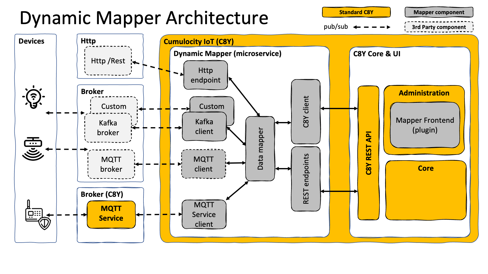

# Architecture

The solution is composed of two major components:

- A **microservice** - exposes REST endpoints, provides a generic connector interface which can be used by broker clients to
  connect to a message broker, a generic data mapper, a comprehensive expression language for data mapping and the
  [Cumulocity Microservice SDK](https://cumulocity.com/guides/microservice-sdk/introduction/) to connect to Cumulocity. It also supports multi tenancy.

- A **frontend (plugin)** - uses the exposed endpoints of the microservice to configure a broker connection & to perform
  graphical or code-based data mappings within the Cumulocity IoT UI.

The architecture of the components consists of the following components:

 
The main components of this project are:

- Default connectors for..
  - **MQTT client** - using [hivemq-mqtt-client](https://github.com/hivemq/hivemq-mqtt-client) to connect and subscribe to MQTT brokers
  - **MQTT Service client** - using hivemq-mqtt-client to connect to MQTT Service
  - **Kafka connector** - to connect to Kafka brokers
  - **HTTP/REST endpoint** - to receive data from HTTP/REST clients
- **Data mapper** - handling of received messages via connector and mapping them to a target data format for Cumulocity IoT.
  Also includes an expression runtime [JSONata](https://jsonata.org) to execute expressions
- **C8Y client** - implements part of the Cumulocity IoT REST API to integrate data
- **REST endpoints** - custom endpoints which are used by the MQTT Frontend or can be used to add mappings programmatically
- **Mapper frontend** - A plugin for Cumulocity IoT to provide a UI for MQTT Configuration & Data Mapping

> **Please Note:** When using MQTT or any other Message Broker beside MQTT Service you need to provide this broker available yourself to use the Dynamic Data Mapper.

The mapper processes messages in both directions:

1. `INBOUND`: from Message Broker to C8Y
2. `OUTBOUND`: from C8Y to Message Broker

The Dynamic Data Mapper can be deployed as a **multi tenant microservice** which means you can deploy it once in your enterprise tenant and subscribe additional tenants using the same hardware resources.
It is also implemented to support **multiple broker connections** at the same time. So you can combine multiple message brokers sharing the same mappings.
This implies of course that all of them use the same topic structure and payload otherwise the mappings will fail.

Incoming messages are processed by the steps in the following diagram. It shows the involved classes:

 
