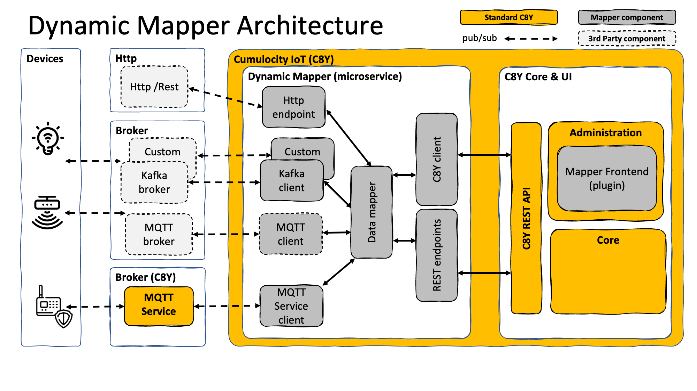

# Architecture

The solution is composed of two major components:

- A **microservice** (`dynamic-mapper-service`) — exposes REST endpoints, provides a generic connector interface for broker clients, a data mapper with multiple transformation engines, and uses the [Cumulocity Microservice SDK](https://cumulocity.com/guides/microservice-sdk/introduction/) to connect to Cumulocity. Supports multi-tenancy.

- A **frontend plugin** (`dynamic-mapper-ui`) — uses the microservice REST endpoints to configure broker connections and perform graphical or code-based data mappings within the Cumulocity IoT UI.

## Module Structure

| Module | Purpose |
|--------|---------|
| `dynamic-mapper-interface` | Shared API interfaces and models — used by Java extensions |
| `dynamic-mapper-service` | Spring Boot microservice — main backend |
| `dynamic-mapper-extension` | Reference implementations for processor extensions |
| `dynamic-mapper-ui` | Angular frontend plugin for Cumulocity |
| `dynamic-mapper-smart-function` | TypeScript type definitions, examples and tests for Smart Functions |

## Component Overview

<p align="center">

</p>
<br/>

### Broker Connectors

| Connector | Description |
|-----------|-------------|
| **MQTT 3.1.1** | Uses [hivemq-mqtt-client](https://github.com/hivemq/hivemq-mqtt-client) — connects to any MQTT 3.1.1 broker |
| **MQTT 5.0** | Uses hivemq-mqtt-client with MQTT 5.0 features (properties, subscription options) |
| **MQTT Service** | Connects to the Cumulocity built-in MQTT Service via the unified Pulsar-based connector path |
| **Kafka** | Connects to Apache Kafka brokers |
| **HTTP/REST endpoint** | Receives data pushed by HTTP clients |
| **AMQP** | Supports AMQP 0.9.x (RabbitMQ) and AMQP 1.0 (Azure Service Bus) |
| **Apache Pulsar** | Connects to Pulsar brokers (native Pulsar protocol and MQTT-over-Pulsar) |
| **Webhook** | Exposes an HTTP endpoint accepting inbound push payloads |
| **Google Cloud Pub/Sub** | Bidirectional — publishes Cumulocity data (Measurements, Alarms, Events, ...) to a Pub/Sub topic (e.g. for ingestion into Google's Manufacturing Data Engine) and consumes inbound messages from a pre-existing Pub/Sub subscription |

Custom connectors can be added by extending `AConnectorClient` — see [EXTENSIONS.md](EXTENSIONS.md).

### Data Mapper

Handles received messages and maps them to Cumulocity domain objects. Supports multiple payload formats and transformation types (see below).

Key classes:
- `processor/inbound/CamelDispatcherInbound.java` — Apache Camel entry point for Broker → C8Y
- `processor/outbound/CamelDispatcherOutbound.java` — entry point for C8Y → Broker
- `processor/model/ProcessingContext.java` — per-message processing state

### C8Y Client

`core/C8YAgent.java` implements the Cumulocity REST API for inventory, measurements, events, alarms, and operations.

### REST Endpoints

Custom REST endpoints consumed by the Dynamic Mapper frontend or used to manage mappings programmatically.

### Frontend Plugin

A Cumulocity web plugin providing a full UI for:
- **Connector configuration** — add, configure and monitor broker connections
- **Mapping configuration** — stepper wizard and unified editor for creating mappings
- **Monitoring** — real-time status of the mapper and all connectors
- **Message Explorer** — inspect live inbound/outbound broker messages and create mappings from them
- **Mapping Tree** — hierarchical view of all active mappings
- **Test Device** — simulate a device to test mappings end-to-end
- **AI-assisted mapping** — generate mapping substitutions from a natural-language prompt
- **Import/Export** — bulk import and export of mapping definitions

---

## Payload Formats (MappingType)

| Format | Description |
|--------|-------------|
| `JSON` | Standard JSON payload (default) |
| `FLAT_FILE` | Delimited flat-file payloads |
| `HEX` | Raw hexadecimal byte payloads |
| `PROTOBUF_INTERNAL` | Protobuf-encoded payloads |
| `SPARKPLUGB` | SparkPlug B payloads over MQTT |
| `ANY_PAYLOAD` | Generic binary/text, processed entirely by an extension or Smart Function |
| `CODE_BASED` | Payload handled by a code-based (JavaScript) transformation *(legacy — creation disabled since v6.2, superseded by Smart Functions)* |

## Transformation Types (TransformationType)

| Type | Description |
|------|-------------|
| `DEFAULT` | Simple field substitution via the graphical mapper |
| `JSONATA` | Expression-based transformation using [JSONata](https://jsonata.org) |
| `SMART_FUNCTION` | User-supplied JavaScript executed in a GraalVM polyglot sandbox |
| `EXTENSION_JAVA` | Custom Java processor extension uploaded as a plugin JAR |

---

## Message Flow

The mapper processes messages in both directions:

- **INBOUND**: Broker → C8Y
- **OUTBOUND**: C8Y → Broker

Inbound processing pipeline:

```
AConnectorClient → CamelDispatcherInbound → deserialize → enrich → substitute/eval → emit to C8Y
```

<p align="center">

</p>
<br/>

---

## Multi-tenancy and Multi-broker

The Dynamic Mapper can be deployed as a **multi-tenant microservice** — deploy once in an enterprise tenant and subscribe additional tenants sharing the same hardware resources. `ConfigurationRegistry` and `C8YAgent` are scoped per-tenant; never use static/singleton state for tenant data.

It also supports **multiple simultaneous broker connections** — connectors from different brokers can be active at the same time, each with their own mappings.

> **Note:** When using MQTT or any other message broker besides MQTT Service, you must provide and operate that broker yourself.
