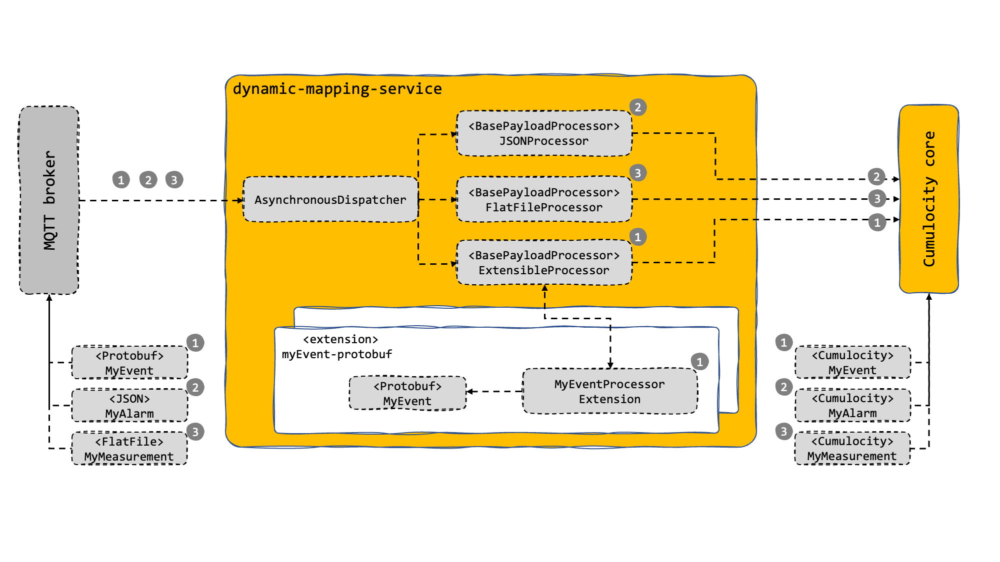
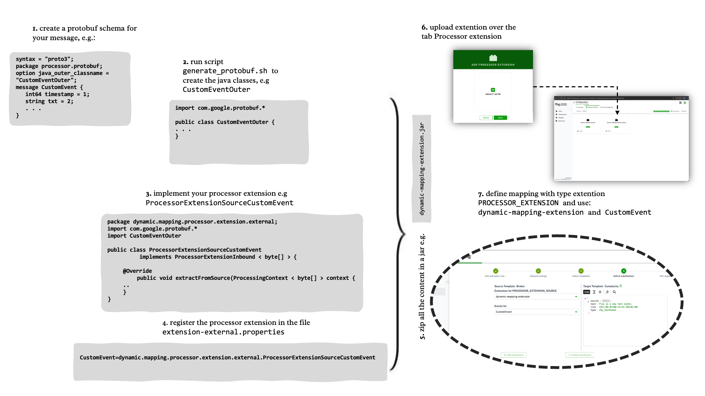

# Enhance and Extensions

## Custom message broker connector

Additional connectors supporting different message brokers can be added to the dynamic mapper.
For that an abstract Class [AConnectorClient](./dynamic-mapping-service/src/main/java/dynamic/mapping/connector/core/client/AConnectorClient.java) must be implemented handling the basic methods of a message broker like  `connect`, `subscribe` and `disconnect`.
In addition, a Callback must be implemented handling the message broker typical messages and forwarding it to a [GenericMessageCallback](./dynamic-mapping-service/src/main/java/dynamic/mapping/connector/core/callback/GenericMessageCallback.java)

Check out the [MQTTCallback](./dynamic-mapping-service/src/main/java/dynamic/mapping/connector/mqtt/MQTTCallback.java) as an example implementation.

## Mapper Extensions
In the folder [dynamic.mapping.processor.extension](./dynamic-mapping-service/src/main/java/dynamic/mapping/processor/extension) you can implement  the Interface `ProcessorExtension<O>` to implement the processing of your own messages. Together with the Java representation of your message you can build your own processor extension.
This needs to be packages in a ```jar``` file. The extension packaged as a ```jar``` you can upload this extension using the tab ```Processor Extension```, see [Processing Extensions (Protobuf, ...)](#processing-extensions-protobuf) for details.
In order for the mapper backend (```dynamic-mapping-service```) to find your extension you need to add the properties file ```extension-external.properties```. The content could be as follows:
```
CustomEvent=external.extension.processor.dynamic.mapping.ProcessorExtensionCustomEvent
CustomMeasurement=external.extension.processor.dynamic.mapping.ProcessorExtensionCustomMeasurement
```

The steps required for an external extension are as follows. The extension:
1. has to implement the interface <code>ProcessorExtension<O></code>
2. be registered in the properties file <code>dynamic-mapping-extension/src/main/resources/extension-external.properties</code>
3. be developed/packed in the maven module <code>dynamic-mapping-extension</code>. **Not** in the maven module <code>dynamic-mapping-service</code>. This is reserved for internal extensions.
4. be uploaded through the Web UI.

> **_NOTE:_** When you implement <code>ProcessorExtension<O></code> an additional <code>RepairStrategy.CREATE_IF_MISSING</code> can be used. This helps to address mapping cases, where you want to create a mapping that adapts to different structures of source payloads. It is used to create a node in the target if it doesn't exist and allows for using mapping with dynamic content. See [sample 25](./resources/script/mapping/sampleMapping/SampleMappings_06.pdf).

A sample how to build an extension is contained in the maven module [dynamic-mapping-extension](./dynamic-mapping-extension).
The following diagram shows how the dispatcher handles messages with different format:


<p align="center">

</p>
<br/>

The following diagram gives an overview on the step to build and use your own extension:

<p align="center">

</p>
<br/>