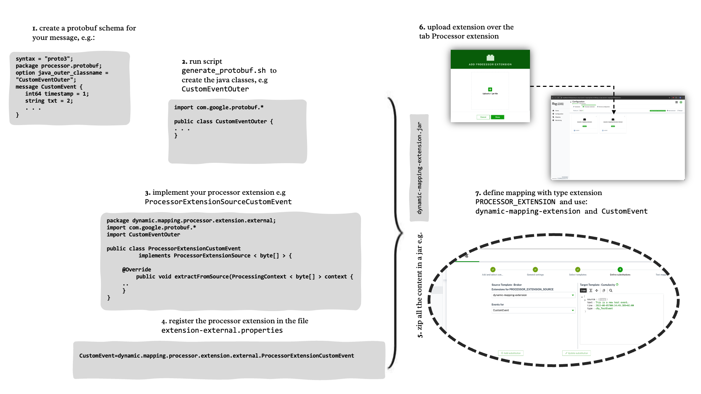

# Enhance and Extensions

## Custom message broker connector

Additional connectors supporting different message brokers can be added to the dynamic mapper.
For that, the abstract class [AConnectorClient](dynamic-mapper-service/src/main/java/dynamic/mapper/connector/core/client/AConnectorClient.java) must be extended, implementing the basic methods of a message broker like `initialize()`, `connect()`, `subscribe()`, `disconnect()`, and `publishMEAO()`.

In addition, a Callback must be implemented handling the message broker-specific messages and forwarding them to a [GenericMessageCallback](dynamic-mapper-service/src/main/java/dynamic/mapper/connector/core/callback/GenericMessageCallback.java).

### Base Class Helper Methods

The `AConnectorClient` base class provides several helper methods that simplify connector implementation and ensure consistent behavior across all connectors. **It is highly recommended to use these helpers** in your custom connector implementation.

#### 1. Connection/Disconnection Synchronization

Use these methods to ensure thread-safe connection management:

```java
@Override
public void connect() {
    // Returns false if connection is already in progress or not needed
    if (!beginConnection()) {
        return;
    }

    try {
        // Your connection logic here
        log.info("{} - Connecting to broker", tenant);

        // Create client, establish connection, etc.

        connectionStateManager.setConnected(true);
        connectionStateManager.updateStatus(ConnectorStatus.CONNECTED, true, true);

    } catch (Exception e) {
        log.error("{} - Connection failed", tenant, e);
        connectionStateManager.updateStatusWithError(e);
    } finally {
        // Always call this to release the connection lock
        endConnection();
    }
}

@Override
public void disconnect() {
    // Returns false if disconnection is already in progress or not needed
    if (!beginDisconnection()) {
        return;
    }

    try {
        // Your disconnection logic here
        log.info("{} - Disconnecting from broker", tenant);

        // Close consumers, producers, client, etc.

        connectionStateManager.setConnected(false);
        connectionStateManager.updateStatus(ConnectorStatus.DISCONNECTED, true, true);

    } finally {
        // Always call this to release the disconnection lock
        endDisconnection();
    }
}
```

**Benefits:**
- Prevents concurrent connection attempts
- Prevents race conditions between connect/disconnect
- Consistent state management across all connectors

#### 2. Retry Operations with Exponential Backoff

Use `retryOperation()` for operations that may fail temporarily (e.g., establishing connections, creating producers):

```java
// Example: Retry connection with 3 attempts, starting with 2-second delay
@Override
public void connect() {
    if (!beginConnection()) {
        return;
    }

    try {
        retryOperation("Broker connection", 3, 2000, () -> {
            // Your connection logic that may fail
            client = createClient();
            client.connect();
            return null;  // Or return the created object
        });

        connectionStateManager.setConnected(true);

    } catch (ConnectorException e) {
        log.error("{} - Connection failed after retries", tenant, e);
        connectionStateManager.updateStatusWithError(e);
    } finally {
        endConnection();
    }
}
```

**Parameters:**
- `operationName`: Descriptive name for logging
- `maxAttempts`: Maximum number of retry attempts
- `baseDelayMs`: Initial delay in milliseconds (doubles with each retry)
- `operation`: Lambda containing the operation to retry

**Benefits:**
- Automatic retry with exponential backoff
- Consistent error handling and logging
- Improved reliability for transient failures

#### 3. SSL/TLS Initialization

Use `initializeSslIfNeeded()` to handle SSL configuration automatically:

```java
@Override
public boolean initialize() {
    loadConfiguration();

    try {
        // Automatically detects SSL requirements and initializes certificates
        initializeSslIfNeeded();

        log.info("{} - Connector initialized successfully", tenant);
        if (isConfigValid(connectorConfiguration)) {
            connectionStateManager.updateStatus(ConnectorStatus.CONFIGURED, true, true);
        }
        return true;

    } catch (Exception e) {
        log.error("{} - Initialization failed", tenant, e);
        connectionStateManager.updateStatusWithError(e);
        return false;
    }
}
```

The `initializeSslIfNeeded()` method:
- Automatically detects SSL requirement based on protocol (mqtts://, wss://, amqps://, ssl://, https://)
- Loads certificates from configuration (PEM format or C8Y certificate store)
- Creates SSL context with proper truststore
- Handles both system certificates and self-signed certificates
- Sets `sslContext` field that your connector can use

**Override SSL detection if needed:**
```java
@Override
protected boolean isSslRequired() {
    // Custom SSL detection logic for your protocol
    String url = (String) connectorConfiguration.getProperties().get("brokerUrl");
    return url != null && url.startsWith("secure://");
}
```

#### 4. Physical Connectivity Checks

Override `isPhysicallyConnected()` to perform connector-specific connectivity checks:

```java
@Override
protected boolean isPhysicallyConnected() {
    // Check if your client is actually connected
    return client != null && client.isConnected();
}
```

The base class `isConnected()` method (final) combines:
- Connection state manager status
- Your `isPhysicallyConnected()` implementation

#### 5. Configuration Validation

Use validation helpers to check required properties:

```java
@Override
public boolean isConfigValid(ConnectorConfiguration configuration) {
    if (configuration == null) {
        return false;
    }

    // Validate required properties
    if (!validateRequiredProperties(configuration,
            "brokerUrl", "clientId")) {
        return false;
    }

    // Validate SSL certificate if SSL is enabled
    if (isSslRequired() && !validateCertificateConfig(configuration)) {
        return false;
    }

    // Add connector-specific validation here

    return true;
}
```

#### 6. Optional monitorSubscriptions()

The `monitorSubscriptions()` method is now optional with a default no-op implementation. Only override if your connector needs subscription monitoring (e.g., Kafka):

```java
@Override
public void monitorSubscriptions() {
    // Only implement if your connector needs to monitor subscription health
    // Default implementation does nothing
}
```

### Complete Example: Custom Connector Implementation

Here's a skeleton for a custom connector using all the base class helpers:

```java
package dynamic.mapper.connector.custom;

import dynamic.mapper.connector.core.client.AConnectorClient;
import dynamic.mapper.connector.core.client.ConnectorException;
import dynamic.mapper.model.ConnectorStatus;

public class CustomBrokerClient extends AConnectorClient {

    private CustomClient client;

    public CustomBrokerClient() {
        this.connectorType = ConnectorType.CUSTOM;
        this.connectorSpecification = createConnectorSpecification();
    }

    @Override
    public boolean initialize() {
        loadConfiguration();

        try {
            // Use base class helper for SSL
            initializeSslIfNeeded();

            if (isConfigValid(connectorConfiguration)) {
                connectionStateManager.updateStatus(ConnectorStatus.CONFIGURED, true, true);
            }
            return true;

        } catch (Exception e) {
            log.error("{} - Initialization failed", tenant, e);
            connectionStateManager.updateStatusWithError(e);
            return false;
        }
    }

    @Override
    public void connect() {
        // Use base class helper for synchronization
        if (!beginConnection()) {
            return;
        }

        try {
            if (!shouldConnect()) {
                return;
            }

            // Use retry helper for reliable connection
            retryOperation("Custom broker connection", 3, 2000, () -> {
                String brokerUrl = (String) connectorConfiguration.getProperties().get("brokerUrl");
                client = new CustomClient(brokerUrl);

                // Use SSL context if available
                if (sslContext != null) {
                    client.useSsl(sslContext);
                }

                client.connect();
                return null;
            });

            connectionStateManager.setConnected(true);
            connectionStateManager.updateStatus(ConnectorStatus.CONNECTED, true, true);

            // Initialize subscriptions
            if (isConnected()) {
                initializeSubscriptionsAfterConnect();
            }

        } catch (Exception e) {
            log.error("{} - Connection failed", tenant, e);
            connectionStateManager.updateStatusWithError(e);
        } finally {
            endConnection();
        }
    }

    @Override
    public void disconnect() {
        // Use base class helper for synchronization
        if (!beginDisconnection()) {
            return;
        }

        try {
            if (client != null) {
                client.disconnect();
            }

            connectionStateManager.setConnected(false);
            connectionStateManager.updateStatus(ConnectorStatus.DISCONNECTED, true, true);

        } catch (Exception e) {
            log.error("{} - Disconnection failed", tenant, e);
        } finally {
            endDisconnection();
        }
    }

    @Override
    protected boolean isPhysicallyConnected() {
        // Check actual connectivity
        return client != null && client.isConnected();
    }

    @Override
    protected void subscribe(String topic, Qos qos) throws ConnectorException {
        if (!isConnected()) {
            throw new ConnectorException("Not connected");
        }

        client.subscribe(topic, message -> {
            // Forward to dispatcher
            ConnectorMessage connectorMessage = ConnectorMessage.builder()
                .tenant(tenant)
                .topic(topic)
                .payload(message.getPayload())
                .build();
            dispatcher.onMessage(connectorMessage);
        });
    }

    @Override
    protected void unsubscribe(String topic) throws ConnectorException {
        if (client != null) {
            client.unsubscribe(topic);
        }
    }

    @Override
    public void publishMEAO(ProcessingContext<?> context) {
        if (!isConnected()) {
            log.warn("{} - Cannot publish: not connected", tenant);
            return;
        }

        // Publish messages to broker
        var requests = context.getRequests();
        for (DynamicMapperRequest request : requests) {
            String topic = request.getPublishTopic();
            String payload = request.getRequest();

            try {
                client.publish(topic, payload.getBytes());
            } catch (Exception e) {
                log.error("{} - Publish failed", tenant, e);
                request.setError(e);
            }
        }
    }

    @Override
    public boolean isConfigValid(ConnectorConfiguration configuration) {
        if (configuration == null) {
            return false;
        }

        // Use validation helpers
        return validateRequiredProperties(configuration, "brokerUrl", "clientId")
            && validateCertificateConfig(configuration);
    }

    // Implement other required abstract methods...
}
```

### Reference Implementations

Check out these implementations for complete examples:

- **MQTT 3.1.1**: [MQTT3Client.java](dynamic-mapper-service/src/main/java/dynamic/mapper/connector/mqtt/MQTT3Client.java) - Shows MQTT-specific implementation
- **MQTT 5.0**: [MQTT5Client.java](dynamic-mapper-service/src/main/java/dynamic/mapper/connector/mqtt/MQTT5Client.java) - Shows MQTT5-specific features
- **AMQP/RabbitMQ**: [AMQPClient.java](dynamic-mapper-service/src/main/java/dynamic/mapper/connector/amqp/AMQPClient.java) - Shows channel-based connectivity
- **Kafka**: [KafkaClientV2.java](dynamic-mapper-service/src/main/java/dynamic/mapper/connector/kafka/KafkaClientV2.java) - Shows consumer-per-topic pattern
- **Apache Pulsar**: [PulsarConnectorClient.java](dynamic-mapper-service/src/main/java/dynamic/mapper/connector/pulsar/PulsarConnectorClient.java) - Shows producer management with retry

### Best Practices

1. **Always use `beginConnection()`/`endConnection()`** in `connect()` method
2. **Always use `beginDisconnection()`/`endDisconnection()`** in `disconnect()` method
3. **Use `retryOperation()`** for operations that may fail transiently
4. **Use `initializeSslIfNeeded()`** in `initialize()` for automatic SSL setup
5. **Override `isPhysicallyConnected()`** to provide accurate connectivity status
6. **Use `validateRequiredProperties()`** and `validateCertificateConfig()`** in `isConfigValid()`
7. **Call `endConnection()`/`endDisconnection()` in finally blocks** to ensure locks are released
8. **Only override `monitorSubscriptions()`** if you need subscription-level monitoring

### Callback Implementation

Implement a callback to handle incoming messages from your broker:

```java
package dynamic.mapper.connector.custom;

import dynamic.mapper.connector.core.callback.GenericMessageCallback;

public class CustomCallback implements Consumer<CustomMessage> {

    private final String tenant;
    private final GenericMessageCallback dispatcher;
    private final String connectorIdentifier;

    public CustomCallback(String tenant,
                         ConfigurationRegistry registry,
                         GenericMessageCallback dispatcher,
                         String connectorIdentifier,
                         String connectorName) {
        this.tenant = tenant;
        this.dispatcher = dispatcher;
        this.connectorIdentifier = connectorIdentifier;
    }

    @Override
    public void accept(CustomMessage message) {
        ConnectorMessage connectorMessage = ConnectorMessage.builder()
            .tenant(tenant)
            .topic(message.getTopic())
            .sendPayload(true)
            .connectorIdentifier(connectorIdentifier)
            .payload(message.getPayload())
            .build();

        dispatcher.onMessage(connectorMessage);
    }
}
```

Check out [MQTT3Callback.java](dynamic-mapper-service/src/main/java/dynamic/mapper/connector/mqtt/MQTT3Callback.java) as a complete reference implementation.

### Migration Guide for Existing Custom Connectors

If you have an existing custom connector, follow these steps to migrate to the improved base class:

#### 1. Remove Duplicate Synchronization Fields

**Before:**
```java
public class MyCustomConnector extends AConnectorClient {
    private final Object connectionLock = new Object();
    private final Object disconnectionLock = new Object();
    private volatile boolean isConnecting = false;
    private volatile boolean isDisconnecting = false;
    private volatile boolean intentionalDisconnect = false;
    // ...
}
```

**After:**
```java
public class MyCustomConnector extends AConnectorClient {
    // These fields are now provided by the base class - remove them!
    // ...
}
```

#### 2. Update connect() Method

**Before:**
```java
@Override
public void connect() {
    synchronized (connectionLock) {
        if (isConnecting) {
            return;
        }
        isConnecting = true;
    }

    try {
        // connection logic
    } finally {
        synchronized (connectionLock) {
            isConnecting = false;
        }
    }
}
```

**After:**
```java
@Override
public void connect() {
    if (!beginConnection()) {
        return;
    }

    try {
        // connection logic (unchanged)
    } finally {
        endConnection();
    }
}
```

#### 3. Update disconnect() Method

**Before:**
```java
@Override
public void disconnect() {
    synchronized (disconnectionLock) {
        if (isDisconnecting) {
            return;
        }
        isDisconnecting = true;
        intentionalDisconnect = true;
    }

    try {
        // disconnection logic
    } finally {
        synchronized (disconnectionLock) {
            isDisconnecting = false;
            intentionalDisconnect = false;
        }
    }
}
```

**After:**
```java
@Override
public void disconnect() {
    if (!beginDisconnection()) {
        return;
    }

    try {
        // disconnection logic (unchanged)
    } finally {
        endDisconnection();
    }
}
```

#### 4. Replace Custom SSL Initialization

**Before:**
```java
@Override
public boolean initialize() {
    loadConfiguration();

    try {
        Boolean useSelfSignedCertificate = (Boolean) connectorConfiguration
            .getProperties().getOrDefault("useSelfSignedCertificate", false);

        if (useSelfSignedCertificate) {
            // 30+ lines of SSL setup code
            cert = loadCertificateFromConfiguration();
            // ... create truststore
            // ... create TrustManagerFactory
            sslContext = SSLContext.getInstance("TLS");
            sslContext.init(null, tmf.getTrustManagers(), null);
        }

        return true;
    } catch (Exception e) {
        log.error("Initialization failed", e);
        return false;
    }
}
```

**After:**
```java
@Override
public boolean initialize() {
    loadConfiguration();

    try {
        // Single line replaces all SSL setup code!
        initializeSslIfNeeded();

        return true;
    } catch (Exception e) {
        log.error("Initialization failed", e);
        return false;
    }
}
```

#### 5. Add Retry Logic for Reliability

**Before:**
```java
@Override
public void connect() {
    // ... synchronization code

    try {
        // Direct connection without retry
        client = new MyClient(url);
        client.connect();

        connectionStateManager.setConnected(true);
    } catch (Exception e) {
        log.error("Connection failed", e);
        connectionStateManager.updateStatusWithError(e);
    }
}
```

**After:**
```java
@Override
public void connect() {
    if (!beginConnection()) {
        return;
    }

    try {
        // Automatic retry with exponential backoff
        retryOperation("MyBroker connection", 3, 2000, () -> {
            client = new MyClient(url);
            client.connect();
            return null;
        });

        connectionStateManager.setConnected(true);
    } catch (Exception e) {
        log.error("Connection failed after retries", e);
        connectionStateManager.updateStatusWithError(e);
    } finally {
        endConnection();
    }
}
```

#### 6. Override isPhysicallyConnected()

**Before:**
```java
// No specific connectivity check - relied on connection state manager only
```

**After:**
```java
@Override
protected boolean isPhysicallyConnected() {
    // Provide actual connectivity check
    return client != null && client.isConnected();
}
```

#### 7. Remove monitorSubscriptions() If Not Needed

**Before:**
```java
@Override
public void monitorSubscriptions() {
    // Empty implementation - required by abstract class
}
```

**After:**
```java
// Just remove the method! Base class now has default no-op implementation
// Only override if you actually need subscription monitoring
```

#### 8. Remove Duplicate cert and sslContext Fields

**Before:**
```java
public class MyCustomConnector extends AConnectorClient {
    protected SSLContext sslContext;  // Duplicate!
    protected Certificate cert;        // Duplicate!
    // ...
}
```

**After:**
```java
public class MyCustomConnector extends AConnectorClient {
    // Remove these fields - they're already in the base class!
    // ...
}
```

### Migration Checklist

Use this checklist to ensure your custom connector is fully migrated:

- [ ] Removed duplicate synchronization fields (`connectionLock`, `disconnectionLock`, `isConnecting`, `isDisconnecting`, `intentionalDisconnect`)
- [ ] Updated `connect()` to use `beginConnection()` and `endConnection()`
- [ ] Updated `disconnect()` to use `beginDisconnection()` and `endDisconnection()`
- [ ] Replaced custom SSL initialization with `initializeSslIfNeeded()`
- [ ] Removed duplicate `sslContext` and `cert` fields (if any)
- [ ] Added `retryOperation()` for connection logic (optional but recommended)
- [ ] Implemented `isPhysicallyConnected()` override
- [ ] Removed empty `monitorSubscriptions()` implementation (if not needed)
- [ ] Removed unused imports related to SSL (KeyStore, TrustManagerFactory, X509Certificate)
- [ ] Updated `isConfigValid()` to use `validateRequiredProperties()` and `validateCertificateConfig()`
- [ ] Tested connection, disconnection, SSL configuration, and reconnection scenarios
- [ ] Verified build compiles without errors

### Breaking Changes

The following changes may require code updates:

1. **isConnected() is now final**: If you override `isConnected()`, change it to override `isPhysicallyConnected()` instead.

2. **reconnect() never returns null**: The `reconnect()` method now always returns a `CompletableFuture<Void>`. If you call this method, remove null checks.

3. **monitorSubscriptions() is optional**: You no longer need to provide an empty implementation if you don't use this feature.

### Compatibility

All changes are backward compatible at the API level. Existing connectors will continue to work, but migrating to use the new helpers is strongly recommended for:

- Improved reliability (retry logic)
- Better thread safety (synchronization helpers)
- Simplified SSL configuration
- Reduced code duplication
- Consistent behavior across all connectors

## Mapper Extensions - general
In the folder [dynamic.mapper.processor.extension](dynamic-mapper-service/src/main/java/dynamic/mapper/processor/extension) you can implement  the Interface `ProcessorExtensionSource<O>` to implement the processing of your own messages. Together with the Java representation of your message you can build your own processor extension. This needs to be packages in a `jar` file. <br>
The extension packaged as a `jar` you can upload this extension using the tab `Processor Extension`, see [Processing Extensions (Protobuf, ...)](#processing-extensions-protobuf) for details.
In order for the mapper backend (`dynamic-mapper-service`) to find your extension you need to add the properties file `extension-external.properties`. The content could be as follows:
```
CustomEvent=external.extension.processor.dynamic.mapper.ProcessorExtensionCustomEvent
CustomMeasurement=external.extension.processor.dynamic.mapper.ProcessorExtensionCustomMeasurement
```

The steps required for an external extension are as follows. The extension:
1. has to implement the interface `ProcessorExtensionSource<O>`
2. be registered in the properties file <code>dynamic-mapper-extension/src/main/resources/extension-external.properties</code>
3. be developed /packed in the maven module <code>dynamic-mapper-extension</code>. **Not** in the maven module <code>dynamic-mapper-service</code>. This is reserved for internal extensions.
4. be uploaded through the Web UI.

> **_NOTE:_** When you implement `ProcessorExtensionSource<O>` an additional <code>RepairStrategy.CREATE_IF_MISSING</code> can be used. This helps to address mapping cases, where you want to create a mapping that adapts to different structures of source payloads. It is used to create a node in the target if it doesn't exist and allows for using mapping with dynamic content. See [sample 25](./resources/script/mapping/sampleMapping/SampleMappings_06.pdf).

A sample how to build an extension is contained in the maven module [dynamic-mapper-extension](dynamic-mapper-extension).
The following diagram shows how the dispatcher handles messages with different format:


<p align="center">

</p>
<br/>

The following diagram gives an overview on the step to build and use your own extension:

<p align="center">

</p>
<br/>

## Mapper Extensions - portobuf

To process your own Protobuf message, you always need to write a Java class.
The workflow is as follows:

1. Describe the structure of your Protobuf message in a proto file, for example:

```
package processor.protobuf;

option java_package = "dynamic.mapper.processor.extension.external";
option java_outer_classname = "CustomEventOuter";

message CustomEvent {
  int64 timestamp = 1;
  string txt = 2;
  string unit = 3;
  string externalIdType = 4;
  string externalId = 5;
  string eventType = 6;
}
```

2. Generate Java binding classes using the `protoc` compiler, resulting in `CustomEventOuter.java`
Write your own extension in Java, for example `ProcessorExtensionCustomEvent.java`, by implementing the <code>ProcessorExtensionSource<byte[]></code> interface.

The actual mapping consists of the following lines:
```
javaCopycontext.addSubstitution("time", new DateTime(
        payloadProtobuf.getTimestamp())
        .toString(), TYPE.TEXTUAL, RepairStrategy.DEFAULT, false);
context.addSubstitution("text",
        payloadProtobuf.getTxt(), TYPE.TEXTUAL, RepairStrategy.DEFAULT, false);
context.addSubstitution("type", 
        payloadProtobuf.getEventType(), TYPE.TEXTUAL, RepairStrategy.DEFAULT, false);

// as the mapping uses useExternalId we have to map the id to
// _IDENTITY_.externalId
context.addSubstitution(context.getMapping().getGenericDeviceIdentifier(),
        payloadProtobuf.getExternalId()
                .toString(),
        TYPE.TEXTUAL, RepairStrategy.DEFAULT, false);
```
3. Create a property file named extension-external.properties with the following information:

```
<YOUR_EVENT_NAME>=<FQN_NAME_EXTENSION_JAVA_CLASS>
# For example: CustomEvent=dynamic.mapper.processor.extension.external.ProcessorExtensionCustomEvent
```

4. Package the class as a JAR file and upload it via the UI: Configuration -> Processor extension -> Add extension (button)
5. To use the extension, select a mapping of type "Extension Source" and choose the extension uploaded in step 5 in the "Define Substitutions" section.