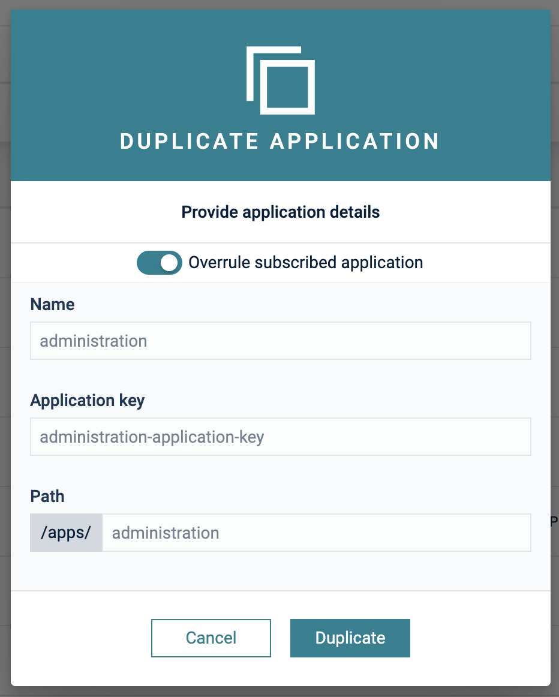
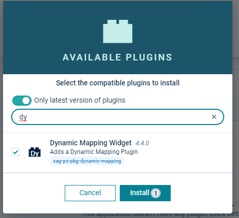
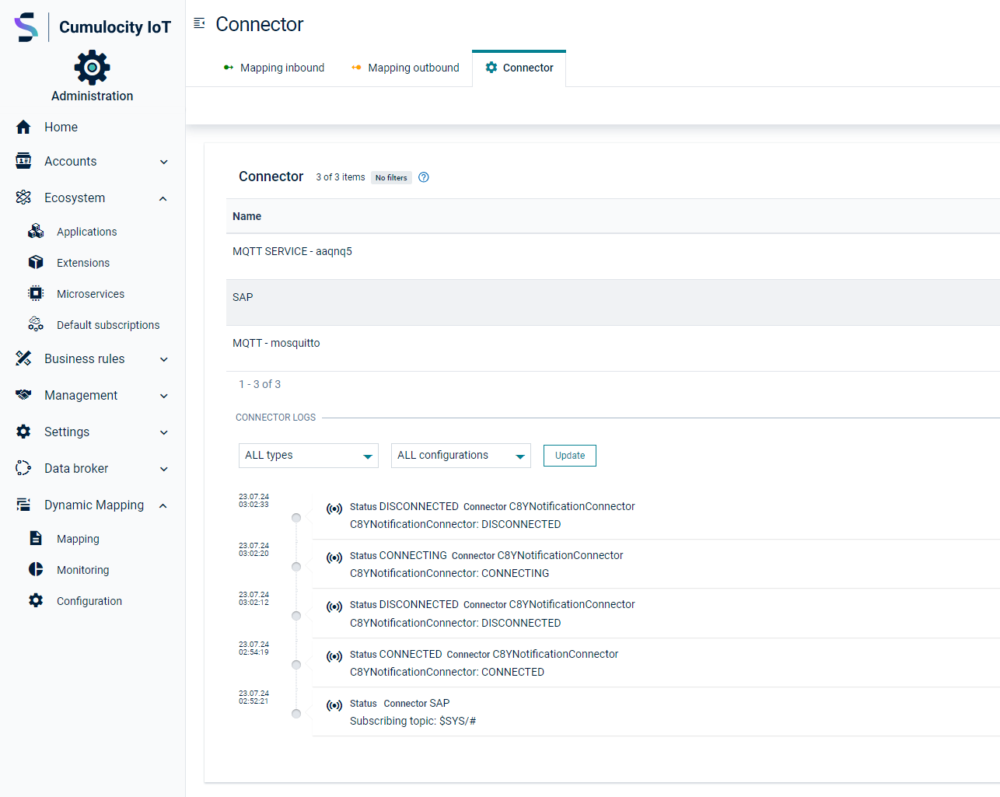
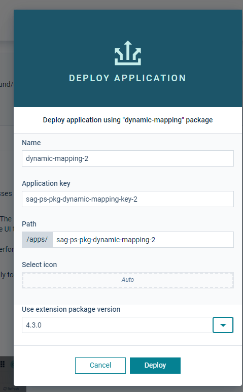
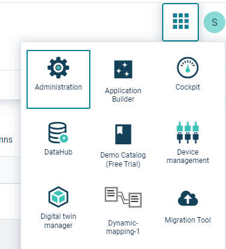

# Installation Guide

## Prerequisites

To use the mapper you must have the following:
* a Cumulocity Tenant with **microservice** feature subscribed (if not available please ask your contact or support)
* Admin privileges for your user in the tenant

## Installation

You need to install two components to your Cumulocity IoT Tenant:

1. microservice - (Java)
2. Web App Plugin & Blueprint - (angular/Cumulocity WebSDK)

Both are provided as binaries in [releases](https://github.com/SoftwareAG/cumulocity-dynamic-mapper/releases).
Download the binaries from the latest release and upload them to your Cumulocity IoT Tenant.

### Microservice

In your Enterprise Tenant or Tenant navigate to "Administration" App, go to "Ecosystem" -> "Microservices" and click on "Add Microservice" on the top right.

Select the `dynamic-mapping-service.zip`.
Make sure that you subscribe the microservice to your tenant when prompted

### Web app

The frontend can be used in two variants in your tenant:
1. As a **UI Plugin** to extend existing applications
2. As a **Blueprint** standalone Application selectable from the App switcher

#### Community store (Preferred)

The Web App is part of the community store and should be available directly in your tenant under
"Administration" -> "Ecosystem" -> "Extensions" -> "Dynamic-mapping". Here you have the choice to install it as a plugin or as a blueprint app.

##### Plugin
> **_NOTE:_** For a plugin we need to clone the Administration app to add the plugin to it

Go to "All Applications" and click on "Add Application". Select "Duplicate existing application" and afterward "Administration".

 

Now select the cloned Administration App and go to the "Plugin" Tab. Click on "Install Plugin" and select "Dynamic Mapper Widget"

 

After successfully adding the plugin you need to refresh the Administration App by pressing F5 and you should see a new navigation entry "Dynamic Mapping"

 

##### Blueprint

For the blueprint go to "Administration" -> "Ecosystem" -> "Dynamic-mapping" -> "Deploy application"

Enter an application key and path and click on "Deploy".

After successful deployment you can find the Dynamic-mapping App in the Application Switcher

#### Manual
If you made changes or your want to upload the plugin manually you can do that by following these steps:

1. In "Administration" App go to "Ecosystem" -> "Packages" and click on "Add Application" on the top right.
2. Select `dynamic-mapping.zip` and wait until it is uploaded.

Follow the steps from the point above to assign the plugin to your Administration App.