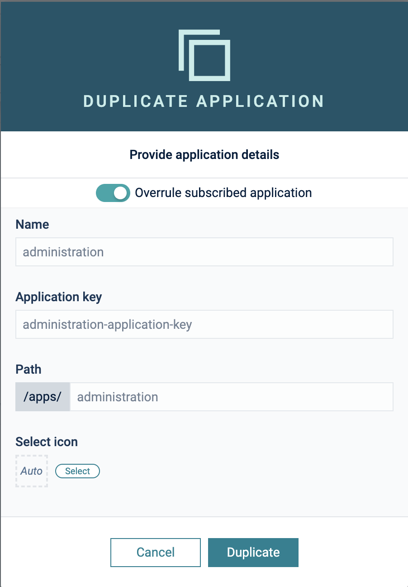

# Installation Guide

## Prerequisites

To use the mapper you must have the following:
* a Cumulocity Tenant with **microservice** feature subscribed (if not available please ask your contact or support)
* Admin privileges for your user in the tenant

## Installation

You need to install two components to your Cumulocity IoT Tenant:

1. microservice - (Java)
2. web app plugin - (angular/Cumulocity WebSDK)

Both are provided as binaries in [releases](https://github.com/SoftwareAG/cumulocity-generic-mqtt-agent/releases).
Download the binaries from the latest release and upload them to your Cumulocity IoT Tenant.

### Microservice

In your Enterprise Tenant or Tenant navigate to "Administration" App, go to "Ecosystem" -> "Microservices" and click on "Add Microservice" on the top right.

Select the `dynamic-mapping-service.zip`.
Make sure that you subscribe the microservice to your tenant when prompted

### Web app plugin

#### Community store

The Web App Plugin is part of the community plugins and should be available directly in your Tenant under
"Administration" -> "Ecosystem" -> "Extensions". Just click on "dynamic-mapping" and click on "install plugin".

> **_NOTE:_** We need to clone the Administration app to add the plugin to it

After successful upload go to "All Applications" and click on "Add Application". Select "Duplicate existing application" and afterward "Administration".

 

Now select the cloned Administration App and go to the "Plugin" Tab. Click on "Install Plugin" and select "MQTT configuration plugin"

 

#### Manual
If you made changes or your want to upload the plugin manually you can do that by following these steps:

1. In "Administration" App go to "Ecosystem" -> "Packages" and click on "Add Application" on the top right.
2. Select `dynamic-mapping.zip` and wait until it is uploaded.

Follow the steps from the point above to assign the plugin to your Administration App.