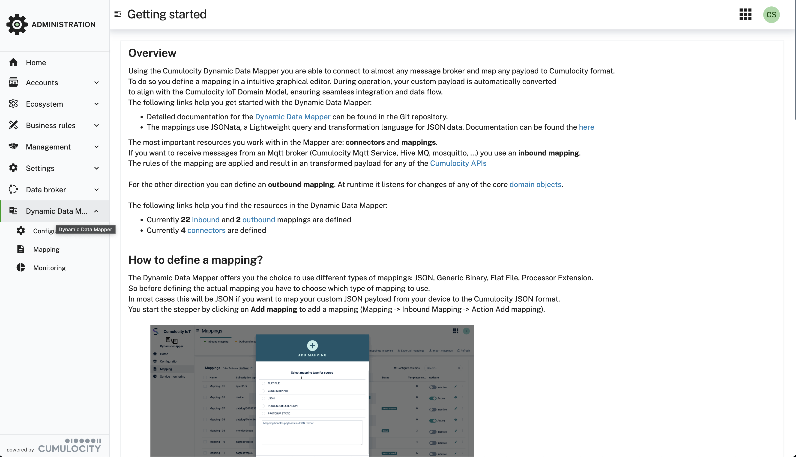
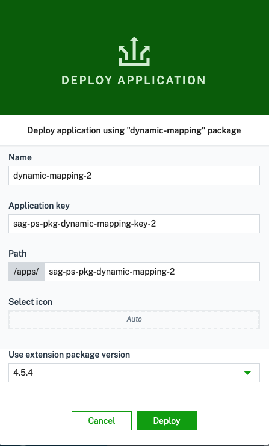
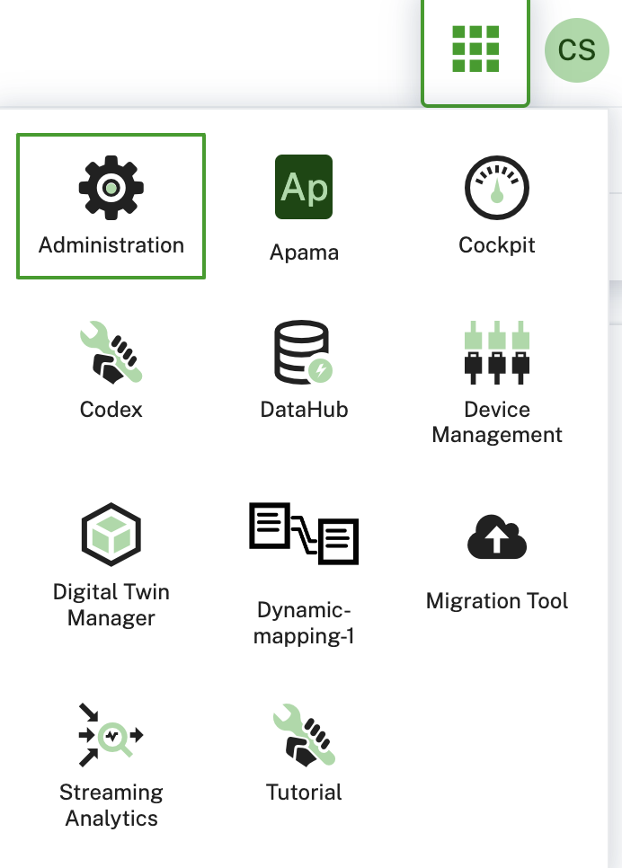

# Installation Guide

## Prerequisites

If you want to use the dynamic mapper, the following prerequisites must be met:

- a Cumulocity Tenant with **microservice** feature subscribed (if not available, please ask your contact or support)
- Admin privileges for your user in the tenant

### AI pre-requisites

To leverage **AI capabilities** of the dynamic mapper, you need to have the following prerequisites:
- **AI Agent Manager** microservice deployed in your tenant. This is currently in private preview, please contact your Cumulocity representative to get access.
- **AI Model Provider + API key** is required which must be configured in the **AI Agent Manager** and is leveraged by the AI agents. We tested `claude-sonnet-4-20250514` model from Anthropic, but you can use any other model that supports the required functionality.
- **Cumulocity MCP Server** microservice deployed in your tenant. Can be downloaded here: https://github.com/Cumulocity-IoT/cumulocity-mcp-server/releases

## Installation

You need to install two components to your Cumulocity Tenant:

1. microservice - (Java)
2. Web App Plugin & Blueprint - (angular/Cumulocity WebSDK)

Both are provided as binaries in [releases](https://github.com/Cumulocity-IoT/cumulocity-dynamic-mapper/releases).

The microservice is provided in 4 variants:
* **Starter** - Uses 0.5 CPUs and 2 GB RAM, suitable for up to 625 messages per second to be processed.
* **Standard** - Uses 2 CPU and 4 GB RAM, suitable for up to 2500 messages per second to be processed.
* **Performance** - Uses 8 CPU and 8 GB RAM, suitable for up to 10.000 messages per second to be processed.
* **Max** - Uses 16 CPU and 16 GB RAM, suitable for up to 20.000 messages per second to be processed.

Download the binaries from the latest release and upload them to your Cumulocity Tenant.

> **_NOTE:_**
> The screenshots show the dynamic mapper installed as a plugin in the Cumulocity Administration app. The dynamic mapper can also be installed in other Cumulocity apps, including Cockpit or Device Management, or as a standalone application.

## Permissions

The solution defines the following roles:

* `ROLE_DYNAMIC_MAPPER_ADMIN` that allows to manage the dynamic mapper, including the configuration of connectors and mappings.
* `ROLE_DYNAMIC_MAPPER_CREATE` that allows the user to create/manage mappings and subscriptions only.
* `ROLE_DYNAMIC_MAPPER_HTTP_CONNECTOR_CREATE` that allows to ingest messages via the HTTP connector.

Please assign the roles to the users that should be able to use the dynamic mapper.

### Microservice

In your Enterprise Tenant or Tenant navigate to "Administration" App, go to "Ecosystem" -> "Microservices" and click on "Add Microservice" on the top right.

Select the `dynamic-mapper-service-*.zip`.
Make sure that you subscribe the microservice to your tenant when prompted

### Web app

The frontend can be deployed in your tenant:

1. As a **Blueprint** standalone Application selectable from the App switcher

> **_NOTE:_** The option to deploy the dynamic mapper as plugin is deprecated.

#### Community store (Preferred)

The Web App is part of the community store and should be available directly in your tenant under
"Administration" -> "Ecosystem" -> "Extensions" -> "dynamic-mapper". Here you have the choice to install it as a plugin or as a blueprint app.

> **_NOTE:_** The option to deploy the dynamic mapper as plugin is deprecated.
##### ~~Plugin~~

> **_NOTE:_** ~~For a plugin we need to clone the Administration app to add the plugin to i~~

~~Go to "All Applications" and click on "Add Application". Select "Duplicate existing application" and afterward "Administration".~~

 

~~Now select the cloned Administration App and go to the "Plugin" Tab. Click on "Install Plugin" and select "Dynamic Mapper Widget"~~

 

~~After successfully adding the plugin you need to refresh the Administration App by pressing F5 and you should see a new navigation entry "Dynamic Mapper"~~

 

##### Blueprint

For the blueprint go to "Administration" -> "Ecosystem" -> "dynamic-mapper" -> "Deploy application"

Enter an application key and path and click on "Deploy".

After successful deployment you can find the dynamic-mapper App in the Application Switcher

#### Manual

If you made changes or your want to upload the plugin manually you can do that by following these steps:

1. In "Administration" App go to "Ecosystem" -> "Packages" and click on "Add Application" on the top right.
2. Select `dynamic-mapper-ui.zip` and wait until it is uploaded.

Follow the steps from the point above to assign the plugin to your Administration App.
