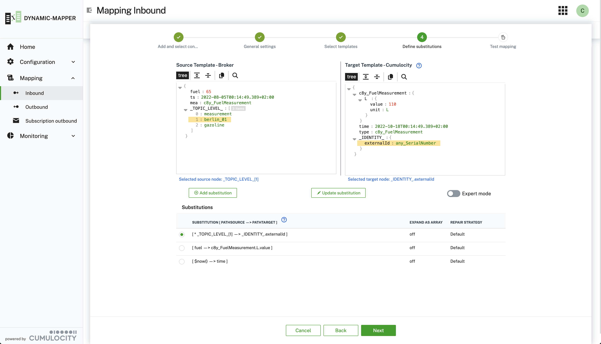

# Dynamic Mapping Service for Cumulocity

## Overview

The Cumulocity Dynamic Data Mapper addresses the need to get **any** data provided by a message broker mapped to the Cumulocity IoT Domain model in a zero-code approach.
It can connect to multiple message brokers likes **MQTT**, **MQTT Service** , **Kafka** and others, subscribes to specific topics and maps the data in a graphical editor to the domain model of Cumulocity.

Per default the followings connectors are supported

- **MQTT** - any MQTT Broker
- **Cumulocity IoT MQTT Service** - Cumulocity IoT built-in MQTT Broker
- **Kafka** - Kafka Broker
- **HTTP/REST** - HTTP/REST Endpoint

Using the Cumulocity Dynamic Data Mapper you are able to connect to almost any message broker and map any payload on any topic dynamically to
the Cumulocity IoT Domain Model in a graphical editor.

Here are the **core features** summarized:

- **Connect** to multiple message broker of your choice at the same time.
- **Map** any data to/from the Cumulocity IoT Domain Model in a graphical way.
- **Bidirectional mappings** are supported - so you can forward data to Cumulocity or subscribe on Cumulocity data and forward it to the broker
- **Transform** data with a comprehensive expression language supported by [JSONata](https://jsonata.org/)
- **Multiple payload formats** are supported, starting with **JSON**, **Protobuf**, **Binary**, **CSV**.
- **Extend** the mapper easily by using payload extensions or the provided connector interface
- Full support of **multi-tenancy** - deploy it in your enterprise tenant and subscribe it to sub-tenants.

<br/>
<p align="center">

</p>
<br/>

## Installation

Please check the [Installation Guide](/INSTALLATION.md) to find out how you can install the Dynamic Data Mapper.

## User Guide

Please check the [User Guide](/USERGUIDE.md) to find a comprehensive guidance how to use the Dynamic Data Mapper.

## Architecture

Please check the [Architecture overview](/ARCHITECTURE.md) if you are eager to understand how it is implemented.

## API

Please check the [REST API](/API.md) provided by the Dynamic Data Mapper.

## Extensions

The Dynamic Data Mapper can be extended on multiple layers. Check out the [Extensions Guide](/EXTENSIONS.md) if you want to add customer mapper or connectors.

## Limitations

Please check the current [Limitations](/LIMITATIONS.md) of the Dynamic Data Mapper.

## Contribution

We are always looking for additional [contribution](/CONTRIBUTING.md).

## Build & Deploy

If you want to make changes to the code or configuration check out this [Build & Deploy guide](/BUILDDEPLOY.md)

## Tests & Sample Data

### Load Test

In the resource section you find a test profil [jmeter_test_01.jmx](./resources/script/performance/jmeter_test_01.jmx) using the performance tool `jmeter` and an extension for MQTT: [emqx/mqtt-jmeter](https://github.com/emqx/mqtt-jmeter).
This was used to run simple loadtest.

## Setup Sample mappings

A script to create sample mappings can be found [here](./resources/script/mapping/import_mappings_01.py).
You have to start it as follows:

```
#python3 resources/script/mapping/import_mappings_01.py -p <YOUR_PASSWORD> -U <YOUR_TENANT> -u <YOUR_USER> -f resources/script/mapping/sampleMapping/sampleMappings_02.json
```

The mappings with inputs and substitutions are explained in the [sample document](./resources/script/mapping/sampleMapping/sampleMappings_02.html).

---

These tools are provided as-is and without warranty or support. They do not constitute part of the Software AG product suite. Users are free to use, fork and modify them, subject to the license agreement. While Software AG welcomes contributions, we cannot guarantee to include every contribution in the master project.

Contact us at [TECHcommunity](mailto:technologycommunity@softwareag.com?subject=Github/SoftwareAG) if you have any questions.
