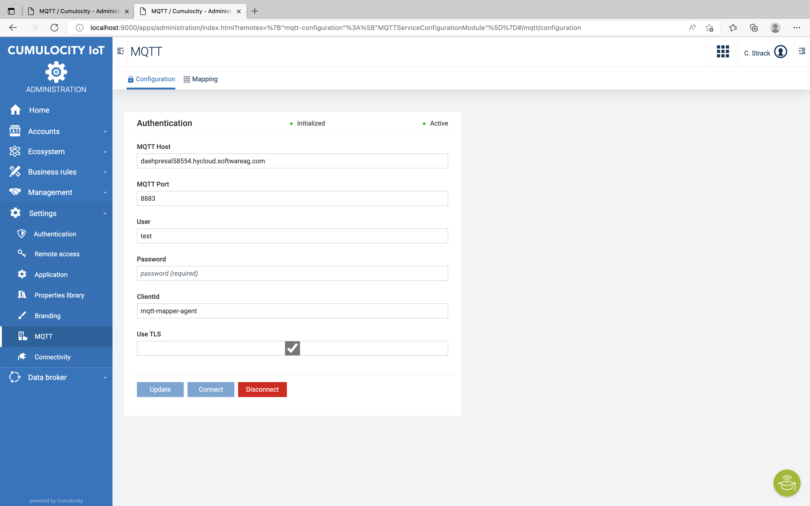
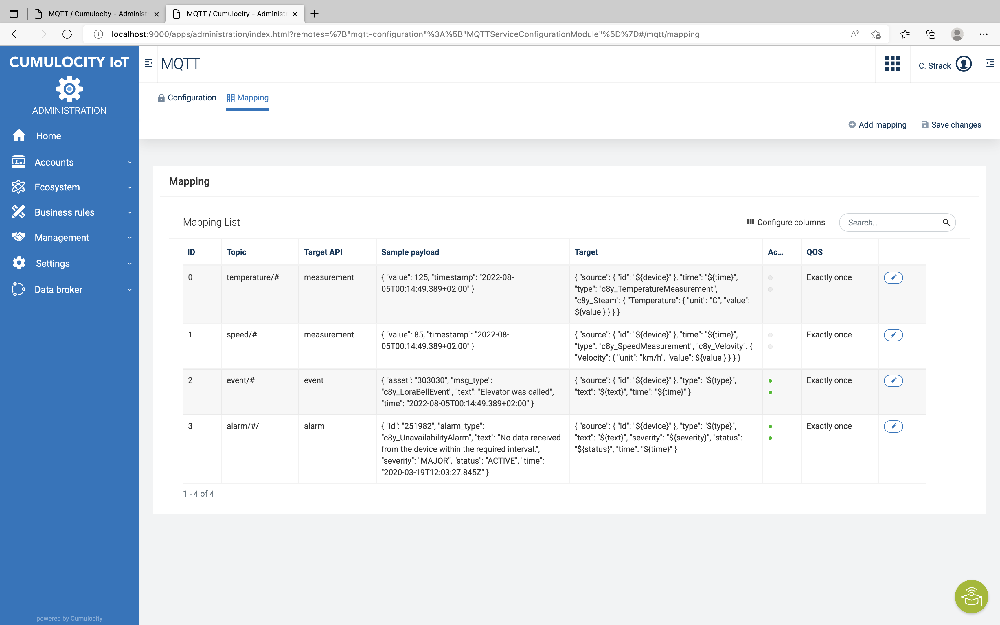
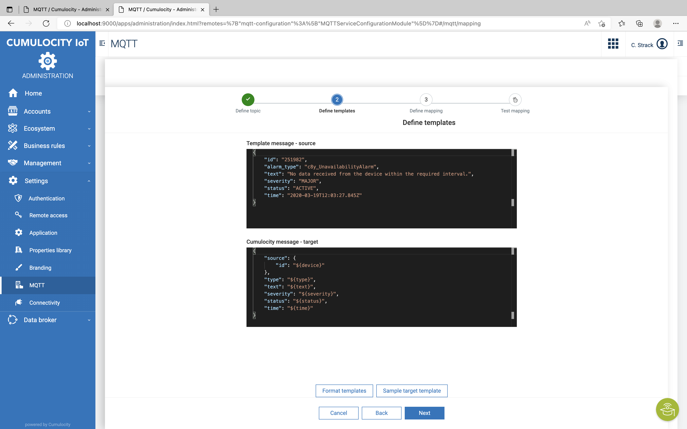
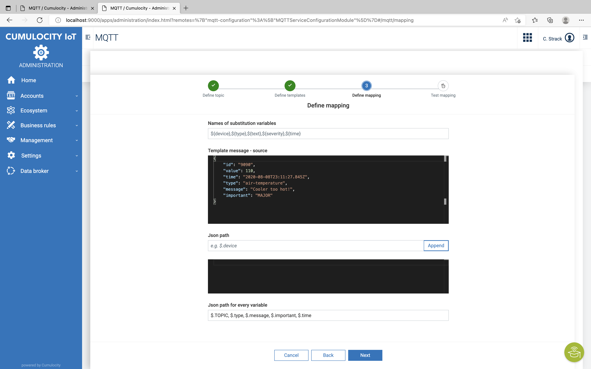
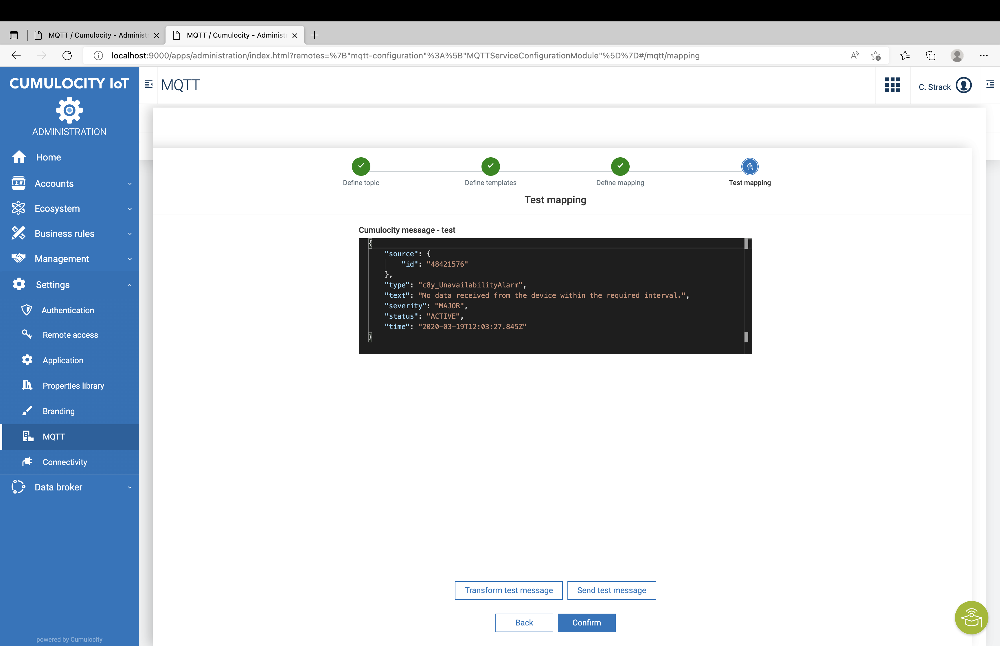
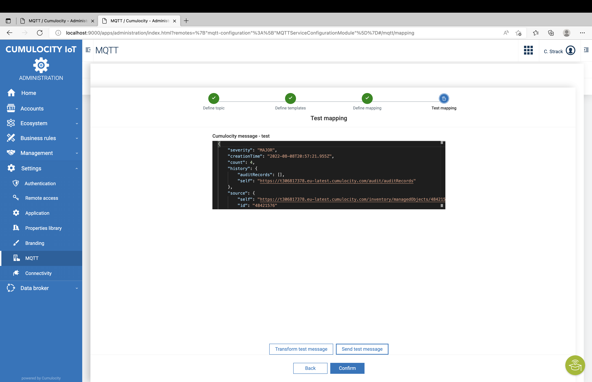

# Generic MQTT Agent Microservice for Cumulocity

## Description
This is an Agent which uses the [PAHO MQTT Client](https://github.com/eclipse/paho.mqtt.java) to connect to any MQTT Broker and uses the [Cumulocity Microservice SDK](https://cumulocity.com/guides/microservice-sdk/introduction/) to connect to Cumulocity.
Purpose of this Agent is to subscribe on any topic and to map the payload to the [Cumulocity Domain Model]((https://cumulocity.com/guides/concepts/domain-model/)).

## Configuration
Just add the necessary details like MQTT Broker, credentials and URL to the [applications.properties](./src/main/resources/application.properties).
Part of this Microservice is an REST endpoint which allows to dynamically subscribe and unsubscribe on topics. 
Once deployed you can call `https://{yourC8YTenant}/service/{microserviceName}/subscribe` with POST to subscribe and DELETE to unsubscribe.

The topic should be part of the body with the Content-Type "text/plain". Example Body: `device/123412/t`

## Build, Deploy, Run
Make sure that [Docker](https://www.docker.com/) and [Apache Maven](https://maven.apache.org/) are installed and running on your Computer.

### Backend - Microservice
Run `mvn clean package` in folder `backend` to build the Microservice which will create a ZIP archive you can upload to Cumulocity.
Just deploy the ZIP to the Cumulocity Tenant like described [here](https://cumulocity.com/guides/users-guide/administration/#uploading-microservices).

### Frondend - Plugin
Run `npm run build` in folder `frontend/mqtt-configuration` to build the Front End (plugin) for the Administration which will build a plugin.
Run `npm run deploy` in folder `frontend/mqtt-configuration` to deploy the Front End (plugin) to your Cumulocity istration which will build a plugin.
The Frontend is build as Plugin [here](https://cumulocity.com/guides/web/tutorials/#add-a-custom-widget-with-plugin).

## Configuration and Definition of MQTT Mappings

### Configuration MQTT Connection to broker

### Table of MQTT Mappings

### Define message Templates for source and target (Cumulocity REST format)

### Define message Mapping for Source and Target (Cumulocity REST format)

### Test transformation of Source to Target message (Cumulocity REST format)

### Send transformed Test Message to test device in Cumulocity

______________________
These tools are provided as-is and without warranty or support. They do not constitute part of the Software AG product suite. Users are free to use, fork and modify them, subject to the license agreement. While Software AG welcomes contributions, we cannot guarantee to include every contribution in the master project.

Contact us at [TECHcommunity](mailto:technologycommunity@softwareag.com?subject=Github/SoftwareAG) if you have any questions.

