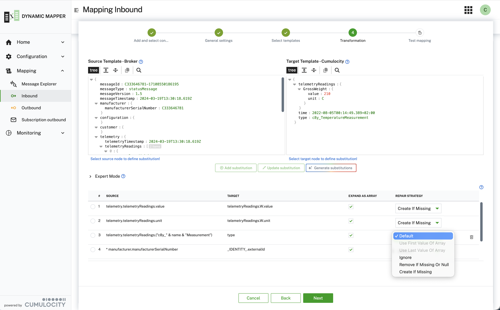

# Cumulocity Dynamic Mapper

Map arbitrary broker payloads to and from the Cumulocity domain model using a graphical editor or JavaScript-based mappings.

## What It Does

The Dynamic Mapper connects to external brokers and APIs, subscribes to topics, transforms payloads, and routes data bidirectionally:

- **Inbound:** Broker -> Cumulocity
- **Outbound:** Cumulocity -> Broker/API

It supports zero-code mapping, code-based mapping, and AI-assisted mapping suggestions.

<p align="center">
  
</p>

## Core Features

- Connect multiple brokers/connectors at the same time
- Create bidirectional mappings between broker payloads and Cumulocity APIs
- Build mappings in a graphical editor or with JavaScript
- Transform payloads with [JSONata](https://jsonata.org/) or JavaScript
- Filter by topics and expressions
- Explore live traffic via Message Explorer
- Use AI agents to propose mapping definitions from observed/provided payloads
- Run in multi-tenant environments

## Supported Connectors

| Connector | Purpose |
|---|---|
| AMQP 0-9-1 | Connect to brokers like RabbitMQ |
| AMQP 1.0 | Connect to AMQP 1.0 systems (Azure Service Bus, Artemis, Solace, etc.) |
| Apache Kafka | Integrate with Kafka topics |
| Apache Pulsar | Integrate with Pulsar topics |
| Cumulocity API | Create/update/delete managed objects, events, alarms, measurements |
| Cumulocity MQTT Service | Use Cumulocity's built-in MQTT broker with device isolation |
| Google Cloud Pub/Sub | Publish/subscribe data via a Google Cloud Pub/Sub topic and subscription, e.g. for ingestion into Google's Manufacturing Data Engine (MDE) |
| HTTP Connector | Receive payloads via REST endpoints |
| MQTT Broker | Connect to third-party MQTT brokers (HiveMQ, Mosquitto, etc.) |
| Webhook | Forward data to external REST APIs |

## Documentation

- [Architecture Overview](ARCHITECTURE.md)
- [Installation Guide](INSTALLATION.md)
- [User Guide](USERGUIDE.md)
- [FAQ](FAQ.md)
- [Limitations](LIMITATIONS.md)
- [Extensions Guide](EXTENSIONS.md)
- [Backend Docs](docs/backend.md)
- [Frontend Docs](docs/ui.md)
- [Smart Functions Docs](docs/smart-functions.md)

## API

- REST API docs: [resources/openAPI/README.md](resources/openAPI/README.md)
- OpenAPI spec: [resources/openAPI/openapi.json](resources/openAPI/openapi.json)
- Swagger UI (runtime): `{yourTenantURL}/service/dynamic-mapper-service/swagger-ui/index.html`

## Build and Test

Project modules and common commands are documented in [AGENTS.md](AGENTS.md) and module docs.

```bash
# Build all modules (from repo root)
mvn clean package

# Backend tests
cd dynamic-mapper-service
mvn test

# Frontend dev / tests
cd ../dynamic-mapper-ui
npm start
npm test
```

## Test Assets and Sample Data

### Load Test

- JMeter profile: [resources/script/performance/jmeter_test_01.jmx](resources/script/performance/jmeter_test_01.jmx)
- MQTT JMeter extension: [emqx/mqtt-jmeter](https://github.com/emqx/mqtt-jmeter)

### Sample Mappings

- Import script: [resources/script/mapping/import_mappings_01.py](resources/script/mapping/import_mappings_01.py)
- Example command:

```bash
python3 resources/script/mapping/import_mappings_01.py \
  -p <YOUR_PASSWORD> \
  -U <YOUR_TENANT> \
  -u <YOUR_USER> \
  -f resources/script/mapping/sampleMapping/sampleMappings_02.json
```

- Mapping examples: [resources/samples/SampleMappings_19.xlsx](resources/samples/SampleMappings_19.xlsx)

## Security Notes for Code-Based Mappings (JavaScript)

User-defined JavaScript is executed inside the backend JVM with sandbox restrictions.
The GraalVM context is configured to minimize guest-code access to host resources.

The sandbox behavior has been validated with examples such as:

- Accessing `process.env` from JavaScript (blocked)
- Accessing host class `java.lang.System` via `Java.type(...)` (blocked)

Reference: [GraalVM Sandboxing](https://www.graalvm.org/latest/security-guide/sandboxing/)

---

These tools are provided as-is and without warranty or support. They are not part of the official Cumulocity GmbH product suite. You may use, fork, and modify them under the project license. Contributions are welcome, but inclusion in the main project cannot be guaranteed.

