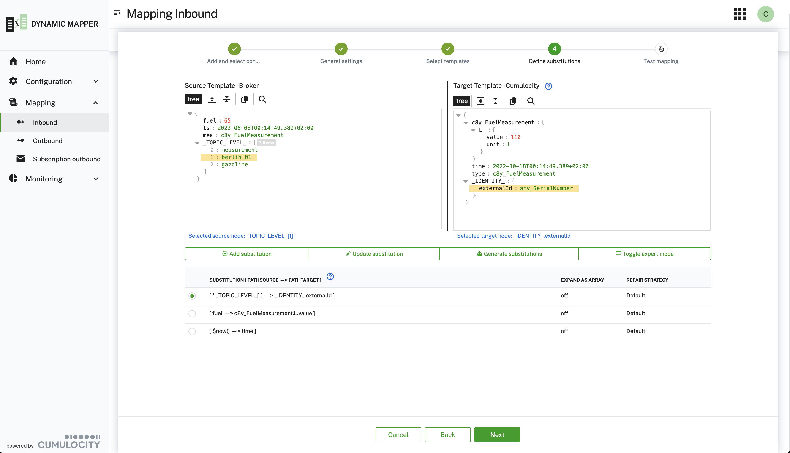

# Dynamic Mapper Service for Cumulocity

## Overview

The Cumulocity Dynamic Mapper addresses the need to get **any** data provided by a message broker mapped to the Cumulocity IoT Domain model in a zero-code approach powered by AI agents.
It can connect to multiple message brokers like **MQTT**, **MQTT Service**, **Kafka** and others, subscribes to specific topics and maps the data in a graphical or code-based editor to the domain model of Cumulocity.

Per default, the following connectors are supported

- **MQTT** - any MQTT Broker
- **Cumulocity MQTT Service** - Cumulocity built-in MQTT Broker
- **Kafka** - Kafka Broker
- **HTTP/REST** - HTTP/REST Endpoint

Using the Cumulocity Dynamic Mapper you are able to connect to almost any message broker and map any payload on any topic dynamically to
the Cumulocity IoT Domain Model in a graphical or, if you prefer code, in a web code editor.

It comes with built-in **AI agents** that suggest and create mappings based on provided or snooped payloads.

Here are the **core features** summarized:

- **Connect** to multiple message broker of your choice at the same time.
- **Map** any data to/from the Cumulocity Domain Model in a graphical or code-based (javaScript) way.
- **Auto-generate** mappings using AI agents that suggest and create mappings based on provided or snooped payloads.
- **Bidirectional mappings** are supported - so you can forward data to Cumulocity or subscribe on Cumulocity data and forward it to the broker
- **Transform** data with a comprehensive expression language supported by [JSONata](https://jsonata.org/) or plain JavaScript.
- **Filter** messages either via topic subscriptions or using simple expressions or JavaScript code applied on the payload.
- **Multiple payload formats** are supported, starting with **JSON**, **Protobuf**, **Hex**.
- **Extend** the mapper easily by using payload extensions or the provided connector interface
- Full support of **multi-tenancy** - deploy it in your enterprise tenant and subscribe it to sub-tenants.

<br/>
<p align="center">

</p>
<br/>

## Installation

Please check the [Installation Guide](/INSTALLATION.md) to find out how you can install the Dynamic Mapper.

## User Guide

Please check the [User Guide](/USERGUIDE.md) to find comprehensive guidance on how to use the Dynamic Mapper.

## Architecture

Please check the [Architecture overview](/ARCHITECTURE.md) if you are eager to understand how it is implemented.

## API

Please check the [REST API](/resources/openAPI/README.md) provided by the Dynamic Mapper.
You can also check out the **Swagger UI** of the Dynamic Mapper at the following URL: `{yourTenantURL}/service/dynamic-mapper-service/swagger-ui/index.html`

To embed the API in your API tools of your choice, e.g. postman, use this URL: [Open API Specification](/resources/openAPI/openapi.json)

## Extensions

The Dynamic Mapper can be extended on multiple layers. Check out the [Extensions Guide](/EXTENSIONS.md) if you want to add customer mapper or connectors.

## Limitations

Please check the current [Limitations](/LIMITATIONS.md) of the Dynamic Mapper.

## Contribution

We are always looking for additional [contribution](/CONTRIBUTING.md).

## Build & Deploy

If you want to make changes to the code or configuration check out this [Build & Deploy guide](/BUILDDEPLOY.md)

## Tests & Sample Data

### Load Test

In the resource section you find a test profil [jmeter_test_01.jmx](./resources/script/performance/jmeter_test_01.jmx) using the performance tool `jmeter` and an extension for MQTT: [emqx/mqtt-jmeter](https://github.com/emqx/mqtt-jmeter).
This was used to run simple load test.

## Setup Sample mappings

A script to create sample mappings can be found [here](./resources/script/mapping/import_mappings_01.py).
You have to start it as follows:

```
#python3 resources/script/mapping/import_mappings_01.py -p <YOUR_PASSWORD> -U <YOUR_TENANT> -u <YOUR_USER> -f resources/script/mapping/sampleMapping/sampleMappings_02.json
```

The mappings with inputs and substitutions are explained in the [sample document](./resources/samples/SampleMappings_19.xlsx).

## Security evaluation code-base mappings (JavaScript)

For code-base mappings user defined JavaScript code is executed (evaluated) on the JVM in the Cumulocity microservice for this backend.
This could pose potential security risks, therefore special configurations are applied to restrict the access from the JavaScript code (guest code) to the JVM and the java code (host code).
The guest code runs in a [Sandbox](https://https://www.graalvm.org/latest/security-guide/sandboxing/) with a policy `SandboxPolicy.TRUSTED`. The Graals `Context` is build with the minimal access right to receive the required message payload an to return the list of substitutions.
This was tested with te following JavaScript code snippets:
* The test to access the environment variables in JavaScript returns an error:
```
// Log all environment variables via JavaScript
console.log(process.env);    // <---- line 15
```

```
2025-05-05T07:52:28.782Z  WARN 14 --- [  virtThread-18] d.m.processor.inbound.DispatcherInbound  : Tenant t2050305588 - Processing error: - Demo 4b - Code-Based for mapping: ReferenceError: process is not defined, line 15
```

* The test to access the environment variables over Java returns an error:
```
// Log all environment variables via Java
const System = Java.type('java.lang.System');   // <---- line 19
const env = System.getenv();
console.log('Environment via JavaS', env);
```

```
2025-05-05T08:03:11.587Z  WARN 14 --- [  virtThread-20] d.m.processor.inbound.DispatcherInbound  : Tenant t2050305588 - Processing error: - Demo 4b - Code-Based for mapping: TypeError: Access to host class java.lang.System is not allowed or does not exist., line 19
```


---

These tools are provided as-is and without warranty or support. They do not constitute part of the Cumulocity GmbH product suite. Users are free to use, fork and modify them, subject to the license agreement. While Cumulocity GmbH welcomes contributions, we cannot guarantee to include every contribution in the master project.

