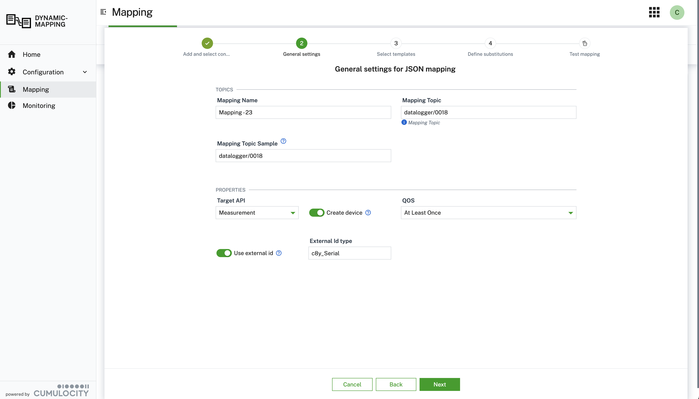

# Dynamic Mapper Service for Cumulocity

>NOTE: Breaking changes 
Due to the approach to sync the JS7TS API offer Smart Functions with the new Cumulocity Product IDP (Intelligent Data Preparation) the followinf JS APi where changed in this release:


**Obsolete**
```
    // lookup device for enrichment
    var deviceByDeviceId = context.getManagedObjectByDeviceId(payload.get("deviceId"));
    context.logMessage("Device (by device id): " + deviceByDeviceId);

    var deviceByExternalId = context.getManagedObject({ externalId: payload.get("clientId"), type: "c8y_Serial" } );
    c


**New**
```
    // lookup device for enrichment
    var deviceByDeviceId = context.getManagedObjectByDeviceId(payload.get("deviceId"));
    context.logMessage("Device (by device id): " + deviceByDeviceId);

    var deviceByExternalId = context.getManagedObject({ externalId: payload.get("clientId"), type: "c8y_Serial" } );
    context.logMessage("Device (by external id): " + deviceByExternalId);
```

## Overview

The Cumulocity Dynamic Mapper addresses the need to get **any** data provided by a message broker mapped to the Cumulocity IoT Domain model in a zero-code approach powered by AI agents.
It can connect to multiple message brokers like **MQTT**, **MQTT Service**, **Kafka** and others, subscribes to specific topics and maps the data in a graphical or code-based editor to the domain model of Cumulocity.

Per default, the following connectors are supported

- **MQTT** - any MQTT Broker
- **Cumulocity MQTT Service** - Cumulocity built-in MQTT Broker
- **Kafka** - Kafka Broker
- **HTTP/REST** - HTTP/REST Endpoint

Using the Cumulocity Dynamic Mapper you are able to connect to almost any message broker and map any payload on any topic dynamically to
the Cumulocity IoT Domain Model in a graphical or, if you prefer code, in a web code editor.

It comes with built-in **AI agents** that suggest and create mappings based on provided or snooped payloads.

Here are the **core features** summarized:

- **Connect** to multiple message broker of your choice at the same time.
- **Map** any data to/from the Cumulocity Domain Model in a graphical or code-based (javaScript) way.
- **Auto-generate** mappings using AI agents that suggest and create mappings based on provided or snooped payloads.
- **Bidirectional mappings** are supported - so you can forward data to Cumulocity or subscribe on Cumulocity data and forward it to the broker
- **Transform** data with a comprehensive expression language supported by [JSONata](https://jsonata.org/) or plain JavaScript.
- **Filter** messages either via topic subscriptions or using simple expressions or JavaScript code applied on the payload.
- **Multiple payload formats** are supported, starting with **JSON**, **Protobuf**, **Hex**.
- **Extend** the mapper easily by using payload extensions or the provided connector interface
- Full support of **multi-tenancy** - deploy it in your enterprise tenant and subscribe it to sub-tenants.

<br/>
<p align="center">

</p>
<br/>

## Installation

Please check the [Installation Guide](/INSTALLATION.md) to find out how you can install the Dynamic Mapper.

## User Guide

Please check the [User Guide](/USERGUIDE.md) to find comprehensive guidance on how to use the Dynamic Mapper.

### Defining a mapping

When you start with a new mapping the first considerations are about the payload format and the transformation type to use:

1. In which format is the inbound payload sent? This defines the payload type to choose: JSON, Flat File, Hexadecimal, Protobuf
2. How to define the transformation of inbound to Cumulocity format? This defines the transformation type: JSONata, Smart Functions, ...

<br/>
<p align="center">

<br/>
<b>Description:</b> Screenshot showing available payload types.
</p>
<br/>

<br/>
<p align="center">

<br/>
<b>Description:</b> Screenshot showing available transformation types.
</p>
<br/>

Now you start adding a mapping by clicking **Add mapping** (Mapping -> Inbound Mapping -> Action Add mapping).

In the **Add mapping** dialog, you can choose the payload type, e.g. **JSON** and the transformation type, e.g. **Define substitutions as JavaScript** to use JavaScript.

<br/>
<p align="center">

</p>
<br/>

The stepper guides you through these steps to define a mapping using JSONata for substitutions:

1. Add or select an existing connector for your mapping (where payloads come from).
2. Define general settings, such as the topic name for this mapping.
3. Select or enter the template for the expected source payload. This is used as the source path for substitutions.
4. Define substitutions for copying content from the source to the target payload. These will be applied at runtime.
5. Test the mapping by applying the substitutions and save the mapping.

<br/>
<p align="center">

</p>
<br/>

### Defining the payload transformation using a Smart Function (JavaScript)

When you select **Smart Function** as the **Transformation Type** in the modal dialog, you can define the entire payload directly in the editor using JavaScript syntax, rather than just substitutions. At runtime, this JavaScript code is evaluated and copies the value to the target payload path. This gives you the freedom to see the payload exactly as it is sent to the Cumulocity backend.

**Note:** The JavaScript editor for Smart Function is only available if you select the **Smart Function** as a **Transformation Type** when creating the mapping.

The signature and structure of a **Smart Function** has the form:

```javascript
function onMessage (inputMsg, context) {
    const msg = inputMsg;
    var payload = msg.getPayload(); // contains payload

    context.logMessage("Context" + context.getStateAll());
    context.logMessage("Payload Raw:" + msg.getPayload());
    context.logMessage("Payload messageId" +  msg.getPayload().get('messageId'));
    // insert transformation logic here

    // then return result
    return [{
        cumulocityType: "measurement",
        action: "create",
        payload: {
            "time":  new Date().toISOString(),
            "type": "c8y_TemperatureMeasurement",
            "c8y_Steam": {
                "Temperature": {
                    "unit": "C",
                    "value": payload["sensorData"]["temp_val"]
                }
            }
        },
        externalSource: [{"type":"c8y_Serial", "externalId": payload.get("clientId")}]
    }];
}
```

The **Smart Function** allows to enrich the payload with inventory data from the device e.g.:

```javascript
// lookup device for enrichment
var deviceByDeviceId = context.getManagedObjectByDeviceId(payload.get("deviceId"));
context.logMessage("Device (by device id): " + deviceByDeviceId);

var deviceByExternalId = context.getManagedObject({ externalId: payload.get("clientId"), type:"c8y_Serial" } );
context.logMessage("Device (by external id): " + deviceByExternalId);
```

**Note:** Only device fragments configured in **Configuration > Service Configuration > Function > Fragments from inventory to cache** can be referenced and have to be defined in this list of fragments.

<br/>
<p align="center">

<br/>
<b>Description:</b> Screenshot showing step 4 for defining complete transformation using JavaScript.
</p>
<br/>

## Architecture

Please check the [Architecture overview](/ARCHITECTURE.md) if you are eager to understand how it is implemented.

## API

Please check the [REST API](/resources/openAPI/README.md) provided by the Dynamic Mapper.
You can also check out the **Swagger UI** of the Dynamic Mapper at the following URL: `{yourTenantURL}/service/dynamic-mapper-service/swagger-ui/index.html`

To embed the API in your API tools of your choice, e.g. postman, use this URL: [Open API Specification](/resources/openAPI/openapi.json)

## Extensions

The Dynamic Mapper can be extended on multiple layers. Check out the [Extensions Guide](/EXTENSIONS.md) if you want to add customer mapper or connectors.

## Limitations

Please check the current [Limitations](/LIMITATIONS.md) of the Dynamic Mapper.

## Contribution

We are always looking for additional [contribution](/CONTRIBUTING.md).

## Build & Deploy

If you want to make changes to the code or configuration check out this [Build & Deploy guide](/BUILDDEPLOY.md)

## Tests & Sample Data

### Load Test

In the resource section you find a test profil [jmeter_test_01.jmx](./resources/script/performance/jmeter_test_01.jmx) using the performance tool `jmeter` and an extension for MQTT: [emqx/mqtt-jmeter](https://github.com/emqx/mqtt-jmeter).
This was used to run simple load test.

## Setup Sample mappings

A script to create sample mappings can be found [here](./resources/script/mapping/import_mappings_01.py).
You have to start it as follows:

```
#python3 resources/script/mapping/import_mappings_01.py -p <YOUR_PASSWORD> -U <YOUR_TENANT> -u <YOUR_USER> -f resources/script/mapping/sampleMapping/sampleMappings_02.json
```

The mappings with inputs and substitutions are explained in the [sample document](./resources/samples/SampleMappings_19.xlsx).

## Security evaluation code-base mappings (JavaScript)

For code-base mappings user defined JavaScript code is executed (evaluated) on the JVM in the Cumulocity microservice for this backend.
This could pose potential security risks, therefore special configurations are applied to restrict the access from the JavaScript code (guest code) to the JVM and the java code (host code).
The guest code runs in a [Sandbox](https://https://www.graalvm.org/latest/security-guide/sandboxing/) with a policy `SandboxPolicy.TRUSTED`. The Graals `Context` is build with the minimal access right to receive the required message payload an to return the list of substitutions.
This was tested with te following JavaScript code snippets:
* The test to access the environment variables in JavaScript returns an error:
```
// Log all environment variables via JavaScript
console.log(process.env);    // <---- line 15
```

```
2025-05-05T07:52:28.782Z  WARN 14 --- [  virtThread-18] d.m.processor.inbound.DispatcherInbound  : Tenant t2050305588 - Processing error: - Demo 4b - Code-Based for mapping: ReferenceError: process is not defined, line 15
```

* The test to access the environment variables over Java returns an error:
```
// Log all environment variables via Java
const System = Java.type('java.lang.System');   // <---- line 19
const env = System.getenv();
console.log('Environment via JavaS', env);
```

```
2025-05-05T08:03:11.587Z  WARN 14 --- [  virtThread-20] d.m.processor.inbound.DispatcherInbound  : Tenant t2050305588 - Processing error: - Demo 4b - Code-Based for mapping: TypeError: Access to host class java.lang.System is not allowed or does not exist., line 19
```


---

These tools are provided as-is and without warranty or support. They do not constitute part of the Cumulocity GmbH product suite. Users are free to use, fork and modify them, subject to the license agreement. While Cumulocity GmbH welcomes contributions, we cannot guarantee to include every contribution in the master project.

