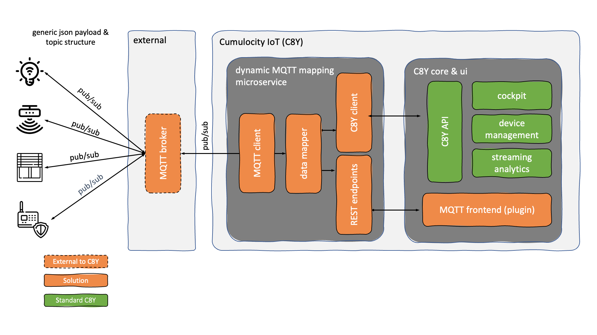
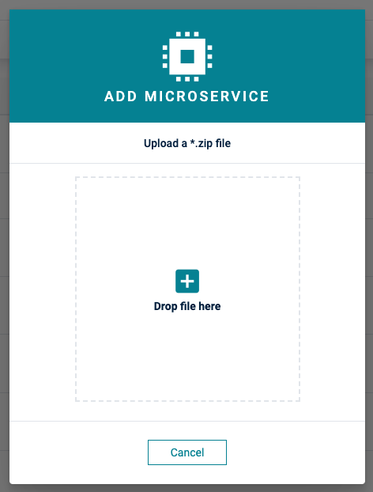
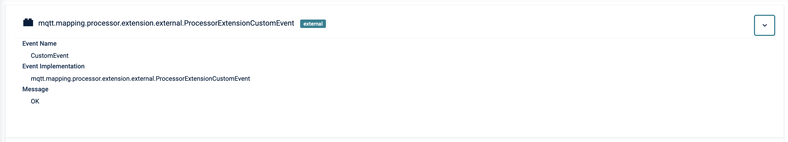
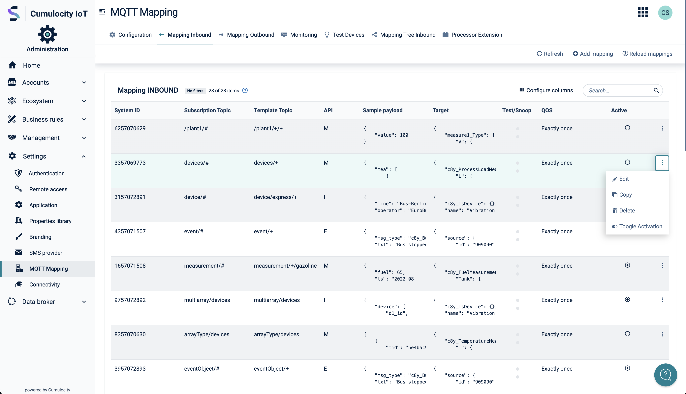
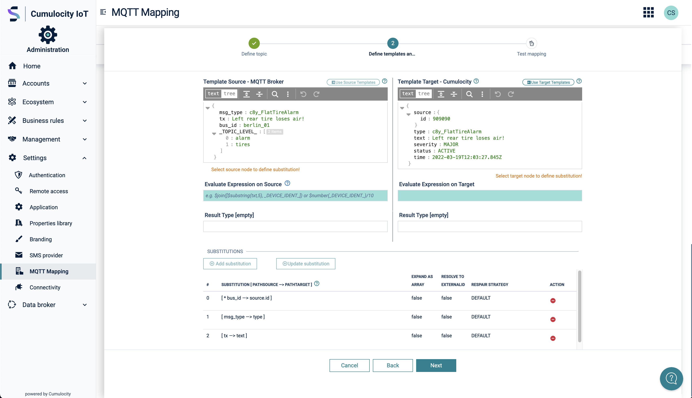

# Generic MQTT Agent Microservice for Cumulocity

## Description

Cumulocity IoT does have an MQTT endpoint but does not yet allow connecting generic MQTT devices. This project addresses
this gap by providing the following artifcats:

* A **Microservice** - exposes REST endpoints, uses the [PAHO MQTT Client](https://github.com/eclipse/paho.mqtt.java) to
connect to a MQTT Broker, a generic Data Mapper & Expression Language  for data mapping and the
[Cumulocity Microservice SDK](https://cumulocity.com/guides/microservice-sdk/introduction/) to connect to Cumulocity.
* A **Frontend Plugin** - uses the exposed endpoints of the microservice to configure a MQTT Broker connection & to perform 
graphical MQTT Data Mappings within the Cumumlocity IoT UI.

Using this project you are able to connect to any MQTT Broker and map any JSON-based payload on any topic dynamically to
the Cumulocity IoT Domain Model in a graphical way.

### Architecture

The grey components are part of this project.

The MQTT Broker configuration is persisted in the tenant options of a Cumulocity IoT Tenant.

Mappings are persisted as Managed Objects and can be easily changed, deleted or migrated.

For the mappings we differentiate between a **subscription topic** and a **template topic**:

#### Subscription Topic

This is the topic which is actually subscribed on in the MQTT Broker. It can contain wildcards.
Examples are: "device/#", "device/data/#", "device/12345/data" etc.

#### Template Topic

The template topic is the key of the persisted mapping. The main difference to subscription topic is that 
a template topic can have a path behind the wildcard for the reason as we can receive multiple topics on a wildcard which might be mapped differently.
Examples are: "device/#/data, "device/#/events/", "device/#/sensor"

### Known Limitation & Disclaimer

Currently this project is focussing on JSON Payload only. Any other payload sent via MQTT must be mapped programmatically.
See chapter [Enhance](#enhance) for more details.

As we already have a very good C8Y API coverage for mapping not all complex cases might be supported. Currently the 
following Mappings are supported:

* Inventory
* Events
* Measurements
* Alarms

Beside that complex JSON objects & arrays are supported but not fully tested.
Also complex mapping expressions are supported by using [JSONata](https://jsonata.org).

Example to concatenate JSON Properties with JSONata:
```
Account.Order[0].Product[0]."Product Name" & "_" &Account.Order[0].Product[0]."ProductID"
```

Pull Requests adding mappings for other data formats or additional functionaly are welcomed!

## Prerequisites
In your Cumulocity IoT Tenant you must have the **microservice** feature subscribed. Per default this feature is not
avilable and must be provided by administrators of the instance you are using.

Make sure to use an user with admin privileges in your Tenant.

## Installation

You need to install two components to your Cumulocity IoT Tenant:

* Microservice
* WebApp Plugin

Both are provided as binaries in [Releases](https://github.com/SoftwareAG/cumulocity-generic-mqtt-agent/releases). Take 
the binaries from the latest release and upload them to your Cumulocity IoT Tenant.

### Microservice

In Administration App go to Ecosystem -> Microservices and click on "Add Microservice" on the top right.

.

Select the "generic-mqtt-agent.zip".
Make sure that you subscribe the microservice to your tenant when prompted

### Web App Plugin

In Adminstration App go to Ecosystem -> Packages and click on "Add Application" on the top right.

> Note: If you don't see the Packages Menu you have to add "?beta=true" in your URL.
> Example: {{url}}/apps/administration?beta=true

Select "mqtt-configuration.zip" and wait until it is uploaded.

> Note: We need to clone the Administration app to add the plugin to it

After succesful upload go to "All Applications" and click on "Add Application". Select "Duplicate existing application"
and afterwards "Administration".
.

Now select the cloned Administration App and go to the "Plugin" Tab. Click on "Install Plugin" and select "MQTT configuration plugin"



## Build, Deploy, Run
Make sure that [Docker](https://www.docker.com/) and [Apache Maven](https://maven.apache.org/) are installed and running on your Computer.

### Backend - Microservice
Run `mvn clean package` in folder `backend` to build the Microservice which will create a ZIP archive you can upload to Cumulocity.
Just deploy the ZIP to the Cumulocity Tenant like described [here](https://cumulocity.com/guides/users-guide/administration/#uploading-microservices).

### Frondend - Plugin
Run `npm run build` in folder `frontend/mqtt-configuration` to build the Front End (plugin) for the Administration which will build a plugin.
Run `npm run deploy` in folder `frontend/mqtt-configuration` to deploy the Front End (plugin) to your Cumulocity istration which will build a plugin.
The Frontend is build as Plugin [here](https://cumulocity.com/guides/web/tutorials/#add-a-custom-widget-with-plugin).

## Configuration and Definition of MQTT Mappings

### Configuration MQTT Connection to broker


### Table of MQTT Mappings



### Define message Templates for source and target (Cumulocity REST format)




### Define message Mapping for Source and Target (Cumulocity REST format)


### Test transformation of Source to Target message (Cumulocity REST format)


### Send transformed Test Message to test device in Cumulocity


### Setup Sample MQTTMappings

A script to create sample MQTTMappings can be found [here](resources/script/createSampleMQTTMappings.sh).

## Enhance
In the folder [Callbacks](./backend/src/main/java/mqttagent/callbacks) you can either overwrite the existing `GenericCallback.class` or add a new Handler in the handler folder.
As an example see the [SysHandler](./backend/src/main/java/mqttagent/callbacks/handler/SysHandler.java) which subscribes and handles all topics for $SYS and creates Measurements in Cumulocity for the received data.

______________________
These tools are provided as-is and without warranty or support. They do not constitute part of the Software AG product suite. Users are free to use, fork and modify them, subject to the license agreement. While Software AG welcomes contributions, we cannot guarantee to include every contribution in the master project.

Contact us at [TECHcommunity](mailto:technologycommunity@softwareag.com?subject=Github/SoftwareAG) if you have any questions.


