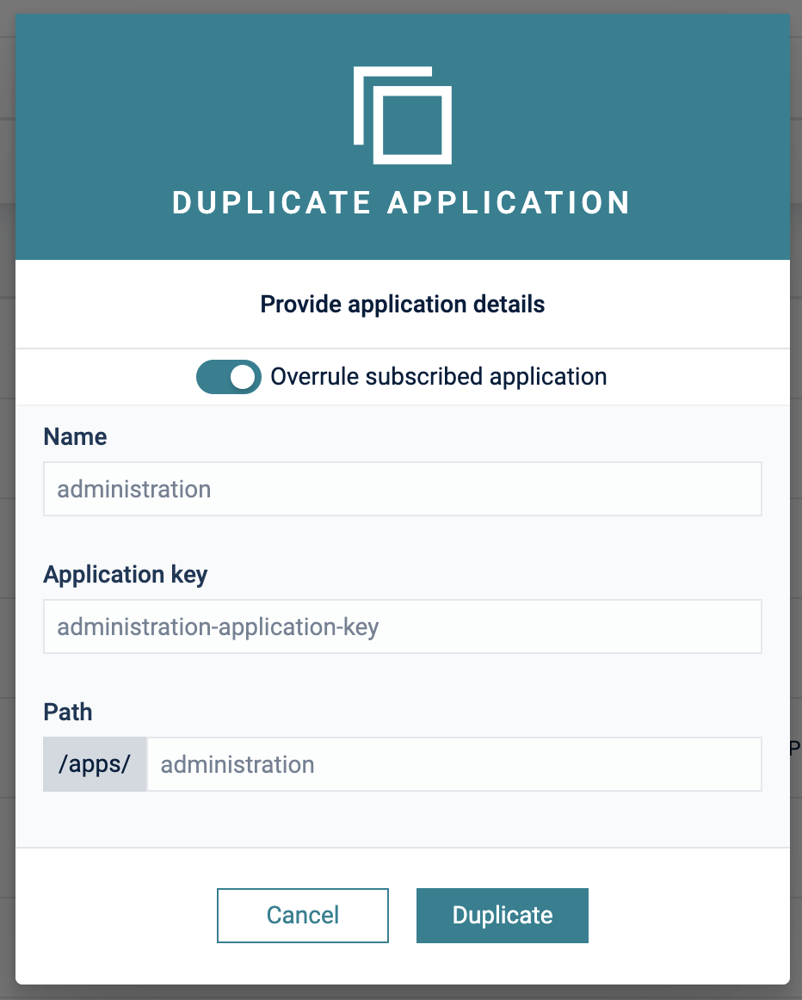
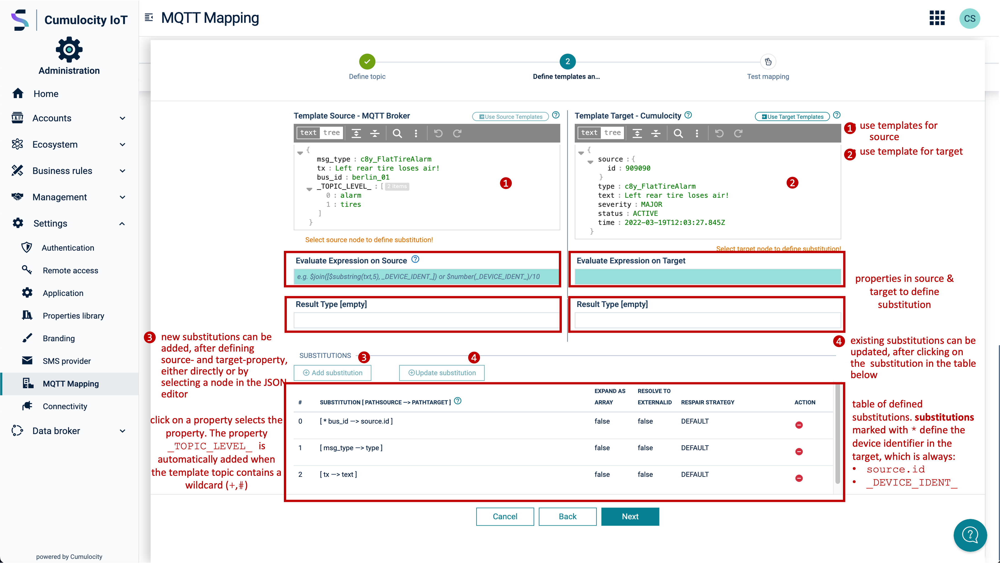
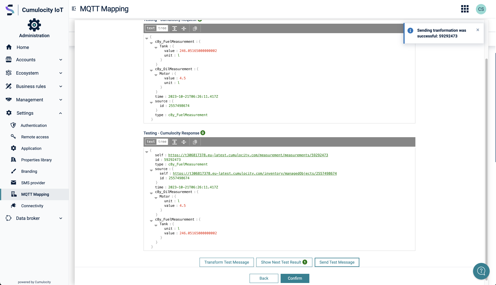

# Generic MQTT Agent Microservice for Cumulocity

# Content
- [Overview](#overview)
  * [Architecture](#architecture)
  * [Known Limitation and Disclaimer](#known-limitation-and-disclaimer)
  * [Prerequisites](#prerequisites)
- [Installation](#installation)
  * [Microservice](#icroservice)
  * [Web App Plugin](#web-app-plugin)
  * [Build, Deploy, Run](#build-deploy-run)
- [Configuration, Definition and Deployment of MQTT-Mappings](#configuration-definition-and-deployment-of-mqtt-mappings)
  * [Configuration MQTT Connection to broker](#configuration-mqtt-connection-to-broker)
  * [Table of MQTT mappings](#table-of-mqtt-mappings)
  * [Define message mapping for Source and Target (Cumulocity REST format)](#define-message-mapping-for-source-and-target-(cumulocity-rest-format))
    + [Wizzard to define a mapping](#wizzard-to-define-a-mapping)
    + [Define templates and substitutions for source and target payload](#define-templates-and-substitutions-for-source-and-target-payload)
  * [Test transformation of Source to Target message (Cumulocity REST format)](#test-transformation-of-source-to-target-message-(cumulocity-rest-format))
  * [Setup Sample MQTT-Mappings](#setup-sample-mqtt-mappings)
  * [Snooping payloads on source topic](#snooping-payloads-on-source-topic)
    + [Enable snooping payloads on source topic](#enable-snooping-payloads-on-source-topic)
    + [Use snooped payloads in source templates](#use-snooped-payloads-in-source-templates)
- [Monitoring](#monitoring)


## Overview

Cumulocity IoT has a MQTT endpoint but does not yet allow devices to send generic MQTT payloads. This project addresses
this gap by providing the following artifcats:

* A **Microservice** - exposes REST endpoints, uses the [PAHO MQTT Client](https://github.com/eclipse/paho.mqtt.java) to
connect to a MQTT Broker, a generic Data Mapper & Expression Language  for data mapping and the
[Cumulocity Microservice SDK](https://cumulocity.com/guides/microservice-sdk/introduction/) to connect to Cumulocity.
* A **Frontend Plugin** - uses the exposed endpoints of the microservice to configure a MQTT Broker connection & to perform 
graphical MQTT Data Mappings within the Cumumlocity IoT UI.

Using the solution you are able to connect to any MQTT Broker and map any JSON-based payload on any topic dynamically to
the Cumulocity IoT Domain Model in a graphical way.

### Architecture

The grey components are part of this project which are:

* **MQTT Client** - using [PAHO MQTT Client](https://github.com/eclipse/paho.mqtt.java) to connect and subscribe to a MQTT Broker
* **Data Mapper** - handling of received messages via MQTT and mapping them to a target data format for Cumulocity IoT. 
Also includes an expression runtime [JSONata](https://jsonata.org) to execute expressions
* **C8Y Client** - implements part of the Cumulocity IoT REST API to integrate data
* **REST Endpoints** - custom endpoints which are used by the MQTT Frontend or can be used to add mappings programmatically
* **MQTT Frontend** - A plugin for Cumulocity IoT to provide an UI for MQTT Configuration & Data Mapping

### Known Limitation and Disclaimer

Currently this project is focussing on JSON Payload only. Any other payload sent via MQTT must be mapped programmatically.
See chapter [Enhance](#enhance) for more details.

As we already have a very good C8Y API coverage for mapping not all complex cases might be supported. Currently the 
following Mappings are supported:

* Inventory
* Events
* Measurements
* Alarms

Beside that complex JSON objects & arrays are supported but not fully tested.

> **Pull Requests adding mappings for other data formats or additional functionaly are welcomed!**

## Prerequisites
In your Cumulocity IoT Tenant you must have the **microservice** feature subscribed. Per default this feature is not
avilable and must be provided by administrators of the instance you are using.

Make sure to use an user with admin privileges in your Tenant.

## Installation

You need to install two components to your Cumulocity IoT Tenant:

* Microservice
* WebApp Plugin

Both are provided as binaries in [Releases](https://github.com/SoftwareAG/cumulocity-generic-mqtt-agent/releases). Take 
the binaries from the latest release and upload them to your Cumulocity IoT Tenant.

### Microservice

In Administration App go to Ecosystem -> Microservices and click on "Add Microservice" on the top right.

.

Select the "generic-mqtt-agent.zip".
Make sure that you subscribe the microservice to your tenant when prompted

### Web App Plugin

In Adminstration App go to Ecosystem -> Packages and click on "Add Application" on the top right.

> Note: If you don't see the Packages Menu you have to add "?beta=true" in your URL.
> Example: {{url}}/apps/administration?beta=true

Select "mqtt-mapping.zip" and wait until it is uploaded.

> Note: We need to clone the Administration app to add the plugin to it

After succesful upload go to "All Applications" and click on "Add Application". Select "Duplicate existing application"
and afterwards "Administration".

.

Now select the cloned Administration App and go to the "Plugin" Tab. Click on "Install Plugin" and select "MQTT configuration plugin"


## Build, Deploy, Run
Make sure that [Docker](https://www.docker.com/) and [Apache Maven](https://maven.apache.org/) are installed and running on your Computer.

### Backend - Microservice
Run `mvn clean package` in folder `backend` to build the Microservice which will create a ZIP archive you can upload to Cumulocity.
Just deploy the ZIP to the Cumulocity Tenant like described [here](https://cumulocity.com/guides/users-guide/administration/#uploading-microservices).

### Frondend - Plugin
Run `npm run build` in folder `frontend/mqtt-mapping` to build the Front End (plugin) for the Administration which will build a plugin.
Run `npm run deploy` in folder `frontend/mqtt-mapping` to deploy the Front End (plugin) to your Cumulocity istration which will build a plugin.
The Frontend is build as Plugin [here](https://cumulocity.com/guides/web/tutorials/#add-a-custom-widget-with-plugin).

## Configuration, Definition and Deployment of MQTT mappings

### Configuration MQTT Connection to broker
The MQTT Broker configuration is persisted in the tenant options of a Cumulocity IoT Tenant and can be configured by the following UI.

<br/>
<p align="center" style="text-indent:70px;">
  <a>
    
  </a>
</p>
<br/>

### Table of MQTT mappings
Once the connection to a MQTT broker is configured and successfully enabled you can start defining MQTT mappings. The MQTT mappings table is the entry point for:
1. Creating new MQTT mappinfs: Press button ```Add Mapping```
1. Updating exsiting MQTT mapping: Press the pencil in the row of the relevant mapping
1. Deleting exsiting MQTT mapping: Press the "-"" in the row of the relevant mapping to delete an existing mappings

After every change the mappings are automatically updated in the microservice.


### Define message Mapping for Source and Target (Cumulocity REST format)
Mappings are persisted as Managed Objects and can be easily changed, deleted or migrated.

For the mappings we differentiate between a **subscription topic** and a **template topic**:

#### Subscription Topic

This is the topic which is actually subscribed on in the MQTT Broker. It can contain wildcards.
Examples are: "device/#", "device/data/#", "device/12345/data" etc.

#### Template Topic

The template topic is the key of the persisted mapping. The main difference to the subscription topic is that
a template topic can have a path behind the wildcard for the reason as we can receive multiple topics on a wildcard which might be mapped differently.
Examples are: "device/#/data, "device/#/events/", "device/#/sensor"

#### Expression Language
In addition to using plain properties of the source payload, you can apply functions on the payload properties. This covers a scenario where a device name should be a combination of a generic name and an external device Id. In this case the following function could be used:
```$join([device_name, _DEVICE_IDENT_])```.
Complex mapping expressions are supported by using [JSONata](https://jsonata.org).

Example to concatenate JSON Properties with JSONata:
```
Account.Order[0].Product[0]."Product Name" & "_" &Account.Order[0].Product[0]."ProductID"
```
### Wizzard to define a mapping
<br/>

The wizzard to define a mapping consists of the steps:
1. Define the properties of the topic and API to be used
1. Define the templates for the source and target, in JSON format. The soure payload can be in any custom JSON format. the target format has to follow the schemsa for Alarm, Events, Measurements or Inventory, [see Cumulocity OpenAPI](https://cumulocity.com/api/).
1. Test the mapping by applying the transformation and send the result to a test device.

<br/>

#### Define MQTT topic properties
<br/>


#### Define templates and substitutions for source and target payload
<br/>


<br/>

In oder to define a substitution ( substitute values in the target payload with values extracted at runtime from the source payload), the UI offers the following features:
1. Add mapping (button with "+" sign)
1. Show & Select already defined substitutions (button with skip symbol). A selected substitution is colored and can be deleted by pressing the button with "-" sign
1. Delete mapping (button wiht one "-" sign), the selected substitution is deleted
1. Delete all mappings (button wiht two "--" signs). In this case the substitution to define the deviceIdentifier is automatically added again. This is the case when a template topic contains a wildcard, eithe "+"- singel level or "#" - multi level


<br/>

To define a new substitution the following steps have to be performed:
1. Select a property in the source JSON payload by double-click on the respective property. Then the JSONpath is appears in the field with the label ```Evaluate expression on source```
1. Select a property in the target JSON payload by double-click on the respective property. Then the JSONpath is appears in the field with the label ```Substitute in target```
1.  Select  ```Defines device identifier``` if this property defines the device identifier, i.e. it is mapped to ```source.id```.
1. Press the add button with the ```+``` sign.

Note: When adding a new substitution the following two cosistency rules are checked:

1. Does another substitution for the same target property exist? If so, a modal dialog appears and asks for confirmation to overwrite the existing substitution.
1. If the new substotution defines the device identifier, it is checked if already another substitution exists defining the device identifier. If so, a modal dialog appears and asks for confirmation to overwrite the existing substitution.


#### Test transformation of Source to Target message (Cumulocity REST format)
<br/>

To test the defined transformation, press the button ```Transform test message```. The result of the transformation and any error are displayed.


### Send transformed Test Message to test device in Cumulocity
<br/>

To send the a transformormed payload to a test device, press the button ```Send test message```.



### Setup Sample MQTT-Mappings

A script to create sample MQTT-Mappings can be found [here](resources/script/createSampleMQTTMappings.sh).

For all target payloads in Cumulocity (Measurement, Event, Alarm, Inventory) schemas for the required  are defined and validated.
In the sample below , e.g. a warning is shown since the required property ```source.id``` is  missing in the payload.
<br/>


### Snooping payloads on source topic

In the first wizzard step snooping for payloads on the source topic can be started. In order to record JSON payloads on this topic a subscrition records the payloads and saves them for later use in a source template.
The process goes through the steps **ENABLED** -> **STARTED** -> **STOPPED**.
If a payload is found the status moves to **STARTED**. This is indicated in the last column of the mappping table, where the number of payloads snooped so far is shown.

#### Enable snooping payloads on source topic
<br/>


#### Use snooped payloads in source templates
<br/>

In order to use a previously snooped payload click the button
```Snooped templates```. Multiples activation of this button iterates over all the recorded templates.


### Monitoring

<br/>

On the monitoring tab you can see how a specific MQTT mapping performs during the last activation in the microservice.


## Enhance
In the folder [Callbacks](./backend/src/main/java/mqttagent/callbacks) you can either overwrite the existing `GenericCallback.class` or add a new Handler in the handler folder.
As an example see the [SysHandler](./backend/src/main/java/mqttagent/callbacks/handler/SysHandler.java) which subscribes and handles all topics for $SYS and creates Measurements in Cumulocity for the received data.

______________________
These tools are provided as-is and without warranty or support. They do not constitute part of the Software AG product suite. Users are free to use, fork and modify them, subject to the license agreement. While Software AG welcomes contributions, we cannot guarantee to include every contribution in the master project.

Contact us at [TECHcommunity](mailto:technologycommunity@softwareag.com?subject=Github/SoftwareAG) if you have any questions.


