# Dynamic MQTT Mapping Service for Cumulocity

# Content
- [Overview](#overview)
  * [Architecture](#architecture)
  * [Known Limitation and Disclaimer](#known-limitation-and-disclaimer)
  * [Prerequisites](#prerequisites)
- [Installation](#installation)
  * [Microservice](#microservice)
  * [Web App Plugin](#web-app-plugin)
  * [Build, Deploy, Run](#build-deploy-run)
  * [Permissions](#permissions)
- [Configuration MQTT connection to broker](#configuration-mqtt-connection-to-broker)
- [Definition and Activation  of MQTT mappings](#definition-and-activation-of-mqtt-mappings)
  * [Table of MQTT mappings](#table-of-mqtt-mappings)
  * [Define mappings from source to target format (Cumulocity REST format)](#define-mappings-from-source-to-target-format-cumulocity-rest-format)
    + [Wizard to define a mapping](#wizard-to-define-a-mapping)
    + [Snooping payloads on source topic](#snooping-payloads-on-source-topic)
    + [Enable snooping payloads on source topic](#enable-snooping-payloads-on-source-topic)
    + [Define templates and substitutions for source and target payload](#define-templates-and-substitutions-for-source-and-target-payload)
    + [Different type of substitutions](#different-type-of-substitutions)
  * [Test transformation from source to target format](#test-transformation-from-source-to-target-format)
  * [Send transformed test message to test device in Cumulocity](#send-transformed-test-message-to-test-device-in-cumulocity)
  * [Use snooped payloads in source templates](#use-snooped-payloads-in-source-templates)
  * [Update existing Mapping](#update-existing-mapping)
- [Processing Extensions (Protobuf, ...)](#processing-extensions)
- [Monitoring](#monitoring)
- [Mapping Tree](#mapping-tree)
- [REST API](#rest-api)
- [Load Test](#load-test)
- [Setup Sample MQTT mappings](#setup-sample-mqtt-mappings)


## Overview

Cumulocity IoT has a MQTT endpoint, but does not yet allow devices to send generic MQTT payloads. This project addresses
this gap by providing the following artifcats:

* A **Microservice** - exposes REST endpoints, uses the [PAHO MQTT Client](https://github.com/eclipse/paho.mqtt.java) to
connect to a MQTT broker, a generic Data Mapper & Expression Language  for data mapping and the
[Cumulocity Microservice SDK](https://cumulocity.com/guides/microservice-sdk/introduction/) to connect to Cumulocity.
* A **Frontend Plugin** - uses the exposed endpoints of the microservice to configure a MQTT broker connection & to perform 
graphical MQTT Data Mappings within the Cumumlocity IoT UI.

Using the solution you are able to connect to any MQTT broker and map any JSON-based payload on any topic dynamically to
the Cumulocity IoT Domain Model in a graphical way.

### Architecture
The architecture of the components consists of the following components:

<p align="center">

</p>
<br/>
The grey components are part of this project which are:

* **MQTT Client** - using [PAHO MQTT Client](https://github.com/eclipse/paho.mqtt.java) to connect and subscribe to a MQTT broker
* **Data Mapper** - handling of received messages via MQTT and mapping them to a target data format for Cumulocity IoT. 
Also includes an expression runtime [JSONata](https://jsonata.org) to execute expressions
* **C8Y Client** - implements part of the Cumulocity IoT REST API to integrate data
* **REST Endpoints** - custom endpoints which are used by the MQTT Frontend or can be used to add mappings programmatically
* **MQTT Frontend** - A plugin for Cumulocity IoT to provide an UI for MQTT Configuration & Data Mapping

> **Please Note:** A required MQTT Broker is not part of this repo and must be provided to make use of this component.
> In upcoming releases a *Generic MQTT Broker* will be part of Cumulocity IoT. If necessary we will adapt this component
> to work with it seamlessly!

The mapper processes messages in both directions:
1. `INBOUND`: from external source to C8Y
2. `OUTBOUND`: from C8Y to external source

Before inbound messages can be processed, the mappings have to be loaded into the mapping cache, which is part of the microservice. This cache is organized as a tree to reduce retrival times when later messages arrive. Then the approriate mapping can be efficiently found by traversing the tree.The following diagram describes what happens in the mapping cache if a new MQTT mapping is added to the list of already existing mappings. 

<p align="center">
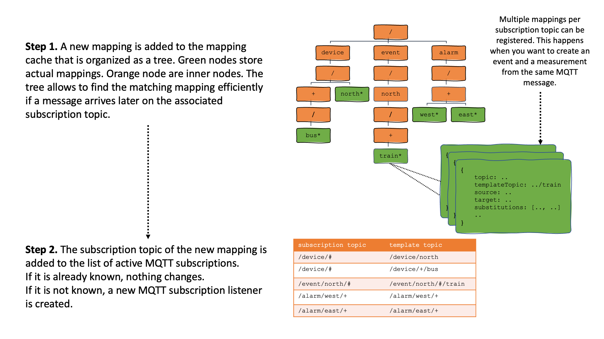
</p>
<br/>

Once all mappings are added to the cache we are ready to process inbound messages transmitted by the MQTT broker.
The following diagram describes how a new message is processed.

<p align="center">
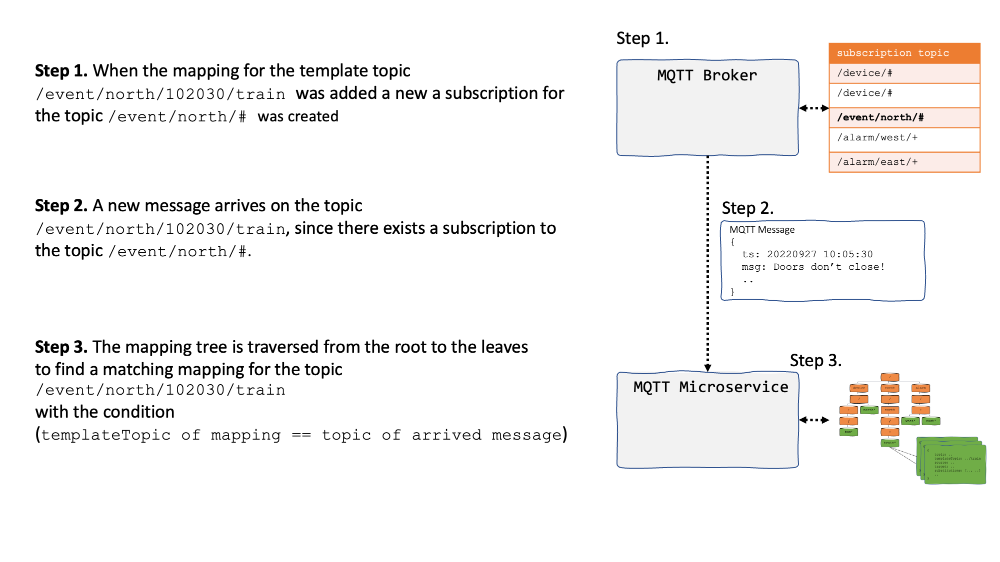
</p>

<p align="center">
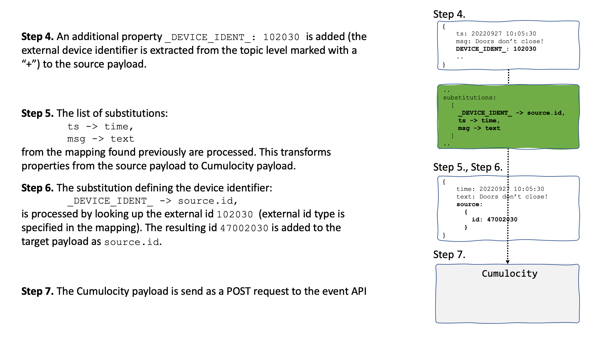
</p>
<br/>

Outbound messages are organized in a flat list. Mappings are bound using the mapping property ```filterOutgoing```. This specifies an fragment name in the Cumulocity message (MEAO or Inventory). Once this fragment exists in a Cumulocity message the respective mapping is applied.

<p align="center">

</p>
<br/>

### Known Limitation and Disclaimer

As we already have a very good C8Y API coverage for mapping not all complex cases might be supported. Currently the 
following Mappings are supported:

* Inventory
* Events
* Measurements
* Alarms
* Operations (Outbound to devices)

Beside that complex JSON objects & arrays are supported but not fully tested.

Due to two different libraries to evaluate JSONata in:
1. `mqtt-mapping-ui`: (nodejs) [npmjs JSONata](https://www.npmjs.com/package/jsonata) and
2. `mqtt-mapping-service` (java): [JSONata4Java](https://github.com/IBM/JSONata4Java)

differences in more advanced expressions can occur. Please test your expressions before you use advanced elements.

The Paho java client uses memory persistence to persist its state (used to store outbound and inbound messages while they are in flight). When the microservice restarts this information is lost. 
The microservice can not use the default `MqttDefaultFilePersistence` of the paho client. See [Issue](https://github.com/eclipse/paho.mqtt.java/issues/507)

### Contribution
> **Pull Requests adding mappings for other data formats or additional functionaly are welcomed!**

## Prerequisites
In your Cumulocity IoT Tenant you must have the **microservice** feature subscribed. Per default this feature is not
available and must be provided by administrators of the instance you are using.

Make sure to use an user with admin privileges in your Tenant.

## Installation

You need to install two components to your Cumulocity IoT Tenant:

1. Microservice - (Java)
2. WebApp Plugin - (Angular/Cumulocity WebSDK)

Both are provided as binaries in [Releases](https://github.com/SoftwareAG/cumulocity-generic-mqtt-agent/releases). Take 
the binaries from the latest release and upload them to your Cumulocity IoT Tenant.

### Microservice

In Administration App go to Ecosystem -> Microservices and click on "Add Microservice" on the top right.

<p align="center">

</p>
<br/>

Select the "mqtt.mapping.service.zip".
Make sure that you subscribe the microservice to your tenant when prompted

### Web App Plugin

In Adminstration App go to Ecosystem -> Packages and click on "Add Application" on the top right.

> **_NOTE:_** If you don't see the Packages Menu you have to add "?beta=true" in your URL.
> Example: {{url}}/apps/administration?beta=true

Select "mqtt-mapping-ui.zip" and wait until it is uploaded.

> **_NOTE:_** We need to clone the Administration app to add the plugin to it

After successful upload go to "All Applications" and click on "Add Application". Select "Duplicate existing application"
and afterwards "Administration".


<p align="center">

</p>
<br/>

Now select the cloned Administration App and go to the "Plugin" Tab. Click on "Install Plugin" and select "MQTT configuration plugin"


<p align="center">

</p>
<br/>

## Build, Deploy, Run
Make sure that [Docker](https://www.docker.com/) and [Apache Maven](https://maven.apache.org/) are installed and running on your computer.

## Permissions
The solution differentiates two different roles:
1. `ROLE_MQTT_MAPPING_ADMIN`: can use/access all tabs, including **Configuration**, **Processor Extension**. In addition the relevant endpoints in `MQTTMappingRestController`:

    1.1. `POST /configuration/connection`

    1.2. `POST /configuration/service` 

    1.3 `DELETE /extension/{extensionName}` 

    are accessible.
1. `ROLE_MQTT_MAPPING_CREATE`: can't use/access tabs **Configuration**, **Processor Extension**.

The two roles have to be assigned in the Web UI **Adminisitration**, see [here](https://cumulocity.com/guides/users-guide/administration/#managing-permissions).

The available tabs for `ROLE_MQTT_MAPPING_ADMIN` are as follows:
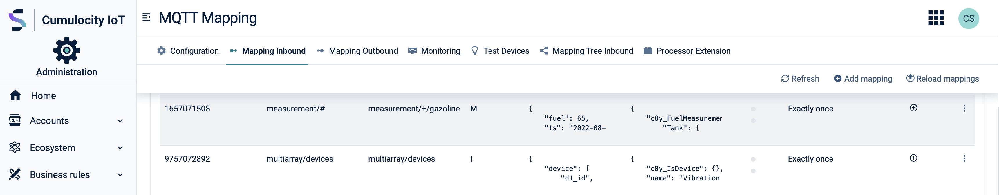

The available tabs for `ROLE_MQTT_MAPPING_CREATE` are as follows:
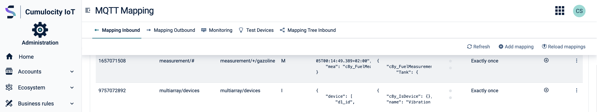

### Backend - Microservice
Run `mvn clean package` in folder `mqtt-mapping-service` to build the Microservice which will create a ZIP archive you can upload to Cumulocity.
Just deploy the ZIP to the Cumulocity Tenant like described [here](https://cumulocity.com/guides/users-guide/administration/#uploading-microservices).

### Frontend - Plugin
Run `npm run build` in folder `mqtt-mapping-ui/mqtt-mapping` to build the Front End (plugin) for the Administration which will build a plugin.
Run `npm run deploy` in folder `mqtt-mapping-ui/mqtt-mapping` to deploy the Front End (plugin) to your Cumulocity tenant.
The Frontend is build as [Cumulocity plugin](https://cumulocity.com/guides/web/tutorials/#add-a-custom-widget-with-plugin).

## Configuration MQTT connection to broker
The MQTT broker configuration is persisted in the tenant options of a Cumulocity Tenant and can be configured by the following UI.\
Furthermore, connections to the MQTT broker can be enabled or disabled.

<!-- <br/>
<p align="center" style="text-indent:70px;">
  <a>
    
  </a>
</p>
<br/> -->

<p align="center">

</p>
<br/>

## Definition and Activation of MQTT mappings

### Table of MQTT mappings

Once the connection to a MQTT broker is configured and successfully enabled you can start defining MQTT mappings. The MQTT mappings table is the entry point for:
1. Creating new MQTT mappings: Press button `Add mapping`
2. Updating existing MQTT mapping: Press the pencil in the row of the relevant mapping
3. Deleting existing MQTT mapping: Press the "-" icon in the row of the relevant mapping to delete an existing mappings

After every change the mappings is automatically updated in the mapping cache of the microservice.


### Define mappings from source to target format (Cumulocity REST format)

Mappings are persisted as Managed Objects and can be easily changed, deleted or migrated.

#### Expression Language

In addition to using plain properties of the source payload, you can apply functions on the payload properties. This covers a scenario where a device name should be a combination of a generic name and an external device Id.
Complex mapping expressions are supported by using [JSONata](https://jsonata.org). \
In this case the following function could be used:
```$join([device_name, id])```. 

Further example for JSONata expressions are:
* to convert a UNIX timestamp to ISO date format use:
      <code>$fromMillis($number(deviceTimestamp))</code>
* to join substring starting at position 5 of property <code>txt</code> with device
      identifier use: <code>$join([$substring(txt,5), "-", id])</code>

>**_NOTE:_**
> * escape properties with special characters with <code>`</code>. The property
        <code>customer-1</code> becomes <code>`customer-1`</code>
> * function chaining using <code>~></code> is not supported, instead use function
        notation. The expression <code>Account.Product.(Price * Quantity) ~> $sum()</code>
        becomes <code>$sum(Account.Product.(Price * Quantity))</code>

### Wizard to define a mapping

Creation of the new mapping starts by pressing `Add Mapping`. On the next modal UI you can choose the mapping type depending on the structure of your payload. Currently there is support for:
1. `JSON`: if your payload is in JSON format
1. `FLAT_FILE`: if your payload is in a csv format
1. `GENERIC_BINARY`: if your payload is in HEX format
1. `PROTOBUF_STATIC`: if your payload is a serialized protobuf message
1. `PROCESSOR_EXTENSION`: if you want to process the message yourself, by registering a processor extension


<p align="center">

</p>
<br/>

The wizard to define a mapping consists of the steps:

1. Select the type of mapping:
* `JSON`
* `FLAT_FILE`
* `GENERIC_BINARY`
* `PROTOBUF_STATIC`
* `PROCESSOR_EXTENSION`
___
  **NOTE:**
Payload for ```FLAT_FILE``` and ```GENERIC_BINARY``` are wrapped.
For example for a flat file messages:

```
{
  "message": "oil,100,1666863595",
}
```
You can use the JSONata function ```$split(str, separator)``` for splitting the payload, e.g:
```
$split(message,",")[1]
```
splits the payload and return the second field: ```100```.

And for the binary payload is encoded as hex string:
```
{
  "message": "5a75207370c3a47420303821",
}
```
Using appropriate JSONata expression you can parse the payload:
```
$parseInteger($string("0x"&$substring(message,0,2)),"0")&" C"
```
___

1. Define the properties of the topic and API to be used
2. Define the templates for the source and target, in JSON format. The soure payload can be in any custom JSON format. the target format has to follow the schemsa for Alarm, Events, Measurements or Inventory, [see Cumulocity OpenAPI](https://cumulocity.com/api/).
3. Test the mapping by applying the transformation and send the result to a test device.

#### Define MQTT topic properties

In the first wizard step properties for the topic are defined.
<p align="center">
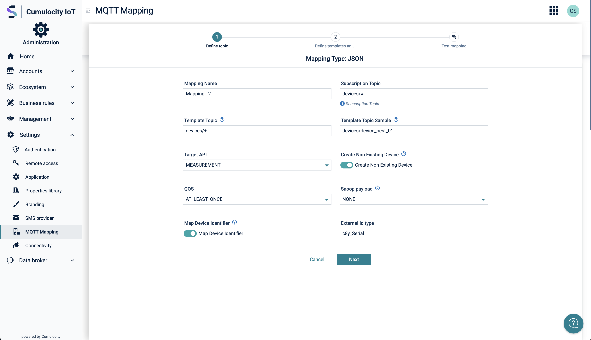
</p>
<br/>

For the mappings we differentiate between a **subscription topic** and a **template topic**:

For outbound mappings the properties are slightly different. Most important are the properties:
1. `filterOutbound`: The Filter Outbound can contain one fragment name to associate a
                      mapping to a Cumulocity MEAO. If the Cumulocity MEAO contains this fragment, the maping is
                      applied.
2. `publishTopic`: MQTT topic to publish outbound messages to.

<p align="center">
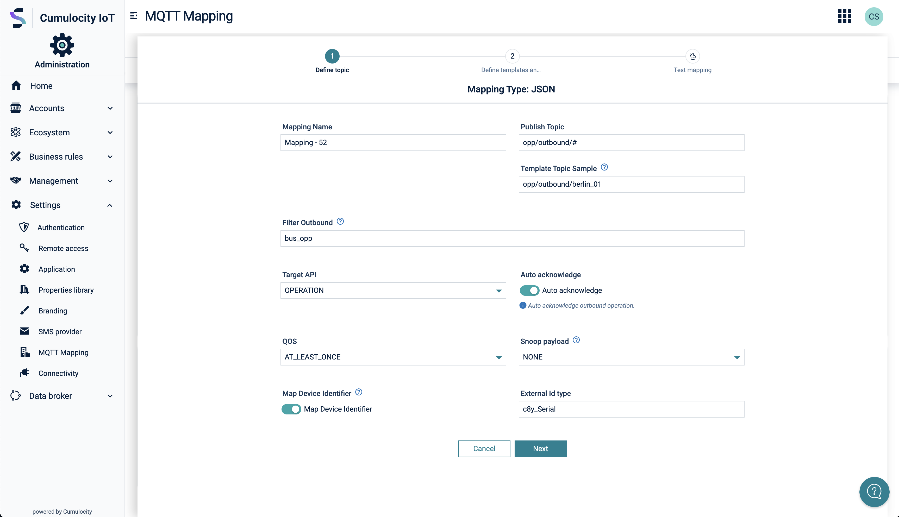
</p>
<br/>

For an outbound mapping to be applied two conditions have to be fulfilled: 
1. the Cumulocity MEAO message has to have a fragment that is defined in property `filterOutbound`
2. for the device a Notification 2.0 subscription has to be created. This is done using the following dialog:
<p align="center">
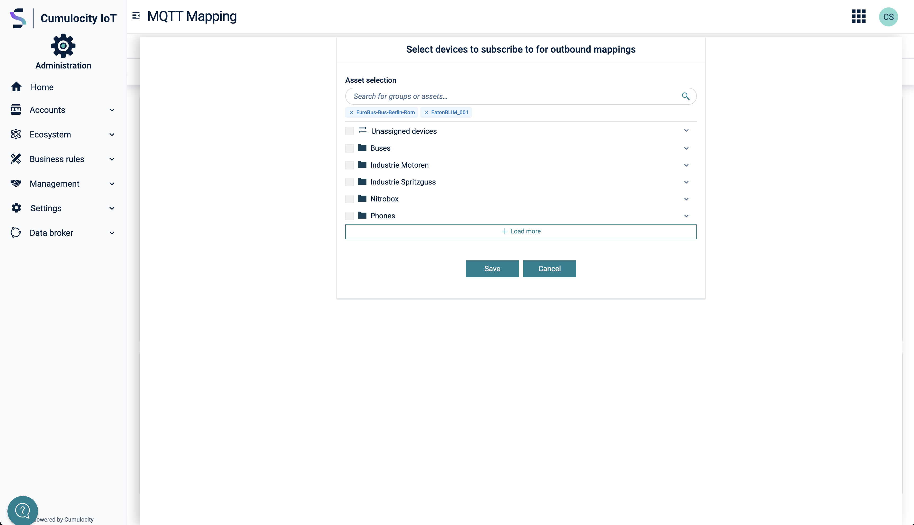
</p>
<br/>

#### Subscription Topic

This is the topic which is actually subscribed on in the MQTT broker. It can contain wildcards, either single level "+" or multilevel "#".

>**_NOTE:_** Multi-level wildcards can only appear at the end of topic. The topic "/device/#/west" is not valid.
Examples of valid topics are: "device/#", "device/data/#", "device/12345/data" etc.

#### Template Topic

The template topic is the key of the persisted mapping. The main difference to the subscription topic is that
a template topic can have a path behind the wildcard for the reason as we can receive multiple topics on a wildcard which might be mapped differently.\
Examples are: "device/+/data, "device/express/+", "device/+"\
In order to use sample data instead of the wildcard you can add a Template Topic Sample, which must have the same structure, i.e. same level in the topic and when explicit name are used at a topic level in the Template Topic they must exactly be the same in the Template Topic Sample.
The levels of the Template Topic are split and added to the payload:
```
  "_TOPIC_LEVEL_": [
    "device",
    "express",
    "berlin_01"
  ]
```
The entries in the ```_TOPIC_LEVEL_``` can be used to resolve the external device identifier to the internal Cumulocity Id.
The additinal property ```_TOPIC_LEVEL_``` is added to the source template shown in the next wizard step. It must not be deleted when editing the JSON source template.

#### Snooping payloads on source topic

Very often you want to use the payloads of existing JSON messages as a sample to define the source template. This can be achieved by listening and recording - **snooping** - messages on a topic.

In order to record JSON payloads on the defined topic a subscription records the payloads and saves them for later use in a source template.

The snooping process goes through the steps **ENABLED** -> **STARTED** -> **STOPPED**.

If a payload is found the status moves to **STARTED**. This is indicated in the last column of the mappping table, where the number of payloads snooped so far is shown.

#### Enable snooping payloads on source topic

To enable snooping select ```ENABLED``` in the drop down as shown in the screenshot below. This starts the snooping process and the microservice subscribes to the related topic and records the received payloads.


<p align="center">
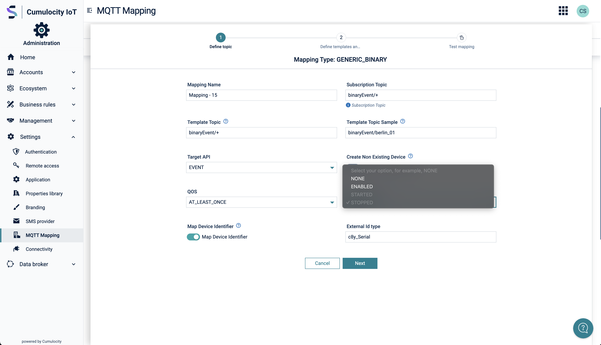
</p>
<br/>

#### Map Device Identifier

Connected devices send their data using an external device identifier, e.g. IMEI, serial number, ... In this case the external id has to be used for looking to the device id used by Cumulocity. To achieve this the entries in the ```_TOPIC_LEVEL_``` can be used to resolve the external device identifier to an internal Cumulocity id. When a payload from this device arrives at runtime the external id is used to lookup the corresponding internal Cumulocity id with the help of a external id tpye.


#### Define templates and substitutions for source and target payload

In the second wizard step, shown on the screenshot below the mapping is further defined:
1. Editing the source template directly or use a snooped template by pressing button ```<-```, arrow left
2. Editing the target template directly or use a sample template by pressing button ```->```, arrow right
3. Adding substitutions


<p align="center">

</p>
<br/>

In order to define a substitution ( substitute values in the target payload with values extracted at runtime from the source payload), the UI offers the following features:
1. Add mapping (button with "+" sign)
2. Show & Select already defined substitutions (button with skip symbol). A selected substitution is colored and can be deleted by pressing the button with "-" sign
3. Delete mapping (button with one "-" sign), the selected substitution is deleted
4. Delete all mappings (button with two "--" signs). In this case the substitution to define the deviceIdentifier is automatically added again. This is the case when a template topic contains a wildcard, either "+"- single level or "#" - multi level

<p align="center">

</p>
<br/>

To define a new substitution the following steps have to be performed:
1. Select a property in the source JSON payload by click on the respective property. Then the JSONpath is appears in the field with the label ```Evaluate expression on source```
2. Select a property in the target JSON payload by click on the respective property. Then the JSONpath is appears in the field with the label ```Substitute in target```
3. Select  ```Expand Array``` if the result of the source expression is an array and you want to generate any of the following substitutions:
  * ```multi-device-single-value```
  * ```multi-device-multi-value```
  * ```single-device-multi-value```\
  Otherwise an extracted array is treated as a single value, see [Different type of substitutions](#different-type-of-substitutions).
4. Select a repair strategy that determines how the mapping is applied:
  *  ```DEFAULT```: Map the extracted values to the attribute addressed on right side
  *  ```USE_FIRST_VALUE_OF_ARRAY```: When the left side of the mapping returns an array, only use the 1. item in the array and map this to the right side
  *  ```USE_LAST_VALUE_OF_ARRAY```: When the left side of the mapping returns an array, only use the last item in the array and map this to the right side
  *  ```REMOVE_IF_MISSING```: When the left side of the mapping returns no result (not NULL), then delete the attribute (that is addressed in mapping) in the target on the right side. This avoids empty attribute, e.d. ```airsensor: undefined```
  *  ```REMOVE_IF_NULL```: When the left side of the mapping returns ```null```, then delete the attribute (that is addressed in mapping) in the target on the right side. This avoids empty attribute, e.d. ```airsensor: undefined```
5. Press the add button with the ```+``` sign, to add the substitution to the list of substitutions.
<br/>

>**_NOTE:_** When adding a new substitution the following two consistency rules are checked:
>1. Does another substitution for the same target property exist? If so, a modal dialog appears and asks the user for confirmation to overwrite the existing substitution.
>2. If the new substitution defines the device identifier, it is checked if another substitution already withe the same proprty exists. If so, a modal dialog appears and asks for confirmation to overwrite the existing substitution.


To avoid inconsistent JSON being sent to the Cumulocity API schemas are defined for all target payloads (Measurement, Event, Alarm, Inventory). The schemas validate if reqiured properties are defined and if the time is in the correct format.

In the sample below, e.g. a warning is shown since the required property ```c8y_IsDevice``` is  missing in the payload.


<p align="center">
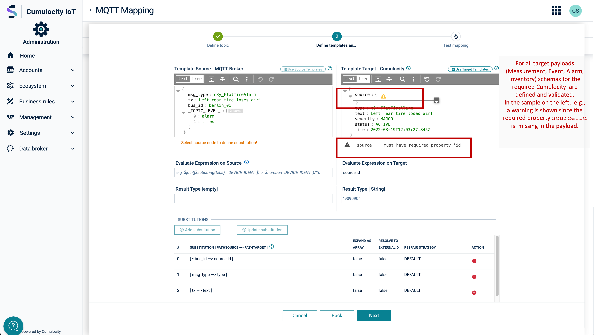
</p>
<br/>

#### Different type of substitutions
When you define an expression or a path in the source payload for a substitution the result can be one of the following cases:
1. **if** the result is a scalar value, e.g. ```10.4``` for a single value **and**
     * **if** only one device is identified in the payload \
      **then** only one Cumulocity MEA-resquest is generated from this payload.\
     This is a **single-device-single-value** mapping.
     * **if** multiple devices are identified, e.g. ```["device_101023", "device_101024"]``` in the payload \
      **then** multiple Cumulocity MEA-requests or inventory requests - depending on the used targetAPI in the mapping - are generated from this payload. This only makes sense for creating multiple devices.\
      This is a **multi-device-single-value** mapping.
2. **if** the result is an array, e.g. ```[10.4, 20.9]``` for multiple measurements values **and**
    * **if** multiple devices are identified , e.g. ```["device_101023","device_101024"]``` \
      **then**  multiple Cumulocity MEA-requests are generated from this single payload. In this case two requests: 
      1. request: for device ```"device_101023"``` and value ```10.4```
      2. request: for device ```"device_101024"``` and value ```20.9``` 

      This is a **multi-device-multi-value** mapping.

    * **if** a single devices is identified , e.g. ```"device_101023"``` \
     **then**  multiple Cumulocity MEA-requests are generated from this single payload. In this case two requests: 
      1. request: for device ```"device_101023"``` and value ```10.4```
      2. request: for device ```"device_101023"``` and value ```20.9```

      This is a **single-device-multi-value** mapping.

3. the result is an object: this is not supported.

This is illustrated on the following diagram:

<p align="center">

</p>
<br/>

___
  **NOTE:** If the size of all extracted arrays do not match, then the first values in the array with less items is taken to fill the missing values.\
  To illustrate this behavior, take the following case where:
  * the first expression returns 2 values ```[10.4, 20.9]```
  * the second expression returns 3 dates ```["2022-10-30T04:10:00.000Z", "2022-10-30T04:11:00.000Z", "2022-10-30T04:12:00.000Z"]```
  * the third expression returns 3 ids ```["device_101023","device_101024","device_101025"]```

  then three requests are generated:
  1. request: for device ```"device_101023"```, timestamp ```2022-10-30T04:10:00.000Z``` and value ```10.4```
  1. request: for device ```"device_101024"```, timestamp ```2022-10-30T04:11:00.000Z``` and value ```20.9```
  1. request: for device ```"device_101025"```, timestamp ```2022-10-30T04:12:00.000Z``` and value ```10.4```
___

### Test transformation from source to target format

To test the defined transformation, press the button ```Transform test message```. The result of the transformation and any errors are displayed.
On test transformation can result in multiple Cumulocity reqests, e.g. when a measurement is created for a device that is implicitly created, then two requests result from this transformation.
To iterate and show all results press the button ```Show Next Test Result```.


<p align="center">
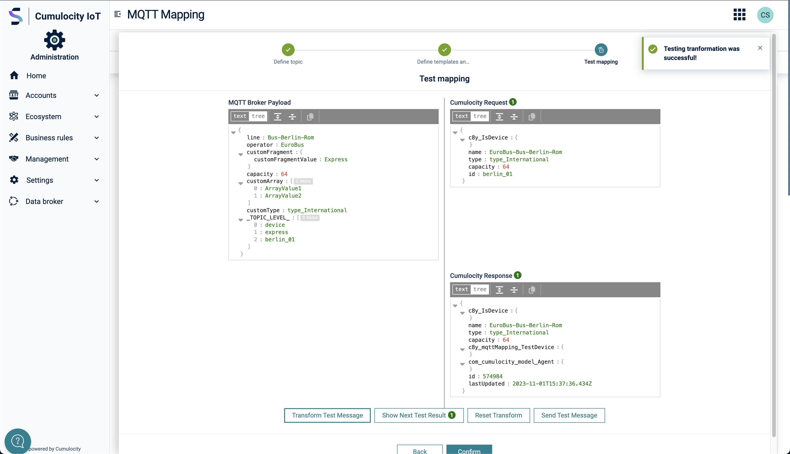
</p>
<br/>

When the transformation is tested and the resulting request are sent to Cumulocity, this result respective test devices are generated. These can be viewed on the tab ```Testing```. Generated devices can be deleted.
All generated test devices have a fragment ```c8y_mqttMapping_TestDevice```.


<p align="center">
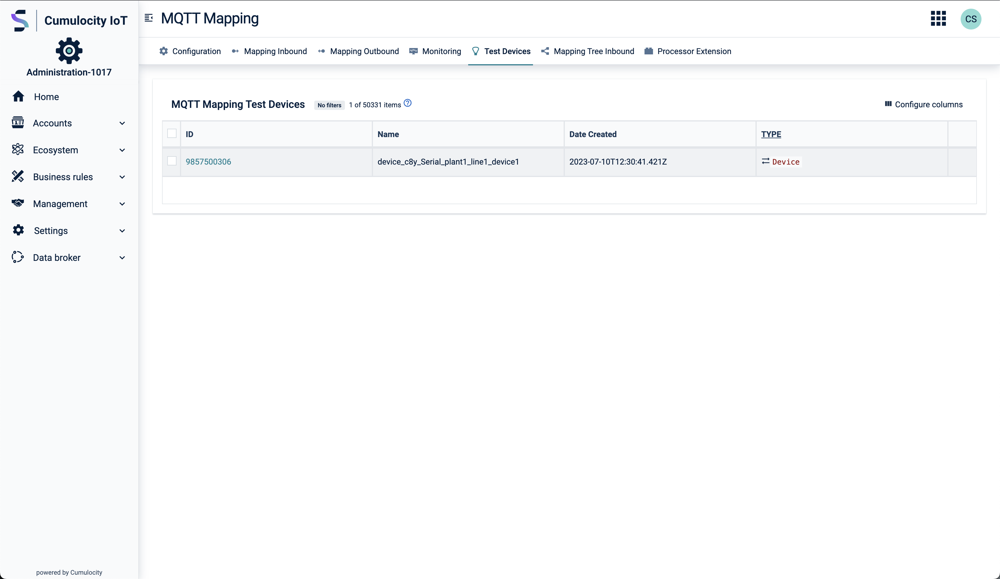
</p>
<br/>


### Send transformed test message to test device in Cumulocity

To send the transformed payload to a test device, press the button ```Send test message```. If an error occurs this is shown in the UI.


<p align="center">

</p>
<br/>

### Use snooped payloads in source templates

In order to use a previously snooped payload click the button
```Snooped templates```. Multiples activation of this button iterates over all the recorded templates.


<p align="center">
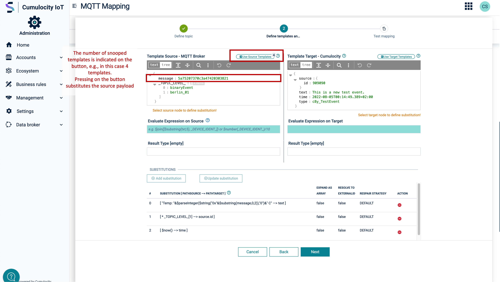
</p>
<br/>

### Update existing Mapping

To avoid inconsistencies when updating the properties of a mapping, active mapping are locked - ```READ_ONLY``` - and can't be updated. All properties of the mapping are protected from changes.
This can be seen on the following screenshot:

<p align="center">

</p>
<br/>

To allow updating an activated mapping it has to be deactivated in the list of all mapping, please refer to the following screenshot:

<p align="center">
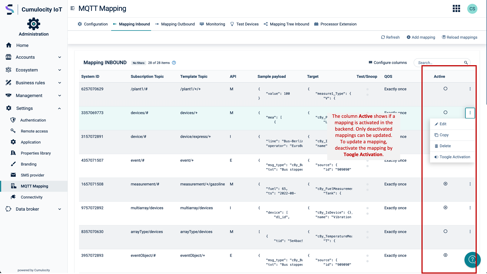
</p>
<br/>

### Processing Extensions

When you choose the mapping type  ```PROCESSOR_EXTENSION``` the wizard for defining your mapping changes. On the second step you are not be able to change the source format of the inbound message and define substitutions. This is done by the processor extension. Instead you are able to choose a processor extension by selecting the respective message in the dropdown:

<p align="center">
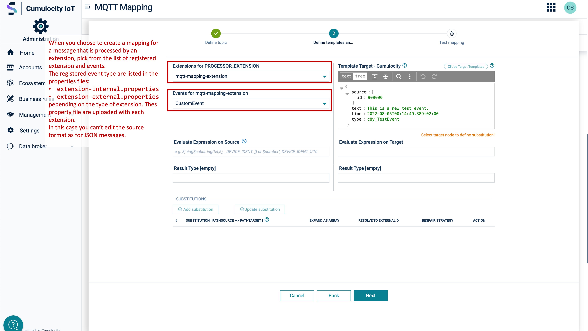
</p>
<br/>

Using the tab ```Processor Extension``` you can upload your own processor extension. After the upload the mircroservice has to be re-subscribed in order to load the extensions. This does not happen dynamically.

<p align="center">

</p>
<br/>

The following guide lays out hte steps to create and use a processor extension:

<p align="center">

</p>
<br/>


### Monitoring

On the monitoring tab ```Monitoring``` you can see how a specific MQTT mapping performs since the last activation in the microservice.


<p align="center">
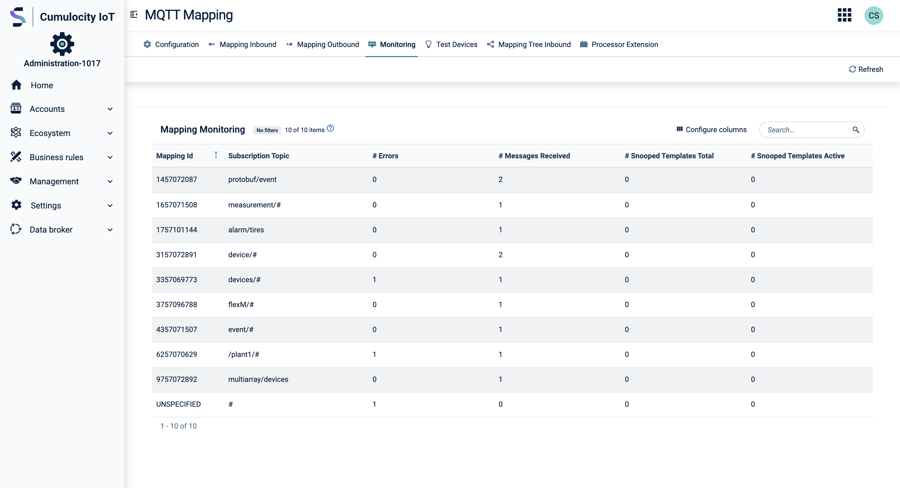
</p>
<br/>

### Mapping Tree

On the tab ```Mapping Tree``` you can see how the registered mappings are organised in a tree. This can be very helpful in case of tracing any errors.


<p align="center">
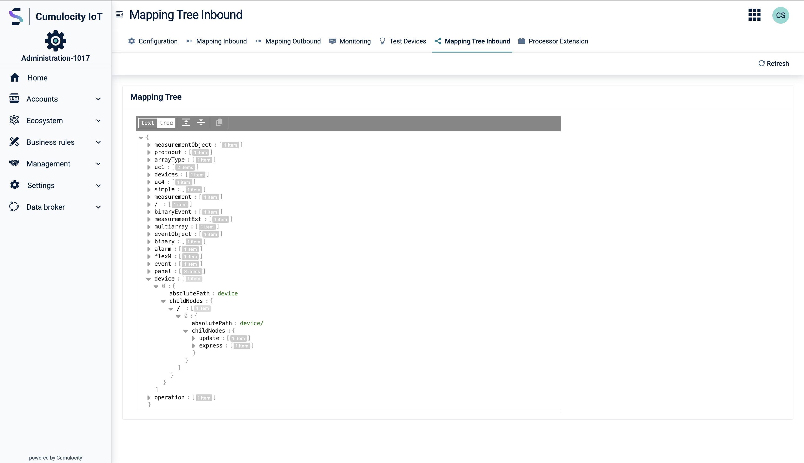
</p>
<br/>

### REST API

The mapping microservice provides endpoints to control the lifecycle and manage mappings. in details these endpoint are:
1. ```.../configuration/connection```: retrieve and change the connection details to the MQTT broker
2. ```.../configuration/serice```: retrieve and change the configuration details, e.g. loglevel of the mapping service
3. ```.../operation```: execute operation: reload mappings, connect to broker, disconnect from broker, reset the monitoring statistic, reload extensions
4. ```.../monitoring/status/service```: retrieve service status: is microservice connected to broker, are connection details loaded
5. ```.../monitoring/status/mapping```: retrieve mapping status: number of messages, errors processed per mapping
6. ```.../monitoring/tree```: all mappings are organised in a tree for efficient processing and resolving the mappings at runtime. This tree can be retrieved for debugging purposes.
7. ```.../monitoring/subscriptions```: retrieve all active subscriptions.
8. ```.../mapping```: retrieve, create, delete, update mappings
9. ```.../test/{method}?topic=URL_ENCODED_TOPIC```: this endpoint allows testing of a payload. The send parameter (boolean)  indicates if the transformed payload should be sent to Cumulocity after processing. The call return a list of ```ProcessingConext``` to record which mapping processed the payload and the outcome of the mapping process as well as error
10. ```.../extension/```: endpoint to retieve a list of all extensions
11. ```.../extension/{extension-name}```: endpoint to retrieve/delete a specific extension


### Load Test
In the resource section you find a test profil [jmeter_test_01.jmx](./resources/script/performance/jmeter_test_01.jmx) using the performance tool ```jmeter``` and an extension for mqtt: [emqx/mqtt-jmete](https://github.com/emqx/mqtt-jmeter).
This was used to run simple loadtest.

## Setup Sample MQTT mappings

A script to create sample MQTT mappings can be found [here](./resources/script/mapping/import_mappings_01.py).
You have to start it as follows:
```
#python3 resources/script/mapping/import_mappings_01.py -p <YOUR_PASSWORD> -U <YOUR_TENANT> -u <YOUR_USER> -f resources/script/mapping/sampleMapping/sampleMappings_02.json
```

The mappings with inputs and substitutions are explained in the [sample document](./resources/script/mapping/sampleMapping/sampleMappings_02.html).

## Enhance and Extensions
In the folder [mqtt.mapping.processor.extension](./mqtt-mapping-service/src/main/java/mqtt/mapping/processor/extension) you can implement  the Interface `ProcessorExtensionInbound<O>` to implement the processing of your own messages. Together with the Java representation of your message you can build your own processor extension.
This needs to be packages in a ```jar``` file. The extension packaged as a ```jar``` you can upload this extension using the tab ```Processor Extension```, see [Processing Extensions (Protobuf, ...)](#processing-extensions-protobuf) for details.
In order for the mapper backend (```mqtt-mapping-service```) to find your extension you need to add the properties file ```extension-external.properties```. The content could be as follows:
```
CustomEvent=mqtt.mapping.processor.extension.external.ProcessorExtensionInboundCustomEvent
CustomMeasurement=mqtt.mapping.processor.extension.external.ProcessorExtensionInboundCustomMeasurement
```

The steps required for a external extension are as follows. The extension:
1. has to implement the inteface <code>ProcessorExtensionInbound<O></code> 
2. be registered in the properties file <code>mqtt-mapping-extension/src/main/resources/extension-external.properties</code>
3. be developed/packed in the maven module <code>mqtt-mapping-extension</code>. **Not** in the maven module <code>mqtt-mapping-service</code>. This is reserved for internal extensions.
4. be uploaded through the Web UI.

> **_NOTE:_** When you implement <code>ProcessorExtensionInbound<O></code> an additional <code>RepairStrategy.CREATE_IF_MISSING</code> can be used. This helps to address mapping cases, where you want to create a mapping that adapts to different structures of source payloads. It is used to create a node in the target if it doesn't exist and allows for using mapping with dynamic content. See [sample 25](./resources/script/mapping/sampleMapping/SampleMappings_06.pdf).

A sample how to build an extension is contained in the maven module [mqtt-mapping-extension](./mqtt-mapping-extension).
The following diagram shows how the dispatcher handles meassages with different format:

<p align="center">

</p>
<br/>

As an example see the [SysHandler](./mqtt-mapping-service/src/main/java/mqtt/mapping/processor/system/SysHandler.java) which subscribes and handles all topics for $SYS and creates Measurements in Cumulocity for the received data.

______________________
These tools are provided as-is and without warranty or support. They do not constitute part of the Software AG product suite. Users are free to use, fork and modify them, subject to the license agreement. While Software AG welcomes contributions, we cannot guarantee to include every contribution in the master project.

Contact us at [TECHcommunity](mailto:technologycommunity@softwareag.com?subject=Github/SoftwareAG) if you have any questions.


