# User Guide

- [User Guide](#user-guide)
  - [Connector configuration to broker](#connector-configuration-to-broker)
  - [Definition and Activation of mappings](#definition-and-activation-of-mappings)
    - [Table of mappings](#table-of-mappings)
    - [Define mappings from source to target format (Cumulocity REST format)](#define-mappings-from-source-to-target-format--cumulocity-rest-format-)
      - [Expression Language](#expression-language)
    - [Wizard to define a mapping](#wizard-to-define-a-mapping)
      - [Connector selection](#connector-selection)
      - [Define topic properties](#define-topic-properties)
      - [Subscription Topic](#subscription-topic)
      - [Mapping Topic](#mapping-topic)
      - [Snooping payloads on source topic](#snooping-payloads-on-source-topic)
      - [Enable snooping payloads on source topic](#enable-snooping-payloads-on-source-topic)
      - [Map Device Identifier](#map-device-identifier)
      - [Define templates and substitutions for source and target payload](#define-templates-and-substitutions-for-source-and-target-payload)
      - [Different type of substitutions](#different-type-of-substitutions)
    - [Apply a filter for a mapping](#apply-a-filter-for-a-mapping)
    - [Test transformation from source to target format](#test-transformation-from-source-to-target-format)
    - [Send transformed test message to test device in Cumulocity](#send-transformed-test-message-to-test-device-in-cumulocity)
    - [Use snooped payloads in source templates](#use-snooped-payloads-in-source-templates)
    - [Update existing Mapping](#update-existing-mapping)
    - [Import & Export Mappings](#import---export-mappings)
  - [Configuration](#configuration)
    - [Microservice configuration](#microservice-configuration)
    - [Processing Extensions](#processing-extensions)
  - [Monitoring](#monitoring)
    - [Mapping Tree Inbound](#mapping-tree-inbound)

## Connector configuration to broker

The configurations of connectors are persisted as tenant options in the Cumulocity Tenant and can be managed using the following UI.\
The table of configured connectors to different brokers can be:

- deleted
- enabled / disabled
- updated / copied

<p align="center">
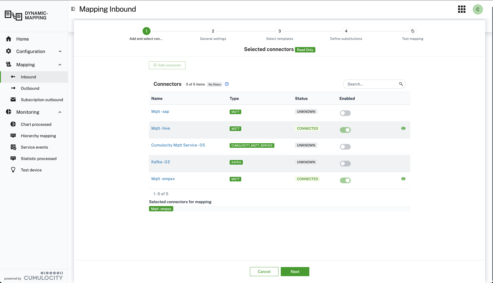
</p>

<br/>

Furthermore, new connectors can be added. The UI is shown on the following screenshot. In the modal dialog you have to first select the type of connector. Currently we support the following connectors:

- MQTT: supports connections to MQTT version 3.1.1 over websocket and tcp
- MQTT Service: this connector is a special case of the MQTT connector, to connect to the Cumulocity MQTT Service
- Kafka: is an initial implementation for connecting to Kafka brokers. It is expected that the implementation of the connector has to be adapted to the specific needs of your project. This applies to configuration for security, transactions, key and payload serialization ( currently StringSerializer)...

The configuration properties are dynamically adapted to the configuration parameter for the chosen connector type:

<p align="center">

</p>
<br/>

The settings for the Kafka connector can be seen on the following screenshot:

<p align="center">

</p>
<br/>

When you add or change a connection configuration it happens very often that the parameter are incorrect and the connection fails. In this case the connection to the MQTT broker cannot be established and the reason is not known. To identify the incorrect parameter you can follows the error messages in the connections logs on the same UI:

<p align="center">

</p>
<br/>

## Definition and Activation of mappings

### Table of mappings

Once the connection to a broker is configured and successfully enabled you can start defining mappings. The mappings table is the entry point for:

1. Creating new mappings: Press button `Add mapping`
2. Updating existing mapping: Press the pencil in the row of the relevant mapping
3. Deleting existing mapping: Press the "-" icon in the row of the relevant mapping to delete an existing mappings
4. Importing new mappings
5. Exporting defined mappings

To change a mapping it has to be deactivated. After changes are made the mapping needs to be activated again. The updated version of the mapping is deployed automatically and applied immediately when new messages are sent to the configure mapping topic.

### Define mappings from source to target format (Cumulocity REST format)

Mappings are persisted as Managed Objects and can be easily changed, deleted or migrated.

#### Expression Language

In addition to using plain properties of the source payload, you can apply functions on the payload properties. This covers a scenario where a device name should be a combination of a generic name and an external device Id.
Complex mapping expressions are supported by using [JSONata](https://jsonata.org). \
In this case the following function could be used:
`$join([device_name, id])`.

Further example for JSONata expressions are:

- to convert a UNIX timestamp to ISO date format use:
  <code>$fromMillis($number(deviceTimestamp))</code>
- to join substring starting at position 5 of property <code>txt</code> with device
  identifier use: <code>$join([$substring(txt,5), "-", id])</code>

> **_NOTE:_**
>
> - escape properties with special characters with <code>`</code>. The property

    <code>customer-1</code> becomes <code>`customer-1`</code>

> - function chaining using <code>~></code> is not supported, instead use function

    notation. The expression <code>Account.Product.(Price * Quantity) ~> $sum()</code>
    becomes <code>$sum(Account.Product.(Price * Quantity))</code>

### Wizard to define a mapping

Creation of the new mapping starts by pressing `Add Mapping`. On the next modal UI you can choose the mapping type depending on the structure of your payload. Currently there is support for:

1. `JSON`: if your payload is in JSON format
1. `FLAT_FILE`: if your payload is in a CSV format
1. `GENERIC_BINARY`: if your payload is in HEX format
1. `PROTOBUF_STATIC`: if your payload is a serialized protobuf message
1. `PROCESSOR_EXTENSION`: if you want to process the message yourself, by registering a processor extension

<p align="center">
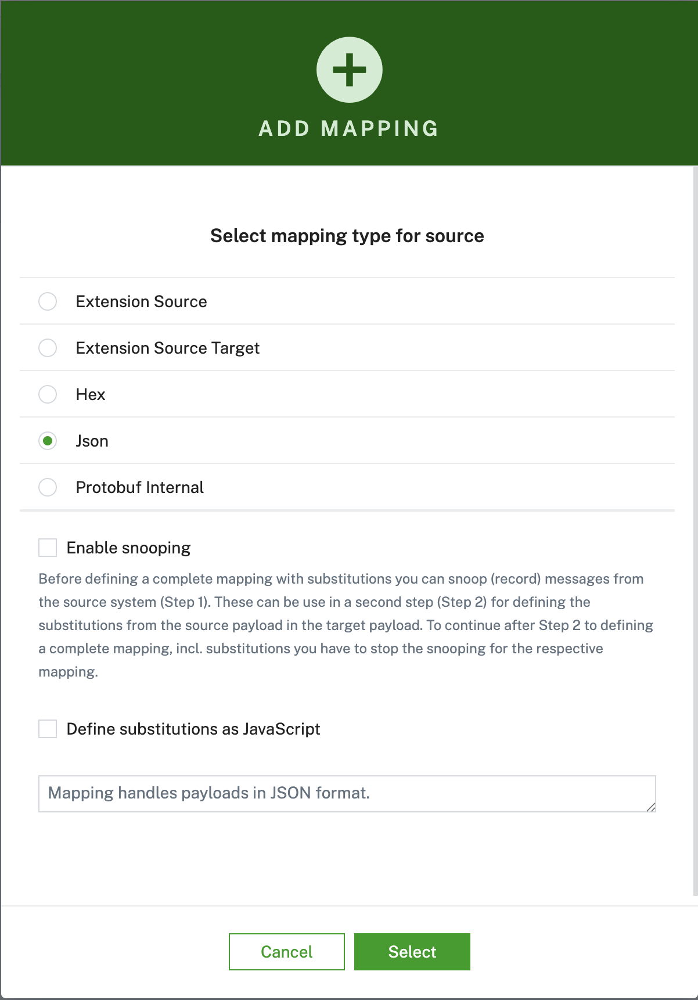
</p>
<br/>

The wizard to define a mapping consists of the steps:

1. Select the type of mapping:

- `JSON`
- `FLAT_FILE`
- `GENERIC_BINARY`
- `PROTOBUF_STATIC`
- `PROCESSOR_EXTENSION`

---

**NOTE:**
Payload for `FLAT_FILE` and `GENERIC_BINARY` are wrapped.
For example for a flat file messages:

```
{
  "message": "oil,100,1666863595",
}
```

You can use the JSONata function `$split(str, separator)` for splitting the payload, e.g:

```
$split(message,",")[1]
```

splits the payload and return the second field: `100`.

And for the binary payload is encoded as hex string:

```
{
  "message": "0x575",
}
```

Using appropriate JSONata expression you can parse the payload:

```
$number(message) & " C"
```

---

1. Define the properties of the topic and API to be used
2. Define the templates for the source and target, in JSON format. The source payload can be in any custom JSON format. the target format has to follow the schemsa for Alarm, Events, Measurements or Inventory, [see Cumulocity OpenAPI](https://cumulocity.com/api/).
3. Test the mapping by applying the transformation and send the result to a test device.

Also you can decide if you want to start with snooping messages on specific topics before defining your mapping in detail by checking `Start snoop`.

#### Connector selection

As a next step you need to create or select the connectors the mapping should be effective for.

<p align="center">
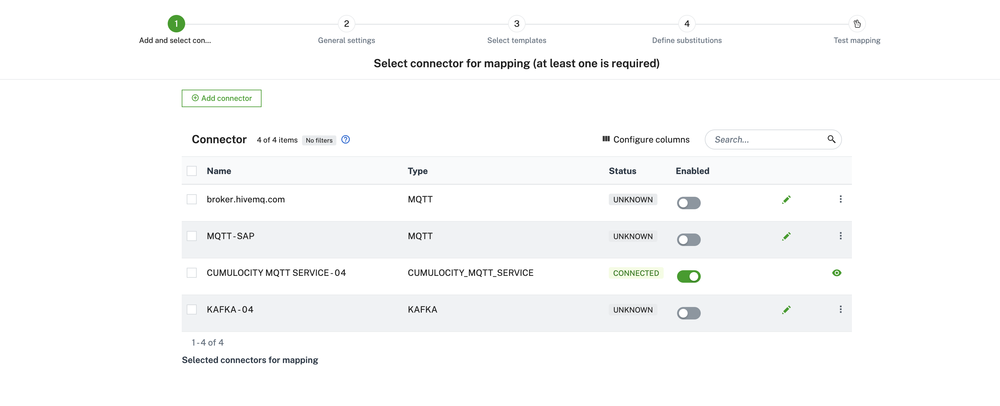
</p>

Make sure to select at least one connector before you proceed to the next step. You can select multiple connectors if your mapping should be effective for them.
For creating a new connector please review the [connector configuration guide](#connector-configuration-to-broker)

#### Define topic properties

In the first wizard step properties for the topic are defined.

<p align="center">

</p>
<br/>

For the mappings we differentiate between a **subscription topic** and a **template topic**:

For outbound mappings the properties are slightly different. Most important are the properties:

1. `filterOutbound`: The Filter Outbound can contain one fragment name to associate a
   mapping to a Cumulocity MEAO. If the Cumulocity MEAO contains this fragment, the mapping is
   applied.
2. `publishTopic`: MQTT topic to publish outbound messages to.

<p align="center">
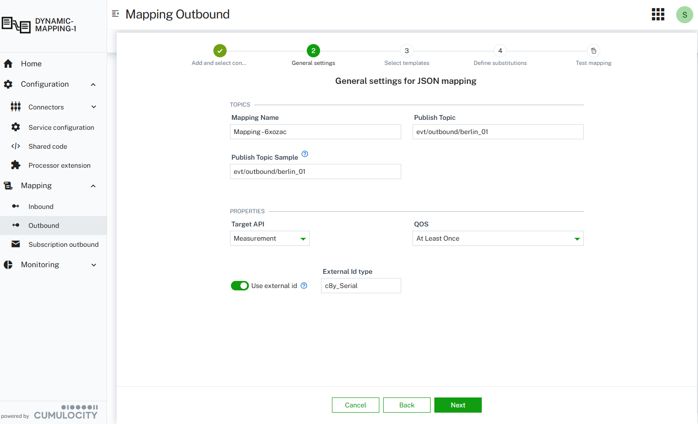
</p>
<br/>

For an outbound mapping to be applied two conditions have to be fulfilled:

1. the Cumulocity MEAO message has to have a fragment that is defined in property `filterOutbound`
2. for the device a Notification 2.0 subscription has to be created. This is done using the following dialog:
<p align="center">
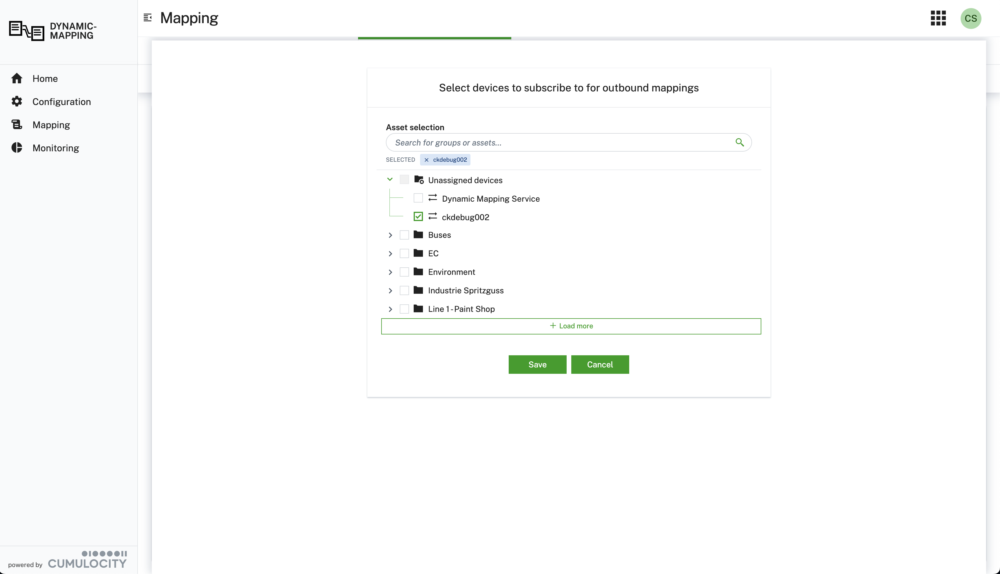
</p>
<br/>

#### Subscription Topic

This is the topic which is actually subscribed on in the broker. It can contain wildcards, either single level "+" or multilevel "#".
This must be supported by the configured message broker.

> **_NOTE:_** Multi-level wildcards can only appear at the end of topic. The topic "/device/#/west" is not valid.
> Examples of valid topics are: "device/#", "device/data/#", "device/12345/data" etc.

#### Mapping Topic

The template topic is the key of the persisted mapping. The main difference to the subscription topic is that
a template topic can have a path behind the wildcard for the reason as we can receive multiple topics on a wildcard which might be mapped differently.\
Examples are: "device/+/data, "device/express/+", "device/+"\
In order to use sample data instead of the wildcard you can add a Mapping Topic Sample, which must have the same structure, i.e. same level in the topic and when explicit name are used at a topic level in the Mapping Topic they must exactly be the same in the Mapping Topic Sample.

<p align="center">

</p>
<br/>

The levels of the Mapping Topic are split and added to the payload:

```
  "_TOPIC_LEVEL_": [
    "device",
    "express",
    "berlin_01"
  ]
```

The entries in the `_TOPIC_LEVEL_` can be used to resolve the external device identifier to the internal Cumulocity Id.
The additional property `_TOPIC_LEVEL_` is added to the source template shown in the next wizard step. It must not be deleted when editing the JSON source template.

#### Snooping payloads on source topic

Very often you want to use the payloads of existing JSON messages as a sample to define the source template. This can be achieved by listening and recording - **snooping** - messages on a topic.

In order to record JSON payloads on the defined topic a subscription records the payloads and saves them for later use in a source template.

The snooping process goes through the steps **ENABLED** -> **STARTED** -> **STOPPED**.

If a payload is found the status moves to **STARTED**. This is indicated in the last column of the mapping table, where the number of payloads snooped so far is shown.

#### Enable snooping payloads on source topic

To enable snooping select `ENABLED` in the drop down as shown in the screenshot below. This starts the snooping process and the microservice subscribes to the related topic and records the received payloads.

<p align="center">
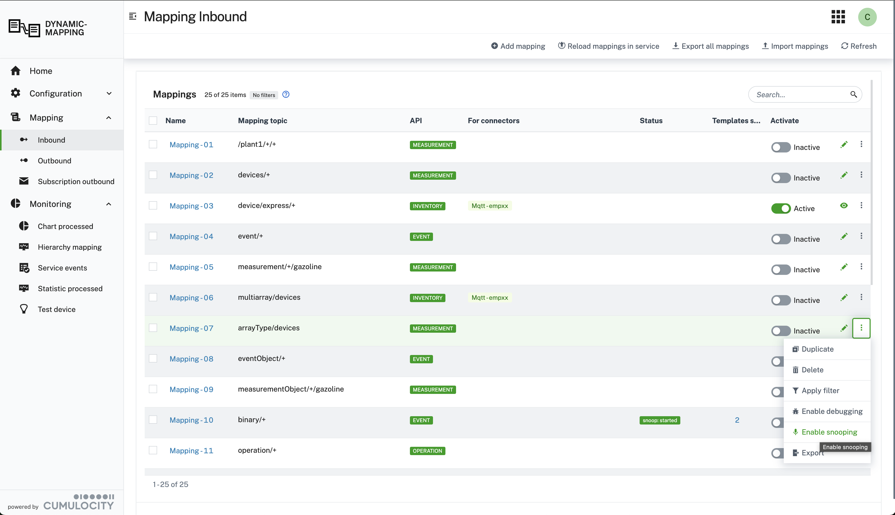
</p>
<br/>

#### Map Device Identifier

Connected devices send their data using an external device identifier, e.g. IMEI, serial number, ... In this case the external id has to be used for looking to the device id used by Cumulocity. To achieve this the entries in the `_TOPIC_LEVEL_` can be used to resolve the external device identifier to an internal Cumulocity id. When a payload from this device arrives at runtime the external id is used to lookup the corresponding internal Cumulocity id with the help of a external id type.

#### Define templates and substitutions for source and target payload

In the third wizard step, shown on the screenshot below the mapping is further defined:

1. Editing the source template directly
2. Editing the target template directly

<p align="center">
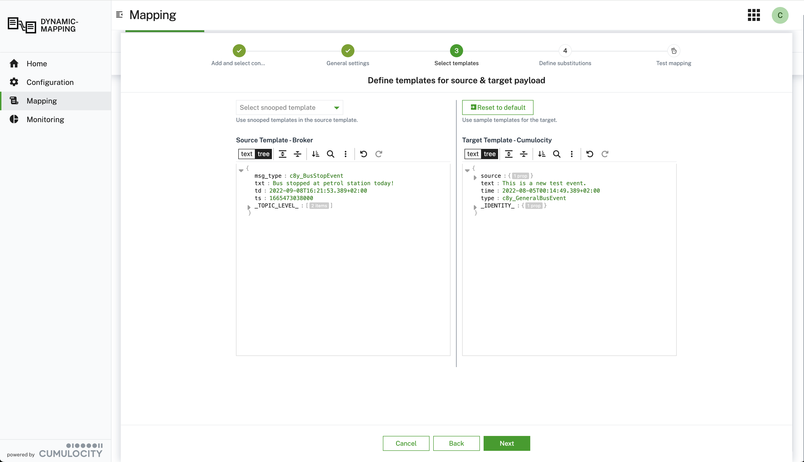
</p>
<br/>

In order to define a substitution (a substitution substitutes values in the target payload with values extracted at runtime from the source payload), the UI offers the following feaoptionstures:

1. Add new substitution by pressing button "Add substitution". Further details for the substitution can be defined in the next modal dialog. See as well the next paragraph.
2. Update an existing substitution, by selecting the substitution in the table of substitutions in the lower section of the wizard. Then press button "Update substitution"
3. Delete an existing substitution, by pressing the button with the red minus

<p align="center">

</p>
<br/>

To define a new substitution the following steps have to be performed:

1. Select a property in the source JSON payload by click on the respective property. Then the JSONpath is appears in the field with the label `Evaluate Expression on Source`
1. Select a property in the target JSON payload by click on the respective property. Then the JSONpath is appears in the field with the label `Evaluate Expression on Target`

   > **_NOTE:_** Use the same <a href="https://jsonata.org" target="_blank">JSONata</a>
   > expressions as in the source template. In addition you can use <code>$</code> to merge the
   > result of the source expression with the existing target template. Special care is
   > required since this can overwrite mandatory Cumulocity attributes, e.g. <code>source.id</code>. This can result in API calls that are rejected by the Cumulocity backend!

1. Press the button "Add substitution". In the next modal dialog the following details can be specified: 1. Select option `Expand Array` if the result of the source expression is an array and you want to generate any of the following substitutions:
_ `multi-device-single-value`
_ `multi-device-multi-value`
_ `single-device-multi-value`\
 Otherwise an extracted array is treated as a single value, see [Different type of substitutions](#different-type-of-substitutions). 1. Select option `Resolve to externalId` if you want to resolve system Cumulocity Id to externalId using externalIdType. This can only be used for OUTBOUND mappings. 1. Select a `Reapir Strategy` that determines how the mapping is applied:
_ `DEFAULT`: Map the extracted values to the attribute addressed on right side
_ `USE_FIRST_VALUE_OF_ARRAY`: When the left side of the mapping returns an array, only use the 1. item in the array and map this to the right side
_ `USE_LAST_VALUE_OF_ARRAY`: When the left side of the mapping returns an array, only use the last item in the array and map this to the right side
_ `REMOVE_IF_MISSING`: When the left side of the mapping returns no result (not NULL), then delete the attribute (that is addressed in mapping) in the target on the right side. This avoids empty attribute, e.d. `airsensor: undefined`
_ `REMOVE_IF_NULL`: When the left side of the mapping returns `null`, then delete the attribute (that is addressed in mapping) in the target on the right side. This avoids empty attribute, e.d. `airsensor: undefined`
<p align="center">

</p>
<br/>

> **_NOTE:_** When adding a new substitution the following two consistency rules are checked:
>
> 1.  Does another substitution for the same target property exist? If so, a modal dialog appears and asks the user for confirmation to overwrite the existing substitution.
> 2.  If the new substitution defines the device identifier, it is checked if another substitution already withe the same property exists. If so, a modal dialog appears and asks for confirmation to overwrite the existing substitution.

To avoid inconsistent JSON being sent to the Cumulocity API the defined target tmeplate are validated with schemas. These are defined for all target payloads (Measurement, Event, Alarm, Inventory). The schemas validate if required properties are defined and if the time is in the correct format.

In the sample below, e.g. a warning is shown since the required property `source.id` is missing in the payload.

<p align="center">
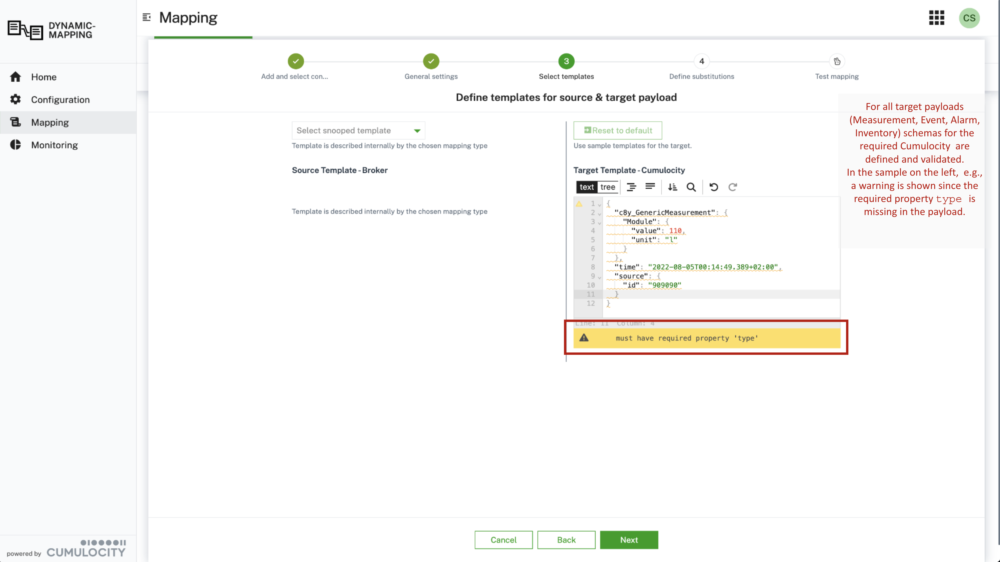
</p>
<br/>

#### Different type of substitutions

When you define an expression or a path in the source payload for a substitution the result can be one of the following cases:

1. **if** the result is a scalar value, e.g. `10.4` for a single value **and**
   - **if** only one device is identified in the payload \
     **then** only one Cumulocity MEA-request is generated from this payload.\
     This is a **single-device-single-value** mapping.
   - **if** multiple devices are identified, e.g. `["device_101023", "device_101024"]` in the payload \
     **then** multiple Cumulocity MEA-requests or inventory requests - depending on the used targetAPI in the mapping - are generated from this payload. This only makes sense for creating multiple devices.\
     This is a **multi-device-single-value** mapping.
2. **if** the result is an array, e.g. `[10.4, 20.9]` for multiple measurements values **and**

   - **if** multiple devices are identified , e.g. `["device_101023","device_101024"]` \
     **then** multiple Cumulocity MEA-requests are generated from this single payload. In this case two requests:

     1. request: for device `"device_101023"` and value `10.4`
     2. request: for device `"device_101024"` and value `20.9`

     This is a **multi-device-multi-value** mapping.

   - **if** a single devices is identified , e.g. `"device_101023"` \
     **then** multiple Cumulocity MEA-requests are generated from this single payload. In this case two requests:

     1. request: for device `"device_101023"` and value `10.4`
     2. request: for device `"device_101023"` and value `20.9`

     This is a **single-device-multi-value** mapping.

3. the result is an object: this is not supported.

This is illustrated on the following diagram:

<p align="center">

</p>
<br/>

---

**NOTE:** If the size of all extracted arrays do not match, then the first values in the array with less items is taken to fill the missing values.\
To illustrate this behavior, take the following case where:

- the first expression returns 2 values `[10.4, 20.9]`
- the second expression returns 3 dates `["2022-10-30T04:10:00.000Z", "2022-10-30T04:11:00.000Z", "2022-10-30T04:12:00.000Z"]`
- the third expression returns 3 ids `["device_101023","device_101024","device_101025"]`

then three requests are generated:

1. request: for device `"device_101023"`, timestamp `2022-10-30T04:10:00.000Z` and value `10.4`
1. request: for device `"device_101024"`, timestamp `2022-10-30T04:11:00.000Z` and value `20.9`
1. request: for device `"device_101025"`, timestamp `2022-10-30T04:12:00.000Z` and value `10.4`

---

### Apply a filter for a mapping

You can apply a filter for a mapping, in case the mapping should only be processed if the payload meets a certain condition. This might be the case, if you want to turn a rather generic payload into a measurement, an event and an alarm depending on content of the payload.
In this case you can apply a filter:
<p align="center">
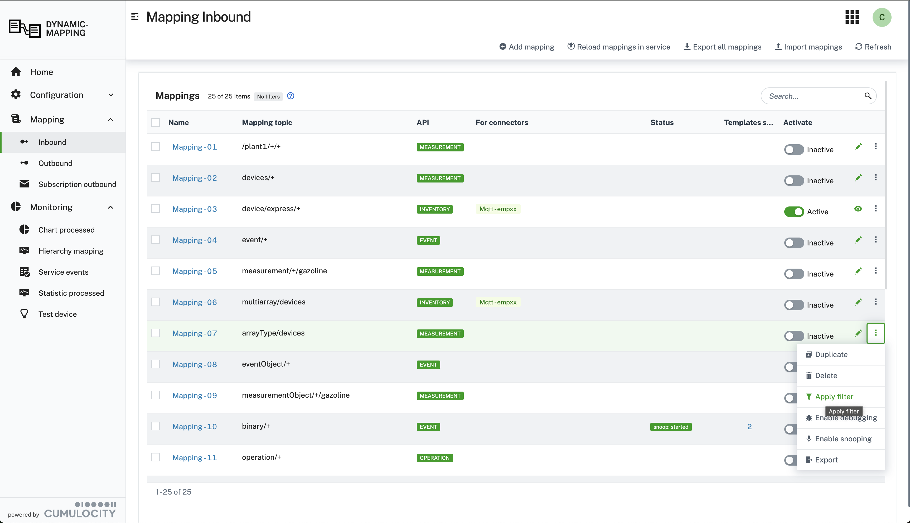
</p>

by defining a `JSONata` expression that evaluates to `true` or `false`:

<p align="center">
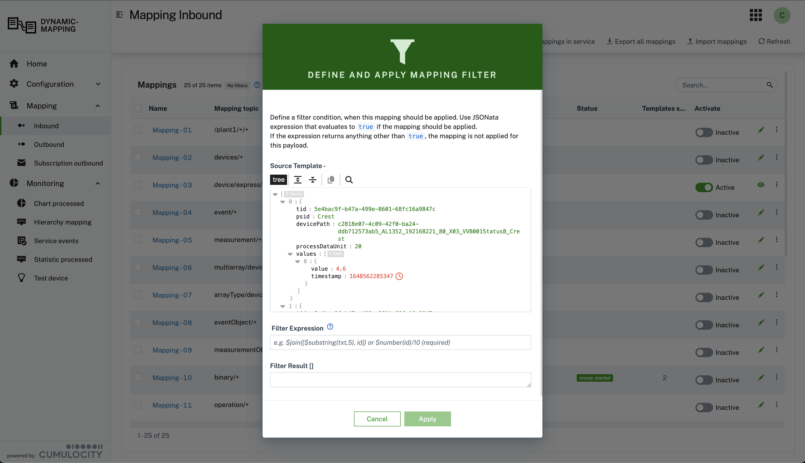
</p>

---

### Test transformation from source to target format

To test the defined transformation, press the button `Transform test message`. The result of the transformation and any errors are displayed.
On test transformation can result in multiple Cumulocity requests, e.g. when a measurement is created for a device that is implicitly created, then two requests result from this transformation.
To iterate and show all results press the button `Show Next Test Result`.

<p align="center">

</p>
<br/>

When the transformation is tested and the resulting request are sent to Cumulocity, this result respective test devices are generated. These can be viewed on the tab `Testing`. Generated devices can be deleted.
All generated test devices have a fragment `d11r_testDevice`.

<p align="center">

</p>
<br/>

### Send transformed test message to test device in Cumulocity

To send the transformed payload to a test device, press the button `Send test message`. If an error occurs this is shown in the UI.

<p align="center">

</p>
<br/>

### Use snooped payloads in source templates

In order to use a previously snooped payload click the button
`Snooped templates`. Multiples activation of this button iterates over all the recorded templates.

<p align="center">

</p>
<br/>

### Update existing Mapping

To avoid inconsistencies when updating the properties of a mapping, active mapping are locked - `READ_ONLY` - and can't be updated. All properties of the mapping are protected from changes.
This can be seen on the following screenshot:

<p align="center">

</p>
<br/>

To allow updating an activated mapping it has to be deactivated in the list of all mapping, please refer to the following screenshot:

<p align="center">
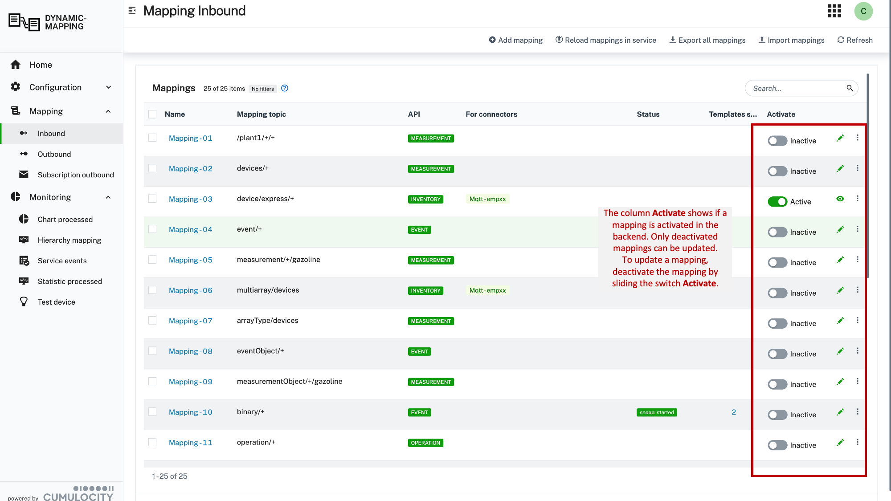
</p>
<br/>

### Import & Export Mappings

On the tag with `Ìnbound Mappings` and `Outbound Mappings` you can import mappings from a JSON file. A Sample cane be found [here - Inbound](resources/script/mapping/sampleMapping/mappings-INBOUND.json) and [here - Outbound](resources/script/mapping/sampleMapping/mappings-OUTBOUND.json).
You can as well export all or a single mapping.
The import dialog can be seen on the following screenshot:

<p align="center">

</p>
<br/>

## Configuration

### Microservice configuration

The configuration of the microservice can be changed using the following UI:

<p align="center">
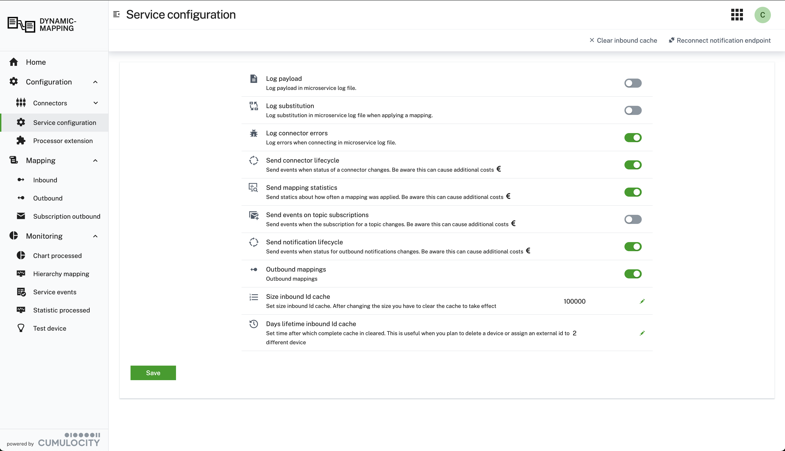
</p>
<br/>

### Processing Extensions

When you choose the mapping type `PROCESSOR_EXTENSION` the wizard for defining your mapping changes. On the second step you are not be able to change the source format of the inbound message and define substitutions. This is done by the processor extension. Instead you are able to choose a processor extension by selecting the respective message in the dropdown:

<p align="center">

</p>
<br/>

Using the tab `Processor Extension` you can upload your own processor extension. After the upload the mircroservice load the extensions dynamically.

<p align="center">

</p>
<br/>

The following guide lays out the steps to create and use a processor extension:

<p align="center">

</p>
<br/>

## Monitoring

On the monitoring tab `Monitoring` you can see how a specific MQTT mapping performs since the last activation in the microservice.

<p align="center">
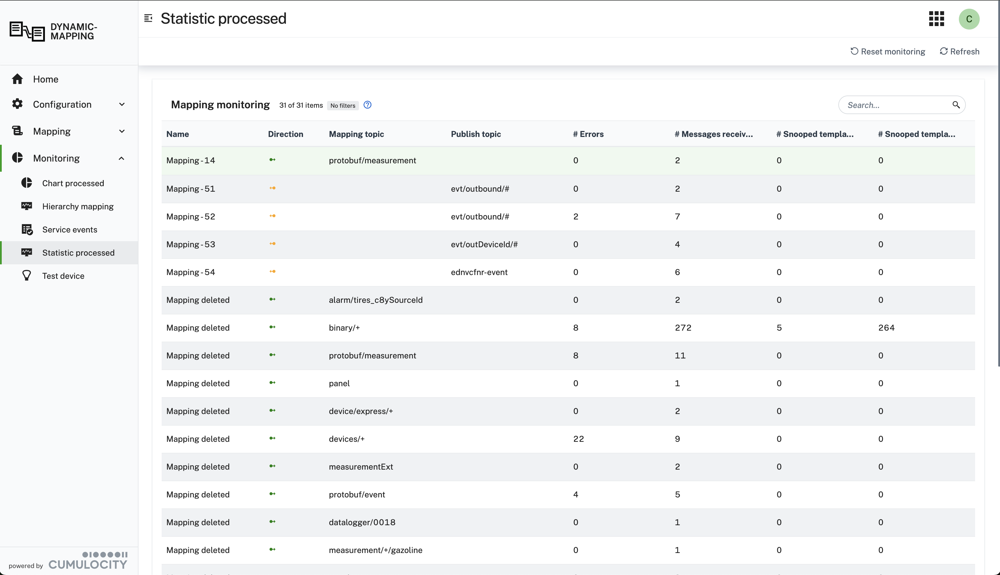
</p>
<br/>

A chart shows a summary with numbers of all successfully processed messages and those raising errors.

<p align="center">
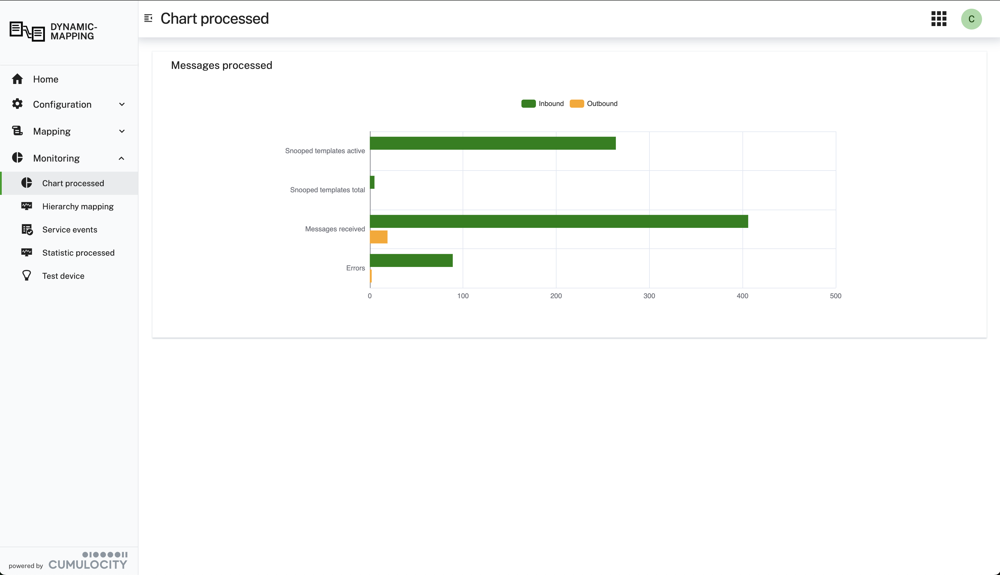
</p>
<br/>

### Mapping Tree Inbound

On the tab `Mapping Tree` you can see how the registered mappings are organised in a tree. This can be very helpful in case of tracing any errors.

<p align="center">
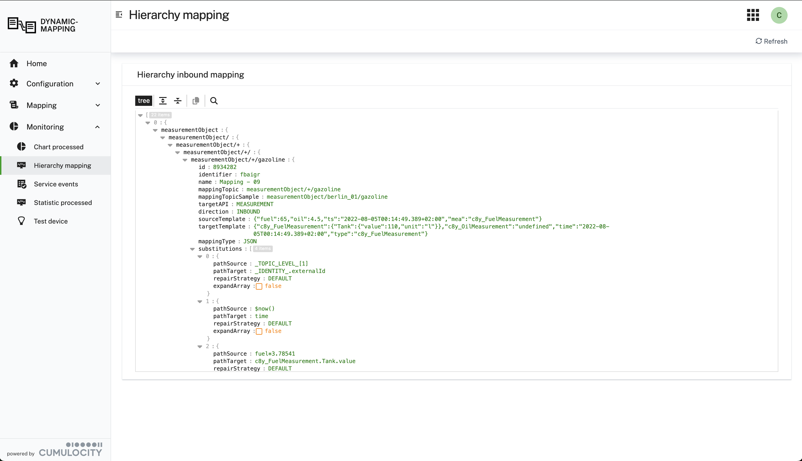
</p>
<br/>
