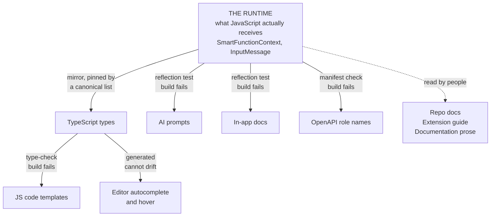

# Keeping the runtime contract in sync

The Dynamic Mapper has **one** runtime contract — what a Smart Function or Java Extension can
call, what `msg` contains, what a returned object may hold — and **nine** places that describe it.
None of them are generated from the runtime. Every one can drift silently: the build stays green,
the tests stay green, and the first symptom is a user following documentation that is wrong.

This page is the strategy for preventing that. For the Smart Function TypeScript types
specifically, [smart-function-type-sync.md](smart-function-type-sync.md) goes deeper; this page is
the umbrella and covers the other eight surfaces.

---

## 0. What is enforced today, at a glance

The opening paragraph describes the problem as it was. Six of the nine surfaces no longer rely on
anyone remembering — they fail the build instead.



How to read it:

- **Solid arrows are mechanical.** Break one and `mvn test`, `npm test` or the CI job goes red.
- **The dashed arrow is not.** Those three surfaces get meaning wrong, not identifiers, so a
  checker cannot tell.
- **"Generated" is stronger than "checked".** The editor's autocomplete table is produced from the
  types, so there is no second copy that *can* drift — the others are compared and rejected.
- **The canonical list is the hub.** It cannot know whether you updated the docs and the prompts,
  but changing the runtime API trips it, and its failure message lists every surface to mirror
  the change into. That is the one check whose job is to start a conversation.

What this replaces: previously every arrow in that picture was a convention, and drift was found
by someone reading two files side by side — which is how six context methods went undocumented
and an editor tooltip kept advertising a class deleted three releases earlier.

---

## 1. The principle: one authority, everything else mirrors it

The contract is **the code that constructs the objects handed to user code**. Not the interfaces,
not the docs — the construction sites.

| The contract | Authoritative file |
|---|---|
| What `context.*` offers a Smart Function | `processor/runtime/SmartFunctionContext.java` |
| What `context.*` offers a Java Extension | `processor/model/JavaExtensionContext.java` (extends `DataPrepContext`) |
| What `msg` contains | `processor/model/InputMessage.java`, populated by `FlowInboundProcessor.createInputMessage` and `FlowOutboundProcessor.createInputMessage` |
| What an inbound function may return | `processor/model/CumulocityObject.java` |
| What an outbound function may return | `processor/model/DeviceMessage.java` |
| Which `_CONTEXT_DATA_` keys do anything | `inbound/processor/SubstitutionResultInboundProcessor.java`, `FlowResultInboundProcessor.java`, `outbound/processor/SubstitutionResultOutboundProcessor.java` |
| Allowed enum values | `CumulocityType`, `MappingAction`, `Destination`, `RepairStrategy`, `API` |

Two consequences worth internalising:

- **An interface is not the contract.** `DataPrepContext` declares 13 methods; the object actually
  passed to JavaScript (`SmartFunctionContext`) has 15. Auditing the interface alone under-reports.
- **A field existing is not the same as it being populated.** `InputMessage` has 8 fields, but
  outbound passes `null` for three of them. Declaring them without saying so is how a documented
  field becomes a runtime `undefined`.

---

## 2. The nine surfaces

| # | Surface | Location | Fails as |
|---|---|---|---|
| 1 | TypeScript type definitions | `dynamic-mapper-smart-function/src/types/` | Author-time: valid code won't compile, or invalid code does |
| 2 | Mock context helpers | same file, `createMockRuntimeContext*` | Tests pass against an API that no longer matches |
| 3 | JS code templates | `dynamic-mapper-service/src/main/resources/templates/*.js` | Users copy a template that throws — **now build-enforced, see §3.5** |
| 4 | Java extension interfaces | `processor/extension/ProcessorExtension{Inbound,Outbound}.java` | Extension authors code against the wrong shape |
| 5 | AI prompts | `dynamic-mapper-service/src/main/resources/prompts/*.txt` | The AI generates mappings using APIs that don't exist — **now build-enforced, see §3.6** |
| 6 | In-app documentation | `dynamic-mapper-ui/public/docs/*.md` | Users follow instructions that don't work — **now build-enforced for the context API, see §3.6** |
| 7 | Editor completion + hover | `dynamic-mapper-ui/src/shared/mapping/stepper.model.ts` | Autocomplete offers phantom members |
| 8 | Repo documentation | `docs/**/*.md` | Contributors build on stale assumptions |
| 9 | OpenAPI spec | `resources/openAPI/openapi.json` | Generated clients and 403 messages name wrong roles — **role names now build-enforced, see §3.6** |

Surface 5 deserves the most care. A wrong prompt is not one wrong page — it is every mapping the
AI generates from then on, and the user has no reason to suspect the tool.

---

## 3. Executable checks

These are the actual commands used in the audits, not illustrations. Run them from the repo root.

### 3.1 Context API across all surfaces

```bash
python3 - <<'PY'
import re
S='dynamic-mapper-service/src/main/java/dynamic/mapper/'
runtime={n for t,n,a in re.findall(r'^\s*public\s+([\w<>,\[\]\. ?]+?)\s+(\w+)\(([^)]*)\)',
        open(S+'processor/runtime/SmartFunctionContext.java').read(), re.M) if not n[0].isupper()}
runtime |= {'logMessage'}            # default method on the interface
runtime -= {'setClientId','setConfig'}   # host-side setters, not script API

T=open('dynamic-mapper-smart-function/src/types/smart-function-dynamic-mapper.types.ts').read()
D=open('dynamic-mapper-smart-function/src/types/dataprep.types.ts').read()
i=T.index('export interface SmartFunctionContext'); j=T.index('export interface', i+10)
ts=set(re.findall(r'^\s{2}(\w+)\s*[(<]', T[i:j], re.M)) | set(re.findall(r'^\s{2}(\w+)\s*[(<]', D, re.M))

E=open('dynamic-mapper-ui/src/shared/mapping/stepper.model.ts').read()
k=E.index("name: 'SmartFunctionContext'")
editor=set(re.findall(r"\{ name: '(\w+)', parameters", E[k:k+4500]))

docs=open('dynamic-mapper-ui/public/docs/smartfunction.md').read()
prompt=open('dynamic-mapper-service/src/main/resources/prompts/smartfunction_prompt.txt').read()

for label, S_ in [('ts-defs',ts), ('editor',editor)]:
    print(f'{label:<10} missing={sorted(runtime-S_) or "none"}  phantom={sorted(S_-runtime-{"runtime","payload"}) or "none"}')
for label, text in [('docs',docs), ('prompt',prompt)]:
    print(f'{label:<10} missing={sorted(m for m in runtime if not re.search(rf"\b{m}\b", text)) or "none"}')
PY
```

### 3.2 `msg` shape

```bash
python3 - <<'PY'
import re
J='dynamic-mapper-service/src/main/java/dynamic/mapper/processor/model/InputMessage.java'
im=set(re.findall(r'^\s*public final [\w<>,\[\]\. ]+ (\w+);', open(J).read(), re.M))
T=open('dynamic-mapper-smart-function/src/types/smart-function-dynamic-mapper.types.ts').read()
def fields(name):
    a=T.index(f'export interface {name}'); b=T.index('{',a); d=0; k=b
    while k<len(T):
        if T[k]=='{': d+=1
        elif T[k]=='}':
            d-=1
            if d==0: break
        k+=1
    return set(re.findall(r'^\s{2}(?:readonly\s+)?(\w+)\??\s*[:?]', T[b:k], re.M))
for n in ['DynamicMapperDeviceMessage','OutboundMessage']:
    print(f'{n:<28} missing={sorted(im-fields(n)) or "none"}')
PY
```

### 3.3 `_CONTEXT_DATA_` keys the prompt teaches vs the runtime honours

```bash
# Runtime: keys actually read in the inbound result path
grep -rhoE '"(deviceName|deviceType|deviceFragments|deviceGroups|processingMode|attachmentName|attachmentType|attachmentData|api)"' \
  dynamic-mapper-service/src/main/java/dynamic/mapper/processor/inbound/ | sort -u

# Prompt: keys documented for INBOUND (stop at the OUTBOUND heading)
awk '/For INBOUND mappings/,/For OUTBOUND mappings/' \
  dynamic-mapper-service/src/main/resources/prompts/jsonata_prompt.txt \
  | grep -oE '_CONTEXT_DATA_\.\w+' | sort -u
```

### 3.4 Templates use only APIs that exist

```bash
# Every context call in every template must appear in the runtime list from 3.1
grep -rhoE 'context\.(\w+)\s*\(' dynamic-mapper-service/src/main/resources/templates/*.js \
  | sed 's/context\.//;s/(//' | sort -u
```

### 3.5 Templates type-check against the real types — **enforced**

Level 2. `dynamic-mapper-smart-function/tsconfig.templates.json` runs `tsc --checkJs` over
`dynamic-mapper-service/src/main/resources/templates/*.js` with the Smart Function types mapped in.
A template calling a method that does not exist, or reading a `msg` field that is not there, fails
the build:

```bash
cd dynamic-mapper-smart-function && npm run check:templates
```

It runs automatically via the `pretest` hook and in the `smart-function-contract` CI job. Everything
it needed inside the templates is comments (`// @ts-check` plus JSDoc `@param`), so the GraalVM
runtime still sees plain JavaScript — verified with `node --check` on all 18 templates.

### 3.6 Prompts and the runtime API — **enforced**

Level 2. `SmartFunctionApiContractTest` reflects over the concrete objects handed to GraalVM —
`SmartFunctionContext` and `InputMessage`, not the interfaces — and fails the Maven build when:

- a prompt teaches a `context.*` method the runtime does not have,
- a prompt teaches a `msg.*` field the runtime does not set, or
- the context API itself changes, which trips a pinned canonical list whose failure message names
  the other surfaces to update,
- `public/docs/smartfunction.md` describes a method that does not exist, **or omits one that
  does** — the coverage direction is the one that caught six undocumented methods in the
  2026-09-19 audit,
- a role named in the OpenAPI spec is not declared in the microservice manifest. A wrong role name
  never fails at compile time; it sits in a string until a user is told to grant a role that does
  not exist.

```bash
cd dynamic-mapper-service && mvn test -Dtest=SmartFunctionApiContractTest
```

The third check is the hub this page argued for: it cannot know whether the TypeScript, the docs
and the prompts were updated, but it makes the decision impossible to skip silently.

### 3.7 In-app doc images actually ship

Already automated and **failing the build**: `dynamic-mapper-ui/scripts/optimize-images.js` runs on
`prebuild` and errors if a `public/docs/*.md` image has no `buildTime.copy` entry in
`cumulocity.config.ts`. This is the model to copy for the checks above.

---

## 4. Change triggers

| If you change… | Also update |
|---|---|
| `SmartFunctionContext.java` (any public method) | TS defs + both mock helpers, editor provider `stepper.model.ts`, `smartfunction.md`, `smartfunction_prompt.txt`, at least one template |
| `InputMessage.java` or either `createInputMessage` | TS `DynamicMapperDeviceMessage` / `OutboundMessage`, editor provider, `smartfunction.md`, prompt |
| `CumulocityObject.java` / `DeviceMessage.java` | TS defs, editor provider, `smartfunction.md`, prompt, templates |
| A `_CONTEXT_DATA_` key | `jsonata_prompt.txt` (correct **direction** section), `metadata.md`, `smartfunction.md` |
| An enum (`API`, `RepairStrategy`, `CumulocityType`, …) | UI enum in `mapping.model.ts`, both prompts, `jsonata.md` |
| A role name or `@PreAuthorize` | `access-control.md`, the 403 message text, `openapi.json` |
| An `@PreAuthorize`-free endpoint | Ask whether it *should* be guarded — see [access-control.md](../dynamic-mapper-ui/public/docs/access-control.md) |

---

## 5. Pitfalls that have produced wrong conclusions

Every one of these caused a false finding during a real audit. They are listed because the *method*
of checking is as likely to be wrong as the thing being checked.

| Pitfall | Example | Guard |
|---|---|---|
| Regex misses the last enum constant | `CREATE_IF_MISSING` before `}` has no trailing `,` — reported as "missing from Java" when it exists | Match `[,;)}]`, or count against the file |
| Markdown-only image grep | `docs/**` uses ``, not `` — 46 references invisible | Match both forms |
| Splitting on a heading that occurs twice | Splitting the prompt on "For OUTBOUND mappings" hit the wrong occurrence and reported 8 keys missing that were present | Use `index(start)` then `index(end, start)` |
| Interface ≠ runtime object | `DataPrepContext` 13 methods vs `SmartFunctionContext` 15 | Audit the concrete class that is passed to the engine |
| A green build ≠ the test ran | Two jest suites failed to **compile**, so 17 tests never executed while the summary said "7 passed" | Compare suite *and* test counts before/after |
| `tsc -p tsconfig.json` ≠ what ts-jest compiles | The types spec is outside the main tsconfig; 8 errors were invisible to `tsc` | Run both |
| zsh eats unquoted globs | `grep --include=*.ts` fails with "no matches found" before grep runs | Quote them, or use `grep -r` over a path |

---

## 6. Recommended automation, in priority order

1. ~~**Java reflection contract test.**~~ **Done** — `SmartFunctionApiContractTest`, see §3.6.
2. ~~**Prompt contract test.**~~ **Done** — same test, see §3.6.
3. ~~**Template lint.**~~ **Done** — superseded by the type-check in §3.5, which is strictly
   stronger than a grep: it validates against the actual interfaces rather than a banned-word list.
4. ~~**Editor provider test.**~~ **Done differently, and better** — the provider's table is now
   *generated* from the TypeScript types (`npm run generate:editor-api`), with CI failing on a
   stale file. There is no hand-written list left to assert against.
5. **Doc link + anchor check.** Validate `public/docs/*.md` cross-page links and `{#anchors}`
   resolve. The only item still hand-run — the script is in §3 of this page.

Only item 5 remains hand-run. Everything else fails the build.

Six of the nine surfaces are now mechanically enforced. The three that are not — repo docs,
the Java extension interfaces and the prose (as opposed to the API names) in the in-app docs —
resist automated checking because what they get wrong is meaning, not identifiers.

---

## 7. Audit log

| Date | Scope | Outcome |
|---|---|---|
| 2026-06 | TS types ↔ Java runtime | 6 gaps found and fixed — see [smart-function-type-sync.md §6](smart-function-type-sync.md) |
| 2026-09-19 | Enforcement | Templates type-checked against the types; editor table generated from them; prompts and the context API pinned by `SmartFunctionApiContractTest`. Four surfaces moved from convention to build-enforced. |
| 2026-09-19 | All nine surfaces | `CumulocityObject`, `DeviceMessage`, templates, editor provider: **in sync**. Fixed: `OutboundMessage` missing 5 runtime fields; `clearState` missing from TS; 6 context methods undocumented; `jsonata_prompt.txt` missing `deviceFragments`/`deviceGroups`, listing `retain` under the wrong direction, and omitting `OPERATION` from the target-API list |
