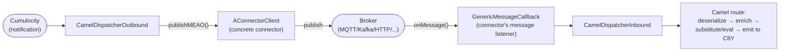

# Connector Framework

The connector framework is the pluggable layer that lets Dynamic Mapper talk to
different message brokers (MQTT, Kafka, HTTP, AMQP, Pulsar, webhooks, Google Pub/Sub)
through one uniform abstraction. A connector is responsible only for broker-specific
I/O — connecting, subscribing, publishing; everything else (mapping resolution,
transformation, emitting to Cumulocity) is broker-agnostic and lives in the processor
pipeline described in [`docs/backend/architecture.md`](../backend/architecture.md).

This is the "hub" document for the framework itself. Per-connector deep-dive pages
(mqtt.md, kafka.md, etc.) are a later addition — see the placeholder table at the bottom.

## Core abstraction: `AConnectorClient`

[`AConnectorClient`](../../dynamic-mapper-service/src/main/java/dynamic/mapper/connector/core/client/AConnectorClient.java)
(1400+ lines) is the abstract base every connector extends. It owns the broker-agnostic
concerns — connection state, subscription bookkeeping, SSL/certificate handling,
housekeeping, metrics — and delegates only the broker-specific parts to subclasses via
abstract methods:

| Abstract method | Responsibility |
|---|---|
| `initialize()` | One-time setup before connecting (e.g. building a client instance from config). |
| `connect()` | Establish the broker connection. |
| `disconnect()` | Tear down the broker connection. |
| `isConfigValid(ConnectorConfiguration)` | Validate a proposed configuration before it is saved/applied. |
| `publishMEAO(ProcessingContext<?>)` | Publish a Measurement/Event/Alarm/Operation-derived outbound message to the broker. |
| `supportsWildcardInTopic(Direction)` | Whether this broker's topic scheme supports wildcards for the given direction. |
| `supportedDirections()` | Which of `INBOUND`/`OUTBOUND` this connector type supports. |
| `subscribe(String topic, Qos qos)` (protected) | Subscribe to one topic. The `qos` handed in is already clamped to the connector's `supportedQos` — see [`qos.md`](qos.md). |
| `unsubscribe(String topic)` (protected) | Unsubscribe from one topic. |
| `connectorSpecificHousekeeping(String tenant)` (protected) | Periodic broker-specific maintenance (reconnect checks, etc.), invoked every `HOUSEKEEPING_INTERVAL_SECONDS` (30s). |

`AConnectorClient` composes several extracted managers rather than doing everything
itself:
[`ConnectionStateManager`](../../dynamic-mapper-service/src/main/java/dynamic/mapper/connector/core/client/ConnectionStateManager.java),
[`MappingSubscriptionManager`](../../dynamic-mapper-service/src/main/java/dynamic/mapper/connector/core/client/MappingSubscriptionManager.java),
[`ExplorerListenerRegistry`](../../dynamic-mapper-service/src/main/java/dynamic/mapper/connector/core/client/ExplorerListenerRegistry.java) (for the topic-explorer/live-inspection UI feature),
and [`ConnectorSslSupport`](../../dynamic-mapper-service/src/main/java/dynamic/mapper/connector/core/client/ConnectorSslSupport.java) (certificate/keystore handling shared across TLS-capable
connectors).

## Declaring a connector: `ConnectorSpecification`

[`ConnectorSpecification`](../../dynamic-mapper-service/src/main/java/dynamic/mapper/connector/core/ConnectorSpecification.java) is the schema a connector type publishes so the UI can
render a configuration form without any connector-specific frontend code:

| Field | Purpose |
|---|---|
| `name`, `description` | Human-readable identity shown in the connector picker. |
| `connectorType` | The `ConnectorType` enum value this specification describes. |
| `singleton` | Whether only one instance of this connector type may be configured per tenant. |
| `properties: Map<String, ConnectorProperty>` | The configuration schema — each entry describes one property's type, whether it's required, display order, and read-only/sensitive flags (`ConnectorPropertyType`, e.g. `SENSITIVE_STRING_PROPERTY` for secrets that get masked). |
| `supportsMessageContext` | Whether the connector can carry additional message metadata alongside the payload. |
| `supportedDirections` | Which of `INBOUND`/`OUTBOUND` this connector type supports. |

Each concrete client exposes a static/builder method that returns its
`ConnectorSpecification` (e.g. `MQTT3Client`'s builder at
[`MQTT3Client.java:478`](../../dynamic-mapper-service/src/main/java/dynamic/mapper/connector/mqtt/MQTT3Client.java#L478) creates one via `.create("MQTT", ConnectorType.MQTT)`).

## Registration and routing

[`ConnectorRegistry`](../../dynamic-mapper-service/src/main/java/dynamic/mapper/connector/core/registry/ConnectorRegistry.java) is the tenant-scoped directory of live connector clients and
their outbound dispatchers:

- `registerClient(tenant, client)` / `unregisterClient(tenant, identifier)` — add/remove a
  connector instance for a tenant.
- `getClientsForTenant(tenant)` / `getClientForTenant(tenant, identifier)` — look up
  connector instances, used by the mapping activation and deployment-map code paths.
- `getConnectorSpecification(ConnectorType)` / `getConnectorSpecifications()` — the
  schema registry the configuration UI queries.
- `addSubscriber` / `getDispatcher(tenant, identifier)` — associates each connector
  instance with its `CamelDispatcherOutbound`, so outbound Cumulocity notifications know
  which connector(s) to publish through.

## Message flow



Every connector implements
[`GenericMessageCallback`](../../dynamic-mapper-service/src/main/java/dynamic/mapper/connector/core/callback/GenericMessageCallback.java) — `onMessage`, `onTestMessage`, `onClose`,
`onError` — as the interface between broker-specific client libraries and the
broker-agnostic dispatcher:

```java
public interface GenericMessageCallback {
    void onClose(String closeMessage, Throwable closeException);
    ProcessingResultWrapper<?> onMessage(ConnectorMessage message);
    ProcessingResultWrapper<?> onTestMessage(ConnectorMessage message, Mapping testMapping);
    void onError(Throwable errorException);
}
```

[`CamelDispatcherInbound`](../../dynamic-mapper-service/src/main/java/dynamic/mapper/processor/inbound/CamelDispatcherInbound.java) implements this interface and is the concrete
callback every inbound connector message is routed through: it notifies any live
topic-explorer listeners, then hands the message to the Camel route (deserialize →
enrich → substitute/eval → emit) via a `ProducerTemplate` against the shared
`CamelContext`, tracked with Micrometer timers/counters
(`dynmapper_inbound_processing_time`, `dynmapper_inbound_message_total`).

[`CamelDispatcherOutbound`](../../dynamic-mapper-service/src/main/java/dynamic/mapper/processor/outbound/CamelDispatcherOutbound.java) is the mirror for the outbound direction: it
subscribes to Cumulocity notifications (`NotificationSubscriber`/`NotificationCallback`)
and, for each connector registered against a mapping, calls that connector's
`publishMEAO(ProcessingContext<?>)` to actually put the transformed message on the wire.

## Adding a new connector

1. Extend `AConnectorClient` and implement the abstract lifecycle methods
   (`initialize`, `connect`, `disconnect`, `subscribe`, `unsubscribe`, `publishMEAO`,
   `isConfigValid`, `supportsWildcardInTopic`, `supportedDirections`,
   `connectorSpecificHousekeeping`).
2. Provide a `ConnectorSpecification` (typically via a static builder method) declaring
   the connector's configuration schema.
3. Register the client with `ConnectorRegistry` (`registerConnectors()` in the registry
   wires up specifications at startup; instances are registered per tenant as
   configurations are created).
4. Route broker messages into `GenericMessageCallback.onMessage(...)` so
   `CamelDispatcherInbound` picks them up.

See [`docs/backend/conventions.md`](../backend/conventions.md) for the condensed version
of this checklist.

## Concrete connectors

| `ConnectorType` | Class | Description |
|---|---|---|
| `MQTT` | [`MQTT3Client`](../../dynamic-mapper-service/src/main/java/dynamic/mapper/connector/mqtt/MQTT3Client.java) | MQTT 3.1.1 connector, extends the shared `AMQTTClient` base. |
| `MQTT` | [`MQTT5Client`](../../dynamic-mapper-service/src/main/java/dynamic/mapper/connector/mqtt/MQTT5Client.java) | MQTT 5.0 connector, extends `AMQTTClient`. |
| — | [`AMQTTClient`](../../dynamic-mapper-service/src/main/java/dynamic/mapper/connector/mqtt/AMQTTClient.java) | Abstract base shared by the MQTT 3/5 clients (connection/subscription logic common to both protocol versions). |
| `KAFKA` | [`KafkaClientV2`](../../dynamic-mapper-service/src/main/java/dynamic/mapper/connector/kafka/KafkaClientV2.java) | Apache Kafka connector. |
| `HTTP` | [`HttpClient`](../../dynamic-mapper-service/src/main/java/dynamic/mapper/connector/http/HttpClient.java) | Generic HTTP endpoint connector (inbound webhook-style receipt and/or outbound HTTP publish). |
| `AMQP_091` | [`AMQPClient`](../../dynamic-mapper-service/src/main/java/dynamic/mapper/connector/amqp/AMQPClient.java) | AMQP 0-9-1 connector (e.g. RabbitMQ). |
| `AMQP_10` | [`AMQP10Client`](../../dynamic-mapper-service/src/main/java/dynamic/mapper/connector/amqp/AMQP10Client.java) | AMQP 1.0 connector. |
| `PULSAR` | [`PulsarConnectorClient`](../../dynamic-mapper-service/src/main/java/dynamic/mapper/connector/pulsar/PulsarConnectorClient.java) | Apache Pulsar connector. |
| `CUMULOCITY_MQTT_SERVICE_PULSAR` | [`MQTTServicePulsarClient`](../../dynamic-mapper-service/src/main/java/dynamic/mapper/connector/pulsar/MQTTServicePulsarClient.java) | Extends `PulsarConnectorClient` to talk to Cumulocity's managed MQTT Service over its Pulsar-backed transport. |
| `GOOGLE_PUBSUB` | [`GooglePubSubClient`](../../dynamic-mapper-service/src/main/java/dynamic/mapper/connector/googlepubsub/GooglePubSubClient.java) | Google Cloud Pub/Sub connector. |
| `WEB_HOOK` | [`WebHook`](../../dynamic-mapper-service/src/main/java/dynamic/mapper/connector/webhook/WebHook.java) | Generic outbound webhook connector (publishes via plain HTTP calls to a configured URL). |
| `WEB_HOOK_INTERNAL` | [`WebHookInternal`](../../dynamic-mapper-service/src/main/java/dynamic/mapper/connector/webhook/WebHookInternal.java) | Extends `WebHook`; internal variant used for Cumulocity's own API as a webhook target. |
| `TEST` | — (`connector/test/`) | Synthetic connector used by the mapping test/preview feature, not a real broker. |

`ConnectorType` also still declares `CUMULOCITY_MQTT_SERVICE` (see
[`ConnectorType.java`](../../dynamic-mapper-service/src/main/java/dynamic/mapper/connector/core/client/ConnectorType.java)),
but this is a **removed/dead** enum value kept only for backward compatibility (e.g.
deserializing old persisted connector configurations). `ConnectorClientFactory` no
longer instantiates a client for it —
[`ConnectorClientFactory.java:95-98`](../../dynamic-mapper-service/src/main/java/dynamic/mapper/connector/core/registry/ConnectorClientFactory.java#L95-L98)
logs a warning ("no longer supported ... Use CUMULOCITY_MQTT_SERVICE_PULSAR instead")
and returns without creating anything. The real, live Cumulocity-managed MQTT Service
connector is `CUMULOCITY_MQTT_SERVICE_PULSAR` / `MQTTServicePulsarClient` (see the table
above) — it does not extend `AMQTTClient` at all; it speaks the Apache Pulsar wire
protocol against Cumulocity's internal Pulsar-backed MQTT Service broker. See
[connector-mqtt-service.md](connector-mqtt-service.md) for details.

## See also (per-connector detail pages)

| Page | Connector(s) |
|---|---|
| [connector-mqtt.md](connector-mqtt.md) | `MQTT3Client`, `MQTT5Client`, `AMQTTClient` |
| [connector-mqtt-service.md](connector-mqtt-service.md) | `MQTTServicePulsarClient` (Cumulocity-managed MQTT Service) |
| [connector-kafka.md](connector-kafka.md) | `KafkaClientV2` |
| [connector-http.md](connector-http.md) | `HttpClient` |
| [connector-amqp.md](connector-amqp.md) | `AMQPClient`, `AMQP10Client` |
| [connector-pulsar.md](connector-pulsar.md) | `PulsarConnectorClient` |
| [connector-webhook.md](connector-webhook.md) | `WebHook`, `WebHookInternal` |
| [connector-google-pubsub.md](connector-google-pubsub.md) | `GooglePubSubClient` |
