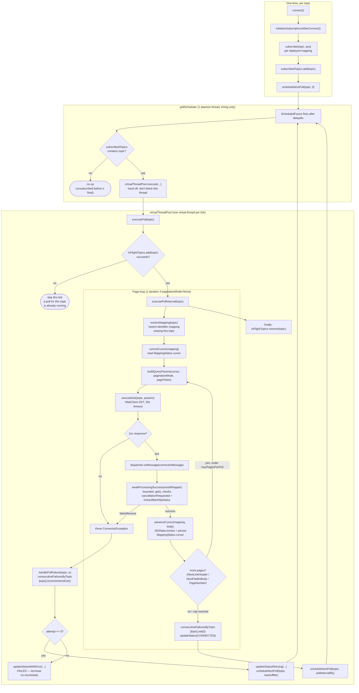

# Connector: REST Polling

The REST Polling connector periodically issues an HTTP GET against a configured URL and
feeds each successful response into the inbound mapping pipeline — the poll-driven
counterpart to the push-driven [HTTP connector](connector-http.md) and the inbound
counterpart to the outbound-only [WebHook connector](connector-webhook.md). Implemented by
[`HttpPollingConnector`](../../dynamic-mapper-service/src/main/java/dynamic/mapper/connector/httppolling/HttpPollingConnector.java),
using Spring's reactive `WebClient` (blocked synchronously per poll), and extends
`AConnectorClient` — see [connector-framework.md](connector-framework.md). Design journal (full
evaluation, alternatives considered, verified-against-code research at each decision point):
[planning/IMPLEMENTATION-PLAN-HTTP-POLLING.md](../planning/IMPLEMENTATION-PLAN-HTTP-POLLING.md).

---

## Background

Requested by a user on the community forum:

> I'm currently trying to use the Dynamic Mapper to periodically poll data from an external REST
> API and map it as e.g. measurements into Cumulocity: trigger (e.g. 5min) → REST GET (external
> API) → mapping result → create MEA in Cumulocity. For Outbound, there is the Webhook Connector,
> which allows sending data to an external REST API. For Inbound however, I don't see any
> connector that can actively poll an external REST API. [...] A native REST polling feature
> directly in the Dynamic Mapper would be much more elegant and helpful, as it would allow
> leveraging the mapping functionalities of Dynamic Mapper, without having to develop and
> maintain an additional Microservice.

An internal reviewer note settled the one architectural question worth settling explicitly —
whether this belongs in the connector layer or as a generic flow/mapping trigger (paraphrased
from German):

> I'd still see this as a connector's job, not the flow's. Or would you add an `onInterval` [flow
> handler]? That method would only ever be relevant for HTTP — for MQTT it's meaningless. That's
> why I'd say it belongs in the connector.

That framing holds throughout: every requirement below follows from treating polling as
transport-specific connector behavior (like MQTT's broker subscription or Kafka's consumer group),
not a cross-cutting mapping feature.

---

## Requirements

**What it is for.** Sources that only expose a REST API and cannot push data — no broker,
no webhook capability on their end — where the alternative would otherwise be a
custom microservice that polls and forwards into Cumulocity or the mapper.

- **Inbound only.** There is no way to "publish" to a polling connector; the reverse
  direction (Cumulocity → external REST API) is the [WebHook connector](connector-webhook.md).
- **Polling belongs to the connector, not the flow.** A generic "on interval" trigger at
  the mapping/flow level would only ever be meaningful for HTTP and dead weight for every
  other connector type — this is a deliberate architectural choice, not an oversight (see
  "Background" above).
- **One HTTP call per distinct topic, not per mapping — CORRECTED 2026-09-21.** Each distinct
  inbound mapping *topic* gets its own scheduled poll job. Mappings that share a topic share
  that one poll job (and its one underlying HTTP call), exactly the same topic-level dedup
  `MappingSubscriptionManager` already applies for MQTT — `subscribe()` is only invoked for the
  first mapping on a given topic. (An earlier version of this doc claimed same-topic calls were
  *not* deduplicated; that was wrong — verify against `MappingSubscriptionManager.subscribeToNewTopics()`
  if this ever needs re-checking.) Since the topic is the request path with no transformation,
  there's no way for two *different* topics to collide into the same URL either.
- **`url` is a base URL; the mapping's topic is the path — RESOLVED 2026-09-21.** Each mapping
  deployed to the connector polls `url` + `/<mapping topic>` (e.g. `url=https://api.example.com/v1`,
  topic `devices/measurements` → `GET https://api.example.com/v1/devices/measurements`), the same
  convention the Default HTTP Connector already uses for inbound (topic = path segment). One
  connector instance (one host, one set of credentials) can therefore serve many distinct
  endpoints — a separate connector instance is only needed for a genuinely different host or
  credential set, not merely a different path. This replaces the earlier v1 simplification where
  `url` had to be the exact target and every mapping on a connector necessarily hit the same
  endpoint. No `Mapping` schema change was needed — the topic field already existed.
- **`pollIntervalSeconds` is still connector-level**, unlike `url` above — every mapping on one
  connector instance shares the same poll interval. Getting a different interval still requires a
  separate connector instance. Not addressed by the `url`-per-mapping fix; flagged as a possible
  follow-up if it turns out to matter in practice.
- **A hard floor of 30 seconds on `pollIntervalSeconds`.** Enforced in `isConfigValid()`,
  to protect both the polled endpoint and this service from too many concurrent poll jobs.
- **Delivery is at-least-once, GET only.** By default every poll fetches the full response fresh
  ("GET full response every interval"). Both optional v2 features are implemented and off by
  default: cross-poll incremental fetch (a cursor, e.g. a `since` timestamp, carried between
  polls — see "Incremental fetch (v2)" below) and intra-poll pagination (draining multiple pages
  within one poll — see "Pagination (v2)" below).
- **Failure escalates through the same connector health mechanism as every other
  connector**, not a bespoke one: repeated poll failures move the connector through
  `RETRYING` (with backoff) to `FAILED`, visible in the same status UI/API as an MQTT
  disconnect.

---

## Implementation

Split across two classes (2026-09-22): `HttpPollingConnector` owns all mutable state (poll
scheduling, in-flight/failure tracking, the WebClient) and framework integration; the pure,
stateless request/response logic — config validation, query-param composition, pagination
continuation/stop-condition extraction, JSONata evaluation — lives in
`HttpPollingRequestHelper`, a package-private class of static functions with no dependency on
connector state. Kept to that boundary deliberately: the concurrency-sensitive state
(`subscribedTopics`, `inFlightTopics`, `consecutiveFailuresByTopic`, `pollTasks`) stays in one
place with one clear owner, the same lesson from the `ProcessingContext` "context decomposition"
attempt that was tried and reverted elsewhere in this codebase — splitting *that* part into
separate classes would reintroduce exactly the kind of copy-out/copy-back risk this connector's
2026-09-22 concurrency fixes (above) just removed.

### Direction: inbound only

```java
public List<Direction> supportedDirections() {
    return Collections.singletonList(Direction.INBOUND);
}
```

`publishMEAO()` logs a warning and returns rather than throwing — nothing should ever
route an outbound publish to this connector type in practice, but a hard throw isn't
warranted either (mirrors `HttpClient`'s inbound-only pattern).

`isPassiveReceiver()` returns `true` (confirmed correct in the 2026-09-22 deep review, after
briefly appearing as a bare `return false;` with no explanatory comment during earlier edits — a
likely accidental regression, restored). This connector never needs to be "connected" in the
broker sense before it can accept subscriptions — there is no persistent connection to establish,
each poll is its own independent HTTP request — so `reconcileSubscriptions()`/
`updateSubscriptionForInbound()` (which gate on `!isConnected() && !isPassiveReceiver()`) must not
block subscribing here on a connection state that this connector doesn't meaningfully have.

### "Subscribe" = register a poll job, not a broker subscription

`subscribe(topic, qos)` is called once per distinct inbound mapping topic (the same dedup
semantics `MappingSubscriptionManager` applies for MQTT). It does not talk to any external
system — it registers a **self-rescheduling** poll chain for that topic on a per-instance
`ScheduledExecutorService` (`pollScheduler`, created lazily via `ensureScheduler()`). This pool is
timing-only — it now runs a single daemon thread (reduced from 4, fixed 2026-09-22), since each
scheduled callback immediately hands the actual work off to `virtualThreadPool.execute(...)`
rather than running `executePoll()` (an HTTP call plus the bounded wait in
`awaitProcessingSuccess()`, together up to ~2 minutes worst case) directly on it — see "Poll
execution and dispatch" below:

```
subscribe(topic) → subscribedTopics.add(topic) → scheduleNextPoll(topic, 0)
                                                       ↓
                                                 executePoll(topic)
                                          success ↓         ↓ failure
                                 scheduleNextPoll(topic,    handlePollFailure(topic, e)
                                   pollIntervalMs)             → scheduleNextPoll(topic, backoffMs)
```

Each run reschedules itself rather than using a fixed-rate schedule — this is what lets the
delay vary per attempt (backoff) while still respecting the configured interval on success.
`unsubscribe(topic)` removes the topic from `subscribedTopics` and cancels its `ScheduledFuture`
in `pollTasks`; `scheduleNextPoll`/`executePoll` both check `subscribedTopics.contains(topic)`
before acting, so an unsubscribe racing with an in-flight run is a no-op rather than a leaked
reschedule.

Subscription membership (`subscribedTopics`) and the actual scheduled job (`pollTasks`) are
**two separate structures**, not one map doing double duty — `subscribe()` originally tried to
mark "subscribed, job not yet scheduled" by putting a `null` value into `pollTasks`
(`ConcurrentHashMap<String, ScheduledFuture<?>>`) before the real future existed. `ConcurrentHashMap`
throws `NullPointerException` on `put(key, null)` — it doesn't allow null values — so `subscribe()`
threw on every call, silently (the exception surfaced only as an opaque `subscriptionWarning` with
a null message on an explorer session, or was swallowed entirely for a real mapping subscribe path).
Fixed 2026-09-21 by splitting the two concerns: `subscribedTopics` (a plain key set) tracks
membership, `pollTasks` only ever holds a real `ScheduledFuture` once one exists.

### URL joining: `url` is a base, the topic is the path — RESOLVED 2026-09-21

Originally `url` had to be the exact poll target, so every mapping on one connector instance
necessarily hit the same endpoint (one connector instance per distinct URL). `topicPath(topic)`
now normalizes the mapping topic into a leading-`/` path segment, and `executeGet()` appends it
via `WebClient`'s `UriBuilder.path(...)` before adding any query params — the same "topic = path"
convention the Default HTTP Connector already uses for inbound
(`.../httpConnector/<MAPPING_TOPIC>`), and the mirror image of WebHook's outbound
`buildFullPath()` (base URL + publish topic).

`buildWebClient()` strips a single trailing slash from the configured `url` before it becomes the
`WebClient`'s base URL, so joining with `topicPath()`'s always-leading-`/` result never produces
a double slash regardless of whether the operator wrote `url` with or without a trailing `/`.

Unlike WebHook's equivalent (`buildFullPath()`, a manual `baseUrl.split("\\?")` string patch
flagged as fragile in `docs/feature/connector-webhook.md`), this join goes entirely through
`UriBuilder` — path and query composition, and encoding, are handled by Spring's
`UriComponentsBuilder` rather than hand-rolled string logic, so an existing query string already
present in `url` (e.g. `url=https://api.example.com/v1?apiVersion=1`) is preserved correctly
alongside the cursor/page query params added on top (see "Incremental fetch (v2)" /
"Pagination (v2)" below) — the exact class of bug WebHook's approach is documented as fragile
against doesn't apply here.

`NextLinkHeader` pagination mode is the one exception: once a page hands back an absolute
next-page URI, `executeGet()` hits it directly and neither `topicPath()` nor the query-building
in `buildQueryParams()` apply for that request — the server-provided URL is authoritative.

### Poll execution and dispatch

`executePoll()` is a thin in-flight guard around `executePollInternal()`, which runs a loop, not a
single request — one iteration per page (a single iteration when `paginationMode=None`, the
default). Each successful (2xx) page builds its own `ConnectorMessage` (payload = raw response
body bytes, `topic` = the mapping topic, `tenant`, `connectorIdentifier`, `sendPayload=true`) and
calls `dispatcher.onMessage(connectorMessage)` — the same dispatch `AbstractMqttCallback`/
`KafkaClientV2` use. Unlike a pure fire-and-forget, the returned `ProcessingResultWrapper` is then
awaited (bounded) via `awaitProcessingSuccess()` before the cursor is allowed to advance — see
"Cursor advances only after processing succeeds" below. Pages are dispatched one at a time as they
arrive, never buffered as a whole result set. See "Pagination (v2)" below for how the loop decides
whether to continue, and the diagram below for how a scheduled tick becomes a running poll.

#### Concurrent-execution guard (in-flight topics) — FIXED 2026-09-22

`subscribe()`/`upgradeQosForRetainedTopics()` can re-invoke `subscribe(topic, qos)` for a topic
that is already subscribed (e.g. to upgrade its QoS on a retained topic) — this unconditionally
cancels and reschedules that topic's poll job. `cancelPollTask()` only calls
`Future.cancel(false)` (no interrupt, so any in-flight `.block()` HTTP call or the bounded wait in
`awaitProcessingSuccess()` keeps running to completion), so a resubscribe during an in-flight poll
used to let a second `executePoll()` start for the *same* topic before the first had finished —
two concurrent runs racing on the same mapping's cursor (`advanceCursor()` from one run could be
silently overwritten or interleaved with the other's).

`executePoll(topic)` now guards its body with a `Set<String> inFlightTopics`
(`ConcurrentHashMap.newKeySet()`): it must win `inFlightTopics.add(topic)` before doing any work,
and always removes itself in a `finally` block. A run that loses the race (a poll for that topic
is already running) logs at debug and returns immediately — the in-flight run supersedes it, so
nothing is lost, only deferred to whatever the in-flight run's own `scheduleNextPoll` does next.

### Diagram: poll job lifecycle, scheduling, and cursor retrieval

One poll job per distinct mapping topic, from `subscribe()` through a scheduled tick to the next
reschedule. `pollScheduler` is a single timing-only thread; the actual poll (HTTP call + bounded
wait for the mapping pipeline) always runs on `virtualThreadPool`, never on the scheduler thread
itself.



Key properties this diagram makes explicit:

- **Scheduling and execution are on different pools** — the scheduler thread only ever decides
  *when*, never blocks on HTTP or pipeline processing (see "Subscribe" above).
- **The in-flight guard (`inFlightTopics`) sits between the scheduler and the actual poll body** —
  a resubscribe-triggered reschedule can produce a second tick for a topic whose previous run
  hasn't finished; that second tick is dropped, not queued or run in parallel.
- **The cursor is only persisted after a page's dispatch is confirmed successful** — a failure at
  any point in the loop (bad HTTP status, failed/timed-out processing) skips straight to
  `handlePollFailure` without touching `MappingStatus.cursor`, so the next poll resumes from the
  last page that actually completed, never from data that was fetched but not confirmed processed.
- **Failure accounting and the resulting backoff/`FAILED` transition are per-topic** — one topic
  reaching `FAILED` (terminal, no further `scheduleNextPoll`) does not affect any other topic's
  own counter or schedule.

### Configuration (`ConnectorSpecification`)

Built via `ConnectorSpecificationBuilder.create("REST Polling", ConnectorType.REST_POLLING)`:

| Property | Type | Required | Default | Notes |
|---|---|---|---|---|
| `url` | string | yes | — | Base URL; each mapping's topic is appended as the request path — see below |
| `pollIntervalSeconds` | numeric | no | `60` | Hard minimum `30`, enforced in `isConfigValid()` and defensively re-clamped at runtime in `getEffectivePollIntervalSeconds()` |
| `authentication` | option | no | — | `None` / `Basic` / `Bearer` |
| `user` / `password` | string / sensitive | no | — | shown when `authentication=Basic` |
| `token` | sensitive | no | — | shown when `authentication=Bearer` |
| `headers` | map | no | `{}` | Additional static headers sent with every poll request |
| `cursorParam` | string | no | — | Query parameter name for the incremental-fetch cursor (v2, see below); empty disables it |
| `cursorExtractionExpression` | string | no | — | JSONata evaluated against each response to compute the next cursor (v2); only takes effect with `cursorParam` set |
| `paginationMode` | option | no | `None` | `None` / `NextLinkHeader` / `NextFieldInBody` / `PageNumber` (v2, see below) |
| `maxPagesPerPoll` | numeric | no | `20` | Safety cap on pages drained per poll cycle; shown for any non-`None` `paginationMode` |
| `pageParam` | string | no | — | Query parameter name for the page token/number; `NextFieldInBody`/`PageNumber` only |
| `nextPageExpression` | string | no | — | JSONata extracting the next page token from the response; `NextFieldInBody` only |
| `pageStartValue` | numeric | no | `1` | First page number; `PageNumber` only |
| `supportsWildcardInTopicInbound` | boolean, readonly | no | `false` | Each "topic" is a concrete poll-job key, not a broker wildcard pattern |
| `supportsWildcardInTopicOutbound` | boolean, readonly, **hidden** | no | `false` | Hidden rather than shown disabled — this inbound-only connector has no outbound direction for it to describe (fixed 2026-09-21; see `docs/feature/connector-webhook.md`'s note on `WebHookInternal` for the same `.hidden(true)` pattern) |

### Incremental fetch (v2) — IMPLEMENTED 2026-09-21

Opt-in per connector via `cursorParam`/`cursorExtractionExpression`; both empty (the default)
keeps v1 behavior exactly (plain full-response poll, nothing sent or stored). See
[planning/IMPLEMENTATION-PLAN-HTTP-POLLING.md](../planning/IMPLEMENTATION-PLAN-HTTP-POLLING.md)'s
v2 section for the original design discussion — both part A (cross-poll cursor) and part B
(intra-poll pagination, below) are now implemented.

- **Request**: if a cursor is available for the topic, `buildQueryParams()` adds it as a query
  parameter, applied via `WebClient`'s `UriBuilder.queryParam(cursorParam, cursor)` in
  `executeGet()` — not a manual string template, so it URL-encodes correctly and composes with
  any existing query string already in `url` (and with a page parameter, when pagination is also
  active).
- **Extraction**: after each page's data is dispatched **and confirmed successfully processed**
  (see "Cursor advances only after processing succeeds" below — not merely after
  `dispatcher.onMessage(...)` returns), `advanceCursor()` parses that page's response body
  (`com.dashjoin.jsonata.json.Json.parseJson`, the same parser `JSONPayloadDeserializer` uses)
  and evaluates `cursorExtractionExpression` against it via
  `com.dashjoin.jsonata.Jsonata.jsonata(...).evaluate(...)` — the identical call
  `AbstractJSONataExtractionProcessor.extractContentFromPayload()` uses elsewhere in the mapper,
  reused rather than reimplemented. A response the expression can't evaluate logs a warning and
  leaves the cursor unchanged (that page behaves like v1) instead of failing the poll.
- **Persistence**: the cursor lives on `MappingStatus.cursor` (`model/status/MappingStatus.java`),
  resolved from the poll's topic via `mappingSubscriptionManager.getEffectiveMappingsInbound()`
  (matched on `mappingTopic`) — the mappings actually deployed to *this* connector, not every
  inbound mapping tenant-wide, so a same-named topic on a different connector can't be resolved
  by mistake. This reuses `MappingStatus`'s existing inventory-persisted, survives-a-restart,
  periodically-flushed machinery wholesale — no new persistence infrastructure, the crux flagged
  as open in the planning doc's original v2 sketch. If several mappings share one topic, they
  already share this connector's one poll job for it (see "Subscribe" above), so they share its
  cursor too — resolved by picking the mapping with the lowest `identifier`, **deterministically,
  not "whichever the map iterates first" — FIXED 2026-09-22**. `getEffectiveMappingsInbound()` is
  a plain `ConcurrentHashMap` with no iteration-order guarantee; an earlier `findFirst()` could
  silently pick a different mapping across restarts or after unrelated map churn triggered a
  rehash, switching which mapping's cursor was being read/written mid-session (caught in PR
  review, Copilot). Residual tradeoff, accepted: if that specific lowest-identifier mapping is
  later removed while others on the same topic remain, the group's cursor progress is lost
  (falls back to the newly-lowest mapping's own likely-unset cursor) — a full fix needs cursor
  storage keyed by (connector, topic) rather than by mapping, not warranted for what is already
  an edge case (one mapping per topic is the common configuration).
- **Ordering matters**: the cursor advances *after each page's dispatch has been confirmed
  successful*, never before — see "Pagination (v2)" for why this is per-page rather than once per
  poll, and "Cursor advances only after processing succeeds" for what "confirmed successful"
  actually checks.

#### Cursor advances only after processing succeeds — FIXED 2026-09-21

`dispatcher.onMessage(...)` starts Camel processing asynchronously and returns a
`ProcessingResultWrapper` immediately — a `Future` that has merely *completed* says nothing about
whether every mapping that matched actually succeeded. An earlier version of this code either
ignored the wrapper entirely, or (a later partial fix) blocked on the future without inspecting
its result — so a mapping failure, timeout, or downstream Cumulocity error that didn't throw out
of the `Future` itself would still let the cursor advance past data that was never actually
processed. Caught in PR review (Copilot).

`awaitProcessingSuccess()` now mirrors the exact wait/timeout/cancellation handling every broker
callback (e.g. `AbstractMqttCallback`) already uses for QoS>0 messages: bounded
`.get(timeoutMs, TimeUnit.MILLISECONDS)` on `getProcessingResult()` (timeout = the wrapper's own
`pipelineTimeoutMS`, falling back to `ServiceConfiguration.PROCESSING_HARD_CEILING_MS`), a check
for `cancellationRequested` (a JS CPU timeout can close the GraalVM context and complete the
future early), and `ProcessingResultHelper.extractMaxHttpStatus(...)` — the same helper broker
callbacks use to decide ack vs. no-ack — to detect a per-context processing failure that
completed without throwing. Any of these failing is treated exactly like a failed HTTP fetch:
routed through `handlePollFailure` (backoff, `RETRYING`/`FAILED`), cursor not advanced, pagination
stops for that cycle.
- Two backward-compatible constructor/call-site changes came with this: `MappingStatus` gained an
  11th field via a new all-args constructor, with the pre-existing 10-arg constructor kept
  (delegating with `cursor = null`) so none of its ~20 test call sites needed touching.

**Null `Future` from an early-exit dispatch — FIXED 2026-09-22.** `ProcessingResultHelper.failure()`
— used when `dispatcher.onMessage(...)` bails before real (async) processing ever started, e.g. the
payload couldn't be deserialized or no mapping resolved for the topic — builds a
`ProcessingResultWrapper` with **no `processingResult` set**, i.e. `getProcessingResult()` returns
`null`. `awaitProcessingSuccess()` used to call `.get(...)` on that unconditionally, throwing a
`NullPointerException` that happened to be caught two frames up by `executePoll`'s generic
`catch (Exception e)` — accidentally routed through the correct failure path (`handlePollFailure`,
cursor not advanced), but by luck, not by design, and logged as an opaque NPE rather than the
actual cause. `awaitProcessingSuccess()` now checks `getProcessingResult() == null` explicitly
first and returns `false` with a clear log message before ever calling `.get()`.

### Pagination (v2) — IMPLEMENTED 2026-09-21

Opt-in via `paginationMode` (default `None` = single GET per poll, unchanged v1 behavior).
`executePoll()`'s loop fetches, dispatches, and advances the cursor for one page, then decides
whether to continue based on the active mode — each mode has its own stop condition read directly
from the response, so no separate "has more pages" flag is needed:

| `paginationMode` | Continuation | Stop condition |
|---|---|---|
| `NextLinkHeader` | `extractNextLinkUri()` parses an RFC 5988 `Link` response header (`<url>; rel="next"`) | Header absent |
| `NextFieldInBody` | `extractNextPageToken()` evaluates `nextPageExpression` (JSONata) against the body, sent as `pageParam` on the next request | Expression returns nothing |
| `PageNumber` | `pageParam` increments from `pageStartValue` | `isEmptyPage()`: body parses to an empty `[]` or `{}` |

`maxPagesPerPoll` (default 20) caps every mode regardless of what the response claims, so one
runaway or misconfigured endpoint can't starve this connector's other topics' scheduled polls —
hitting the cap logs a warning and ends that poll cycle; the next scheduled poll resumes normally
(using whatever cursor was recorded through the last page processed).

`NextLinkHeader`'s continuation is an **absolute URI** the server hands back — `executeGet()`
hits it directly (`pollingClient.get().uri(absoluteUri)`) instead of composing query parameters
onto `url`, since the server already encodes everything needed (including, typically, its own
cursor-equivalent) into that URL. The other two modes compose query parameters onto `url` via
`buildQueryParams()`, the same mechanism the cursor uses, so cursor and pagination combine freely
in `NextFieldInBody`/`PageNumber` modes.

**Failure semantics — the reason the cursor advances per page, not once per poll**: if page 3 of
5 fails, pages 1–2's already-recorded cursor progress means the next poll resumes from there
rather than re-fetching (and re-dispatching) already-processed pages, or losing the unprocessed
remainder silently. The alternative (cursor advances only after the whole poll succeeds) would
mean any mid-pagination failure re-processes every earlier page in that cycle on the next poll —
harmless for idempotent consumers, but needless duplicate work and, for cursor-based upstream
APIs specifically, easy to get subtly wrong if "since" isn't perfectly idempotent across retries.

`isConfigValid()` also requires `user`+`password` (Basic) or `token` (Bearer) to be
non-empty when the corresponding `authentication` value is selected.

### HTTP client

A small, self-contained `buildWebClient()`/`executeGet()` — **not** a call into
`WebHook.java`'s equivalent methods, which are `private` and outbound-shaped (method/path/
payload resolved from a `ProcessingContext`). Duplicating ~30 lines of GET-only client setup
(Basic/Bearer auth header, custom headers, `Accept: application/json` default) was judged
less invasive than changing `WebHook`'s visibility or extracting a shared base class for a
single caller. `executeGet()` maps both 4xx and 5xx responses to a `ConnectorException`,
bounded by a fixed 30s `REQUEST_TIMEOUT` independent of any TCP-level connect/socket
timeout.

**Connection keep-alive disabled — FIXED 2026-09-22.** `buildWebClient()` configures its
`WebClient` with `HttpClient.create().keepAlive(false)`, deliberately forcing a fresh
connection (and, over TLS, a fresh handshake) on every request rather than letting
reactor-netty pool and reuse one. Found live against a target deployed as its own
Cumulocity microservice: polls hung for exactly `REQUEST_TIMEOUT` (30s) — no response, no
connection-reset error, nothing — on requests that reused a pooled connection, while every
poll that opened a fresh connection succeeded immediately. Root cause: each topic's poll
cycle is at least `MIN_POLL_INTERVAL_SECONDS` (30s) apart, but reactor-netty's default
`HttpClient` has no idle-eviction on its connection pool, so a connection sitting idle for
a whole poll interval is exactly the kind of connection an intermediate gateway or load
balancer (here, Cumulocity's own platform gateway in front of the deployed target) may have
already timed out and silently dropped — some intermediaries send a clean close/reset back
(harmless: reactor-netty detects this and transparently opens a fresh connection before any
request bytes go out), but others "black hole" it: the client's write succeeds locally into
the socket buffer, and nothing ever comes back, which is indistinguishable from a slow
server until `REQUEST_TIMEOUT` fires. Not reproducible against a bare local target over
loopback (no intermediary hop to silently drop anything), which is why this surfaced only
against the real deployed path. The fix trades a small, fixed per-poll cost (new
connection/handshake) — negligible at a 30s-minimum cadence — for eliminating this failure
mode outright, rather than trying to tune the pool's idle timeout below whatever unknown,
un-configurable-by-us timeout the shortest intermediary in the path happens to use.

### Error handling, backoff, and health status

Reuses the existing `ConnectionStateManager`/`ConnectorStatus` mechanism as-is — no new
status/alarm plumbing. A **per-topic** `Map<String, AtomicInteger> consecutiveFailuresByTopic`
drives it (previously a single connector-wide counter — see "Per-topic failure isolation" below):

- **Success** → reset that topic's counter, `updateStatus(CONNECTED, ...)`.
- **Failure, attempt ≤ 5** → `updateStatusRetrying(exception, delaySeconds)` (`RETRYING`).
- **Failure, attempt > 5** → `updateStatusWithError(exception)` (`FAILED`).

Backoff is linear-capped, mirroring MQTT's reconnect shape but sized to the poll interval
rather than MQTT's fixed constants: `delay = min(attempt * pollIntervalMs, 300_000ms)`.
`updateStatus(...)`/`updateStatusWithError(...)` still report one status for the whole connector
(there is no per-topic status concept in `ConnectionStateManager`), so a persistently broken
topic's `FAILED` status is still visible connector-wide — but it can no longer be *caused* by an
unrelated topic's failures being counted against it (see below).

#### Per-topic failure isolation — FIXED 2026-09-22

Before this fix, a single `AtomicInteger consecutiveFailures` was shared by every topic on the
connector. `FAILED` (attempt > `MAX_CONSECUTIVE_FAILURES`, i.e. 5) is **terminal** for a topic's
polling lifecycle — `handlePollFailure()` deliberately does not call `scheduleNextPoll()` once
reached, so that topic's poll chain stops dead until a reconnect. With one shared counter, five
consecutive failures from a single persistently-broken topic (bad credentials, deleted upstream
endpoint, etc.) would silently stop polling for every *other*, perfectly healthy topic on the
same connector too — each of their next failures (or even their next *success*, since the
counter was reset to 0 on any topic's success and incremented by any topic's failure,
interleaved unpredictably across topics) could tip the shared counter over the threshold.

Fixed by replacing the single counter with `Map<String, AtomicInteger> consecutiveFailuresByTopic`,
keyed by topic: `handlePollFailure(topic, e)` increments and checks only that topic's own entry,
and the success path in `executePollInternal()` resets only that topic's own entry to zero.
`unsubscribe()`/`cancelPollTask()` removes the topic's entry so it doesn't linger after a mapping
is undeployed, and `connect()` clears the whole map on (re)connect, matching the previous
reset-on-connect behavior.

### Lifecycle / cleanup

`disconnect()` unconditionally cancels every outstanding poll job for the connector
(`cancelAllPollTasks()`) before flipping state, including in the "already disconnected"
branch, defensively. `connectorSpecificHousekeeping()` is a second safety net: if the
connector reports not-connected but `pollTasks` is non-empty, it force-cancels everything.
`close()` is overridden to call `super.close()` (which takes the connect/disconnect lock and
runs `disconnect()`) and then fully shuts down `pollScheduler` via `shutdownNow()` — this
is reached from tenant cleanup via `BootstrapService.cleanTenantResources()` →
`ConnectorRegistry.unregisterAllClientsForTenant()` → `AConnectorClient.stopHousekeepingAndClose()`
→ `close()`, confirmed during implementation (this chain was an open question in the planning
doc before the connector was built).

### Message Explorer

Works with no connector-specific code: `executePoll()` dispatches every successful poll via
`dispatcher.onMessage(...)` (`CamelDispatcherInbound`), which unconditionally calls
`connectorClient.notifyExplorerListeners(message)` — the same path every other inbound
connector uses, so a session sees every poll response automatically. Starting a session
relies on `AConnectorClient`'s default `subscribeExplorer()`/`unsubscribeExplorer()`, which
this class doesn't override — they delegate straight to `subscribe()`/`unsubscribe()`.

This has a real cost that doesn't exist for broker-based connectors: opening an explorer
session on a topic with **no mapping already deployed on it** schedules a genuine poll job
(`subscribeExplorer` skips the call only if `mappingSubscriptionManager.isTopicSubscribed()`
is already true for that topic) — i.e. real periodic GET requests against the external
endpoint at the connector's configured interval, for as long as the session stays open (up
to the 10-minute idle TTL if not explicitly stopped). An MQTT explorer session by contrast
just adds a broker subscription, essentially free.

### Gotchas

- **A cancelled in-flight poll could previously dispatch late data — FIXED 2026-09-21.**
  `cancelPollTask()` uses `Future.cancel(false)` (no interrupt), so a poll already blocked in
  `.block()` inside `executePoll()` keeps running past an `unsubscribe()`/`disconnect()` that
  happens while it's in flight; `subscribedTopics` was previously only checked once at the very
  top of `executePoll()`, not again once the response actually arrived. `executePoll()` now
  re-checks `subscribedTopics.contains(topic)` both before firing each page's request (skips
  wasted work mid-pagination) and immediately after the response arrives, before dispatch —
  a disabled/deleted mapping can no longer have a straggling response processed after unsubscribe.
- **`pollIntervalSeconds` is still connector-level**, not per-mapping — every mapping on one
  connector instance polls at the same interval, unlike `url`/path (per-mapping since the
  2026-09-21 fix — see "URL joining" above). Don't assume different mappings on one connector
  instance can poll at different intervals.
- **A mapping's topic must be a valid URL path segment** now that it's appended to `url` — a
  topic chosen purely as an internal label (not meant to resemble a real path) will 404 against
  the actual API unless it happens to match one. This is a behavior change from before the
  2026-09-21 URL-joining fix, when the topic was purely an internal key with no bearing on the
  request URL.
- **Pagination stop conditions are trust-the-response, not verify-the-response** — `PageNumber`
  mode's `isEmptyPage()` treats an unparsable body as *non-empty* (keeps paginating rather than
  guessing), which means a misconfigured `paginationMode=PageNumber` against a non-paginated,
  non-JSON, or differently-shaped API can page all the way to `maxPagesPerPoll` before stopping,
  rather than failing fast. Watch for this via `maxPagesPerPoll` warnings in the logs.
- **`NextLinkHeader` mode ignores `cursorParam` on every page after the first** — once pagination
  switches to following an absolute next-page URI, `buildQueryParams()` (and therefore the cursor)
  is bypassed entirely for that request; only page 1 of a `NextLinkHeader` cycle carries the
  cursor query parameter. This is deliberate (the server-provided URL is authoritative for that
  API's own pagination), but combining `NextLinkHeader` with incremental fetch across *separate
  polls* still works — the cursor is only irrelevant *within* one multi-page cycle.
- **Backoff/failure counting is per-topic** (fixed 2026-09-22; was connector-wide before), but
  the reported `ConnectorStatus` itself is still one value for the whole connector — a topic that
  trips `FAILED` still surfaces as the connector's overall status, it just can no longer get there
  because of a *different* topic's failures.
- **No frontend-specific work was needed**: connector config forms are data-driven off
  `ConnectorSpecification`, so `REST_POLLING` appears in the connector-type dropdown
  automatically once registered in `ConnectorRegistry`/`ConnectorClientFactory` — verify
  this holds if the UI's dropdown ever turns out to hardcode a connector-type list.
- **Test target**: `resources/testing/environments/http-polling/` is a small Flask
  microservice deployed as its own Cumulocity microservice (`http-polling-mock`) that
  serves a synthetic, changing reading per request and optionally requires Basic/Bearer
  auth, plus a `/requests` inspection endpoint (the inbound equivalent of the WebHook test
  environment's RequestBin) — see its README for setup.
