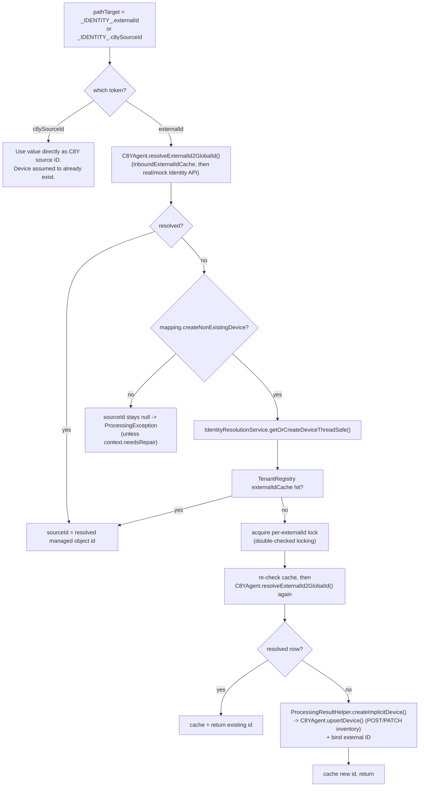

# Identity Resolution

Identity resolution is how the mapper translates between a broker-side device identifier
(an "external ID" — a serial number, IMEI, MQTT client ID, etc.) and the corresponding
Cumulocity managed-object ID ("source ID" / internal ID). Every inbound message needs to
resolve (or create) the target device before it can attach a measurement/event/alarm to it;
every outbound notification needs the reverse — given a Cumulocity device, find the external
ID a mapping's `useExternalId` substitution should publish. This document covers the
lookup/cache/creation mechanics; how `_IDENTITY_.externalId` / `_IDENTITY_.c8ySourceId`
substitutions plug into the processing pipeline is covered in
[`mapping-processing-inbound.md`](mapping-processing-inbound.md) and
[`mapping-processing-outbound.md`](mapping-processing-outbound.md).

---

## Requirements

**What it is for.** A message names a device the way the device's own world names it — a serial
number, an IMEI, a topic segment. Cumulocity names it with an internal managed-object id.
Identity resolution is the translation between the two, in both directions.

- **A mapping states where the device identifier comes from**: a field in the payload, a segment
  of the topic, or a fixed value.
- **An external ID must be resolvable to a managed object** using an external-ID type, and the
  same device must resolve consistently for every subsequent message.
- **A device that does not exist yet may be created automatically**, if the mapping opts in.
  Concurrent messages for the same new device must produce one device, not several.
- **A mapping may address a device by its internal id instead**, skipping resolution.
- **Resolution must be fast enough for message rates**, so results are cached; the cache must
  never outlive the truth — a device deleted in the platform must stop resolving rather than
  resolving to a dead id indefinitely.
- **Cached identities are per tenant.** The same serial number in two tenants is two different
  devices.
- Outbound, the reverse: a Cumulocity object's source id must be translatable back to the external
  ID the receiving system expects, and into the publish topic.

---

## Implementation

### Core classes

| Class | Role |
|---|---|
| [`IdentityResolver`](../../dynamic-mapper-service/src/main/java/dynamic/mapper/core/IdentityResolver.java) | Interface: `resolveExternalId2GlobalId`, `resolveGlobalId2ExternalId`, `getManagedObjectForId`. Implemented by `C8YAgent`. |
| [`C8YAgent`](../../dynamic-mapper-service/src/main/java/dynamic/mapper/core/C8YAgent.java) | Implements `IdentityResolver`; wraps the Cumulocity Identity API (via `IdentityFacade`) with a per-tenant cache and semaphore-bounded concurrency. |
| [`IdentityFacade`](../../dynamic-mapper-service/src/main/java/dynamic/mapper/core/facade/IdentityFacade.java) | Routes identity calls to either the real `IdentityApi` (production) or [`MockIdentity`](../../dynamic-mapper-service/src/main/java/dynamic/mapper/core/mock/MockIdentity.java) (testing), based on a `testing` flag threaded through every call. |
| [`IdentityResolutionService`](../../dynamic-mapper-service/src/main/java/dynamic/mapper/core/IdentityResolutionService.java) | Thread-safe create-or-lookup for **implicit** device creation: `getOrCreateDeviceThreadSafe()`. |
| [`DeviceBootstrapService`](../../dynamic-mapper-service/src/main/java/dynamic/mapper/core/DeviceBootstrapService.java) | **Not** part of per-message identity resolution — see note below. |
| [`TenantRegistry`](../../dynamic-mapper-service/src/main/java/dynamic/mapper/core/TenantRegistry.java) | Holds the external-ID cache and per-external-ID creation locks used by `IdentityResolutionService`. |

### Two independent caches

There are two separate caches involved in resolving an external ID, serving different call
paths — this is a real structural detail, not an implementation accident:

1. **`InboundExternalIdCache`** (per-tenant, inside `CacheManager`, read/written by
   `C8YAgent.resolveExternalId2GlobalId()`
   ([`C8YAgent.java:212-241`](../../dynamic-mapper-service/src/main/java/dynamic/mapper/core/C8YAgent.java#L212-L241))).
   Every plain "does this external ID already resolve to a device?" lookup goes through this
   cache first; on a miss it calls the real (or mock) Identity API and populates the cache
   (skipped when `testing=true`, so synthetic test IDs never enter it).
2. **`TenantRegistry`'s `externalIdCache`** (a flat `Map<String,String>` keyed by
   `"tenant|type|value"`, with a companion `externalIdCacheReverse` and a
   `ConcurrentHashMap<String,Object>` of per-key locks
   ([`TenantRegistry.java:252-323`](../../dynamic-mapper-service/src/main/java/dynamic/mapper/core/TenantRegistry.java#L252-L323))).
   This is read/written only by `IdentityResolutionService.getOrCreateDeviceThreadSafe()` —
   the **create-or-lookup** path used when a mapping has `createNonExistingDevice=true`.

Because these are two different caches, an eviction of one does **not** evict the other.
`CamelDispatcherInbound` handles this explicitly: after a request fails with HTTP 422 (e.g.
the cached device was deleted from inventory), it evicts the entry from **both** caches
before resending
([`CamelDispatcherInbound.java:203-216`](../../dynamic-mapper-service/src/main/java/dynamic/mapper/processor/inbound/CamelDispatcherInbound.java#L203-L216)) —
a comment there points to `attic/fix/inconsistant-cache/ISSUE.md` documenting the bug that
motivated evicting both.

### Inbound resolution path

Triggered from `SubstitutionResultInboundProcessor.prepareAndSubstituteInPayload()`
([`SubstitutionResultInboundProcessor.java:182-247`](../../dynamic-mapper-service/src/main/java/dynamic/mapper/processor/inbound/processor/SubstitutionResultInboundProcessor.java#L182-L247))
when a substitution's `pathTarget` is one of the two identity tokens:

- **`_IDENTITY_.c8ySourceId`** — the simplest path: the substituted value is used directly as
  the Cumulocity internal device ID with no lookup at all. The mapping author is asserting
  the device already exists (e.g. because it was created out-of-band, or the source payload
  literally carries the internal ID).
- **`_IDENTITY_.externalId`** — the value is looked up via
  `C8YAgent.resolveExternalId2GlobalId(tenant, identity, testing)`. If not found and
  `createNonExistingDevice` is off, resolution fails with a `ProcessingException` (unless
  `context.isNeedsRepair()`, which lets `SubstitutionResultInboundProcessor`'s caller
  continue without aborting the whole batch). If `createNonExistingDevice` is on,
  `IdentityResolutionService.getOrCreateDeviceThreadSafe()` is called.

#### `getOrCreateDeviceThreadSafe()` — double-checked locking

([`IdentityResolutionService.java:64-123`](../../dynamic-mapper-service/src/main/java/dynamic/mapper/core/IdentityResolutionService.java#L64-L123))

1. Fast path: check `TenantRegistry.getCachedExternalId(cacheKey)`. If present, return
   immediately (no lock).
2. Otherwise obtain a lock scoped to `tenant|externalIdType|externalIdValue`
   (`TenantRegistry.getOrCreateExternalIdLock`) — not a single global lock, so concurrent
   creation of *different* devices doesn't serialize against each other.
3. Inside the lock: re-check the cache (another thread may have already created the device
   while this one was waiting for the lock), then call
   `C8YAgent.resolveExternalId2GlobalId()` again (the device may already exist in C8Y even
   though it wasn't yet in this local create-or-lookup cache).
4. If still not found and `mapping.getCreateNonExistingDevice()` is true, create it via
   `ProcessingResultHelper.createImplicitDevice()`.
5. **Testing note:** a resolved or newly-created ID is only written into
   `TenantRegistry`'s cache when `!testing` — during a dry-run test,
   `resolveExternalId2GlobalId` returns a synthetic mock ID (e.g. `"10000"`) that must never
   leak into the production create-or-lookup cache.

#### Implicit device creation

`ProcessingResultHelper.createImplicitDevice()`
([`ProcessingResultHelper.java:168-`](../../dynamic-mapper-service/src/main/java/dynamic/mapper/processor/util/ProcessingResultHelper.java#L168))
builds a minimal managed object:

- `name` — `context.getDeviceName()` if the mapping/context supplied one (via
  `_CONTEXT_DATA_.deviceName` or the Smart Function config), else
  `"device_" + externalIdType + "_" + externalIdValue`.
- `type` — `context.getDeviceType()` if supplied, else `"c8y_GeneratedDeviceType"`.
- Always includes `c8y_IsDevice` and `com_cumulocity_model_Agent` fragments.
- Merges in any additional `context.getDeviceFragments()` (from `_CONTEXT_DATA_.deviceFragments`).
- Submitted as a `DynamicMapperRequest` (method `POST` or `PATCH`, depending on
  `mapping.getUpdateExistingDevice()`) through `C8YAgent.upsertDevice()`, which also binds the
  external ID (`createWithExternalIdBinding`) unless `testing=true`, in which case a
  predefined mock source ID is assigned instead of a server-generated one.

### Outbound resolution path

Outbound goes the other direction: given a Cumulocity source device ID (extracted from the
notification payload by `EnrichmentOutboundProcessor` — see
[`mapping-processing-outbound.md`](mapping-processing-outbound.md)), find its external ID of
a specific type. This uses `C8YAgent.resolveGlobalId2ExternalId(tenant, gid, externalIdType,
testing)` → `IdentityFacade.resolveGlobalId2ExternalId()`
([`IdentityFacade.java:78-100`](../../dynamic-mapper-service/src/main/java/dynamic/mapper/core/facade/IdentityFacade.java#L78-L100)),
which pages through the device's full external-ID collection and returns the first entry
matching the requested type. There is no local cache on this path (each call queries the
Identity API, or `MockIdentity.getExternalIdsOfGlobalId()` when testing) — if no external ID
of that type exists, the mapping is skipped for that device
(`context.setIgnoreFurtherProcessing(true)`) rather than erroring, since a missing enrollment
is a device-configuration gap rather than a mapping bug.

### Testing: mocked identity resolution

When `testing=true` (see [`mapping-testing.md`](mapping-testing.md) for exactly when this is
set for each direction), every identity call in this document routes through
[`MockIdentity`](../../dynamic-mapper-service/src/main/java/dynamic/mapper/core/mock/MockIdentity.java)
instead of the real Cumulocity Identity API — an in-memory, per-tenant
`ConcurrentHashMap`-backed store with the same bidirectional external-ID ↔ managed-object
lookup shape as the real API, including pagination support for
`getExternalIdsCollectionOfGlobalId()`. The UI clears this mock state (`MockIdentity.clear()`,
plus a parallel mock inventory cache) between test runs via the `CLEAR_CACHE` operation with
`cacheId: MOCK_IDENTITY_CACHE` / `MOCK_INVENTORY_CACHE`, handled in `OperationController`.

### `DeviceBootstrapService` is not per-message auto-registration

Despite the name, `DeviceBootstrapService` is **not** involved in resolving or
auto-registering devices for incoming messages. Grepping its only caller confirms it is used
for two unrelated purposes:

1. **One-time tenant bootstrap**: `initializeMapperServiceRepresentation()` and
   `initializeDeviceToClientMapRepresentation()` create/find the mapper's own agent
   managed object and its device-to-client-map managed object when a tenant subscribes —
   infrastructure for the mapper service itself, not end-device identity.
2. **Generic inventory read helpers**: `getManagedObjectForId()`, `getManagedObjectsByType()`,
   `forEachManagedObjectByType()` are thin wrappers around `InventoryFacade` that `C8YAgent`
   delegates to for by-ID/by-type inventory lookups (used elsewhere, e.g. by the inventory
   filter evaluator and type-subscription backfill).

The actual per-message "auto-registration of a previously-unseen external ID" behavior is
entirely in `IdentityResolutionService.getOrCreateDeviceThreadSafe()` and
`ProcessingResultHelper.createImplicitDevice()`, documented above.
