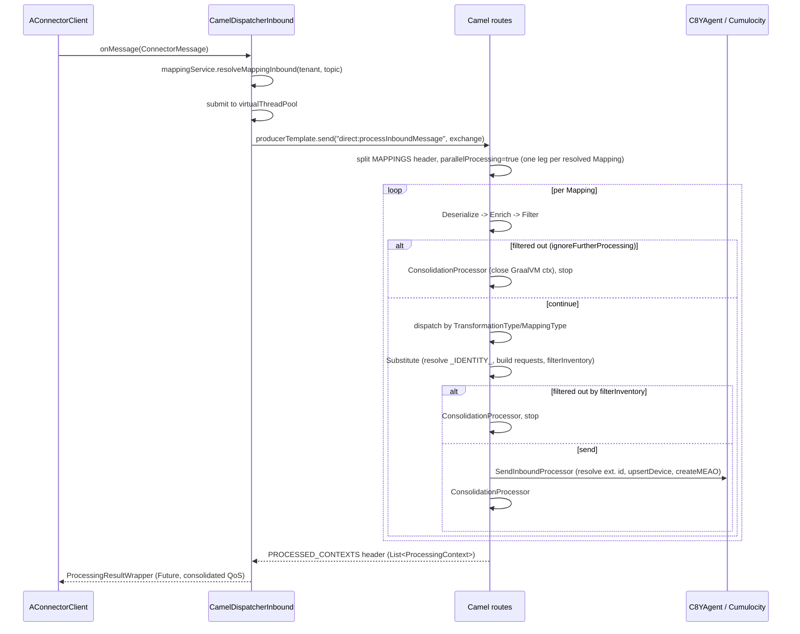

# Inbound Message Processing

Inbound processing turns a broker message (MQTT, Kafka, HTTP, AMQP, Pulsar) into one or
more Cumulocity IoT requests (measurement, event, alarm, inventory update, operation
update). It is an Apache Camel pipeline: each connector hands the raw bytes to a single
dispatcher, which resolves the matching `Mapping`(s), then runs a fixed sequence of
processing stages per mapping — deserialize, enrich, filter, transform, substitute,
send. This page describes that pipeline's shape and sequencing; the transformation
mechanisms themselves (JSONata, Smart Functions, Java extensions) are documented
separately.

## Where it runs

| Stage | Class | Role |
|---|---|---|
| Entry point | [`CamelDispatcherInbound`](../../dynamic-mapper-service/src/main/java/dynamic/mapper/processor/inbound/CamelDispatcherInbound.java) | Implements `GenericMessageCallback`; every connector calls `onMessage()` (live) or `onTestMessage()` (dry-run/test) with a `ConnectorMessage`. |
| Route definitions | [`DynamicMapperInboundRoutes`](../../dynamic-mapper-service/src/main/java/dynamic/mapper/processor/inbound/route/DynamicMapperInboundRoutes.java) | Camel `RouteBuilder` wiring the processor beans below into `direct:` routes. |
| Deserialize | [`DeserializationInboundProcessor`](../../dynamic-mapper-service/src/main/java/dynamic/mapper/processor/inbound/processor/DeserializationInboundProcessor.java) | Picks a `PayloadDeserializer` by `MappingType` and builds the `ProcessingContext`. |
| Enrich | [`EnrichmentInboundProcessor`](../../dynamic-mapper-service/src/main/java/dynamic/mapper/processor/inbound/processor/EnrichmentInboundProcessor.java) (extends [`AbstractEnrichmentProcessor`](../../dynamic-mapper-service/src/main/java/dynamic/mapper/processor/AbstractEnrichmentProcessor.java)) | Injects `_TOPIC_LEVEL_`/`_CONTEXT_DATA_` into the payload (non-code mappings) or builds the GraalVM Smart Function config (code mappings); borrows a pooled GraalVM context when the mapping has `code`. |
| Filter | [`FilterInboundProcessor`](../../dynamic-mapper-service/src/main/java/dynamic/mapper/processor/inbound/processor/FilterInboundProcessor.java) | Evaluates `mapping.getFilterMapping()` (a JSONata boolean expression) against the deserialized payload; inbound-only, no equivalent on the outbound route. |
| Transform (dispatch) | `DynamicMapperInboundRoutes.configure()` `.choice()` block | Routes to one of `processInternalProtobuf` / `processExtension` / `processJSONataExtraction` / `processFlowFunction` based on `mapping.getTransformationType()`/`getMappingType()`; unmatched types fall back to JSONata. |
| Substitute | [`SubstitutionResultInboundProcessor`](../../dynamic-mapper-service/src/main/java/dynamic/mapper/processor/inbound/processor/SubstitutionResultInboundProcessor.java) | Applies cached `SubstituteValue`s to `targetTemplate`, resolves `_IDENTITY_.*`, builds one `DynamicMapperRequest` per device (cardinality), evaluates `filterInventory`. |
| Send | [`SendInboundProcessor`](../../dynamic-mapper-service/src/main/java/dynamic/mapper/processor/inbound/processor/SendInboundProcessor.java) | Resolves external IDs to C8Y source IDs, upserts devices, calls `C8YAgent.createMEAO`, merges multiple MEASUREMENT requests into one bulk request, creates processing alarms, handles SparkPlug B birth/active-state bookkeeping. |
| Cleanup | [`ConsolidationProcessor`](../../dynamic-mapper-service/src/main/java/dynamic/mapper/processor/util/ConsolidationProcessor.java) | Moves the `ProcessingContext` from Camel header to exchange body for the aggregation strategy, and closes the context's GraalVM resources (idempotent — the one point every leg passes through, including early-`.stop()` exits). |

## End-to-end flow

## Dispatch and resolution (`CamelDispatcherInbound`)

`onMessage()`/`onTestMessage()` both funnel into `processMessage()`
([`CamelDispatcherInbound.java:93-253`](../../dynamic-mapper-service/src/main/java/dynamic/mapper/processor/inbound/CamelDispatcherInbound.java#L93-L253)):

1. System topics (`$SYS*`) and null payloads are dropped immediately.
2. Mappings are resolved for the topic via `mappingService.resolveMappingInbound(tenant, topic)`
   — or, for a test call, the single `testMapping` passed in is used directly. Their QoS is
   consolidated into the wrapper's `consolidatedQos` (strongest level requested, clamped to the
   connector's capabilities), which decides when the connector acknowledges the message — see
   [`reliability.md`](reliability.md).
3. `testing` is computed as `testMapping != null && !sendPayload` — a dry-run test uses
   mocked identity/inventory lookups, but as soon as `sendPayload=true` (the user created a
   real test device beforehand) the mapping runs against real Cumulocity services. See
   [`mapping-testing.md`](mapping-testing.md).
4. A pipeline timeout is computed: 0 for template-based mappings, or
   `serviceConfiguration.getPipelineTimeoutMS()` (default 5000ms) when
   `mapping.isTransformationAsCode()` is true, since Smart Function execution needs a
   dedicated CPU-time bound (GraalVM interruption) in addition to the ambient Camel timeout.
5. The whole per-message pipeline is submitted to a virtual-thread pool
   (`configurationRegistry.getVirtualThreadPool()`); the returned `Future` is embedded in a
   `ProcessingResultWrapper` so the connector can wait on, or cancel, processing.
6. After processing, any resulting request that failed with HTTP 422 causes the resolved
   external-ID cache entries to be evicted (both `InboundExternalIdCache` in `C8YAgent` and
   the separate cache in `TenantRegistry` used by `IdentityResolutionService`) and, if
   `createNonExistingDevice` is set, the whole message is resent once
   (`CamelDispatcherInbound.java:203-238`). See [`identity-resolution.md`](identity-resolution.md)
   for why there are two caches.

## Camel route structure (`DynamicMapperInboundRoutes`)

- `direct:processInboundMessage` — no-op short-circuit when no mappings were resolved.
- `direct:processWithMappingsOutbound` — filters candidate mappings to those actually
  deployed on the originating connector (`isMappingDeployed`), then `.split()`s over the
  mapping list with `parallelProcessing(true)` on the virtual-thread pool: **each matching
  mapping for a topic is processed as an independent parallel leg**, aggregated back
  together by `ProcessingContextAggregationStrategy`.
- `direct:processSingleInboundMapping` — the common prefix for every mapping: deserialize
  → enrich → filter, then a `.choice()` that stops early
  (via `ConsolidationProcessor`) if `shouldIgnoreFurtherProcessing` is true after
  enrichment/filtering, otherwise dispatches by transformation type to one of:
  - `direct:processInternalProtobuf` (`MappingType.PROTOBUF_INTERNAL`)
  - `direct:processExtension` (`TransformationType.EXTENSION_JAVA`)
  - `direct:processJSONataExtraction` (JSONata/default)
  - `direct:processFlowFunction` (`TransformationType.SMART_FUNCTION`)
  - unmatched types log a warning and fall back to JSONata.
- Each of those four sub-routes ends the same way: substitution/result processor →
  optional early stop if filtered → `SendInboundProcessor` → `ConsolidationProcessor`.
- `direct:processRequestsInParallel` — used only when a Java extension or Smart Function
  produced multiple independent `DynamicMapperRequest`s and `PARALLEL_PROCESSING` header is
  true; splits and sends each request concurrently via `SendInboundProcessor`.
- A global `onException(Exception.class)` handler logs and routes to
  `direct:inboundErrorHandling`, which guarantees `PROCESSED_CONTEXTS` is never null so the
  dispatcher's header read always succeeds.

## `ProcessingContext` and its focused sub-contexts

`ProcessingContext<O>` ([`ProcessingContext.java`](../../dynamic-mapper-service/src/main/java/dynamic/mapper/processor/model/ProcessingContext.java))
is the per-message state object threaded through every processor via the Camel header
`CamelHeaders.PROCESSING_CONTEXT`. It is `AutoCloseable`: `close()`
([`ProcessingContext.java:509-556`](../../dynamic-mapper-service/src/main/java/dynamic/mapper/processor/model/ProcessingContext.java#L509-L556))
releases GraalVM resources — either returning a pooled `Context` to the pool via
`engineReleaseAction`, or closing a non-pooled `Context` directly — and is called by
`ConsolidationProcessor` on every terminal path so a filtered-out mapping still releases its
JS context.

Several fields on `ProcessingContext` (`requests`, `errors`, `warnings`, `logs`,
`processingCache`) already use thread-safe collections (`CopyOnWriteArrayList`,
`ConcurrentSkipListMap`) because the parallel-request route above can mutate the same
context concurrently across virtual threads. On top of that, `ProcessingContext` exposes
adapter methods to five focused, more narrowly-scoped views:

| Context class | Getter on `ProcessingContext` | Fields | Thread-safety notes |
|---|---|---|---|
| [`RoutingContext`](../../dynamic-mapper-service/src/main/java/dynamic/mapper/processor/model/RoutingContext.java) | `getRoutingContext()` | `topic`, `clientId`, `api`, `qos`, `resolvedPublishTopic`, `tenant` | `@Value` (Lombok immutable); `with*` methods return a new copy. |
| [`PayloadContext<T>`](../../dynamic-mapper-service/src/main/java/dynamic/mapper/processor/model/PayloadContext.java) | `getPayloadContext()` | `deserializedPayload`, `rawPayload`, `binaryInfo` | Immutable snapshot. |
| [`DeviceContext`](../../dynamic-mapper-service/src/main/java/dynamic/mapper/processor/model/DeviceContext.java) | `getDeviceContext()` | `sourceId`, `externalId`, `deviceName`, `deviceType`, `deviceFragments`, `deviceGroups`, `alarms` | Immutable, copy-on-write via `with*`; **read-only snapshot — there is no `syncFromDeviceContext()`**, so mutating the returned copy does not affect the original `ProcessingContext`. |
| [`ProcessingState`](../../dynamic-mapper-service/src/main/java/dynamic/mapper/processor/model/ProcessingState.java) | `getProcessingState()` / `syncFromState()` | `processingCache` (`ConcurrentHashMap`), `needsRepair`/`ignoreFurtherProcessing` (`AtomicBoolean`) | Genuinely mutable and thread-safe; changes must be synced back explicitly with `syncFromState()`. |
| [`OutputCollector`](../../dynamic-mapper-service/src/main/java/dynamic/mapper/processor/model/OutputCollector.java) | `getOutputCollector()` / `syncFromOutputCollector()` | `requests` (`CopyOnWriteArrayList`), `errors`/`warnings`/`logs` (`ConcurrentLinkedQueue`) | Same pattern as `ProcessingState`: a snapshot copy, synced back explicitly. |

**Note on project memory:** the six-context refactor described in this repository's saved
memory (`RoutingContext`, `PayloadContext`, `DeviceContext`, `ProcessingState`,
`OutputCollector`, plus a sixth `ExecutionContext` for GraalVM resources) matches the code
for the first five classes. There is, however, no separate `ExecutionContext` class in
`processor/model/` — GraalVM lifecycle (the pooled `Context`, `Engine` reference, and release
callback) lives directly on `ProcessingContext` itself (`graalContext`, `pooledGraalContext`,
`engineReleaseAction`), and `ProcessingContext` itself implements `AutoCloseable` for that
purpose. Use `try (ProcessingContext<?> ctx = ...) { ... }` (or rely on
`ConsolidationProcessor`, which does this on every pipeline exit) rather than looking for a
dedicated `ExecutionContext` type.

## Filtering (`FilterInboundProcessor`)

Runs once, right after enrichment, only for inbound. It evaluates `mapping.getFilterMapping()`
(a JSONata boolean expression) against the deserialized payload
([`FilterInboundProcessor.java:35-66`](../../dynamic-mapper-service/src/main/java/dynamic/mapper/processor/inbound/processor/FilterInboundProcessor.java#L35-L66)).
A falsy result, or an expression that fails to evaluate, both set
`context.setIgnoreFurtherProcessing(true)` — filter evaluation errors fail closed (the
message is dropped, not silently passed through), matching the outbound resolver's
`evaluateMessageFilter`/`evaluateInventoryFilter` behavior. There is a second,
post-substitution filter — `filterInventory` — applied later in
`SubstitutionResultInboundProcessor`, once the target device's C8Y source ID is known; see
[`mapping-validation.md`](mapping-validation.md) for the full validation rule set around both
filters.

## Transformation dispatch

The four transformation paths are documented individually — this page only covers how the
route selects and sequences them:

- [`transformation-jsonata.md`](transformation-jsonata.md) — JSONata substitutions (default).
- [`transformation-smart-functions.md`](transformation-smart-functions.md) — GraalVM-sandboxed JavaScript (`TransformationType.SMART_FUNCTION`).
- [`transformation-java-extensions.md`](transformation-java-extensions.md) — Java `ProcessorExtensionInbound<O>` plugins (`TransformationType.EXTENSION_JAVA`).

`MappingType.PROTOBUF_INTERNAL` (internal protobuf, e.g. SparkPlug B once decoded) is
handled by `InternalProtobufProcessor` directly on the inbound route and is not one of the
three pluggable transformation types above.

## Substitution and identity resolution

`SubstitutionResultInboundProcessor` walks every `pathTarget` in
`context.getProcessingCache()` and writes the corresponding value into a copy of
`targetTemplate` for each device (cardinality is driven by the maximum `expandArray` fan-out
across all cached substitutions — see `BaseProcessor.validateProcessingCache()`). Two
`pathTarget` values are handled specially before the generic JSONPath write, because they
drive Cumulocity identity:

- `_IDENTITY_.externalId` — resolves (or, if `mapping.getCreateNonExistingDevice()`, creates)
  the Cumulocity device for that external ID.
- `_IDENTITY_.c8ySourceId` — passes the value straight through as the device's C8Y internal
  ID; the device is assumed to already exist.

Full identity-resolution mechanics (caches, locking, implicit device creation) are in
[`identity-resolution.md`](identity-resolution.md).

Once requests are built, `mapping.getCreateNonExistingDevice()` decides whether the
resulting `DynamicMapperRequest`s are processed sequentially (`false` → parallel via
`CamelHeaders.PARALLEL_PROCESSING`, since there's no ordering dependency between independent
devices; `true` → sequential, since device creation must happen deterministically before
dependent MEAO requests).

## Sending (`SendInboundProcessor`)

Beyond resolving external IDs and creating/updating devices via `C8YAgent.upsertDevice()`
and `C8YAgent.createMEAO()`, this processor also:

- Merges multiple `MEASUREMENT` requests produced by one message (e.g. a Smart Function
  emitting several data points) into a single bulk `{"measurements": [...]}` request
  (`bulkMeasurementRequestsIfNeeded`).
- Creates a `WARNING` alarm (`Utils.MAPPER_PROCESSING_ALARM`) on the resolved source device
  for any entries in `context.getAlarms()` accumulated during processing.
- For `MappingType.SPARKPLUGB`: persists the NBIRTH/DBIRTH alias→metric map as a managed
  object fragment (`sparkPlugB_NBIRTH` / `sparkPlugB_DBIRTH_<deviceId>`) so later
  NDATA/DDATA messages can resolve metric aliases, and maintains
  `sparkPlugB_isActive[_<deviceId>]` flags from BIRTH/DATA/DEATH message types.

## Cancellation

Both `CamelDispatcherInbound` and the outbound dispatcher submit processing to a virtual
thread and store the `Future` on a `ProcessingResultWrapper`. A caller (e.g. a connector
detecting a processing timeout) can call `cancelProcessing()` on that wrapper, which sets a
`cancellationRequested` flag, interrupts the future, and runs any registered GraalVM
cancel-actions to abort CPU-bound JS execution. `SendInboundProcessor` checks this flag
before doing any work so a cancelled pipeline doesn't still publish to Cumulocity.
