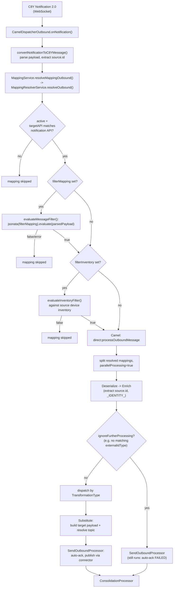

# Outbound Message Processing

Outbound processing turns a Cumulocity IoT change — a new measurement, event, alarm,
inventory update, or operation — into a message published to a broker (MQTT, Kafka, HTTP,
AMQP, Pulsar). Cumulocity delivers these changes as Notification 2.0 WebSocket
notifications; the mapper resolves which outbound `Mapping`(s) apply, transforms the
notification payload into the broker-side shape, and publishes it through the owning
connector. This page describes the pipeline shape; transformation internals are documented
separately (see the links below).

---

## Requirements

**What it is for.** Turning a change in Cumulocity — a measurement, event, alarm, operation or
inventory update — into a message published to a broker.

- **The tenant subscribes to what it wants forwarded.** Outbound processing only sees objects for
  devices that are subscribed; how a device becomes subscribed is a separate concern.
- **Outbound mapping can be switched off tenant-wide**, and then nothing is subscribed or
  published at all.
- **Every outbound mapping has a filter expression** deciding whether a given object is forwarded.
  It defaults to "forward everything" so the field is never implicitly empty.
- **The publish topic may be derived from the device**, so one mapping can serve many devices by
  resolving the device's external ID into the topic.
- **Internal metadata never reaches the broker.** Fields the mapper adds for its own use are
  stripped from the published payload.
- **The QoS a mapping asks for governs the publish**, clamped to what the connector supports —
  see [reliability.md](reliability.md).
- **Operations are forwarded on creation only.** Updates and deletions of an operation are
  deliberately ignored, since the device acts on the original.

---

## Implementation

### Where it runs

| Stage | Class | Role |
|---|---|---|
| Entry point | [`CamelDispatcherOutbound`](../../dynamic-mapper-service/src/main/java/dynamic/mapper/processor/outbound/CamelDispatcherOutbound.java) | Implements `NotificationCallback`; `onNotification()` (live WebSocket) and `onTestNotification()` (dry-run/test) both funnel into `processNotification()`. |
| Route definitions | [`DynamicMapperOutboundRoutes`](../../dynamic-mapper-service/src/main/java/dynamic/mapper/processor/outbound/route/DynamicMapperOutboundRoutes.java) | Camel `RouteBuilder` wiring the processor beans below into `direct:` routes. |
| Mapping resolution + filtering | [`MappingResolverService.resolveOutbound()`](../../dynamic-mapper-service/src/main/java/dynamic/mapper/service/resolver/MappingResolverService.java) | Matches active outbound mappings by `targetAPI`, then applies `filterMapping` and `filterInventory` — **before** any Camel route runs. |
| Deserialize | [`DeserializationOutboundProcessor`](../../dynamic-mapper-service/src/main/java/dynamic/mapper/processor/outbound/processor/DeserializationOutboundProcessor.java) | Builds the `ProcessingContext` from the already-parsed `C8YMessage`. |
| Enrich | [`EnrichmentOutboundProcessor`](../../dynamic-mapper-service/src/main/java/dynamic/mapper/processor/outbound/processor/EnrichmentOutboundProcessor.java) (extends [`AbstractEnrichmentProcessor`](../../dynamic-mapper-service/src/main/java/dynamic/mapper/processor/AbstractEnrichmentProcessor.java)) | Extracts the source device ID from the payload, injects `_IDENTITY_` (c8ySourceId/externalId), resolves `useExternalId`, loads SparkPlug B alias/active state. |
| Transform (dispatch) | `DynamicMapperOutboundRoutes.configure()` `.choice()` block | Routes to `processOutboundExtension` / `processOutboundFlowFunction` / `processOutboundJSONataExtraction` based on `TransformationType`; unmatched types fall back to JSONata. |
| Substitute | [`SubstitutionResultOutboundProcessor`](../../dynamic-mapper-service/src/main/java/dynamic/mapper/processor/outbound/processor/SubstitutionResultOutboundProcessor.java) | Applies cached substitutions to `targetTemplate`, resolves the publish topic from `_TOPIC_LEVEL_`, extracts method/key/retain/publishTopic overrides from `_CONTEXT_DATA_`. |
| Send | [`SendOutboundProcessor`](../../dynamic-mapper-service/src/main/java/dynamic/mapper/processor/outbound/processor/SendOutboundProcessor.java) | Auto-acknowledges OPERATION status (EXECUTING/SUCCESSFUL/FAILED), routes `API.CUSTOM` requests to `C8YAgent` directly, publishes the rest via the connector's `publishMEAO()`. |
| Cleanup | [`ConsolidationProcessor`](../../dynamic-mapper-service/src/main/java/dynamic/mapper/processor/util/ConsolidationProcessor.java) | Same role as on inbound: moves context to exchange body, closes GraalVM resources. |

### End-to-end flow

### Notification arrival and message conversion

`CamelDispatcherOutbound.onNotification()`
([`CamelDispatcherOutbound.java:110-159`](../../dynamic-mapper-service/src/main/java/dynamic/mapper/processor/outbound/CamelDispatcherOutbound.java#L110-L159))
receives a parsed `Notification` from the Notification 2.0 WebSocket subscription (device or
device-group subscriptions are managed separately — see
[`NotificationSubscriptionService`](../../dynamic-mapper-service/src/main/java/dynamic/mapper/service/NotificationSubscriptionService.java),
which subscribes/unsubscribes individual devices and device groups as mappings are deployed).
Only `CREATE`/`UPDATE` operations are processed further (`UPDATE` on `API.OPERATION` is
skipped outside of testing). `convertNotificationToC8YMessage()`
([`CamelDispatcherOutbound.java:227-258`](../../dynamic-mapper-service/src/main/java/dynamic/mapper/processor/outbound/CamelDispatcherOutbound.java#L227-L258))
parses the notification body as JSON (`Json.parseJson`) into `c8yMessage.parsedPayload`, and
extracts `source.id` via a JSONata expression keyed by API
(`notification.getApi().identifier`).

**This parsed payload is the raw Notification 2.0 message body as delivered by Cumulocity —
it is not necessarily the full managed object/measurement/event/alarm representation.** For
an `UPDATE` notification, Cumulocity sends only the changed fragments (a partial delta), not
a full re-fetch of the object.

### Filtering happens before the Camel route, not inside it

Unlike inbound (where `FilterInboundProcessor` is a pipeline stage), outbound filtering is
resolved entirely in
[`MappingResolverService.shouldProcessMapping()`](../../dynamic-mapper-service/src/main/java/dynamic/mapper/service/resolver/MappingResolverService.java#L86-L114),
called from `resolveOutbound()` before any mapping enters the Camel pipeline. A mapping is
selected only if, in order:

1. `mapping.getActive()` is true.
2. `mapping.getTargetAPI()` equals the notification's `API`.
3. If `filterMapping` is set: `evaluateMessageFilter()`
   ([`MappingResolverService.java:116-137`](../../dynamic-mapper-service/src/main/java/dynamic/mapper/service/resolver/MappingResolverService.java#L116-L137))
   evaluates the JSONata expression **against `message.getParsedPayload()`** — i.e. the raw,
   possibly-partial notification body described above — and any evaluation error is treated
   as "no match" (fails closed).
4. If `filterInventory` is set: `evaluateInventoryFilter()`
   ([`MappingResolverService.java:139-157`](../../dynamic-mapper-service/src/main/java/dynamic/mapper/service/resolver/MappingResolverService.java#L139-L157))
   evaluates a separate JSONata expression against the **source device's full inventory
   representation** (looked up by `sourceId` via `InventoryFilterEvaluator`), independent of
   whatever fields happen to be present in the notification delta.

**This confirms the behavior recorded in project memory
(also documented in [`overview-part2.md`](../../dynamic-mapper-ui/public/docs/overview-part2.md#outbound-filters)):**
`filterMapping` runs against the partial Notification 2.0 payload, so a condition that
depends on a fragment not included in a given `UPDATE` delta will not see that fragment and
will evaluate as if it were absent — even if the fragment does exist on the object in
Cumulocity. `filterInventory`, by contrast, always sees the complete current inventory
representation because it queries it separately rather than reading the notification body.
A filter that must be robust to partial updates should use `filterInventory` (or move the
condition to the inbound/managed-object side) rather than `filterMapping`.

Also note (`DynamicMapperOutboundRoutes.java:165-167`): there is deliberately **no**
outbound equivalent of `FilterInboundProcessor` in the Camel route itself — mapping/inventory
filtering for outbound is a resolution-time concern, not a post-enrichment pipeline stage.

### Camel route structure (`DynamicMapperOutboundRoutes`)

- `direct:processOutboundMessage` — no-op short-circuit when no mappings were resolved.
- `direct:processWithMappingsOutbound` — re-filters candidate mappings by connector
  deployment (`isMappingDeployed`, mirroring the inbound route), then `.split()`s with
  `parallelProcessing(true)` over the resolved mapping list — each matching mapping is an
  independent parallel leg, aggregated by `ProcessingContextAggregationStrategy`.
- `direct:processSingleOutboundMapping` — deserialize → enrich, then a `.choice()` that
  stops early via `ConsolidationProcessor` if enrichment set `ignoreFurtherProcessing`
  (e.g. `EnrichmentOutboundProcessor` found no external ID of the mapping's
  `externalIdType` for this device), otherwise dispatches by transformation type:
  - `direct:processOutboundExtension` (`TransformationType.EXTENSION_JAVA`)
  - `direct:processOutboundFlowFunction` (`TransformationType.SMART_FUNCTION`)
  - `direct:processOutboundJSONataExtraction` (JSONata/default)
  - unmatched types log a warning and fall back to JSONata.
- All three sub-routes funnel into `SendOutboundProcessor` even on their filtered-out path
  (unlike inbound, which just stops) — the comment in the route source explains why:
  *"Still call SendOutboundProcessor so it can auto-ack the operation as FAILED when [the
  extension/JS/substitution] caused processing to be skipped"* — an `OPERATION` mapping must
  always reach a terminal status, even when transformation itself failed or was skipped.
- A global `onException(Exception.class)` handler logs to
  `direct:outboundErrorHandling` (no `PROCESSED_CONTEXTS` reconciliation step here, unlike
  the inbound error route).

### Identity enrichment (`EnrichmentOutboundProcessor`)

For non-code mappings, `enrichPayload()`
([`EnrichmentOutboundProcessor.java:83-224`](../../dynamic-mapper-service/src/main/java/dynamic/mapper/processor/outbound/processor/EnrichmentOutboundProcessor.java#L83-L224))
extracts the source device ID from the payload using a JSONata expression keyed by
`context.getApi().identifier` (e.g. `source.id` for MEASUREMENT/EVENT/ALARM, `id` for
INVENTORY, `deviceId` for OPERATION), then injects an `_IDENTITY_` fragment
(`{c8ySourceId, externalIdType[, externalId]}`) into the payload so later substitutions can
reference `_IDENTITY_.c8ySourceId` / `_IDENTITY_.externalId` as `pathSource`. If
`mapping.getUseExternalId()` is set, the external ID of the configured `externalIdType` is
resolved via `C8YAgent.resolveGlobalId2ExternalId()`; if the device has no external ID of
that type, the mapping is skipped for this device (`ignoreFurtherProcessing = true`) rather
than treated as an error — a missing enrollment is a device-configuration gap, not a mapping
bug. For SparkPlug B mappings, the alias map and per-device active flags are loaded from the
managed object here (`loadSparkPlugBContext()`) so NCMD/DCMD Smart Functions can address
metrics by the original device-side alias.

### Substitution and topic resolution (`SubstitutionResultOutboundProcessor`)

Applies cached substitutions to `targetTemplate` the same way as inbound, but the target
here is a broker message rather than a Cumulocity object, so this processor additionally:

- Substitutes `_TOPIC_LEVEL_` placeholders into `mapping.getPublishTopic()` to produce
  `context.resolvedPublishTopic` (e.g. a per-device MQTT topic segment).
- Reads back `_CONTEXT_DATA_.method`, `.publishTopic`, `.retain`, and a message key from the
  patched target document — letting Smart Functions or substitutions override the HTTP
  method, publish topic, retain flag, or broker message key at runtime.
- Builds one `DynamicMapperRequest` (unlike inbound's per-device fan-out, outbound has
  exactly one target message per notification).

### Sending (`SendOutboundProcessor`)

- `autoAckOperation()` updates the source `OperationRepresentation`'s status
  (EXECUTING → SUCCESSFUL/FAILED) when `API.OPERATION` and
  `mapping.getAutoAckOperation()` are both set — skipped entirely in test mode.
- `API.CUSTOM` requests (a `pathCumulocity` REST call rather than a broker publish) are
  routed to `C8YAgent.createMEAO()` directly; connectors reject `CUSTOM` via
  `supportsRequestAPI()`.
- All other requests go through `connectorClient.publishMEAO(context)` — the connector
  implementation resolves `resolvedPublishTopic`, `retain`, QoS, and any broker-specific key.
- In outbound test mode with `send=true`, the payload is instead published through **every**
  connected non-`TEST` connector that has the mapping deployed
  (`publishToRealConnectors()`), since a test invocation has no single "originating"
  connector the way a live notification does.

### Transformation dispatch

As with inbound, the individual transformation mechanisms are documented separately:

- [`transformation-jsonata.md`](transformation-jsonata.md) — shared with inbound via `AbstractJSONataExtractionProcessor`.
- [`transformation-smart-functions.md`](transformation-smart-functions.md) — `SmartFunctionContext` carries `aliasMap`/`isActive`/`deviceActiveMap` for SparkPlug B on the outbound side.
- [`transformation-java-extensions.md`](transformation-java-extensions.md) — `ProcessorExtensionOutbound<O>`.

### Testing

Outbound tests reuse the same dispatcher: `onTestNotification()` builds a synthetic
`Notification` from a user-provided payload (see `TestController.createTestNotification()`)
and calls `processNotification()` with `testing=true` unconditionally — unlike inbound, where
`testing` depends on `sendPayload`. This is because the outbound source payload is always a
synthetic template, never a real Cumulocity object, so there is nothing to resolve against
real inventory even when "Send Test Message" is used. See
[`mapping-testing.md`](mapping-testing.md) for the full testing flow.
