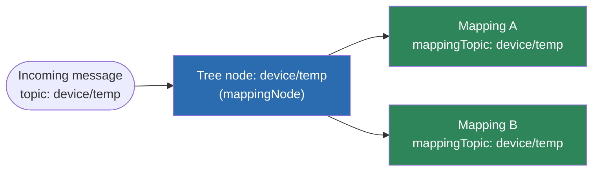
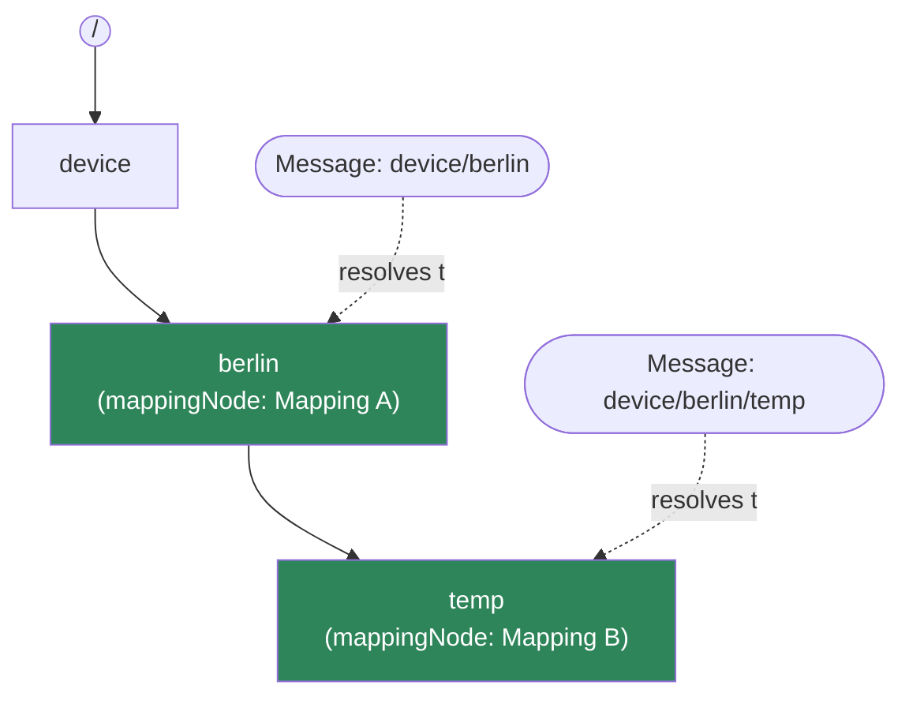
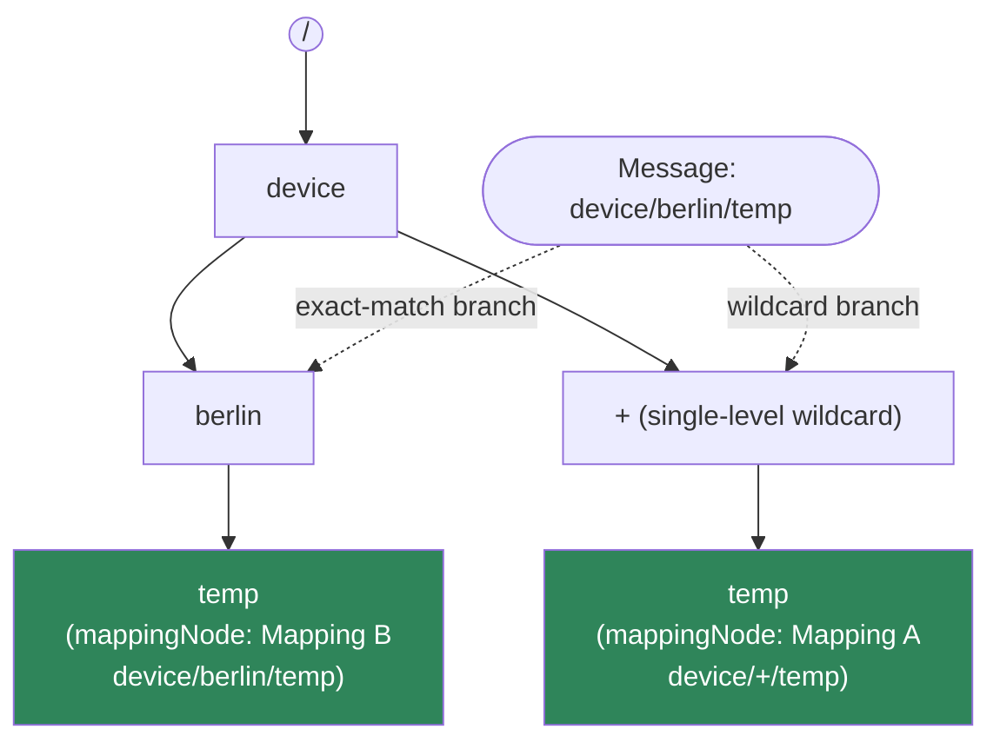

# Mapping Validation

> This consolidates, in the repository's standard `docs/feature/` reference style, what
> was previously drafted at
> [`attic/fix/mapping-validation/README.md`](../../attic/fix/mapping-validation/README.md).
> That file is left in place as a historical artifact; this page is the maintained version.

Every `Mapping` is checked against a set of business rules when it is created, updated,
or published. This documents each check — where it runs, the error code it produces, and
worked examples that pass/fail it.

## Where validation runs

| Layer | Class / function | When | Notes |
|---|---|---|---|
| Backend (authoritative) | [`MappingValidator`](../../dynamic-mapper-service/src/main/java/dynamic/mapper/service/MappingValidator.java) | `POST /mapping`, `PUT /mapping/{id}` (via `MappingService.createMapping`/`updateMapping`), and `publishDraft` (via `MappingVersionService`) | Returns a `List<ValidationError>`; a non-empty list is thrown as `MappingValidationException` → HTTP **422 Unprocessable Entity**. `PUT /mapping/{id}/draft` (saving a draft) skips this — drafts may be incomplete. |
| Backend (structural) | Bean Validation (`@NotNull`) on [`Mapping.java`](../../dynamic-mapper-service/src/main/java/dynamic/mapper/model/Mapping.java) | Same create/update endpoints, via `@Valid` | Only checks required fields are non-null (`id`, `identifier`, `name`, `targetAPI`, `direction`, `sourceTemplate`, `targetTemplate`, `transformationType`, `substitutions`, `active`, `debug`, `useExternalId`, `maxFailureCount`, `qos`, `lastUpdate`). Failures → HTTP 400. No format/business rules here. |
| Frontend (live UX) | `checkTopicsInboundAreValid` / `checkTopicsOutboundAreValid` in [`dynamic-mapper-ui/src/mapping/shared/util.ts`](../../dynamic-mapper-ui/src/mapping/shared/util.ts) | Reactive form group validators on the mapping stepper's topic step | Mirrors the backend's topic/wildcard/consistency rules only (not substitutions, JSON templates, extensions, or the uniqueness checks) so the user gets inline feedback before submitting. The backend re-checks everything regardless — the frontend check is UX only, not a security boundary. |

If you bypass the UI (e.g. call the REST API directly), only the two backend layers apply.

`MappingValidator.validate()` collects **all** applicable errors in one pass — it does not
stop at the first failure — so an API response can list several violations at once.

---

## Rules that apply to both directions

### 1. Source/target templates must be valid JSON

- `sourceTemplate` must always parse as valid JSON.
- `targetTemplate` must parse as valid JSON **unless** the mapping is
  `TransformationType.EXTENSION_JAVA`, or `MappingType` is `PROTOBUF_INTERNAL`,
  `ANY_PAYLOAD`, or `SPARKPLUGB` (these produce/consume non-JSON or externally-defined
  shapes, so the check is skipped).

| Error code | Example (fails) | Example (passes) |
|---|---|---|
| `Source_Template_Must_Be_Valid_JSON` | `sourceTemplate: "{temperature: 25.5"` (missing closing brace, unquoted key) | `sourceTemplate: "{\"temperature\": 25.5}"` |
| `Target_Template_Must_Be_Valid_JSON` | `targetTemplate: "not json at all"` | `targetTemplate: "{\"c8y_Temperature\": {}}"` |

### 2. Array-rooted templates require `SMART_FUNCTION`

If either `sourceTemplate` or `targetTemplate` is a JSON **array** at the root, the
mapping's `transformationType` must be `SMART_FUNCTION` (JSONata/DEFAULT transformations
can't iterate an array root).

| Error code | Fails | Passes |
|---|---|---|
| `Wrong_Transformation_Type_Array_In_Source_Template_Or_Target_Template_Requires_Transformation_Type_Smart_Function` | `sourceTemplate: "[{\"t\":1},{\"t\":2}]"` with `transformationType: JSONATA` | Same template with `transformationType: SMART_FUNCTION` |

### 3. `EXTENSION_JAVA` mappings must reference an extension

If `transformationType` is `EXTENSION_JAVA`, the `extension` field must be set (the
loaded Java processor extension + event to invoke). See
[`transformation-java-extensions.md`](transformation-java-extensions.md) for how this
field is resolved at runtime.

| Error code | Fails | Passes |
|---|---|---|
| `Extension_Must_Be_Defined_For_Extension_Java_Mapping` | `transformationType: EXTENSION_JAVA`, `extension: null` | `transformationType: EXTENSION_JAVA`, `extension: {extensionName: "my-extension", eventName: "onMeasurement"}` |

### 4. `ANY_PAYLOAD` / `SPARKPLUGB` require `SMART_FUNCTION`

- `MappingType.ANY_PAYLOAD` requires `SMART_FUNCTION` — except when `transformationType`
  is `EXTENSION_JAVA` (a Java extension is also allowed to handle an unparsed/raw payload).
- `MappingType.SPARKPLUGB` requires `SMART_FUNCTION` unconditionally.

| Error code | Fails | Passes |
|---|---|---|
| `Unparsed_MappingType_Requires_Smart_Function_Transformation_Type` | `mappingType: ANY_PAYLOAD`, `transformationType: JSONATA` | `mappingType: ANY_PAYLOAD`, `transformationType: SMART_FUNCTION` (or `EXTENSION_JAVA`) |
| `Unparsed_MappingType_Requires_Smart_Function_Transformation_Type` | `mappingType: SPARKPLUGB`, `transformationType: JSONATA` | `mappingType: SPARKPLUGB`, `transformationType: SMART_FUNCTION` |

### 5. One valid device-identifier substitution (direction-dependent cardinality)

A substitution "defines the device identifier" if its path (for INBOUND: `pathTarget`,
for OUTBOUND: `pathSource`) references `_IDENTITY_.externalId` or `_IDENTITY_.c8ySourceId`.

This check is **skipped entirely** when `mappingType` is `PROTOBUF_INTERNAL`,
`ANY_PAYLOAD`, or `SPARKPLUGB`, or when `transformationType` is `EXTENSION_JAVA` or
`SMART_FUNCTION` — those either resolve identity themselves in code, or have no
substitution list to check.

- **INBOUND**: exactly **one** substitution must define the identifier (not zero, not
  more than one — there's only one target device per inbound message).
- **OUTBOUND**: **at least one** substitution must define the identifier (several are
  allowed, e.g. one per publish-topic level built from the identity).

| Error code | Direction | Fails | Passes |
|---|---|---|---|
| `One_Substitution_Defining_Device_Identifier_Must_Be_Used` | INBOUND | No substitution targets `_IDENTITY_.externalId`/`c8ySourceId` | Exactly one substitution has `pathTarget: "_IDENTITY_.externalId"` |
| `Only_One_Substitution_Defining_Device_Identifier_Can_Be_Used` | INBOUND | Two substitutions both target `_IDENTITY_.externalId` | Only one such substitution |
| `One_Substitution_Defining_Device_Identifier_Must_Be_Used` | OUTBOUND | No substitution sources `_IDENTITY_.externalId`/`c8ySourceId` | At least one substitution has `pathSource: "_IDENTITY_.externalId"` |

---

## INBOUND-only rules

### 6. `mappingTopic` wildcard syntax

MQTT-style wildcards in `mappingTopic`:

- `#` (multi-level) may appear **at most once**, and only as the **final** segment.
- (`+` single-level wildcards are unrestricted in count/position.)

| Error code | Fails | Passes |
|---|---|---|
| `Only_One_Multi_Level_Wildcard` | `mappingTopic: "device/#/data/#"` | `mappingTopic: "device/+/data/#"` |
| `Multi_Level_Wildcard_Only_At_End` | `mappingTopic: "device/#/data"` | `mappingTopic: "device/data/#"` |

### 7. `mappingTopic` vs. `mappingTopicSample` consistency

`mappingTopicSample` is a concrete example topic used for testing/preview; it must have
the same *structure* as `mappingTopic`:

- **Level count**: without a trailing `#`, the sample must have exactly the same number
  of `/`-separated levels as the topic. With a trailing `#`, the sample only needs **at
  least** as many levels as the topic's fixed (non-`#`) prefix — `#` matches zero or more
  trailing levels (real MQTT semantics).
- **Structure**: every non-wildcard segment of the topic must equal the corresponding
  segment of the sample; segments that are `+` or `#` in the topic may be any value in
  the sample.

| Error code | Fails | Passes |
|---|---|---|
| `MappingTopic_And_MappingTopicSample_Do_Not_Have_Same_Number_Of_Levels_In_Topic_Name` | `mappingTopic: "device/east"`, `mappingTopicSample: "device/us/east"` (2 vs 3 levels, no `#`) | `mappingTopic: "device/+/east"`, `mappingTopicSample: "device/us/east"` |
| `MappingTopic_And_MappingTopicSample_Do_Not_Have_Same_Number_Of_Levels_In_Topic_Name` | `mappingTopic: "fridge/#"`, `mappingTopicSample: "fri"` (sample shorter than the fixed prefix `fridge`) | `mappingTopic: "fridge/#"`, `mappingTopicSample: "fridge/east/sensor-99"` (any number of extra levels is fine) |
| `MappingTopic_And_MappingTopicSample_Do_Not_Have_Same_Structure_In_Topic_Name` | `mappingTopic: "device/berlin/temp"`, `mappingTopicSample: "device/hamburg/temp"` (`berlin` ≠ `hamburg`, and neither is a wildcard) | `mappingTopic: "device/+/temp"`, `mappingTopicSample: "device/hamburg/temp"` |

> **No `mappingTopic` uniqueness/overlap check exists.** Two INBOUND mappings may have
> overlapping or even identical `mappingTopic`s. The runtime resolver
> (`MappingTreeNode.resolveTopicPath`) matches per MQTT topic-level and wildcard
> semantics and returns `List<Mapping>` by design — every matching mapping runs. This is
> supported fan-out (e.g. one mapping writing a measurement, another raising an alarm
> from the same payload), not an error condition, so no such rule is implemented.

#### Illustrated: same topic vs. string-overlap vs. real (wildcard) overlap

`MappingTreeNode` builds a tree keyed by topic level (`/`-separated segment); a node is
a `mappingNode` only when some mapping's `mappingTopic` ends exactly there.
`resolveTopicPath` walks the tree level-by-level for an incoming message topic and
follows **all three** branches that can match a level: the literal segment, a `+` child,
and a `#` child (which short-circuits and matches immediately, regardless of how many
levels remain). Every `mappingNode` reached this way is returned — as a `List<Mapping>`,
not a single result — and the dispatcher runs **all** of them.



Two mappings with the exact same `mappingTopic` sit as sibling `mappingNode`s under the
same tree node — every message on that topic resolves and runs both.



`"device/berlin"` and `"device/berlin/temp"` are a string prefix of each other but sit at
*different depths* in the tree — neither message ever reaches both mappings, so there is
nothing ambiguous to reject.



`"device/+/temp"` and `"device/berlin/temp"` both terminate at depth 3 via different
branches (the literal `berlin` branch and the sibling `+` branch, which is always walked
in addition to the literal match). A message on `"device/berlin/temp"` reaches **both**
mappings — genuine, wildcard-driven fan-out, supported by design.

---

## OUTBOUND-only rules

### 8. `publishTopic` vs. `publishTopicSample` consistency

Same idea as rule 7, but for outbound publishing and **without** the `#`-matches-any-suffix
relaxation — `publishTopic`/`publishTopicSample` must always have exactly the same
number of levels, and every non-wildcard segment must match.

| Error code | Fails | Passes |
|---|---|---|
| `PublishTopic_And_PublishTopicSample_Do_Not_Have_Same_Number_Of_Levels_In_Topic_Name` | `publishTopic: "out/+/temp"`, `publishTopicSample: "out/berlin/west/temp"` (3 vs 4 levels) | `publishTopic: "out/+/temp"`, `publishTopicSample: "out/berlin/temp"` |
| `PublishTopic_And_PublishTopicSample_Do_Not_Have_Same_Structure_In_Topic_Name` | `publishTopic: "out/berlin/temp"`, `publishTopicSample: "out/hamburg/temp"` | `publishTopic: "out/+/temp"`, `publishTopicSample: "out/hamburg/temp"` |

### 9. `filterMapping` must be unique across OUTBOUND mappings

Two outbound mappings must not have the **exact same** `filterMapping` expression — a
duplicate filter means both mappings would fire for the same Cumulocity notification
with no way to tell them apart. (Only checked when `filterMapping` is set; mappings
using the default `"true"` filter but different `targetAPI`/topics are not compared
here — only the filter string itself.)

| Error code | Fails | Passes |
|---|---|---|
| `FilterOutbound_Must_Be_Unique` | Existing mapping has `filterMapping: "$.temp > 30"`, new mapping also has `filterMapping: "$.temp > 30"` | New mapping has `filterMapping: "$.temp > 50"` (different expression) |

---

## Full example: a valid INBOUND mapping

```json
{
  "name": "Temperature Sensor Data",
  "direction": "INBOUND",
  "targetAPI": "MEASUREMENT",
  "mappingType": "JSON",
  "transformationType": "JSONATA",
  "mappingTopic": "sensors/+/data",
  "mappingTopicSample": "sensors/temp001/data",
  "sourceTemplate": "{\"temperature\": 25.5, \"deviceId\": \"sensor001\"}",
  "targetTemplate": "{\"c8y_Temperature\": {\"T\": {\"value\": 0, \"unit\": \"C\"}}, \"source\": {\"id\": \"sensor001\"}, \"type\": \"c8y_TemperatureMeasurement\"}",
  "substitutions": [
    { "pathSource": "$.deviceId", "pathTarget": "_IDENTITY_.externalId" },
    { "pathSource": "$.temperature", "pathTarget": "c8y_Temperature.T.value" }
  ]
}
```

Passes every rule: valid JSON templates (rule 1), object-rooted so rule 2 doesn't apply,
not `EXTENSION_JAVA`/`ANY_PAYLOAD`/`SPARKPLUGB` so rules 3–4 don't apply, exactly one
identifier substitution (rule 5), no `#` wildcard issues (rule 6), and topic/sample have
matching structure — `+` in the topic aligns with `temp001` in the sample (rule 7).

## Full example: a valid OUTBOUND mapping

```json
{
  "name": "Alarm Notification",
  "direction": "OUTBOUND",
  "targetAPI": "ALARM",
  "mappingType": "JSON",
  "transformationType": "JSONATA",
  "publishTopic": "alarms/+/critical",
  "publishTopicSample": "alarms/device001/critical",
  "filterMapping": "$.severity = \"CRITICAL\"",
  "sourceTemplate": "{\"severity\": \"CRITICAL\", \"text\": \"Overheating\", \"source\": {\"id\": \"device001\"}}",
  "targetTemplate": "{\"deviceId\": \"device001\", \"message\": \"Overheating\"}",
  "substitutions": [
    { "pathSource": "_IDENTITY_.externalId", "pathTarget": "$.deviceId" },
    { "pathSource": "$.text", "pathTarget": "$.message" }
  ]
}
```

Passes every rule the same way, plus rule 8 (topic/sample level counts and static
segments match) and rule 9 (assuming no other outbound mapping already uses the exact
filter `$.severity = "CRITICAL"`).

## Full example: a mapping that fails multiple rules at once

```json
{
  "name": "Broken Mapping",
  "direction": "INBOUND",
  "targetAPI": "MEASUREMENT",
  "mappingType": "JSON",
  "transformationType": "JSONATA",
  "mappingTopic": "sensors/#/extra/#",
  "mappingTopicSample": "sensors/a",
  "sourceTemplate": "{\"temperature\": 25.5",
  "targetTemplate": "{\"c8y_Temperature\": {}}",
  "substitutions": []
}
```

This single mapping fails **five** independent checks simultaneously:

- `Only_One_Multi_Level_Wildcard` — two `#` in `mappingTopic`.
- `Multi_Level_Wildcard_Only_At_End` — the first `#` isn't the last segment.
- `MappingTopic_And_MappingTopicSample_Do_Not_Have_Same_Number_Of_Levels_In_Topic_Name` — the fixed (non-`#`) prefix of the topic has more levels than the sample provides.
- `Source_Template_Must_Be_Valid_JSON` — `sourceTemplate` has an unclosed brace.
- `One_Substitution_Defining_Device_Identifier_Must_Be_Used` — no substitutions at all.
