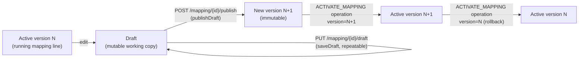

# Mapping Versioning

Mapping versioning lets a mapping be edited without disturbing what is currently
running. Edits accumulate in a single mutable **draft**; a user explicitly **publishes**
the draft as a new immutable **version**; and a version is **activated** to become the
mapping's running configuration. Versions are retained (bounded by a configurable
limit) so a mapping can be **rolled back** to any prior published version.

This page describes the feature as it is implemented today.

## Core concepts

| Term | Meaning |
|---|---|
| Mapping line | The single `d11r_mapping` managed object identified by its Cumulocity managed-object `id`. This is the "runnable" record the processing pipeline reads. |
| `identifier` | A separate, stable functional identifier for the mapping line (e.g. `l19zjk`), used to correlate a line with its version records. See [`Mapping.java:117`](../../dynamic-mapper-service/src/main/java/dynamic/mapper/model/Mapping.java#L117). |
| Draft | The single mutable working copy of a mapping line's configuration. At most one draft exists per line at a time. Stored as a `MappingVersion` with `isDraft = true` and `version = null`. |
| Version | An immutable snapshot of a mapping line's full configuration, published under a semver label (`MAJOR.MINOR.PATCH`), unique within the line. Stored as a `MappingVersion` with `isDraft = false`. |
| Active version | The version whose `version` label matches the running mapping line's own `version` field. Exactly one version is active per line at a time (a mapping line is a single managed object). |
| `draftDirty` | Boolean flag on the mapping line (`Mapping.java:279`) indicating the line has unpublished draft changes differing from the active version. Used by the UI grid to flag lines with pending edits. |

Both the draft and every published version are stored as the **same** record type,
[`MappingVersion`](../../dynamic-mapper-service/src/main/java/dynamic/mapper/model/MappingVersion.java) —
a managed object of type `d11r_mapping_version`, distinguished by the `isDraft` flag.
This uniform storage (documented in the requirements doc as decision D-1) is implemented
as designed.

## Storage

`MappingVersion` records are looked up by **type + `identifier` filter**, not via a
parent/child inventory relationship:

```java
// MappingVersionService.loadVersions()
InventoryFilter filter = new InventoryFilter().byType(MappingVersionRepresentation.MAPPING_VERSION_TYPE);
ManagedObjectCollection moc = inventoryApi.getManagedObjectsByFilter(filter, false);
return versionRepository.findAll(tenant, moc).stream()
        .filter(v -> identifier.equals(v.getIdentifier()))
        .collect(Collectors.toList());
```

See [`MappingVersionService.java:483-489`](../../dynamic-mapper-service/src/main/java/dynamic/mapper/service/MappingVersionService.java#L483-L489).
The class Javadoc explains why: an earlier design stored versions as **child additions**
of the runnable mapping managed object, but that read path proved unreliable against the
platform, so the plain type+filter query became authoritative. A child-addition link is
still created on publish as a best-effort convenience (so the parent → versions
relationship is navigable in the inventory UI), but nothing in the read path depends on
it — see [`persistNewVersion`](../../dynamic-mapper-service/src/main/java/dynamic/mapper/service/MappingVersionService.java#L503-L527), which logs a warning and continues if the
child-addition call fails.

## Lifecycle



### 1. Draft editing

`MappingService.saveDraftMapping(tenant, id, edits)` writes into the line's single draft,
creating it if absent, without touching the runnable record's `sourceTemplate`,
`targetTemplate`, `substitutions`, etc. It does set `draftDirty = true` on the runnable
record so the grid can flag the line. See
[`MappingService.java:654-679`](../../dynamic-mapper-service/src/main/java/dynamic/mapper/service/MappingService.java#L654-L679).

Optimistic concurrency: if a draft already exists and the incoming edit's `lastUpdate` is
non-zero and does not match the stored draft's `lastUpdate`, the save is rejected with
`IllegalStateException` ("modified concurrently; reload before saving") — see
[`MappingVersionService.saveDraft`](../../dynamic-mapper-service/src/main/java/dynamic/mapper/service/MappingVersionService.java#L208-L247).

### 2. Publish

`POST /mapping/{id}/publish?version=<semver>&note=<text>` (see
[`MappingController.java:526-551`](../../dynamic-mapper-service/src/main/java/dynamic/mapper/controller/MappingController.java#L526-L551))
freezes the current draft into a new immutable `MappingVersion` and clears the draft.
Publishing does **not** activate the new version — activation is a separate step.

Before publishing, `MappingVersionService.publish()`:
1. Validates the identifier and semver format are present/well-formed.
2. Runs the snapshot through `MappingValidator.validate()` (the full rule set — see
   [mapping-validation.md](mapping-validation.md)) since a draft may be incomplete but a
   published version must be sound. A validation failure raises
   `MappingValidationException` → HTTP 422.
3. Rejects a version label that already exists for the line (`IllegalArgumentException` →
   HTTP 409, "Version already exists").
4. Persists the version and runs retention pruning.

If the line has never been published before, `ensureBackfilled()` first captures the
currently-running configuration as a version (see Backfill, below) so history is never
empty once versioning is touched.

### 3. Activate / roll back

There is no dedicated "rollback" endpoint. Both activation and rollback go through the
same **`ACTIVATE_MAPPING` operation** (`OperationController.handleActivateMapping`,
[`OperationController.java:398-425`](../../dynamic-mapper-service/src/main/java/dynamic/mapper/controller/OperationController.java#L398-L425)),
with parameters `id`, `active`, and optionally `version` (the operation also accepts the
older parameter name `versionNumber` as a backward-compatible alias):

```java
Boolean activation = Boolean.parseBoolean(parameters.get("active"));
String versionParam = parameters.getOrDefault("version", parameters.get("versionNumber"));
Mapping updatedMapping = mappingService.setActivationMapping(tenant, id, activation, version);
```

`MappingService.setActivationMapping()` (
[`MappingService.java:438-525`](../../dynamic-mapper-service/src/main/java/dynamic/mapper/service/MappingService.java#L438-L525)):
- Runs under a per-mapping-line `ReentrantLock` so concurrent activations cannot
  interleave.
- If `active=true` and `version` names a version other than the one currently running,
  copies that version's stored snapshot into the runnable mapping (`applyVersion()`,
  [`MappingService.java:533-548`](../../dynamic-mapper-service/src/main/java/dynamic/mapper/service/MappingService.java#L533-L548)) — this is the mechanism for **both** roll-forward
  and rollback; there is no directional distinction in code.
- Validation is skipped when switching to an already-published snapshot (it was already
  validated at publish time) and when deactivating; it still runs for a same-version
  activate.
- Emits a `MAPPING_ACTIVATION_EVENT_TYPE` logging event recording the mapping, the
  active flag, and the resulting version.
- If the resulting mapping is `active` and `SMART_FUNCTION`, submits a background task to
  pre-compile the mapping's JavaScript on the GraalVM engine so the first real message
  does not pay the cold-start JIT penalty.

Because the mapping line is one managed object, activating a version implicitly
deactivates whatever was running before — there is no separate "atomic swap" step to
reason about beyond the lock.

### 4. Listing, retrieval, notes, deletion

| Operation | Method | Notes |
|---|---|---|
| List versions | `MappingVersionService.listVersions` | Excludes the draft; sorted ascending by semver (`SemVer.STRING_COMPARATOR` in `MappingVersionRepository.findAll`). |
| Get one version | `MappingVersionService.getVersion` | Returns `null` if not found (controller maps to 404). |
| Suggest next versions | `MappingVersionService.suggestNextVersions` | Returns `{patch, minor, major}` bumps off the highest published version; `1.0.0` for all three if none exist yet. |
| Edit note | `MappingVersionService.updateNote` | The note is the **only** mutable field of a published version — everything else is frozen at publish time. |
| Delete a version | `MappingVersionService.deleteVersion` | Rejects deleting the active version (`IllegalStateException` → HTTP 406). |
| Delete a line | `MappingVersionService.deleteAllVersions` | Removes every version record (published + draft) so nothing leaks when the mapping line itself is deleted. |

### 5. Retention

`MappingVersionService.prune()` ([`MappingVersionService.java:385-407`](../../dynamic-mapper-service/src/main/java/dynamic/mapper/service/MappingVersionService.java#L385-L407))
keeps the newest *N* published versions (sorted by `createdAt`) and deletes older ones,
**except** the active version, which is never pruned even if it falls outside the
window. *N* comes from `ServiceConfiguration.getMappingVersionRetention()`, tenant-scoped,
defaulting to `MappingVersionService.DEFAULT_RETENTION = 10` when unset or invalid.
Pruning runs automatically after every publish, and can be re-run standalone via
`pruneVersions()`.

### 6. Backfill (legacy mappings)

`ensureBackfilled(tenant, mapping)` is called defensively before publish, activate, and
list-versions, so mappings created before this feature existed (or imported without
version history) always end up with at least one published version:

- No-op if any published version already exists.
- Otherwise creates a version record from the mapping's *current* running configuration.
  The version label is taken from the mapping's own `version` field if it is already
  valid semver; a bare legacy integer (e.g. `"3"`) is migrated to `"3.0.0"`; otherwise it
  defaults to `1.0.0` (`SemVer.INITIAL`).

See [`MappingVersionService.java:421-474`](../../dynamic-mapper-service/src/main/java/dynamic/mapper/service/MappingVersionService.java#L421-L474).

## REST endpoints

All under `/mapping`, defined in
[`MappingController.java`](../../dynamic-mapper-service/src/main/java/dynamic/mapper/controller/MappingController.java).
Roles: every endpoint below requires `ROLE_DYNAMIC_MAPPER_ADMIN` or
`ROLE_DYNAMIC_MAPPER_CREATE`.

| Endpoint | Purpose |
|---|---|
| `GET /mapping/{id}/draft` | Get the current draft, or 204 if none exists. |
| `PUT /mapping/{id}/draft` | Save edits into the draft (creates it if absent). |
| `DELETE /mapping/{id}/draft` | Discard the draft. |
| `POST /mapping/{id}/publish?version=<semver>&note=<text>` | Publish the draft as a new immutable version; clears the draft. |
| `GET /mapping/{id}/version` | List all published versions of the line (draft excluded). |
| `GET /mapping/{id}/version/suggest` | Suggest next patch/minor/major semver labels. |
| `GET /mapping/{id}/version/{version}` | Get one published version's full configuration. |
| `PATCH /mapping/{id}/version/{version}?note=<text>` | Edit a version's change note (the only mutable field). |
| `DELETE /mapping/{id}/version/{version}` | Delete an inactive published version (406 if it is the active one). |
| `GET /mapping/version-counts` | Published-version counts for every mapping in one inventory scan, avoiding N+1 queries — see `MappingVersionService.countVersionsForIdentifiers`. |

Activation/rollback is **not** a `/mapping/*` REST endpoint — it goes through the generic
`Operation` mechanism (`ACTIVATE_MAPPING`, handled in `OperationController`, see
[Activate / roll back](#3-activate--roll-back) above).

## Where the implementation diverges from the plan

The [requirements](REQUIREMENTS-VERSION-MAPPING.md) and
[implementation plan](IMPLEMENTATION-PLAN-VERSION-MAPPING.md) documents describe the
feature at the design stage. Comparing them against the shipped code:

- **Path parameter is the mapping's managed-object `id`, not the functional
  `identifier`.** The plan's proposed API (§9) uses `/mapping/{identifier}/version` and
  `/mapping/{identifier}/version/{versionNumber}`. The actual controller resolves
  everything by the mapping line's Cumulocity `id` (`GET /mapping/{id}/version`, etc.)
  and looks up `identifier` internally via `MappingService.getMapping()` before
  delegating to `MappingVersionService`. The functional `identifier` is an internal
  correlation key for version records, not a routable path segment.
- **Publish takes `version` as a query parameter, not `label` in a request body.** The
  plan's §9 sketch (`POST /mapping/{identifier}/versions`, optional `label`) differs from
  the implemented `POST /mapping/{id}/publish?version=<semver>&note=<text>`.
- **`versionNumber` survives only as a backward-compatible alias** in the
  `ACTIVATE_MAPPING` operation parameters (`OperationController.java:401-402`), not as the
  primary parameter name used elsewhere; the primary name throughout the version REST API
  is `version`.
- **No separate "rollback" endpoint or method exists.** FR-11/FR-12 describe rollback as
  its own capability; in the implementation it is the exact same code path as
  roll-forward activation (`setActivationMapping` with a `version` argument) — the
  requirements' distinction between "activate" and "roll back" collapses to one
  mechanism in code.
- **Child-addition storage was tried and abandoned in favor of a type+identifier
  filter query**, as described under [Storage](#storage) above — this refinement post-dates
  the original plan's storage sketch (§8) and is documented directly in
  `MappingVersionService`'s class Javadoc rather than in the plan.

Everything else — uniform version records (D-1), explicit publish (D-2), editable notes
(D-3), configurable retention (D-4), no-cascade-but-no-delete-while-active semantics
(D-5/FR-17/FR-18), a single shared draft per line (D-6/D-7), and editing an active
mapping routing to the draft rather than failing (D-8) — matches the plan as implemented.
