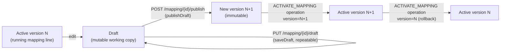

# Mapping Versioning

Mapping versioning lets a mapping be edited without disturbing what is currently
running. Edits accumulate in a single mutable **draft**; a user explicitly **publishes**
the draft as a new immutable **version**; and a version is **activated** to become the
mapping's running configuration. Versions are retained (bounded by a configurable
limit) so a mapping can be **rolled back** to any prior published version.

This page describes the feature as it is implemented today.

---

## Requirements

**What it is for.** Changing a running mapping without losing the version that works, and getting
back to it if the change is wrong.

- **A mapping has one runnable state and a history of published versions.** Exactly one version
  is active at a time.
- **Edits go to a draft** and do not affect the running mapping until published.
- **Publishing creates an immutable snapshot** with a version number and an optional note.
- **Any published version can be made active again** — rollback is activating an older snapshot,
  not undoing an edit.
- **Activating a version validates it**; an invalid snapshot must not be able to replace a
  working one, and a failed activation leaves the running version untouched.
- **History is bounded** by a configurable retention, so a frequently edited mapping does not grow
  without limit.
- **Mappings created before versioning existed must keep working**, and gain a first version
  without the user doing anything.

---

## Implementation

### Core concepts

| Term | Meaning |
|---|---|
| Mapping line | The single `d11r_mapping` managed object identified by its Cumulocity managed-object `id`. This is the "runnable" record the processing pipeline reads. |
| `identifier` | A separate, stable functional identifier for the mapping line (e.g. `l19zjk`), used to correlate a line with its version records. See [`Mapping.java:129`](../../dynamic-mapper-service/src/main/java/dynamic/mapper/model/Mapping.java#L129). |
| Draft | The single mutable working copy of a mapping line's configuration. At most one draft exists per line at a time. Stored as a `MappingVersion` with `isDraft = true` and `version = null`. |
| Version | An immutable snapshot of a mapping line's full configuration, published under a semver label (`MAJOR.MINOR.PATCH`), unique within the line. Stored as a `MappingVersion` with `isDraft = false`. |
| Active version | The version whose `version` label matches the running mapping line's own `version` field ([`Mapping.java:287`](../../dynamic-mapper-service/src/main/java/dynamic/mapper/model/Mapping.java#L287), defaulting to `"1.0.0"`). Exactly one version is active per line at a time (a mapping line is a single managed object). |
| `draftDirty` | Boolean flag on the mapping line ([`Mapping.java:292`](../../dynamic-mapper-service/src/main/java/dynamic/mapper/model/Mapping.java#L292)) set whenever a draft is saved and cleared on publish or discard. Used by the UI grid to flag lines with unpublished edits. It is *not* recomputed by diffing the draft against the active version. |

Both the draft and every published version are stored as the **same** record type,
[`MappingVersion`](../../dynamic-mapper-service/src/main/java/dynamic/mapper/model/version/MappingVersion.java) —
a managed object of type `d11r_mapping_version`, distinguished by the `isDraft` flag.
This uniform storage (decision D-1 in the requirements doc) is implemented as designed.

`MappingVersion` fields: `id` (the version record's own managed-object id), `identifier`
(the owning line), `version` (semver, `null` for the draft), `snapshot` (the full frozen
`Mapping`), `isDraft`, `createdAt` (epoch millis), `createdBy` (username, or `"system"`
when no user context is available), and `note`.

### Storage

`MappingVersion` records are looked up by **type + `identifier` filter**, not via a
parent/child inventory relationship:

```java
// MappingVersionService.loadVersions()
InventoryFilter filter = new InventoryFilter().byType(MappingVersionRepresentation.MAPPING_VERSION_TYPE);
ManagedObjectCollection moc = inventoryApi.getManagedObjectsByFilter(filter, false);
return versionRepository.findAll(tenant, moc).stream()
        .filter(v -> identifier.equals(v.getIdentifier()))
        .collect(Collectors.toList());
```

See [`MappingVersionService.java:483-489`](../../dynamic-mapper-service/src/main/java/dynamic/mapper/mapping/MappingVersionService.java#L483-L489).
The class Javadoc explains why: an earlier design stored versions as **child additions**
of the runnable mapping managed object, but that read path proved unreliable against the
platform, so the plain type+filter query became authoritative. A child-addition link is
still created on publish as a best-effort convenience (so the parent → versions
relationship is navigable in the inventory UI), but nothing in the read path depends on
it — see [`persistNewVersion`](../../dynamic-mapper-service/src/main/java/dynamic/mapper/mapping/MappingVersionService.java#L503-L527), which logs a warning and continues if the
child-addition call fails.

Note the cost model this implies: `loadVersions` scans **every** `d11r_mapping_version`
managed object in the tenant and filters client-side. That is why
`countVersionsForIdentifiers` exists as a batched variant for the grid (see
[REST endpoints](#rest-endpoints)) rather than the grid issuing one query per mapping.

### Lifecycle



All four mutating steps — draft save, publish, discard, activate — take the **same
per-line `ReentrantLock`**, keyed `tenant:mappingId`
([`activationLockFor`](../../dynamic-mapper-service/src/main/java/dynamic/mapper/mapping/MappingService.java#L551)),
so a publish cannot interleave with an activation of the same line.

#### 1. Draft editing

`MappingService.saveDraftMapping(tenant, id, edits)` writes into the line's single draft,
creating it if absent, without touching the runnable record's `sourceTemplate`,
`targetTemplate`, `substitutions`, etc. It does set `draftDirty = true` on the runnable
record so the grid can flag the line. See
[`MappingService.java:651-684`](../../dynamic-mapper-service/src/main/java/dynamic/mapper/mapping/MappingService.java#L651-L684).

Optimistic concurrency: if a draft already exists and the incoming edit's `lastUpdate` is
non-zero and does not match the stored draft's `lastUpdate`, the save is rejected with
`IllegalStateException` → HTTP 409 ("modified concurrently; reload before saving") — see
[`MappingVersionService.saveDraft`](../../dynamic-mapper-service/src/main/java/dynamic/mapper/mapping/MappingVersionService.java#L208-L247).
On success the server stamps a fresh `lastUpdate` that the next edit must echo back, so
the client must save the response, not its own pre-save copy.

#### 2. Publish

`POST /mapping/{id}/publish?version=<semver>&note=<text>` (see
[`MappingController.java:525-556`](../../dynamic-mapper-service/src/main/java/dynamic/mapper/controller/MappingController.java#L525-L556))
freezes the current draft into a new immutable `MappingVersion` and clears the draft and
`draftDirty`. Publishing does **not** activate the new version — activation is a separate
step.

[`MappingService.publishDraft`](../../dynamic-mapper-service/src/main/java/dynamic/mapper/mapping/MappingService.java#L686)
first calls `ensureBackfilled()` so the currently-running configuration is preserved in
history before the new version lands (see [Backfill](#6-backfill-legacy-mappings)), then
fails with 409 if there is no draft to publish. If `note` is omitted it falls back to the
draft snapshot's own `versionNote`.

[`MappingVersionService.publish()`](../../dynamic-mapper-service/src/main/java/dynamic/mapper/mapping/MappingVersionService.java#L99-L155)
then:
1. Validates the identifier is present and the version string is well-formed semver
   (`IllegalArgumentException` → HTTP 404 unless the message says "already exists").
2. Runs the snapshot through `MappingValidator.validate()` (the full rule set — see
   [mapping-validation.md](mapping-validation.md)) since a draft may be incomplete but a
   published version must be sound. A validation failure raises
   `MappingValidationException` → HTTP 422.
3. Rejects a version label that already exists for the line (`IllegalArgumentException`
   whose message contains "already exists" → HTTP 409).
4. Persists the version and runs retention pruning, reusing the version list it already
   loaded rather than re-querying.

#### 3. Activate / roll back

There is no dedicated "rollback" endpoint. Both activation and rollback go through the
same **`ACTIVATE_MAPPING` operation** (`OperationController.handleActivateMapping`,
[`OperationController.java:398-425`](../../dynamic-mapper-service/src/main/java/dynamic/mapper/controller/OperationController.java#L398-L425)),
which requires the mapping-create role, with parameters `id`, `active`, and optionally
`version` (the operation also accepts the older parameter name `versionNumber` as a
backward-compatible alias):

```java
Boolean activation = Boolean.parseBoolean(activeParam);
String versionParam = parameters.getOrDefault("version", parameters.get("versionNumber"));
Mapping updatedMapping = mappingService.setActivationMapping(tenant, id, activation, version);
```

`MappingService.setActivationMapping()` (
[`MappingService.java:435-528`](../../dynamic-mapper-service/src/main/java/dynamic/mapper/mapping/MappingService.java#L435-L528)):
- Runs under the per-mapping-line `ReentrantLock` so concurrent activations cannot
  interleave.
- Calls `ensureBackfilled()` first, so activating a legacy mapping does not silently lose
  the configuration it was running.
- If `active=true` and `version` names a version other than the one currently running,
  copies that version's stored snapshot into the runnable mapping (`applyVersion()`,
  [`MappingService.java:530-548`](../../dynamic-mapper-service/src/main/java/dynamic/mapper/mapping/MappingService.java#L530-L548)) — this is the mechanism for **both** roll-forward
  and rollback; there is no directional distinction in code. `applyVersion` deep-copies
  the snapshot and re-stamps the line's own `id`, `identifier` and `draftDirty` onto it,
  so a rollback never aliases the stored version record and never discards a pending
  draft.
- Validation is skipped when switching to an already-published snapshot (it was already
  validated at publish time) and when deactivating; it still runs for a same-version
  activate (`ignoreValidation = versionSwitched || !active`).
- Emits a `MAPPING_ACTIVATION_EVENT_TYPE` logging event recording the mapping, the
  active flag, and the resulting version — and a `MAPPING_ACTIVATION_ERROR_EVENT_TYPE`
  event if anything throws.
- If the resulting mapping is `active` and `SMART_FUNCTION` with non-blank code, submits a
  virtual-thread task to pre-compile the mapping's JavaScript on the GraalVM engine so the
  first real message does not pay the cold-start JIT penalty.

After `setActivationMapping` returns, `handleActivateMapping` reconciles broker
subscriptions on exactly the connectors this mapping is **deployed** to
(`updateSubscriptionForInbound` / `updateSubscriptionForOutbound`); connectors outside the
deployment map were never subscribed and reconcile independently when the deployment map
itself changes. Connectors whose subscription update fails are reported back in the
operation response.

Because the mapping line is one managed object, activating a version implicitly
deactivates whatever was running before — there is no separate "atomic swap" step to
reason about beyond the lock.

#### 4. Listing, retrieval, notes, deletion

| Operation | Method | Notes |
|---|---|---|
| List versions | `MappingVersionService.listVersions` | Excludes the draft; sorted ascending by semver (`SemVer.STRING_COMPARATOR` in `MappingVersionRepository.findAll`, which sorts `null` — i.e. the draft — last). |
| Get one version | `MappingVersionService.getVersion` | Returns `null` if not found (controller maps to 404). |
| Suggest next versions | `MappingVersionService.suggestNextVersions` | Returns `{patch, minor, major}` bumps off the highest published version; `1.0.0` for all three if none exist yet. |
| Edit note | `MappingVersionService.updateNote` | The note is the **only** mutable field of a published version — everything else is frozen at publish time. Writes both `MappingVersion.note` and the snapshot's `versionNote`. |
| Delete a version | `MappingVersionService.deleteVersion` | Rejects deleting the active version (`IllegalStateException` → HTTP 406); unknown version → 404. |
| Delete a line | `MappingVersionService.deleteAllVersions` | Removes every version record (published + draft) so nothing leaks when the mapping line itself is deleted. Wired from `MappingService.deleteMapping` (FR-18); deleting the line still requires deactivating it first (D-5). |

#### 5. Retention

`MappingVersionService.prune()` ([`MappingVersionService.java:385-407`](../../dynamic-mapper-service/src/main/java/dynamic/mapper/mapping/MappingVersionService.java#L385-L407))
keeps the newest *N* published versions (sorted by `createdAt`) and deletes older ones,
**except** the active version, which is never pruned even if it falls outside the
window. *N* comes from `ServiceConfiguration.getMappingVersionRetention()`, tenant-scoped,
defaulting to `MappingVersionService.DEFAULT_RETENTION = 10` when unset or `< 1`.
Pruning runs automatically after every publish, and can be re-run standalone via
`pruneVersions()`.

#### 6. Backfill (legacy mappings)

`ensureBackfilled(tenant, mapping)` guarantees a line always has at least one published
version. It is called from four places in `MappingService`:

- `createMapping` — so a brand-new mapping starts with a version record immediately, and
  its runnable `version` field is synced to it.
- `publishDraft` — preserve the running config before the new version lands.
- `setActivationMapping` — preserve the running config before a version switch.
- `listVersions` — so opening the versions drawer on a pre-versioning mapping shows a
  history rather than nothing.

Behavior:

- No-op if any published version already exists (a draft alone does not count). It then
  returns the record matching the line's active version, else the first published one.
- Otherwise creates a version record from the mapping's *current* running configuration.
  The version label is taken from the mapping's own `version` field if it is already
  valid semver; a bare legacy integer (e.g. `"3"`) is migrated to `"3.0.0"`; otherwise it
  defaults to `1.0.0` (`SemVer.INITIAL`).
- Returns `null` (with a warning log) if the mapping has no `identifier`.

`createMapping` additionally restores the `version` / `versionNote` carried by an
**imported** mapping before backfilling, so importing a mapping that was exported at
`2.3.0` recreates it at `2.3.0` instead of collapsing to `1.0.0`.

See [`MappingVersionService.java:421-474`](../../dynamic-mapper-service/src/main/java/dynamic/mapper/mapping/MappingVersionService.java#L421-L474).

### REST endpoints

All under `/mapping`, defined in
[`MappingController.java`](../../dynamic-mapper-service/src/main/java/dynamic/mapper/controller/MappingController.java).

| Endpoint | Purpose | Roles |
|---|---|---|
| `GET /mapping/{id}/draft` | Get the current draft, or 204 if none exists. | ADMIN or CREATE |
| `PUT /mapping/{id}/draft` | Save edits into the draft (creates it if absent). 409 on a concurrent modification. | ADMIN or CREATE |
| `DELETE /mapping/{id}/draft` | Discard the draft (204 even when there was none). | ADMIN or CREATE |
| `POST /mapping/{id}/publish?version=<semver>&note=<text>` | Publish the draft as a new immutable version; clears the draft. 201 on success; 409 no draft / duplicate version; 422 validation failure. | ADMIN or CREATE |
| `GET /mapping/{id}/version` | List all published versions of the line (draft excluded). | ADMIN or CREATE |
| `GET /mapping/{id}/version/suggest` | Suggest next patch/minor/major semver labels, as `{patch, minor, major}`. | ADMIN or CREATE |
| `GET /mapping/{id}/version/{version}` | Get one published version's full configuration. | ADMIN or CREATE |
| `PATCH /mapping/{id}/version/{version}?note=<text>` | Edit a version's change note (the only mutable field). | ADMIN or CREATE |
| `DELETE /mapping/{id}/version/{version}` | Delete an inactive published version (406 if it is the active one). | ADMIN or CREATE |
| `GET /mapping/version-counts?direction=<INBOUND\|OUTBOUND>` | Published-version counts for every mapping in one inventory scan, avoiding N+1 queries — see `MappingVersionService.countVersionsForIdentifiers`. Returns `MappingVersionCount` records (`id`, `versionCount`). | **none** — no `@PreAuthorize` on this route |

The `{version}` path variable is mapped as `{version:.+}` so a dotted semver is not
truncated by Spring's default extension handling.

Activation/rollback is **not** a `/mapping/*` REST endpoint — it goes through the generic
`Operation` mechanism (`ACTIVATE_MAPPING`, handled in `OperationController`, see
[Activate / roll back](#3-activate--roll-back) above).

### Frontend

The version UI lives in
[`dynamic-mapper-ui/src/mapping/versions/`](../../dynamic-mapper-ui/src/mapping/versions/):

| Component | Role |
|---|---|
| `MappingVersionDrawerComponent` | Bottom drawer opened from the mapping grid's "Versions" action. One grid row per published version plus one for the draft, each tagged `active` / `published` / `draft`. Row actions: **Activate** and **Delete** on inactive published versions; **Publish** and **Discard** on the draft. Notes are editable inline via `NoteEditCellRendererComponent`. Read-only when the user lacks the manage permission. |
| `PublishVersionModalComponent` | Publish dialog: shows the current active version, three bump buttons pre-filled from `GET /version/suggest`, an editable version field validated against `^\d+\.\d+\.\d+$`, and an optional note. |
| `MappingVersionsCountComponent` | The grid's version-count column, fed by the batched `GET /mapping/version-counts`. |
| `VersionStateCellRendererComponent` | Renders the active/published/draft badge. |

The API client is `MappingService` in
[`mapping/core/mapping.service.ts`](../../dynamic-mapper-ui/src/mapping/core/mapping.service.ts)
(`getDraft`, `saveDraft`, `deleteDraft`, `publishDraft`, `getVersions`, `getVersion`,
`updateVersionNote`, `deleteVersion`, `suggestNextVersions`, `getVersionCounts`,
`activateVersion`). `activateVersion` is a thin wrapper over `changeActivationMapping`,
i.e. the `ACTIVATE_MAPPING` operation.

The editor is where D-8 actually happens: in `EditorMode.UPDATE`, **Save** calls
`saveDraft` rather than `PUT /mapping/{id}`
([`mapping-unified-editor.component.ts:576`](../../dynamic-mapper-ui/src/mapping/unified-editor/mapping-unified-editor.component.ts#L576)),
and only when the content actually changed. The success alert tells the user the edit is
a draft and must be published + activated to take effect. The editor deliberately does
**not** stamp `lastUpdate` itself, because that value is the optimistic-concurrency token
that has to be echoed back unchanged.

### Tests

- [`MappingVersionServiceTest`](../../dynamic-mapper-service/src/test/java/dynamic/mapper/mapping/MappingVersionServiceTest.java) — publish, uniqueness, retention, backfill, draft concurrency.
- [`MappingServiceVersionTest`](../../dynamic-mapper-service/src/test/java/dynamic/mapper/mapping/MappingServiceVersionTest.java) — draft/publish/list wiring at the service level.
- [`MappingServiceActivationTest`](../../dynamic-mapper-service/src/test/java/dynamic/mapper/mapping/MappingServiceActivationTest.java) — activation, version switch, validation skipping.
- UI: `mapping-version-drawer.component.spec.ts`, `publish-version-modal.component.spec.ts`, `version-state-cell.renderer.component.spec.ts`, `mapping-versions-count.component.spec.ts`.

### Known gotchas

- **`GET /mapping/{id}/version` has a write side effect.** Listing versions calls
  `ensureBackfilled`, which creates a version record for a line that has none. A plain
  read can therefore mutate the inventory on first access.
- **`GET /mapping/version-counts` is unauthenticated at the route level.** Every other
  version endpoint carries `@PreAuthorize`; this one does not. It leaks only mapping ids
  and counts, but the asymmetry is unintentional.
- **Retention prunes by publish time, listing sorts by semver.** `prune()` orders by
  `createdAt`, so publishing a *lower* semver later (e.g. a `1.0.5` hotfix after `2.0.0`)
  makes the higher-numbered version the older one and therefore the first pruning
  candidate.
- **`suggestNextVersions` uses `0.9.9` as its "no versions" sentinel and compares by
  value.** A line whose highest published version is literally `0.9.9` takes the
  "nothing published yet" branch and gets `{1.0.0, 1.0.0, 1.0.0}` instead of
  `{0.9.10, 0.10.0, 1.0.0}`. See
  [`MappingVersionService.java:164-181`](../../dynamic-mapper-service/src/main/java/dynamic/mapper/mapping/MappingVersionService.java#L164-L181).
- **`loadVersions` scans every version managed object in the tenant** on each call and
  filters in memory. Several endpoints call it two or three times per request (e.g.
  publish: backfill check, draft fetch, uniqueness check).
- **`draftDirty` is a flag, not a diff.** Saving a draft that is byte-identical to the
  active version still marks the line dirty; only publish or discard clears it.

### Where the implementation diverges from the plan

The [requirements](../planning/REQUIREMENTS-VERSION-MAPPING.md) and
[implementation plan](../planning/IMPLEMENTATION-PLAN-VERSION-MAPPING.md) documents describe the
feature at the design stage. Comparing them against the shipped code:

- **D-8 is implemented in the UI, not in the backend.** The plan (§3.1) calls for
  relaxing the `prepareForUpdate` active guard and making `PUT /mapping/{id}` delegate to
  `saveDraft`. Neither happened: `MappingRepository.prepareForUpdate` still throws
  `IllegalStateException` ("deactivate before updating!") → HTTP 406 when an active
  mapping is updated through `PUT /mapping/{id}`, and that path still writes the runnable
  record for inactive mappings. The "edits go to the draft" behavior comes from the
  editor calling `saveDraft` explicitly. Consequence: an API client that keeps using
  `PUT /mapping/{id}` sees the *old* deactivate-before-edit semantics, not the draft flow.
- **Path parameter is the mapping's managed-object `id`, not the functional
  `identifier`.** The plan's proposed API (§9) uses `/mapping/{identifier}/version` and
  `/mapping/{identifier}/version/{versionNumber}`. The actual controller resolves
  everything by the mapping line's Cumulocity `id` (`GET /mapping/{id}/version`, etc.)
  and looks up `identifier` internally via `MappingService.getMapping()` before
  delegating to `MappingVersionService`. The functional `identifier` is an internal
  correlation key for version records, not a routable path segment.
- **Publish takes `version` as a query parameter, not `label` in a request body.** The
  plan's §9 sketch (`POST /mapping/{identifier}/versions`, optional `label`) differs from
  the implemented `POST /mapping/{id}/publish?version=<semver>&note=<text>`.
- **`versionNumber` survives only as a backward-compatible alias** in the
  `ACTIVATE_MAPPING` operation parameters
  ([`OperationController.java:407-409`](../../dynamic-mapper-service/src/main/java/dynamic/mapper/controller/OperationController.java#L407-L409)),
  not as the primary parameter name used elsewhere; the primary name throughout the
  version REST API is `version`.
- **No separate "rollback" endpoint or method exists.** FR-11/FR-12 describe rollback as
  its own capability; in the implementation it is the exact same code path as
  roll-forward activation (`setActivationMapping` with a `version` argument) — the
  requirements' distinction between "activate" and "roll back" collapses to one
  mechanism in code.
- **The UI is a drawer plus a publish modal, not the planned single
  `MappingVersionModalComponent`** (§P6). Shipped:
  `MappingVersionDrawerComponent` + `PublishVersionModalComponent` +
  `MappingVersionsCountComponent`. The plan's "remaining" item (a) — the grid
  has-draft/version indicator backed by `draftDirty` — is done.
- **Child-addition storage was tried and abandoned in favor of a type+identifier
  filter query**, as described under [Storage](#storage) above — this refinement post-dates
  the original plan's storage sketch (§8) and is documented directly in
  `MappingVersionService`'s class Javadoc rather than in the plan.

Everything else — uniform version records (D-1), explicit publish (D-2), editable notes
(D-3), configurable retention (D-4), no-cascade-but-no-delete-while-active semantics
(D-5/FR-17/FR-18), and a single shared draft per line with optimistic concurrency
(D-6/D-7/IMP-2) — matches the plan as implemented.
