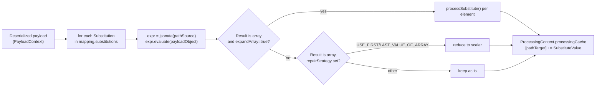

# JSONata Transformation

JSONata is the default transformation mechanism for mappings whose source and target
templates are plain JSON objects. Each field of the target is populated by evaluating a
JSONata expression (the `pathSource`) against the deserialized source payload and writing
the result to a target path (`pathTarget`). It requires no code — mappings are configured
declaratively as a list of substitutions in the mapping editor.

---

## Requirements

**What it is for.** Extracting and reshaping values declaratively, without writing code — the
default for simple field-to-field mappings.

- **A substitution pairs a source expression with a target path.** The expression is evaluated
  against the incoming payload; the result is written into the target template.
- **Expressions may compute**, not just select: arithmetic, string handling, conditionals, dates.
- **One substitution must define the device identifier**, so the message can be attributed.
- **A substitution may expand an array** into several Cumulocity objects.
- **Missing or null values have a defined outcome** the mapping chooses — leave the field, remove
  it, or fail the message — rather than an implicit one.
- **The result is type-checked against what the target expects**, so a mapping fails with a clear
  message rather than producing an object Cumulocity rejects.
- **Expressions are testable in the editor** against a sample payload, showing the extracted value.

---

## Implementation

### Where it runs

Extraction logic lives in
[`AbstractJSONataExtractionProcessor`](../../dynamic-mapper-service/src/main/java/dynamic/mapper/processor/AbstractJSONataExtractionProcessor.java),
shared identically by inbound and outbound. Each direction wires up its own thin Camel
processor bean:

- [`JSONataInboundProcessor`](../../dynamic-mapper-service/src/main/java/dynamic/mapper/processor/inbound/processor/JSONataInboundProcessor.java) — broker payload → Cumulocity object.
- [`JSONataOutboundProcessor`](../../dynamic-mapper-service/src/main/java/dynamic/mapper/processor/outbound/processor/JSONataOutboundProcessor.java) — Cumulocity payload → broker message.

Both simply extend the abstract class with no direction-specific overrides beyond their
constructor — extraction, evaluation, error handling, and failure-count bookkeeping are
identical for both directions (`AbstractJSONataExtractionProcessor.java:1-14`, comment on
`JSONataInboundProcessor`).



### Evaluation

`AbstractJSONataExtractionProcessor.extractFromSource()`
([`AbstractJSONataExtractionProcessor.java:91-132`](../../dynamic-mapper-service/src/main/java/dynamic/mapper/processor/AbstractJSONataExtractionProcessor.java#L91-L132))
iterates `mapping.getSubstitutions()` and, for each `Substitution`, calls
`extractContentFromPayload()`:

```java
// AbstractJSONataExtractionProcessor.java:206-218
var expr = jsonata(substitution.getPathSource());
return expr.evaluate(payloadObject);
```

using `com.dashjoin:jsonata`'s static `Jsonata.jsonata(...)` factory. A failed expression
(bad syntax, path not present) is caught, logged, and treated as a `null` result — it does
not abort processing of the remaining substitutions.

The extracted value is then handled by `processSubstitution()`
([`AbstractJSONataExtractionProcessor.java:137-192`](../../dynamic-mapper-service/src/main/java/dynamic/mapper/processor/AbstractJSONataExtractionProcessor.java#L137-L192)):

- If the result is an array **and** `substitution.getExpandArray()` is set, every element
  is processed individually via `SubstitutionEvaluation.processSubstitute()` — this is
  how one inbound message can fan out into multiple Cumulocity measurements/events/etc.
  from a single substitution.
- Otherwise, if the result is an array and a repair strategy is
  `USE_FIRST_VALUE_OF_ARRAY` / `USE_LAST_VALUE_OF_ARRAY`, it is reduced to a single
  scalar element; any other repair strategy leaves the array as-is (e.g. when the target
  field itself expects an array value).
- The resulting `SubstituteValue`(s) are appended to
  `context.getProcessingCache()` keyed by `pathTarget`, so multiple substitutions can
  target the same JSON path across a message and later be merged into the final target
  document (elsewhere in the pipeline, outside this processor).

### Substitution model: `pathSource` / `pathTarget`

A `Substitution` (`dynamic.mapper.model.Substitution`) is the unit of configuration for a
JSONata mapping:

| Field | Meaning |
|---|---|
| `pathSource` | A JSONata expression evaluated against the deserialized source payload. |
| `pathTarget` | The dot/bracket path in the target document the extracted value is written to. |
| `expandArray` | When true and the extracted value is an array, iterate its elements as separate substitutions instead of writing the array as one value. |
| `repairStrategy` | How to handle the two edge cases: an array result that isn't expanded (`USE_FIRST_VALUE_OF_ARRAY` / `USE_LAST_VALUE_OF_ARRAY`, or leave as-is), and a missing/null value when writing into the target template (`IGNORE`, `REMOVE_IF_MISSING_OR_NULL`, `CREATE_IF_MISSING`). See [`jsonata.md`](../../dynamic-mapper-ui/public/docs/jsonata.md#jsonata-repair-strategy). |

Both `pathSource` and `pathTarget` are plain strings; there is no compiled/typed schema —
correctness (e.g. whether a path actually resolves) is left to the JSONata evaluator and,
before persistence, to [mapping-validation.md](mapping-validation.md)'s JSON/identifier
checks.

### Identity substitution: `_IDENTITY_.externalId` / `_IDENTITY_.c8ySourceId`

Every mapping needs exactly one (inbound) or at least one (outbound) substitution that
tells the pipeline which device the message is about — see rule 5 in
[mapping-validation.md](mapping-validation.md). This is expressed with the reserved
`_IDENTITY_` token rather than a real payload path:

```json
{ "pathSource": "$.deviceId", "pathTarget": "_IDENTITY_.externalId" }
```

(inbound — the external ID extracted from the payload becomes the device identity), or

```json
{ "pathSource": "_IDENTITY_.externalId", "pathTarget": "$.deviceId" }
```

(outbound — the device's resolved external ID is written into the outgoing payload).

`_IDENTITY_.c8ySourceId` is the equivalent for addressing a device by its internal
Cumulocity managed-object ID instead of an external ID. Enrichment processors
(`AbstractEnrichmentProcessor` and its inbound/outbound subclasses) recognize this token
and resolve the actual device before/after the JSONata substitution pass runs — it is not
evaluated by the JSONata engine itself, since `_IDENTITY_` is not a real field of either
payload.

`AbstractEnrichmentProcessor.normalizeTestPayload()`
([`AbstractEnrichmentProcessor.java:249-275`](../../dynamic-mapper-service/src/main/java/dynamic/mapper/processor/AbstractEnrichmentProcessor.java#L249-L275)) shows the outbound test-UI
side of this: the UI always sends `_IDENTITY_.c8ySourceId` in test payloads, and this
method rewrites it in-place into the real API-specific identifier field the enrichment
processor expects (`source.id` for EVENT/ALARM/MEASUREMENT, `id` for INVENTORY, `deviceId`
for OPERATION) before the mapping's normal substitution/extraction logic runs.

### How this differs from Smart Functions and Java Extensions

| | JSONata | Smart Functions | Java Extensions |
|---|---|---|---|
| Configuration | Declarative list of `Substitution`s | JavaScript `onMessage(msg, context)` | Java class implementing `ProcessorExtensionInbound`/`Outbound` |
| Can iterate/produce multiple C8Y objects from one message | Only via `expandArray` on a single field | Yes — arbitrary control flow, returns an array | Yes — arbitrary control flow, returns an array |
| Handles array-rooted or non-JSON payloads (`ANY_PAYLOAD`, `SPARKPLUGB`) | No — validation requires `SMART_FUNCTION` (or `EXTENSION_JAVA` for `ANY_PAYLOAD`) instead, see [mapping-validation.md](mapping-validation.md) rule 4 | Yes | Yes (for `ANY_PAYLOAD`) |
| Runtime | Pure expression evaluation, no sandboxing needed | GraalVM polyglot JS context | Plain JVM, dynamically loaded classes |
| Processor class | `AbstractJSONataExtractionProcessor` (+ `JSONataInboundProcessor`/`JSONataOutboundProcessor`) | `AbstractFlowProcessor` (+ flow processors), see [transformation-smart-functions.md](transformation-smart-functions.md) | `AbstractExtensibleProcessor` (+ extensible processors), see [transformation-java-extensions.md](transformation-java-extensions.md) |

See [`docs/backend/architecture.md`](../backend/architecture.md) for how these three
processor families sit under the shared `AbstractEnrichmentProcessor` step in the Camel
route.
