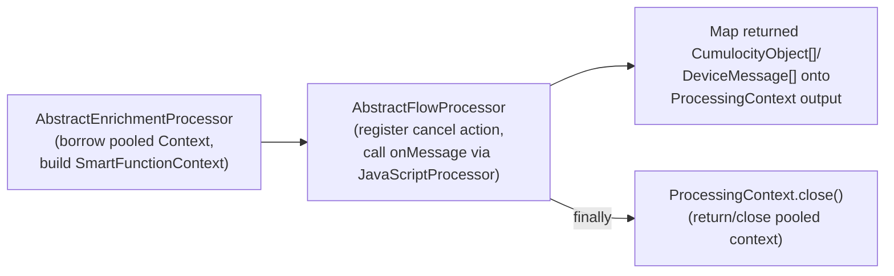

# Smart Functions

Smart Functions are the JavaScript-based transformation option (`transformationType:
SMART_FUNCTION`). A mapping supplies a single `onMessage(msg, context)` function that
receives the source message and returns the Cumulocity objects (inbound) or broker
messages (outbound) to emit. Unlike JSONata substitutions, a Smart Function has full
control flow — loops, conditionals, arbitrary JavaScript logic — and is the only
built-in transformation type that can turn one input message into an arbitrary number of
output objects or handle payloads that aren't well-formed JSON.

This page covers what Smart Functions are and how the runtime executes them. For the
`onMessage` entry-point signature, the `msg`/`context` API, and return-type contracts,
see [`docs/smart-functions.md`](../smart-functions.md) (developer reference) and
[`docs/smart-function-type-sync.md`](../smart-function-type-sync.md) (TypeScript↔Java
type parity) — this document does not repeat that API surface.

---

## Requirements

**What it is for.** Expressing a transformation as JavaScript when substitutions or JSONata are
not enough — conditionals, loops, derived values, state across messages.

- **The tenant writes a function with a fixed entry point** that receives the message and returns
  the Cumulocity objects to create. One invocation may return several objects.
- **A shared library is available to every function**, so common helpers are written once; the
  tenant can edit it.
- **A function may keep state between messages** — per device, per mapping — for deduplication,
  running statistics, or change detection. That state has a bounded lifetime.
- **A function may look data up in Cumulocity**, e.g. resolving a managed object by external ID,
  so a transformation can enrich from inventory.
- **Execution is sandboxed.** A function cannot reach the host, the filesystem, the network, or
  another tenant's data — a tenant runs untrusted code by definition.
- **Execution is bounded.** A function that never returns is stopped, and its failure is attributed
  to its mapping rather than affecting the service — see [reliability.md](reliability.md).
- **Errors must point at the function**, with the line number where it failed, not at mapper
  internals.
- **Both directions are supported**, inbound and outbound.

---

## Implementation

### Why Smart Functions exist

Per [mapping-validation.md](mapping-validation.md), several situations are rejected for
JSONata/DEFAULT transformations and require `SMART_FUNCTION`:

- **Array-rooted templates** — if `sourceTemplate` or `targetTemplate` is a JSON array at
  the root, JSONata substitution (which addresses one target document per message) can't
  express it; only a Smart Function can iterate an array root
  (`Wrong_Transformation_Type_Array_In_Source_Template_Or_Target_Template_Requires_Transformation_Type_Smart_Function`).
- **`MappingType.ANY_PAYLOAD`** — unparsed/raw payloads (not necessarily JSON) require
  `SMART_FUNCTION` or `EXTENSION_JAVA` — a JSONata expression has nothing well-defined to
  evaluate against.
- **`MappingType.SPARKPLUGB`** — Sparkplug B's protobuf-encoded, schema-driven payload
  structure requires `SMART_FUNCTION` unconditionally.

In all three cases, the validator enforces this at `MappingValidator.validate()` time —
see the corresponding rules in [mapping-validation.md](mapping-validation.md) rules 2 and 4.

### Execution model

Smart Function code runs inside a GraalVM polyglot JS `Context`, one per tenant `Engine`,
pooled per mapping+code-hash so repeated invocations reuse a warmed-up context instead of
paying JS parse/JIT cost every message.

#### Context construction and sandboxing

`AbstractEnrichmentProcessor.createGraalContext()`
([`AbstractEnrichmentProcessor.java:178-205`](../../dynamic-mapper-service/src/main/java/dynamic/mapper/processor/AbstractEnrichmentProcessor.java#L178-L205)) builds each `Context` with an
explicit allowlist rather than unrestricted host access:

```java
Context.Builder builder = Context.newBuilder("js")
        .engine(graalEngine)
        .option("js.text-encoding", "true")
        .allowHostAccess(configurationRegistry.getGraalVMContextService().getHostAccess())
        .allowHostClassLookup(className ->
                className.equals("dynamic.mapper.processor.model.SubstitutionContext")
                        || className.equals("dynamic.mapper.processor.model.SubstitutionResult")
                        || className.equals("dynamic.mapper.processor.model.SubstituteValue")
                        // ... a fixed list of specific classes, java.util.Base64, ArrayList, etc.
                );
```

Only a fixed set of Java classes are reachable from JS via `Java.type(...)`; everything
else — including file/network/process access — is unreachable because it was never
granted, not because a runtime sandbox policy revokes it after the fact. `js.esm-eval-returns-exports` /
experimental options are enabled only when the tenant's `ServiceConfiguration.getSupportESM()`
flag is set, to allow `export function` module syntax in mapping code.

> **Note on the code vs. documented model:** `org.graalvm.polyglot.SandboxPolicy` (e.g.
> `SandboxPolicy.TRUSTED`) is not referenced anywhere in the current
> `dynamic-mapper-service` source. The isolation Smart Functions get today comes from the
> explicit `allowHostAccess`/`allowHostClassLookup` allowlists above, plus process-level
> CPU/wall-clock cancellation (below) — not from a `SandboxPolicy` call. If your mental
> model of this feature says otherwise, treat the code as authoritative.

#### Context pooling and lifecycle

`GraalVMContextService.borrowOrCreateContext()` / `returnContext()`
(`dynamic-mapper-service/src/main/java/dynamic/mapper/core/GraalVMContextService.java`)
implement a per-tenant, per-mapping-code-hash pool of pre-built `PooledGraalContext`s, set
up in `AbstractEnrichmentProcessor.process()`
([`AbstractEnrichmentProcessor.java:100-156`](../../dynamic-mapper-service/src/main/java/dynamic/mapper/processor/AbstractEnrichmentProcessor.java#L100-L156)):

```java
PooledGraalContext pooledCtx = graalVMContextService.borrowOrCreateContext(
        poolKey, tenant, graalEngine, supportESM, sharedSource, systemSource,
        mapping.getCode(), mapping.getIdentifier());
context.setPooledGraalContext(pooledCtx);
context.setEngineReleaseAction(() -> graalVMContextService.returnContext(poolKey, pooledCtx, graalEngine));
```

`ProcessingContext` — the per-message context, not a separate `ExecutionContext` type —
implements `AutoCloseable` itself and centralizes GraalVM cleanup in its own `close()`
([`ProcessingContext.java:509-556`](../../dynamic-mapper-service/src/main/java/dynamic/mapper/processor/model/ProcessingContext.java#L509-L556)): if a pooled context is set, `close()` returns
it to the pool via `engineReleaseAction` (or discards it if it was killed) instead of
closing the raw GraalVM `Context` directly; for the non-pooled path it calls
`graalContext.close()` directly. `AbstractFlowProcessor.process()`
([`AbstractFlowProcessor.java:200-213`](../../dynamic-mapper-service/src/main/java/dynamic/mapper/processor/AbstractFlowProcessor.java#L200-L213)) is the call site that guarantees this
runs — a `try { processSmartMapping(context); } ... finally { context.close(); }` around
every Smart Function invocation, so the pooled/raw context is always released or closed
exactly once per message regardless of success or failure.

#### Cancellation

A running Smart Function can be forcibly stopped mid-execution — e.g. an MQTT-side
timeout — via `Context.close(cancelIfExecuting=true)`, since plain thread interruption is
ignored by GraalVM. `AbstractFlowProcessor.process()` registers a cancel action on the
message's `ProcessingResultWrapper` before invoking the function
([`AbstractFlowProcessor.java:110-158`](../../dynamic-mapper-service/src/main/java/dynamic/mapper/processor/AbstractFlowProcessor.java#L110-L158)) that either kills the pooled context
(`PooledGraalContext.kill()`) or calls `graalCtx.close(true)` directly. On the way out, a
`PolyglotException` whose `isCancelled()`/`isResourceExhausted()` is true is treated as a
timeout/kill rather than a script bug, and any `console.log()` output written before the
kill is salvaged into the processing result when possible.

### Console, logs, and warnings plumbing

Smart Function code gets a `console` object backed by
[`JavaScriptConsole`](../../dynamic-mapper-service/src/main/java/dynamic/mapper/processor/flow/JavaScriptConsole.java), which formats GraalVM `Value` arguments (including nested
objects/arrays, via Jackson) and routes `console.log/warn/error/debug` into the flow
context's log sink — for `SMART_FUNCTION` this is
[`DataPrepContext.addLogMessage`](../../dynamic-mapper-service/src/main/java/dynamic/mapper/processor/model/DataPrepContext.java#L164-L180), which is
where `context.addWarning(...)` (documented in `docs/smart-functions.md`) also lands
(`DataPrepContext.WARNINGS` / `DataPrepContext.LOGS` state keys).

The actual JS-callable entry point is the
[`JavaScriptProcessor`](../../dynamic-mapper-service/src/main/java/dynamic/mapper/processor/flow/JavaScriptProcessor.java) functional interface —
`Value onMessage(Value msg, DataPrepContext context)` — invoked by
`AbstractFlowProcessor.processSmartMapping()` against the compiled mapping code loaded
into the pooled `Context`.

### Runtime state: `SmartFunctionContext`

At runtime, `context` inside a Smart Function is backed by
[`SmartFunctionContext`](../../dynamic-mapper-service/src/main/java/dynamic/mapper/processor/model/SmartFunctionContext.java), the concrete
`DataPrepContext` implementation used for `SMART_FUNCTION` (as opposed to
`JavaExtensionContext`, used for `EXTENSION_JAVA` — see
[transformation-java-extensions.md](transformation-java-extensions.md)). It is
constructed fresh per message in `AbstractEnrichmentProcessor.process()`
([`AbstractEnrichmentProcessor.java:144-146`](../../dynamic-mapper-service/src/main/java/dynamic/mapper/processor/AbstractEnrichmentProcessor.java#L144-L146)), seeded with the
mapping's persisted flow state loaded from `FlowStateStore` — this is the backing store
for the `context.getState()`/`setState()` persistence documented in
`docs/smart-functions.md`.

### Where this fits in the pipeline



`AbstractEnrichmentProcessor` (shared with `EXTENSION_JAVA`, see
[transformation-java-extensions.md](transformation-java-extensions.md)) does the GraalVM
setup common to any code-based transformation; `AbstractFlowProcessor` is specific to
`SMART_FUNCTION` and drives the actual `onMessage` invocation and cancellation handling.
