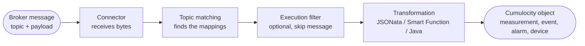

### Core concepts {#concepts}

Six terms cover almost everything in the Dynamic Mapper. Once these are clear, the guides and the reference pages
read much faster.

#### Connector

A **connector** is the link to one message broker or endpoint — MQTT, Kafka, AMQP, Pulsar, Google Pub/Sub, HTTP,
Webhook, or the Cumulocity MQTT Service. Connectors carry no transformation logic; they only move bytes.

Several mappings can share one connector, and one mapping can be deployed to several connectors at once.

→ [Managing connectors](/c8y-pkg-dynamic-mapper/introduction/managing-connectors)

#### Mapping

A **mapping** is a rule that converts one message into one or more Cumulocity objects, or the other way round. It
binds together a topic, a payload format, a transformation and a target API.

A mapping only runs when it is **activated**. Saving is not enough.

→ [Defining a mapping](/c8y-pkg-dynamic-mapper/introduction/define-mapping)

#### Direction: inbound and outbound

**Inbound** goes broker → Cumulocity. A message arrives on a topic and becomes a measurement, event, alarm or
managed object.

**Outbound** goes Cumulocity → broker. The mapper watches Cumulocity for changes to objects you subscribed to,
transforms them, and publishes the result. Outbound additionally needs a **subscription** that says which devices
to watch.

→ [Quickstart outbound](/c8y-pkg-dynamic-mapper/introduction/quickstart-outbound) ·
[Outbound mappings](/c8y-pkg-dynamic-mapper/introduction/define-subscription-for-outbound)

#### Payload type

The **payload type** tells the mapper how to read the raw bytes: JSON, Flat File (CSV), Hexadecimal, Protobuf,
SparkPlug B, or Any Payload for formats the mapper does not parse itself.

JSON is the default and covers most cases. The rest are only offered when **Expert Mode** is enabled in the
creation dialog.

→ [Payload types](/c8y-pkg-dynamic-mapper/introduction/payload-types)

#### Transformation type

The **transformation type** is *how* you express the conversion:

| Type | Use it when |
|---|---|
| **Smart Function** *(default)* | A JavaScript function builds the whole output — arrays, inventory lookups, business logic. This is what a new mapping uses unless you change it. |
| **JSONata** | Declarative field-to-field mapping with expressions and conditions, no JavaScript. |
| **Java Extension** | You need Java type safety, existing libraries or JVM performance. |

With **Expert Mode** switched off the dialog does not ask: you get JSON and a Smart Function. Switch Expert Mode on
to choose a different transformation type.

Payload type and transformation type are both fixed at creation time and cannot be changed afterwards.

→ [Transformation types](/c8y-pkg-dynamic-mapper/introduction/transformation-types)

#### Device identity

Every inbound mapping has to say **which device** the data belongs to — otherwise the mapper has nowhere to put it.
How you express that depends on the transformation type:

- In a **Smart Function**, return an `externalSource` entry alongside the payload.
- In a **JSONata** mapping, add a substitution that writes to `_IDENTITY_.externalId`.

A **substitution** (JSONata only) is a single copy rule: take the value at a path in the source payload, write it
to a path in the target payload. A JSONata mapping is a list of substitutions.

→ [Smart Functions](/c8y-pkg-dynamic-mapper/introduction/smartfunction) ·
[JSONata substitutions](/c8y-pkg-dynamic-mapper/introduction/jsonata)

#### How a message flows through

A single message can match more than one mapping — `device/+/data` and `device/#` both match
`device/abc/data` — and each match produces its own Cumulocity objects.

#### What to read next

- [Quickstart](/c8y-pkg-dynamic-mapper/introduction/quickstart-inbound) if you have not built a mapping yet.
- [Defining a mapping](/c8y-pkg-dynamic-mapper/introduction/define-mapping) for the wizard in full.
- [Metadata](/c8y-pkg-dynamic-mapper/introduction/metadata) for `_TOPIC_LEVEL_`, `_IDENTITY_` and `_CONTEXT_DATA_`.
