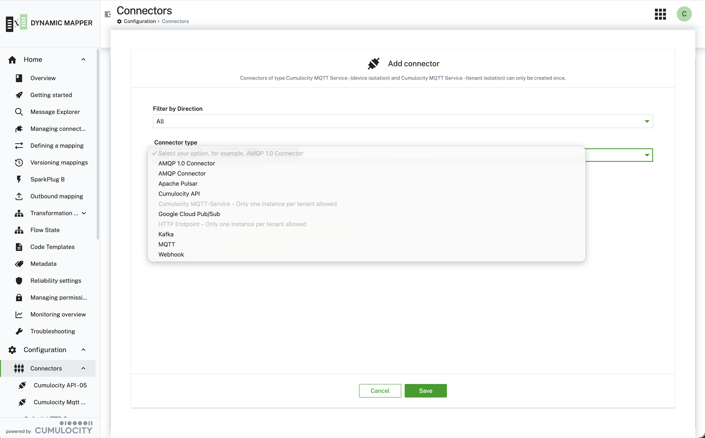
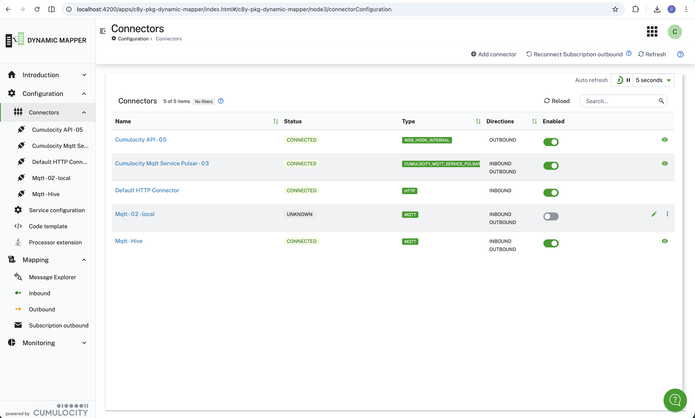
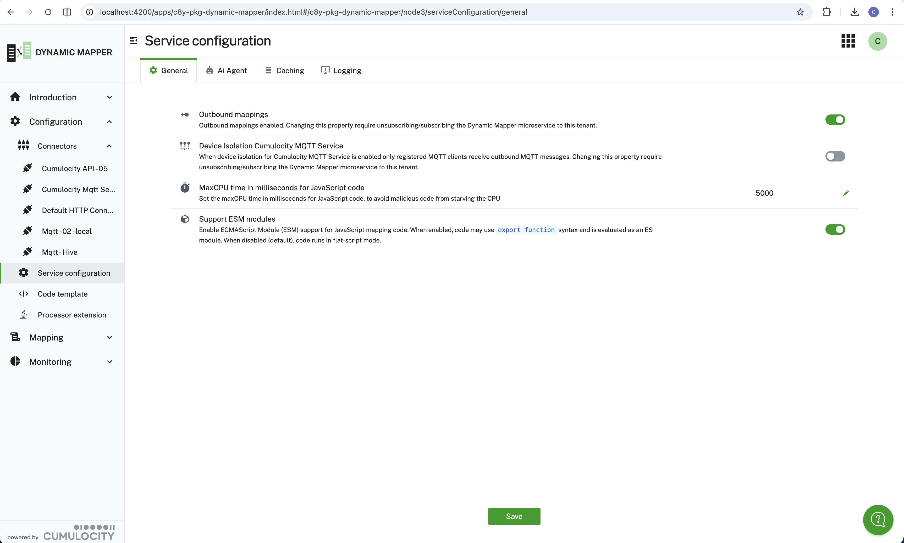
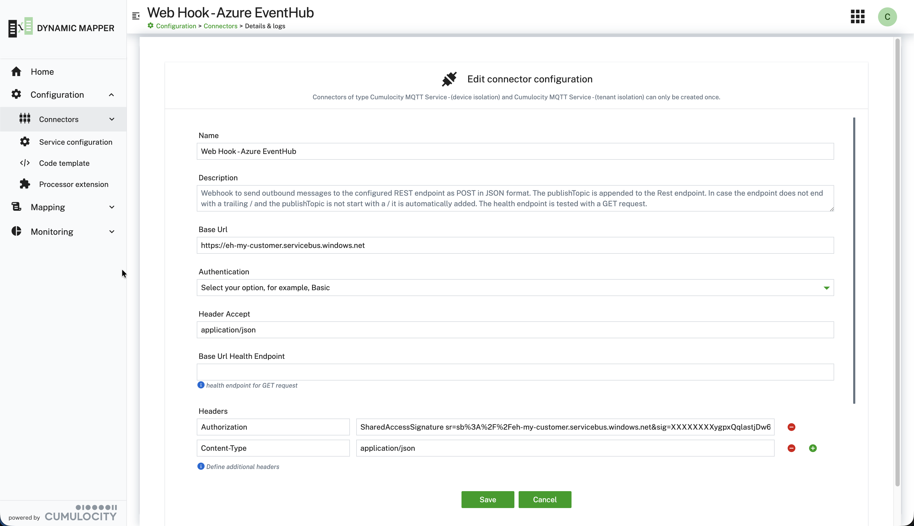
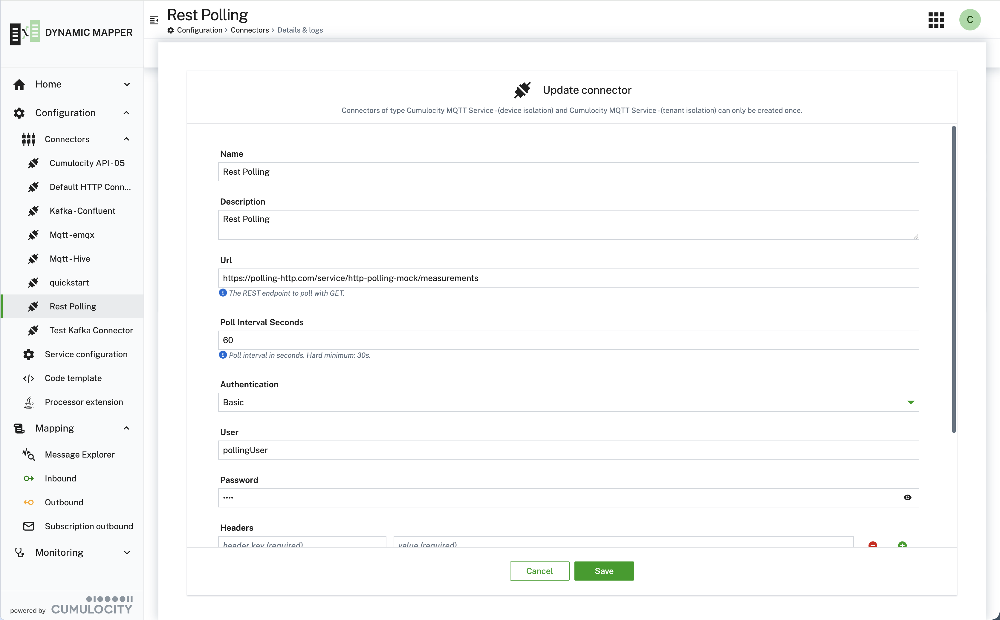
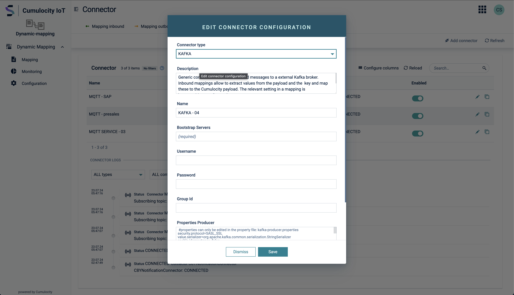

This page walks through the connector configuration UI and covers connector-specific setup details. For the list
of supported connectors, directions, and payload formats, see the table in
[Managing connectors](/c8y-pkg-dynamic-mapper/introduction/managing-connectors#managing-connectors).

### Adding and managing connectors

Add a new connector using the following wizard
[**Configuration → Connectors → Add connector**](/c8y-pkg-dynamic-mapper/node3/connectorConfiguration). The
configuration properties shown are dynamically adapted to the selected connector type.

The configured connectors are listed in a table that can be deleted, enabled/disabled, or updated/copied:

When a connection fails to establish, the connection logs on the same page show the underlying error, which is
often the fastest way to spot an incorrect parameter:

### Default HTTP Connector

The **Default HTTP Connector** does not need to be created manually — it is created automatically for every
tenant at microservice startup. It is reachable at
`https://<YOUR_CUMULOCITY_TENANT>/service/dynamic-mapper-service/httpConnector/<MAPPING_TOPIC>`: the path segment
after `.../httpConnector/` is used directly as the mapping topic. For example, a JSON payload POSTed to
`.../httpConnector/temp/berlin_01` is resolved against a mapping with mapping topic `temp/berlin_01`.

 configuration properties.")

### Webhook connector

The **Webhook** connector has a setting **Cumulocity Internal** which can be used when Cumulocity MEA should be
processed and sent back to Cumulocity Core as transformed MEA, e.g. receive an `EVENT` of type `c8y_Uplink` and use
a **SMART_FUNCTION** to decode the payload and transform it into a `MEASUREMENT`.

### REST Polling connector

The **REST Polling** connector is for sources that only expose a REST API and cannot push data
themselves: instead of subscribing to a broker topic, it periodically sends a GET request and
feeds each response into the inbound mapping pipeline.

| Property | Notes |
|---|---|
| `url` | Base URL — each deployed mapping's **topic** is appended as the request path, e.g. `url=https://api.example.com/v1` + mapping topic `devices/measurements` → `GET https://api.example.com/v1/devices/measurements` |
| `pollIntervalSeconds` | Default 60; minimum **30 seconds**, enforced when saving the connector |
| `authentication` | `None`, `Basic`, or `Bearer` |
| `headers` | Additional static headers sent with every poll request |

Each mapping deployed to one REST Polling connector instance gets its **own independently
scheduled poll job**, and — since the topic becomes the path — can target its own endpoint under
the connector's base URL. All mappings on one connector instance still share the same **poll
interval** and **credentials/host**; a different interval or a different host needs a separate
connector instance.

#### Incremental fetch and pagination

Both are optional and off by default (every poll otherwise fetches the full response fresh):

| Property | Notes |
|---|---|
| `cursorParam` | Query parameter name used to send an incremental-fetch cursor with each poll (e.g. `since`) — leave empty to disable |
| `cursorExtractionExpression` | JSONata evaluated against each response to compute the next cursor value (e.g. `items[-1].timestamp`); only used together with `cursorParam` |
| `paginationMode` | `None` (default), `NextLinkHeader`, `NextFieldInBody`, or `PageNumber` — how to drain multiple pages within one poll cycle |
| `maxPagesPerPoll` | Safety cap on pages drained per cycle, regardless of whether more are available |
| `pageParam` | Query parameter the next page's token/number is sent under (`NextFieldInBody` / `PageNumber` modes only) |
| `nextPageExpression` | JSONata extracting the next page's token from the response (`NextFieldInBody` mode only) |
| `pageStartValue` | First page number (`PageNumber` mode only), e.g. `0` for a zero-indexed API |

Each pagination mode stops on its own signal from the response — no separate "last page" flag to
configure: `NextLinkHeader` stops once an RFC 5988 `Link: rel="next"` header is absent,
`NextFieldInBody` stops once `nextPageExpression` returns nothing, and `PageNumber` stops once a
response is an empty `[]` or `{}`.

The cursor advances after *every* page is successfully processed, not just once per poll cycle —
so if pagination fails partway through, the next poll resumes from the last page that made it
through rather than re-fetching already-processed pages or losing the unprocessed remainder.

Message Explorer works on this connector too, but with a cost that doesn't apply to broker-based
connectors: exploring a topic with no mapping deployed on it yet starts real periodic requests
against the endpoint for as long as the session is open — see the note in
[Message Explorer](/c8y-pkg-dynamic-mapper/introduction/message-explorer).

### Kafka connector security {#kafka-connector-security}

The Kafka connector derives its `security.protocol` automatically — you do not set it directly:

| Credentials set? | Custom CA trusted? | Resulting protocol |
|:---:|:---:|---|
| yes | either | `SASL_SSL` |
| no | yes | `SSL` (TLS only, no authentication) |
| no | no | `PLAINTEXT` |

**Authentication.** Set **Username** and **Password**, then pick the **SASL mechanism** your broker offers:
`SCRAM-SHA-256`, `SCRAM-SHA-512`, or `PLAIN`. Use `PLAIN` for brokers that authenticate with an API key/secret
pair — Confluent Cloud, for example, supports only `PLAIN` and `OAUTHBEARER`, so a SCRAM mechanism there fails with
`UnsupportedSaslMechanismException`.

**Trusting a self-signed or internal CA.** Public-CA brokers (Confluent Cloud, most managed services) need no extra
configuration — the JVM's default truststore already trusts them. For a broker presenting a certificate from an
internal or self-signed CA, enable **Use Self Signed Certificate** and supply the CA one of two ways, exactly as for
the MQTT, AMQP and Pulsar connectors:

| Property | Description |
|---|---|
| `useSelfSignedCertificate` | Enables custom CA trust. The remaining properties below only appear once it is on. |
| `nameCertificate` + `fingerprintSelfSignedCertificate` | Reference a certificate already uploaded to the Cumulocity trusted-certificate store (**Device Management → Management → Trusted certificates**). |
| `certificateChainInPemFormat` | Paste the CA certificate chain inline in PEM format, as an alternative to the certificate store. |
| `disableHostnameValidation` | Skips TLS hostname verification. **Insecure — development and testing only.** |

:::caution
Client-certificate authentication (mTLS) is not supported: the Cumulocity certificate store holds trust material
only, not private keys. The same limitation applies to every other connector type.
:::

Mechanisms beyond the three listed above — `OAUTHBEARER`, `GSSAPI`/Kerberos, AWS MSK IAM — have no dedicated
fields, but can still be configured by setting the raw Kafka client properties (`sasl.mechanism`,
`sasl.jaas.config`, `security.protocol`, …) in **Default properties producer** and **Default properties consumer**.
Those maps are applied last and therefore override anything derived above.
