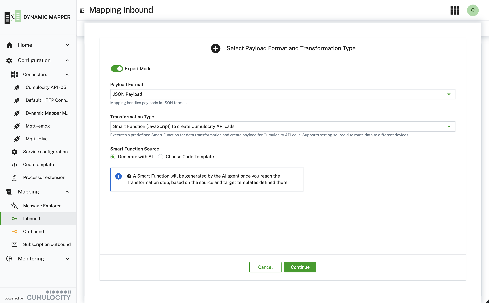
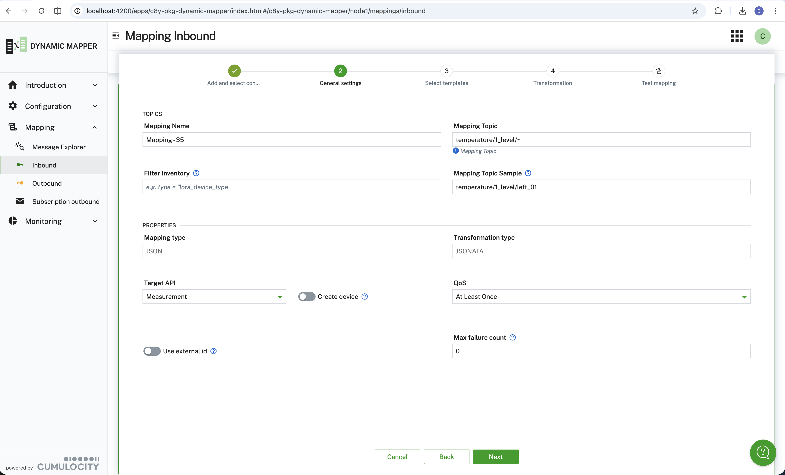
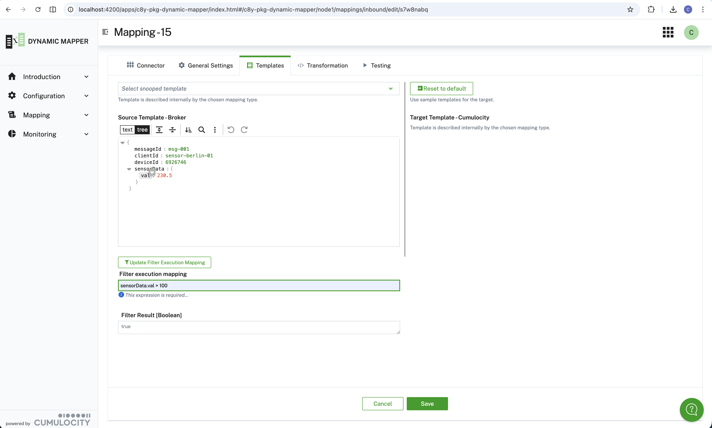
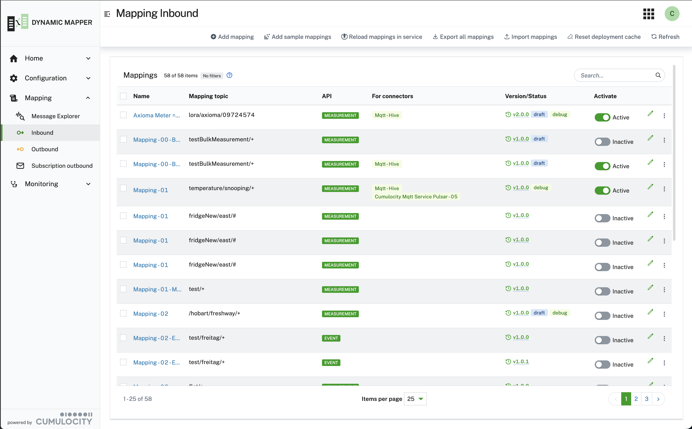
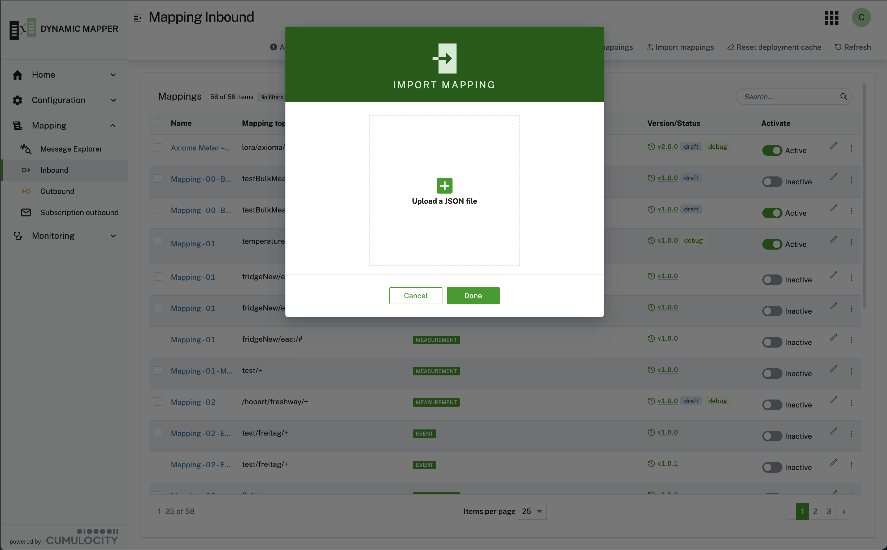
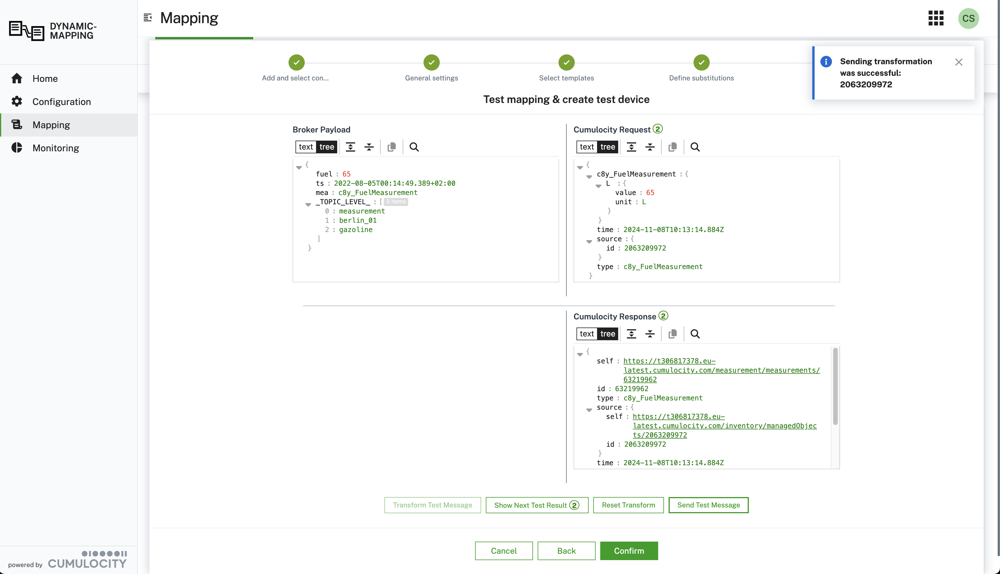
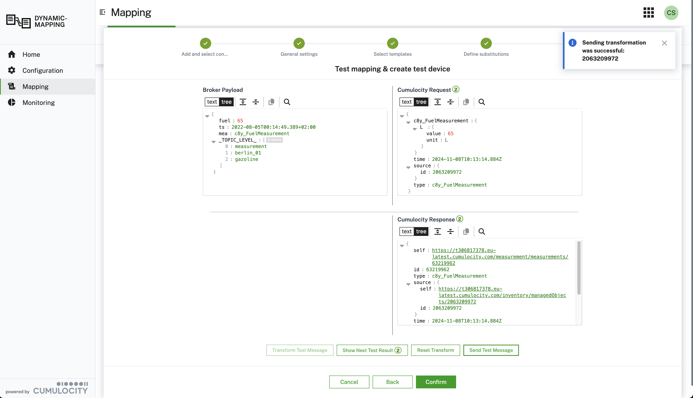
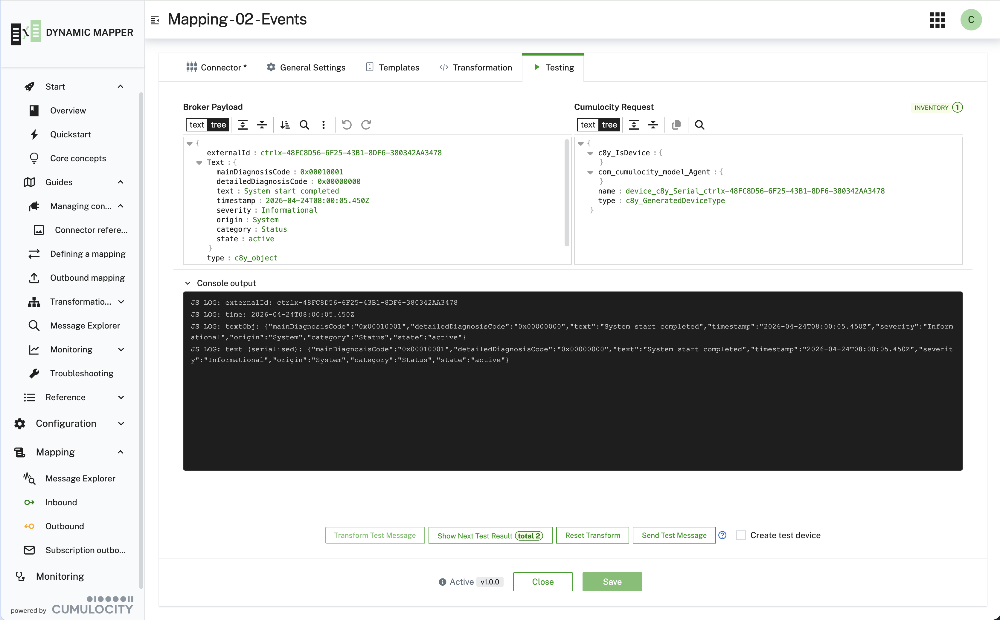
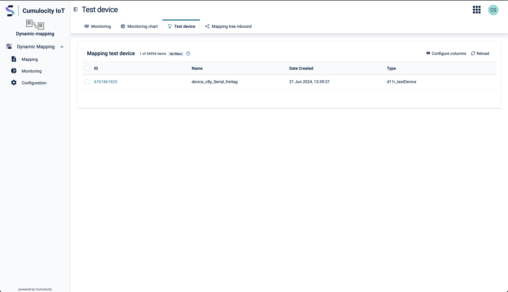

### Defining a mapping {#define-mapping}

When you start with a new mapping, the first considerations are about the payload format and the transformation
type to use:

1. In which format is the inbound payload sent? This defines the payload type to choose: JSON, Flat File,
   Hexadecimal, Protobuf
2. How to define the transformation of inbound to Cumulocity format? This defines the transformation type:
   JSONata, Smart Functions, ...

:::important
If any of the templates: source or target is a JSON array - instead of a JSON object - then you have to choose
**Smart Function** as a transformation type.

This is due to the internal handling of metadata, e.g. `_IDENTITY_.externalId` that is added to the template. This
is not possible for JSON arrays.
:::

Now you start adding a mapping by clicking [Inbound](/c8y-pkg-dynamic-mapper/node1/mappings/inbound) **Add
Mapping**.
The dialog asks for the **Payload Format** and the **Transformation Type** together. With **Expert Mode**
enabled it also offers the **Smart Function Source** — either generating the function with the AI agent when you
reach the Transformation step, or starting from an existing code template.



binary before publishing. See the [SparkPlug B](/c8y-pkg-dynamic-mapper/introduction/sparkplugb) section for the full protocol details, message types,
and Smart Function API.

:::important
**Payload type and transformation type cannot be changed after mapping creation.** If you need a different type,
delete the mapping and create a new one. To avoid this, enable **Expert Mode** in the creation dialog to see all
options upfront.
:::

The stepper guides you through these steps to define a mapping using JSONata for substitutions:

1. Add or select an existing connector for your mapping (where payloads come from). You can select more than one
   connector to deploy the same mapping to all of them at once.
2. Define general settings, such as the topic name for this mapping.
3. Select or enter the template for the expected source payload. This is used as the source path for
   substitutions.
4. Transformation for copying content from the source to the target payload. These will be applied at runtime.
5. Test the mapping by applying the substitutions and save the mapping.

 a mapping is deployed to.")

In the second step of the wizard you define the most important properties for the mapping, e.g. Mapping Name,
Target API, Mapping Topic (topic to which this mapping should listen for, this supports wildcards: `#`, `+`). The
Mapping Topic Sample is a sample topic replacing all wildcards from the Mapping Topic, e.g. `datalogger/+` becomes
`datalogger/logger_13579`, this helps in the later steps to use concrete values instead of the abstract wildcards.



Mappings are organized in a tree, one node per topic segment (`+`/`#` wildcards are ordinary segment values in
that tree). When a message arrives, the tree is walked one segment at a time; exact-match and wildcard branches
are followed in parallel, so a single message can match more than one mapping (e.g. both `device/+/data` and
`device/#`). For the detailed matching algorithm, see
[Mapping processing (inbound)](https://github.com/Cumulocity-IoT/cumulocity-dynamic-mapper/blob/main/docs/feature/mapping-processing-inbound.md)
in the developer documentation.

The levels of the Mapping Topic are split and added to the source payload as `_TOPIC_LEVEL_`, e.g.
`["device", "express", "berlin_01"]` for topic `device/express/berlin_01` — see
[Using metadata in source templates](/c8y-pkg-dynamic-mapper/introduction/metadata).

**Best practice:** **Best Practice:** Always test your mapping with sample payloads before activating it. Use the test feature in
step 5 to verify that your substitutions produce the expected Cumulocity format. This helps catch errors early and
ensures smooth operation.

The following screenshot shows the **Transformation** step for transformation type **Substitution as JSONata
Expression**. This step shows a JavaScript editor if you choose **Smart Function (JavaScript)**.


#### Execution Filter {#execution-filter}

An optional **execution filter** lets you narrow which messages a mapping actually processes, without writing any
transformation code. It applies to **both inbound and outbound mappings**.

You define it in the third step of the wizard, **Select templates**, in the **Filter execution mapping** field.
Select a node in the source template and press **Update Filter Execution Mapping** to seed the expression, then
refine it. The **Filter Result** field below shows the value the expression currently evaluates to against the
source template.



The expression is a JSONata expression that **must evaluate to a boolean**. The editor rejects anything else — an
expression returning a number or a string leaves the step invalid and you cannot continue. When the expression
returns `false` for a message, the mapping is skipped for that message:

- **Inbound:** the message is not mapped to Cumulocity. If no other mapping matches the topic, the message is
  discarded.
- **Outbound:** the message is silently dropped and not forwarded to the broker.

```javascript
// Inbound: only process readings above a threshold
telemetry.telemetryReadings[0].value > 10.00

// Outbound: only forward high-temperature measurements
c8y_TemperatureMeasurement.T.value > 95

// Outbound: only forward critical alarms
severity = "CRITICAL"

// Only process messages of a specific type
type = "c8y_Uplink"
```

The default value is `true`, i.e. every message is processed.

The expression is evaluated against the **incoming payload** — the broker message for inbound mappings, and the
Cumulocity source object (measurement, event, alarm, or managed object) that triggered the mapping for outbound
mappings. To filter on **device inventory** properties instead, use the [Inventory
Filter](/c8y-pkg-dynamic-mapper/introduction/define-subscription-for-outbound#inventory-filter) — that one is available for outbound mappings only.


### Managing mappings {#managing-mappings}

The **Inbound Mappings** / **Outbound Mappings** table is the entry point for working with existing mappings:



- **Add Mapping** — starts the wizard described above.
- The pencil icon on a row opens that mapping for editing. Editing does not need the mapping to be deactivated
  first — your changes are saved as a **draft** alongside the running, active configuration and only take effect
  once you publish and activate that draft. See [Versioning mappings](/c8y-pkg-dynamic-mapper/introduction/versioning)
  for the full draft → publish → activate flow, including rollback to a previous version.
- The "-" icon deletes a mapping.
- **Import** and **Export** move mappings in and out of the table as JSON, individually or all at once. Sample
  files to try this with:
  [inbound](https://github.com/Cumulocity-IoT/cumulocity-dynamic-mapper/blob/main/resources/samples/mappings-INBOUND.json),
  [outbound](https://github.com/Cumulocity-IoT/cumulocity-dynamic-mapper/blob/main/resources/samples/mappings-OUTBOUND.json).



#### Testing a mapping {#testing-a-mapping}

Before activating a mapping, use the **Testing** step of the wizard (or reopen an existing mapping) to verify the
transformation without waiting for a real device message:

- **Transform Test Message** — applies the mapping's substitutions (or Smart Function / Java Extension code) to
  the sample source payload and shows the resulting Cumulocity request. A single test payload can produce more
  than one request — e.g. a measurement for a device that does not exist yet and is implicitly created also
  produces an inventory request. Use **Show Next Test Result** to step through all of them.


- **Reset Transform** — clears the test results and lets you run the transformation again, e.g. after editing the
  source payload or a substitution.
- **Send Test Message** — sends the transformed result(s) to Cumulocity for real. This requires the mapping to
  use an external ID (it is disabled otherwise). Enable **Create test device** to have the mapper create a real
  device in inventory first, tagged with the fragment `d11r_testDevice` so it can be identified and cleaned up
  afterwards.



##### Testing a Smart Function and reading its console output {#testing-smart-function}

A Smart Function is ordinary JavaScript, so it is tested the same way: **Transform Test Message** executes your
`onMessage()` function against the source payload and shows what it returned. You do not have to publish a real
broker message, or even activate the mapping, to find out whether the code works.

Anything the function writes with `console.log()` appears in the **Console output** panel below the two payloads.
It is collapsed by default — click the header to expand it. This is the quickest way to see what your function
actually received and how far it got: print the incoming payload, an intermediate value or a device lookup result,
run the test, and read it back.



Each line is prefixed with the level it was logged at, and colour-coded accordingly:

| In your Smart Function | Appears as |
|---|---|
| `console.log(...)` | `JS LOG:` |
| `console.warn(...)` | `JS WARN:` |
| `console.error(...)` | `JS ERROR:` |
| `console.debug(...)` | `JS DEBUG:` |

Objects are serialised before being printed, so `console.log("payload:", payload)` shows the whole structure
rather than `[object Object]`.

The panel distinguishes two empty states, and the difference is worth knowing: **No output yet** means the test
has not been run, while **No console output for this test run** means the function ran but logged nothing. If you
expected log lines and see the latter, execution never reached your `console.log()` call.

The same messages also go to the microservice log, prefixed with the tenant, so a Smart Function that is already
active can be followed in production the same way. One difference applies there: `console.debug()` reaches the
microservice log only when **debug mode** is enabled for that mapping, whereas it always appears in this test
console. See [Enabling debug mode for a mapping](/c8y-pkg-dynamic-mapper/introduction/troubleshooting).

:::caution
Console output contains whatever you print. Avoid logging complete payloads from a mapping that handles personal
or otherwise sensitive data once it is running in production.
:::

#### Managing test devices {#test-devices}

Every time you use **Send Test Message** with **Create test device** enabled, the mapper creates a real managed
object in inventory tagged with the fragment `d11r_testDevice`. Over a few testing sessions these accumulate, so
the mapper keeps them in one place: **Monitoring → Test device**.



The page lists only devices carrying that fragment — never your production devices — with their **ID**, **Name**,
**Date Created** and **Type**. ID, Name and Type are filterable and sortable, so you can narrow a long list down
to the run you care about. The ID links through to the device in the standard Device Management app if you want
to inspect the measurements, events or alarms your mapping actually produced.

To clean up, delete a single device from its row menu, or tick several rows and delete them in one action. This
is ordinary inventory deletion — the device and its data are removed from the tenant.

:::info
Test devices are real devices. They count towards your tenant's device inventory, and any mapping whose topic
filter matches will process messages for them just like any other device. Deleting them when a test round is
finished keeps both your inventory and your monitoring statistics clean.
:::

