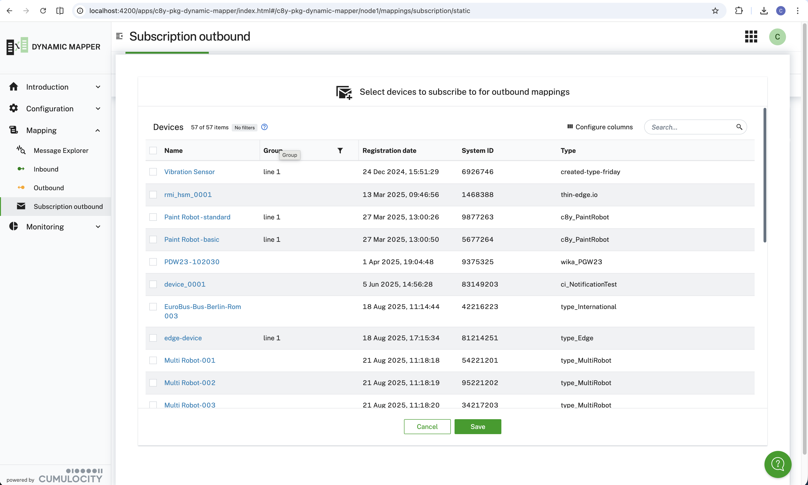
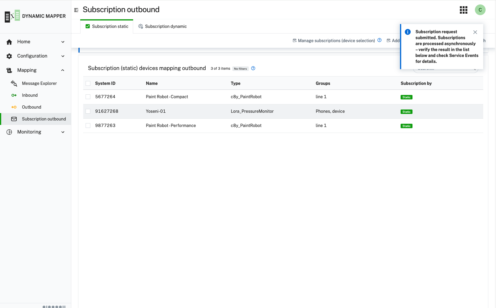
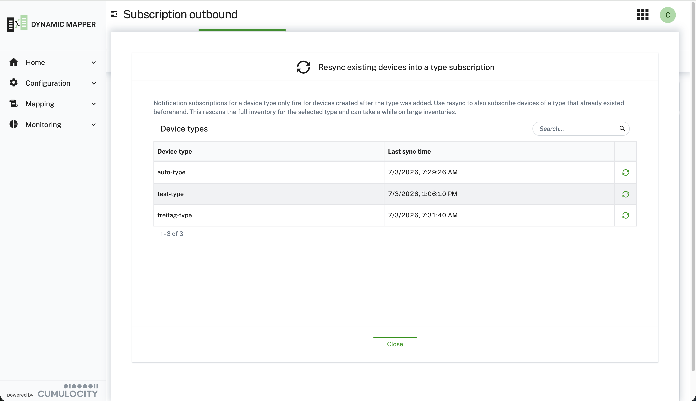
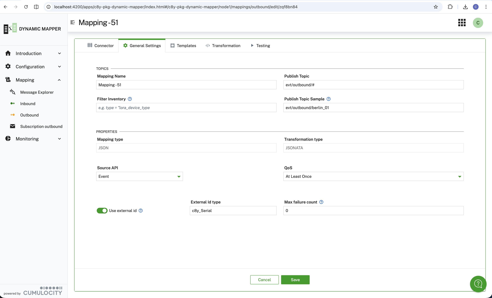

### Defining a subscription for outbound mapping {#define-subscription-for-outbound}

When defining an outbound mapping, the **Dynamic Mapper backend** needs to be triggered when data for a device is
updated.
This only happens when you created a subscription for the device. The details on how to create subscriptions is
explained later in this section.

:::important
Outbound mappings require active subscriptions. Without a subscription, the mapping will not be triggered even if
it's enabled. Make sure to configure subscriptions properly for your device groups or device types.
:::

An outbound mapping is processed only if all of the following conditions apply:

- A subscription for this device exists
- If an inventory filter is defined for the mapping, e.g. `type == "pressure_sensor"`, it must evaluate to `true`
- The mapping must be enabled (activated) and a connector must be assigned to the mapping
- If an execution filter for the mapping is defined, e.g. `temperature > 95`, it must evaluate to `true`

The following screen offers two ways to define subscriptions:

- **Subscriptions static**: Select specific individual devices using a tree or table view. Subscriptions are
  created explicitly for the chosen devices and are not updated automatically when devices are added or removed
  from a group.

  
- **Subscriptions dynamic (by group)**: Specify device groups. When a group is added, subscriptions for all
  assigned devices are created. When a device is added to or removed from a chosen group, the subscription is
  automatically created or deleted. The filter applies to child assets and child devices.
- **Subscriptions dynamic (by device type)**: Specify a list of device types. When a new device of one of the
  configured types is registered, a subscription is automatically created for it.

Use **dynamic subscriptions** with device types when you have many devices of the same type. This automatically
creates subscriptions for new devices as they're added to the system, reducing manual configuration overhead.



#### Resync existing devices into a type subscription

Dynamic subscriptions by device type only subscribe devices that are **created after** the type was added to the
list. Devices of that type which already existed beforehand are not picked up automatically. Use **Resync
existing devices** to backfill subscriptions for those pre-existing devices.

When a device type is removed from the dynamic subscription list, subscriptions that were already created for
that type are **not** deleted.

Clicking **Resync existing devices** next to the device type list opens a dialog listing all configured device
types together with the time of their last successful resync. Selecting **Resync existing devices** for a given
type triggers a background job that rescans the full inventory for devices of that type and creates the missing
subscriptions. This can take a while on large inventories, so the request is submitted asynchronously — progress
and the outcome (e.g. number of devices subscribed) can be tracked via Service Events.



#### Inventory Filter and Execution Filter {#outbound-filters}

Two optional filters let you narrow which outbound messages are processed without writing any transformation
code.

##### Inventory Filter {#inventory-filter}

Evaluated once against the device's managed object properties when the mapping is first triggered for that
device. If the expression returns `false`, the mapping is skipped entirely for that device. The expression is a
JSONata expression evaluated against the device's inventory data.

This filter is defined on the **General settings** step of the wizard and is available for **outbound mappings
only**.



```javascript
// Only process pressure sensors
type == "c8y_PressureSensor"

// Only process devices with a hardware serial number fragment
$exists(c8y_Hardware.serialNumber)

// Only process active devices of a specific model
c8y_IsDevice = true and c8y_Hardware.model = "SmartSensor v2"
```

:::important
Any property referenced here has to be added under **Configuration → Service Configuration → Fragments from
inventory to cache**, otherwise it is not available to the filter at runtime.
:::

##### Execution Filter {#outbound-execution-filter}

Evaluated at runtime against each outgoing message payload. If the expression returns `false`, the message is
silently dropped and not forwarded to the broker.

The execution filter is not specific to outbound mappings — it works the same way for inbound mappings and is
defined on the same wizard step in both directions. See [Execution Filter →](/c8y-pkg-dynamic-mapper/introduction/define-mapping#execution-filter) for the full
description, the editor's boolean requirement, and examples.

The **Inventory Filter** operates on the device managed object, while the **Execution Filter** operates on the
triggering payload (measurement, event, alarm). Use filters to reduce unnecessary broker traffic without
modifying your transformation logic.

