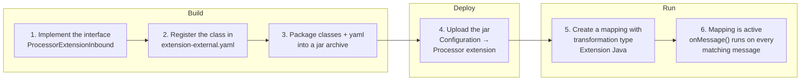
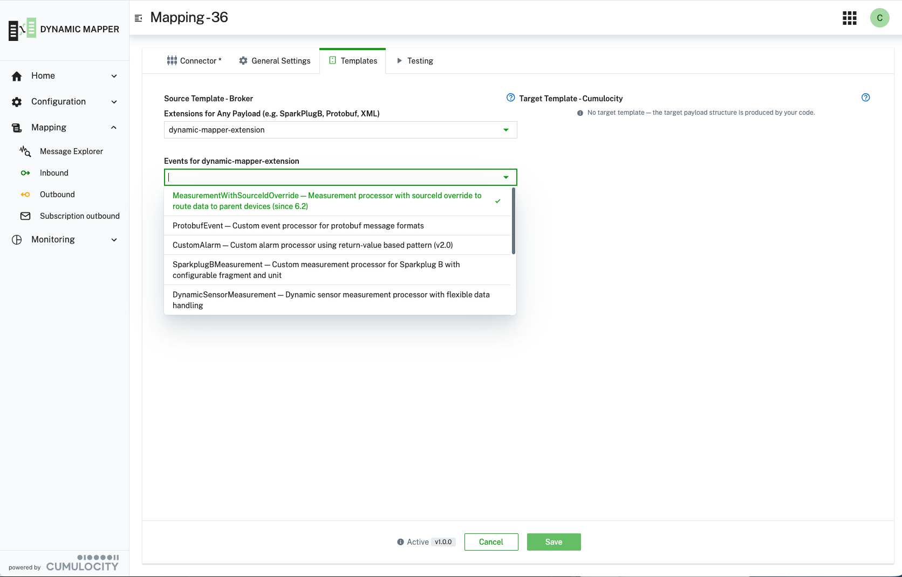
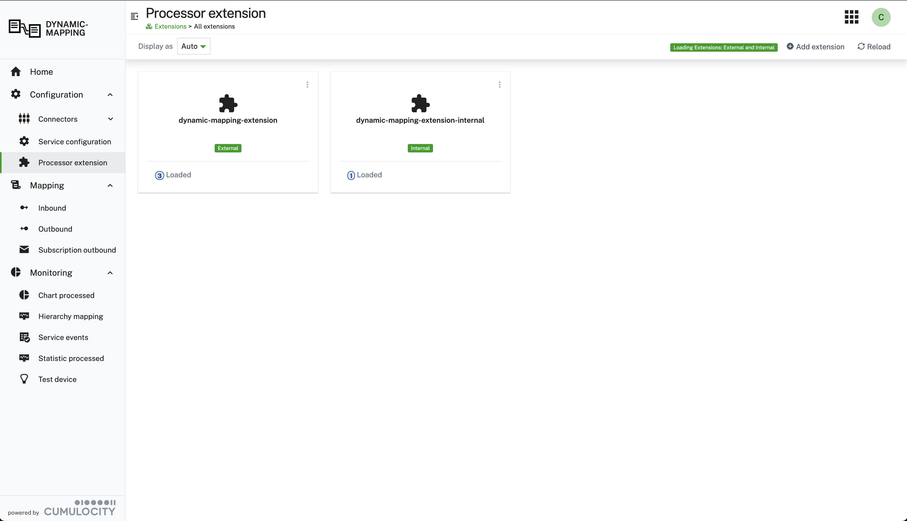
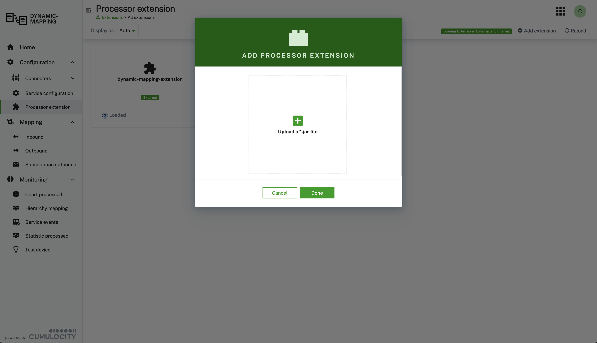

Java Extensions provide enterprise-grade transformation capabilities by allowing you to write custom transformation
logic in Java. This approach offers type safety, superior performance, and full access to the Java ecosystem
including third-party libraries and the Cumulocity Java SDK.

**When to use Java Extensions:** Choose Java Extensions when you need:
- Enterprise-grade type safety with compile-time checking
- Optimal performance for complex transformations
- Binary format support for Protobuf, Avro, MessagePack, and other non-JSON protocols
- Integration with existing Java-based enterprise systems
- Access to the full Java ecosystem and Cumulocity Java SDK
- Advanced debugging capabilities with standard Java tools

:::caution
Java Extensions must be deployed as plugins to the Dynamic Mapper microservice before they can be used. Once
installed, they appear in the Processor Extension configuration and become available as templates in the mapping
stepper.
:::

##### End-to-end overview



Each step in detail:

1. **Implement** `ProcessorExtensionInbound<byte[]>` for broker-to-Cumulocity, or
   `ProcessorExtensionOutbound<O>` for Cumulocity-to-broker.
2. **Register** the class in `extension-external.yaml` with its `eventName`, `className`, `description`,
   `version` and an optional default parameter map.
3. **Package** the yaml together with the compiled classes into a single jar.
4. **Upload** it under **Configuration → Processor extension → Add extension**. The microservice loads the jar
   dynamically, per tenant — no redeployment.
5. **Create a mapping** with transformation type **Extension Java**, select the extension and its `eventName`, and
   optionally override the parameter map for that mapping.
6. At runtime `onMessage(...)` receives every matching message. `context.getConfigAsMap()` exposes the tenant,
   topic and parameter map, and the `CumulocityObject` results your method returns are sent to Cumulocity.

##### Selecting Java Extensions in the Mapping Stepper

When creating a mapping, you can select from installed Java Extensions that define the transformation logic. The
mapping stepper displays all available extensions along with their associated templates:



##### Uploading a Java Extension

A Java Extension is packaged as a single `*.jar` and uploaded through the UI — no redeployment of the
microservice is required. Build the jar first — the **End-to-end overview** above shows where this step sits — then:

1. Go to **Configuration → Processor extension**. The page lists every extension currently known to the service,
   each card showing whether it is **External** (uploaded by you) or **Internal** (shipped with the service), and
   how many processors it contributed under **Loaded**.



2. Choose **Add extension**. In the **Add Processor Extension** dialog, drop your jar onto the upload area or
   click it to pick the file, then confirm with **Done**.



3. The service loads the jar and registers every `ProcessorExtensionInbound` / `ProcessorExtensionOutbound`
   implementation declared in its `extension-external.yaml`. Use **Reload** if the card does not yet show your
   extension — loading happens asynchronously, and the banner reports progress while it runs.

The jar must contain an `extension-external.yaml` naming each processor and its implementation class. An
extension whose descriptor is missing or malformed uploads successfully but contributes **0 Loaded** processors —
if you see that, check the descriptor before looking anywhere else.

Once loaded, the extension's processors become selectable in the mapping wizard as described above, and the jar
survives microservice restarts — it is stored in the tenant, not on the container's filesystem.

##### Managing Installed Java Extensions

To manage and view installed Java Extensions, navigate to the Processor Extension configuration page. This page
displays all deployed extensions with their properties, implementation details, and supported message types:

, implementation class path, message type, direction (Outbound/Inbound), and active status. The interface allows you to view extension properties and verify that plugins are correctly installed and operational.")

A Java Extension implements one of two interfaces, depending on the direction it serves:

| Direction | Interface | Receives | Returns |
|---|---|---|---|
| **Inbound** (broker → Cumulocity) | `ProcessorExtensionInbound<byte[]>` | the raw broker payload as bytes | `CumulocityObject[]` |
| **Outbound** (Cumulocity → broker) | `ProcessorExtensionOutbound<O>` | the Cumulocity object, **already parsed** | `DeviceMessage[]` |

Both are implemented the same way — a single `onMessage(message, context)` that returns an array — and both are
packaged, registered and uploaded identically. The direction is derived from the interface you implement; you do
not declare it anywhere.

###### Inbound — broker to Cumulocity

```java
public class ProcessorExtensionSmartInbound01 implements ProcessorExtensionInbound<byte[]> {

    @Override
    public CumulocityObject[] onMessage(Message<byte[]> message, JavaExtensionContext context) {
        try {
            // Parse JSON payload
            String jsonString = new String(message.getPayload(), "UTF-8");
            @SuppressWarnings("unchecked")
            Map<String, Object> payload = (Map<String, Object>) Json.parseJson(jsonString);

            log.info("{} - Processing smart inbound message, messageId: {}",
                    context.getTenant(), payload.get("messageId"));

            // Get clientId from context first, fall back to payload
            String clientId = context.getClientId();
            if (clientId == null) {
                clientId = (String) payload.get("clientId");
            }

            // Extract data
            @SuppressWarnings("unchecked")
            Map<String, Object> sensorData = (Map<String, Object>) payload.get("sensorData");
            Number tempVal = (Number) sensorData.get("temp_val");

            log.debug("{} - Creating temperature measurement: {} C for device: {}",
                    context.getTenant(), tempVal, clientId);

            // Build measurement using builder pattern
            // Note: deviceName and deviceType are needed for implicit device creation
            return new CumulocityObject[] {
                CumulocityObject.measurement()
                    .type("c8y_TemperatureMeasurement")
                    .time(new DateTime().toString())
                    .fragment("c8y_Steam", "Temperature", tempVal.doubleValue(), "C")
                    .externalId(clientId, "c8y_Serial")
                    .deviceName(clientId)           // Use clientId as device name
                    .deviceType("c8y_TemperatureSensor")  // Device type for implicit creation
                    .build()
            };

        } catch (Exception e) {
            String errorMsg = "Failed to process inbound message: " + e.getMessage();
            log.error("{} - {}", context.getTenant(), errorMsg, e);
            context.addWarning(errorMsg);
            return new CumulocityObject[0];
        }
    }
}
```

Register the extension in **extension-external.yaml**:

```yaml
extensions:
  # Smart Function Equivalents - Inbound
  - eventName: TemperatureMeasurement
    className: dynamic.mapper.processor.extension.external.inbound.ProcessorExtensionSmartInbound01
    description: Temperature measurement processor demonstrating smart function pattern
    version: "2.0"
```

Package the configuration file **extension-external.yaml** and the compiled extension class into a `*.jar`, then
upload it as described in **Uploading a Java Extension** above.

###### Outbound — Cumulocity to broker

An outbound extension implements `ProcessorExtensionOutbound<O>` and returns `DeviceMessage[]`, one entry per
message to publish. Return an empty array to publish nothing.

```java
public class ProcessorExtensionSmartOutbound01 implements ProcessorExtensionOutbound<Object> {

    private final ObjectMapper objectMapper = new ObjectMapper();

    @Override
    public DeviceMessage[] onMessage(Message<Object> message, JavaExtensionContext context)
            throws ProcessingException {
        try {
            // Outbound payloads arrive already parsed — cast, do not deserialize.
            @SuppressWarnings("unchecked")
            Map<String, Object> payload = (Map<String, Object>) message.getPayload();

            log.info("{} - Payload raw: {}", context.getTenant(), payload);

            // The Cumulocity object carries the device under "source"
            @SuppressWarnings("unchecked")
            Map<String, Object> source = (Map<String, Object>) payload.getOrDefault("source", new HashMap<>());
            String sourceId = (String) source.get("id");

            @SuppressWarnings("unchecked")
            Map<String, Object> measurement = (Map<String, Object>) payload.get("c8y_TemperatureMeasurement");
            @SuppressWarnings("unchecked")
            Map<String, Object> series = (Map<String, Object>) measurement.get("T");
            Number value = (Number) series.get("value");

            // Build whatever shape the device expects
            Map<String, Object> devicePayload = new HashMap<>();
            devicePayload.put("time", new DateTime().toString());
            devicePayload.put("c8y_Steam", Map.of("Temperature", Map.of("unit", "C", "value", value)));

            String jsonPayload = objectMapper.writeValueAsString(devicePayload);

            return new DeviceMessage[] {
                DeviceMessage.forTopic("measurements/" + sourceId)
                    .payload(jsonPayload)
                    .build()
            };

        } catch (Exception e) {
            String errorMsg = "Failed to process outbound message: " + e.getMessage();
            log.error("{} - {}", context.getTenant(), errorMsg, e);
            context.addWarning(errorMsg);
            return new DeviceMessage[0];   // nothing is published
        }
    }
}
```

Register it exactly as an inbound extension — the `className` is what tells the mapper it is outbound:

```yaml
extensions:
  # Outbound Extensions (Cumulocity → Device)
  - eventName: MeasurementToCustomJson
    className: dynamic.mapper.processor.extension.external.outbound.ProcessorExtensionSmartOutbound01
    description: Measurement to custom JSON converter with flexible formatting
    version: "2.0"
```

**Two things that differ from inbound and catch people out:**

:::important
The outbound payload is **already parsed**. `message.getPayload()` returns the Cumulocity object as a
`Map<String, Object>`, not bytes — casting is correct, and calling `new String(...)` or a JSON parser on it fails.
Inbound is the opposite: there you do get raw `byte[]` and parse it yourself.
:::

The **publish topic** is yours to choose per message. Either take the one configured on the mapping with
`context.getMapping().getPublishTopic()`, or build it from the payload as above — `"measurements/" + sourceId`
sends each device's data to its own topic from a single mapping.

Beyond `payload(...)`, the `DeviceMessage` builder offers:

| Builder method | Use |
|---|---|
| `topic(...)` / `DeviceMessage.forTopic(...)` | The topic to publish to. |
| `retain(true\|false)` | MQTT retain flag. |
| `transportField(key, value)` | One transport-specific field, e.g. `transportField("qos", "1")`, or the Kafka record key — see [Accessing the broker message key](#broker-message-key). |
| `transportFields(map)` | Several at once. |
| `clientId(...)` / `transportId(...)` | Override the publishing client or transport. |
| `time(...)` | Message timestamp. |

Returning several `DeviceMessage` entries publishes several messages from one Cumulocity object — useful for
fan-out, or for protocols that need a header message before the payload.

##### Extension Parameters

Java Extensions can receive runtime configuration through a **parameter map**. This allows the same extension class
to behave differently depending on the mapping it is used in — without recompiling or redeploying the extension.

Parameters are accessible inside the extension via `context.getConfigAsMap()`, which returns a map containing both
runtime context (tenant, clientId, topic, mapping metadata) and the user-supplied `parameter` map nested under the
key **"parameter"**.

###### 1. Define default parameters in extension-external.yaml

Default parameter values can be declared directly in the extension registration YAML. These defaults apply whenever
no per-mapping override is provided:

```yaml
extensions:
  - eventName: SparkplugBWithConfigMeasurement
    className: dynamic.mapper.processor.extension.external.inbound.ProcessorExtensionSparkplugBWithConfigMeasurement
    description: Sparkplug B processor with configurable fragment and unit
    version: "1.0"
    parameter:
      units:
        unit1: V
        unit2: A
      fragment: Energy
```

###### 2. Override parameters per mapping in the UI

When creating or editing a mapping in the mapping stepper, a **Parameter** YAML field is shown for mappings that use
a Java Extension. Values entered here override or extend the defaults from the YAML registration file and are
stored as part of the mapping. This lets different mappings using the same extension class operate with entirely
different configuration:

```yaml
units:
  unit1: W
fragment: Power
```

###### 3. Read parameters inside the extension

Call `context.getConfigAsMap()` to retrieve the full config. The user-supplied parameter map is nested under the
**"parameter"** key:

```java
@Override
public CumulocityObject[] onMessage(Message<byte[]> message, JavaExtensionContext context) {
    Map<String, Object> config = context.getConfigAsMap();

    // The "parameter" key contains the per-mapping (or YAML default) parameters
    @SuppressWarnings("unchecked")
    Map<String, Object> parameter = (Map<String, Object>) config.get("parameter");

    String fragment = "SparkplugMetrics"; // default fallback
    String unit     = "°C";              // default fallback

    if (parameter != null) {
        if (parameter.get("fragment") instanceof String f) {
            fragment = f;
        }
        @SuppressWarnings("unchecked")
        Map<String, Object> units = (Map<String, Object>) parameter.get("units");
        if (units != null && units.get("unit1") instanceof String u) {
            unit = u;
        }
    }

    // Use fragment and unit to build CumulocityObject...
}
```

##### GetConfigAsMap() — full content

In addition to `parameter`, the map returned by `getConfigAsMap()` also contains:
- **tenant** — current tenant identifier
- **clientId** — MQTT/connector client ID
- **topic** — incoming message topic
- **mappingId**, **mappingName**, **targetAPI**, **debug** — mapping metadata

##### Accessing the broker message key {#broker-message-key}

`message.getTransportFields()` returns the transport-specific fields of the received broker message. For Kafka,
`key` holds the record key — the key, not a header:

```java
@Override
public CumulocityObject[] onMessage(Message<byte[]> message, JavaExtensionContext context) {
    String deviceId = message.getTransportFields().get("key");   // e.g. "863859042393327"
    // falls back to null when the message carries no key
    ...
}
```

The key is delivered **out-of-band — it is not part of the payload**, so it never appears in the mapping's source
template. A Kafka record key is frequently the device identifier, which makes it a useful source for the external
ID. The map is never `null`; it is empty when the transport carries no such fields.

This mirrors `msg.transportFields["key"]` in Smart Functions and `_CONTEXT_DATA_.key` in JSONata mappings.

For **outbound** mappings, set the field on the returned `DeviceMessage` to define the key to publish with:

```java
return new DeviceMessage[] {
    DeviceMessage.forTopic(context.getMapping().getPublishTopic())
        .payload(customJson)
        .transportField("key", externalId)   // sets the Kafka record key
        .build()
};
```

##### Key Benefits of Java Extensions

- **Type Safety:** Compile-time type checking prevents runtime errors and improves code reliability. Your IDE will
  catch errors before deployment, reducing debugging time and production issues.
- **Performance:** Native Java execution provides optimal performance for complex transformations. Unlike
  interpreted JavaScript, Java extensions benefit from JVM optimizations and efficient memory management.
- **Binary Format Support:** Parse and process binary data formats such as Protocol Buffers (Protobuf), Avro,
  MessagePack, and other non-JSON formats. Java Extensions can handle binary payloads that cannot be processed by
  JSONata or JavaScript transformations, making them ideal for IoT devices using efficient binary protocols.
- **Java Ecosystem:** Full access to Java libraries, frameworks, and the Cumulocity Java SDK. Leverage existing
  libraries for JSON processing, data validation, cryptography, and more.
- **Reusability:** Package and deploy transformation logic as reusable plugins across multiple mappings. Once
  developed, a Java extension can be used by multiple tenants and mapping configurations.
- **Advanced Debugging:** Use standard Java debugging tools and IDEs for development. Set breakpoints, inspect
  variables, and step through code using IntelliJ IDEA, Eclipse, or any Java debugger.

:::important
**Development Requirements:** To develop Java Extensions, you need:
- Java Development Kit (JDK) 21 or higher
- Maven or Gradle for building the extension
- Access to the Dynamic Mapper extension API and dependencies
:::
