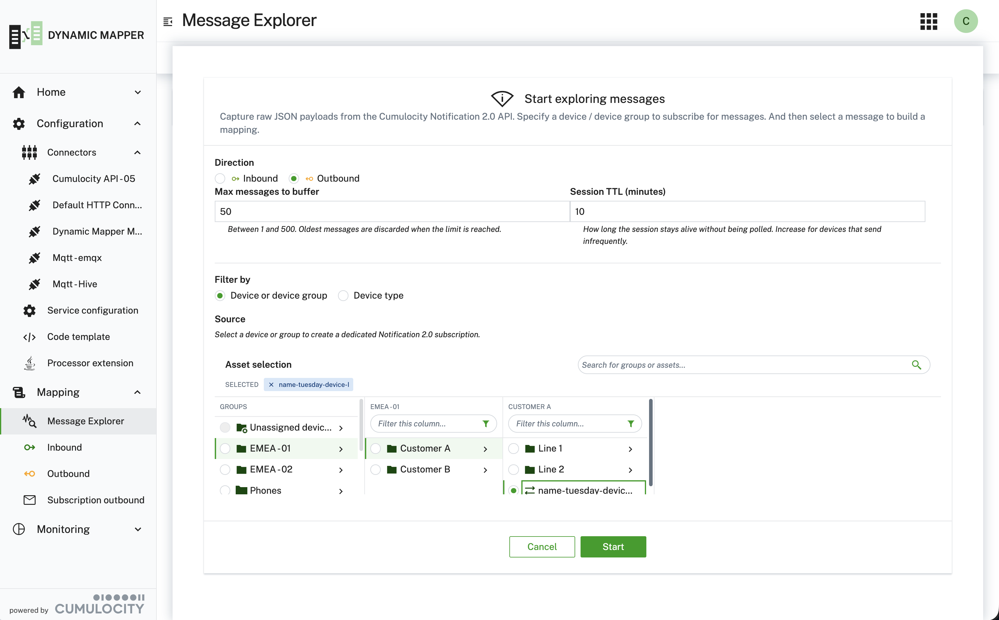

### Message Explorer {#message-explorer}

The **Message Explorer** lets you capture and inspect live messages flowing through the Dynamic Mapper — before
any mapping transformation is applied. It is a powerful tool for understanding your device payloads, validating
connector subscriptions, and rapidly building new mappings from real traffic.

The Message Explorer is available under
[**Mappings → Message Explorer**](/c8y-pkg-dynamic-mapper/node1/mappings/messageExplorer). No mapping or
transformation is applied — you see the raw payloads exactly as they arrive from the broker or the Cumulocity
Notification 2.0 API.

#### Starting a session

Click **Start exploring messages…** in the action bar to open the session configuration drawer. Configure the
following settings:

| Setting | Description |
|---|---|
| **Direction** | Inbound — subscribe to a broker topic via a selected connector. Raw payloads arriving on the topic are captured. Outbound — subscribe to the Cumulocity Notification 2.0 API for a selected device or group and capture the raw JSON objects before they are transformed by an outbound mapping. |
| **Connector** (Inbound only) | The connector to subscribe to. Only connectors that support the selected direction and are currently connected are selectable. |
| **Topic** (Inbound only) | The broker topic to subscribe to. MQTT wildcards (`#`, `+`) are supported. Be specific to avoid capturing unrelated traffic. |
| **Source device / group** (Outbound only) | The managed object (device or group) for which a Notification 2.0 subscription is created. Selecting a group captures events for all devices in that group. |
| **Max messages to buffer** | Maximum number of messages kept in the in-browser buffer (1–500). When the limit is reached, the oldest messages are discarded automatically. Reduce this value for high-frequency topics. |
| **Session TTL (minutes)** | How long the backend keeps the session alive while it is not being polled, default `10`. An idle session is closed automatically, so raise this when the devices you are waiting for publish infrequently. |

Click **Start** to open the session. The action bar switches to show **Stop session**, **Pause / Resume**, and
**Clear** controls.

:::info REST Polling connector
Starting an inbound session on a **REST Polling** connector for a topic with no mapping deployed yet triggers
real periodic GET requests against the polled endpoint (at the connector's configured interval) for as long as
the session stays open. Unlike broker-based connectors, exploring here is not free — stop the session when done
rather than letting it sit until the idle timeout closes it.
:::

#### Viewing captured messages

Each captured message appears as a row in the message list with the following columns:

| # | Column | Description |
|:---:|---|---|
| 1 | **Direction** | INBOUND or OUTBOUND badge. |
| 2 | **Received at** | Timestamp when the backend captured the message. |
| 3 | **Connector** | Name of the connector that delivered the message. |
| 4 | **Client ID** | The publishing client's ID, read from the MQTT 5 user property `clientId`. Shown only when a captured message carries one, so the column is hidden for transports without a per-message publisher identity (Kafka, MQTT 3.1.1, HTTP, AMQP). |
| 5 | **Key** | The broker message key — for Kafka, the record key. Shown only when a captured message carries one, so the column is hidden for transports that have no key concept. |
| 6 | **Topic** | The exact broker topic the message arrived on (wildcards resolved). |
| 7 | **Payload** | Truncated payload preview. Click **show more** to expand the row and view the full payload in a formatted JSON editor. Binary payloads are flagged with a "binary (base64)" badge. |
| 8 | **Create mapping** | The button opens the **Add Mapping** wizard pre-filled with the captured payload as the source template. This is the fastest way to build a mapping from real device data. |

#### Session controls

The action bar provides the following controls while a session is active:

- **Stop session** — terminates the backend subscription and ends the session. All captured messages remain
  visible in the list until you navigate away or click **Clear**.
- **Pause** — suspends polling of new messages. The backend session stays alive so no messages are missed;
  messages received while paused are returned when you resume.
- **Resume** — resumes polling and appends any messages that arrived while paused.
- **Clear** — removes all messages from the in-browser list without stopping the session. Use this to start a
  fresh capture window during an active session.
- **Auto refresh** — when enabled, the Message Explorer polls the backend at the configured interval (e.g. every
  5 s) and appends newly arrived messages automatically.

#### Creating a mapping from a captured message

The most powerful feature of the Message Explorer is the ability to instantly build a mapping from live traffic:

1. Start a session on a connector and topic that your devices publish to.
2. Wait for at least one message to appear in the list.
3. Click the "add" button on the message row you want to use as a template.
4. The **Add Mapping** dialog opens with the captured payload pre-loaded as the source template, and the topic
   pre-filled from the captured message. If the message carried a **key**, it is carried over too — for JSONata
   mappings as `_CONTEXT_DATA_.key` in the source template (toggle **Show metadata** to see it), and for Smart
   Function and Java Extension mappings as a read-only **Transport fields** line below the source editor, since
   those receive the key via `msg.transportFields` rather than inside the payload.
5. Complete the mapping wizard as usual — the source template is already populated, so you can skip straight to
   defining substitutions.

**Tip:** Combine the Message Explorer with **AI-powered substitution generation**: capture a real payload, create a
mapping from it, and then use the AI prompt in the substitution step to auto-generate the mapping rules from a
natural-language description.

