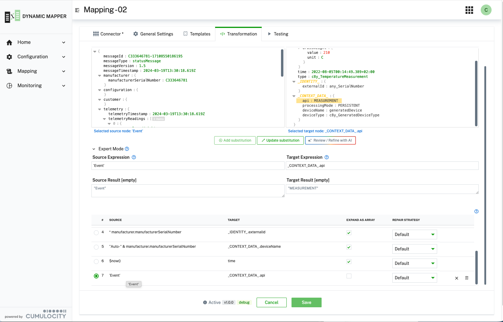
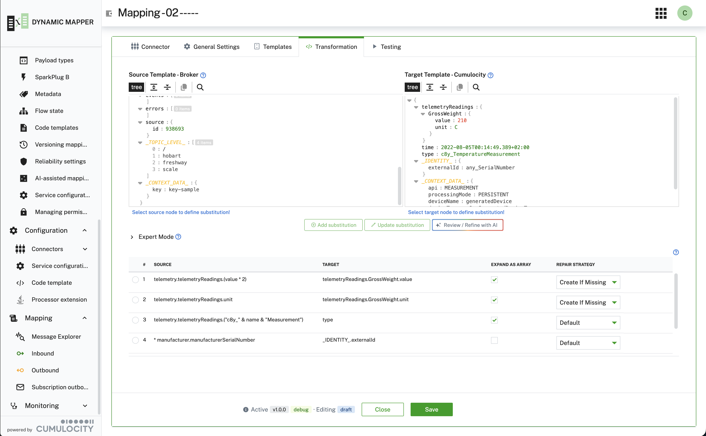
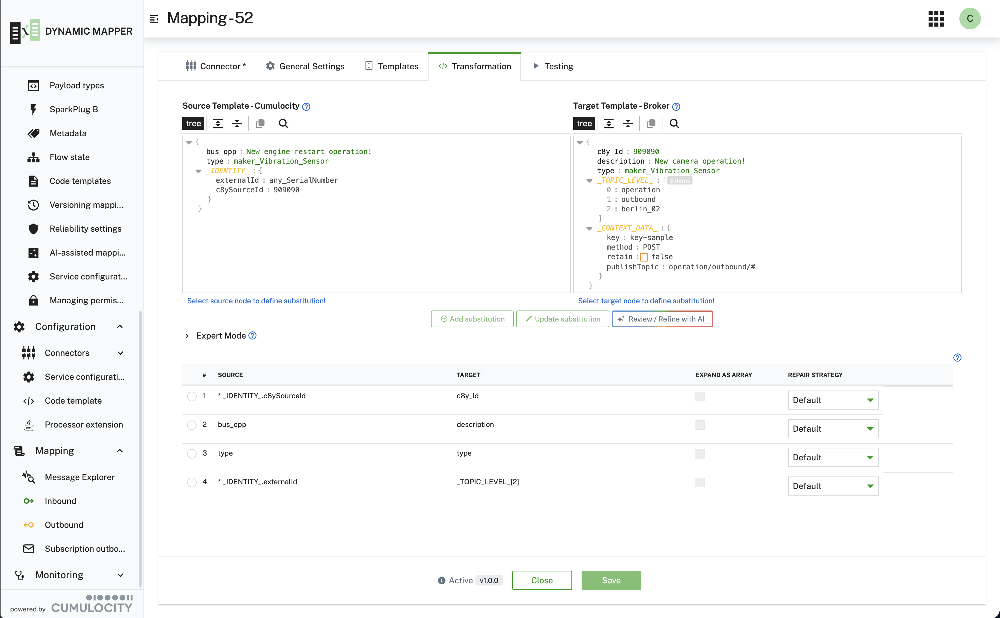

### Using metadata in source templates and target templates (JSONata substitutions) {#metadata}

:::caution
This page covers metadata for mappings with transformation type **Substitution as JSONata Expression**. It does
**not** apply to transformation type **Smart Function** — for that, see
[Using Metadata in Smart Functions](/c8y-pkg-dynamic-mapper/introduction/smartfunction#metadata) instead.
:::

The mapper adds metadata in source and target templates to control the processing of the mapping. All JSON nodes
that are added as metadata to the templates are enclosed in `_`, e.g. `_CONTEXT_DATA_`, `_IDENTITY_` and
`_TOPIC_LEVEL_`.
They are automatically generated at runtime and removed before sending to Cumulocity. Common uses include:

- Extracting device identifiers from MQTT topics (`_TOPIC_LEVEL_`)
- Overriding target API endpoints (`_CONTEXT_DATA_.api`)
- Mapping external device IDs (`_IDENTITY_.externalId`)

:::caution
All metadata nodes including sub-nodes are not meant to be changed directly. All metadata nodes are generated
before the processing of a mapping and removed from the target payload before it is sent. Therefore, the metadata
is not saved in the mapping itself and cannot store individual information. To overwrite e.g. the API for a
mapping at runtime, you have to add a substitution: `[ 'EVENT' → _CONTEXT_DATA_.api ]`.
:::



The following table lists all metadata nodes for inbound mappings:

| Defined in template | Node | Role | Description |
|---|---|:---:|---|
| Source template (external broker) | `_TOPIC_LEVEL_[.]` | map-from | Topic of the inbound MQTT message. Can be used to identify a device if the topic contains external identifiers, e.g. serial number |
| Source template (external broker) | `_CONTEXT_DATA_.key` | map-from | Broker message key, e.g. the Kafka record key (the key, not a header). Only injected when the payload deserializes to a JSON **object** — for a top-level JSON array, a scalar, or binary payloads (`ANY_PAYLOAD`) neither `_CONTEXT_DATA_` nor `_TOPIC_LEVEL_` can be added, so the key is unavailable to JSONata there; use a Smart Function (`msg.transportFields["key"]`) or a Java Extension in those cases |
| Source template (MQTT 5 only) | `_CONTEXT_DATA_.clientId` | map-from | Client ID from MQTT 5 user properties. The publisher must include `clientId` as a user property when publishing the message. Not available for MQTT 3.1.1 connections. |
| Target template (Cumulocity) | `_IDENTITY_.externalId` | map-to | Map node from external template that identifies the device to this node |
| Target template (Cumulocity) | `_CONTEXT_DATA_.api` | map-to | Overwrite target API to send payload to, e.g. `ALARM` |
| Target template (Cumulocity) | `_CONTEXT_DATA_.processingMode` | map-to | Override the Cumulocity processing mode for this payload: `persistent` (default) — the object is stored in the database and persisted to disk, use for all critical data; `transient` — the object is processed and forwarded in real-time but **not written to the database**, use for high-frequency telemetry that must reach subscribed real-time consumers but does not need to be stored (reduces storage cost and write load). |
| Target template (Cumulocity) | `_CONTEXT_DATA_.deviceName` | map-to | Defines the device name of a device that is created implicitly when the mapping uses `Create non-existing devices` |
| Target template (Cumulocity) | `_CONTEXT_DATA_.deviceType` | map-to | Defines the device type of a device that is created implicitly when the mapping uses `Create non-existing devices` |



#### Info - MQTT 5 User Properties

**Publisher Client ID with MQTT 5:**

When using MQTT 5 connectors, publishers can include their client ID as a user property, which the mapper will
automatically extract and make available as `_CONTEXT_DATA_.clientId`. This allows you to identify which client
published a message.

**Example - Publisher side (MQTT 5):**

```java
Mqtt5Publish.builder()
    .topic("devices/data")
    .payload(payloadBytes)
    .userProperties()
        .add("clientId", "device-sensor-123")
        .applyUserProperties()
    .build();
```

**Example - Mapper side:**
In your mapping, you can then reference `_CONTEXT_DATA_.clientId` in the source template to access the
publisher's client ID. For example, you could map it to the external device ID:
`[ _CONTEXT_DATA_.clientId → _IDENTITY_.externalId ]`

**Note:** This feature is only available for MQTT 5 connections. MQTT 3.1.1 does not support user properties, so
the client ID must be included in the message payload or topic instead.

The following table lists all metadata nodes for outbound mappings:

| Defined in template | Node | Role | Description |
|---|---|:---:|---|
| Source template (Cumulocity) | `_IDENTITY_.externalId` | map-from | External Id to identify the external device |
| Source template (Cumulocity) | `_IDENTITY_.c8ySourceId` | map-from | Cumulocity source id of the device |
| Target template (external broker) | `_TOPIC_LEVEL_[.]` | map-to | Topic to be used when sending messages. For a Webhook this defines the context path. The context path is then appended to the URL that is defined in the Webhook connector properties. This property has to be used for all transformation types other than Smart Functions, i.e. Substitution as JSONata Expression. |
| Target template (external broker) | `_CONTEXT_DATA_.key` | map-to | Key to be set on the outgoing broker message, e.g. the Kafka record key. The `dummy` placeholder pre-seeded in the target template is filtered out and never published — map a real value to this node to set a key |
| Target template (external broker) | `_CONTEXT_DATA_.method` | map-to | REST methods to be set when using a Webhook connector |
| Target template (external broker) | `_CONTEXT_DATA_.retain` | map-to | Defines to send MQTT message as retained |
| Target template (external broker) | `_CONTEXT_DATA_.publishTopic` | map-to | Topic to be used when sending messages. For a Webhook this defines the context path. The context path is then appended to the URL that is defined in the Webhook connector properties. Supported for all transformation types. |

**Outbound Metadata Tips:**
- Use `_TOPIC_LEVEL_` to dynamically construct topics based on device properties
- Set `_CONTEXT_DATA_.method` to control HTTP methods (GET, POST, PUT, DELETE) for Webhook connectors
- Use `_CONTEXT_DATA_.retain` for MQTT to ensure last message is always available to new subscribers



