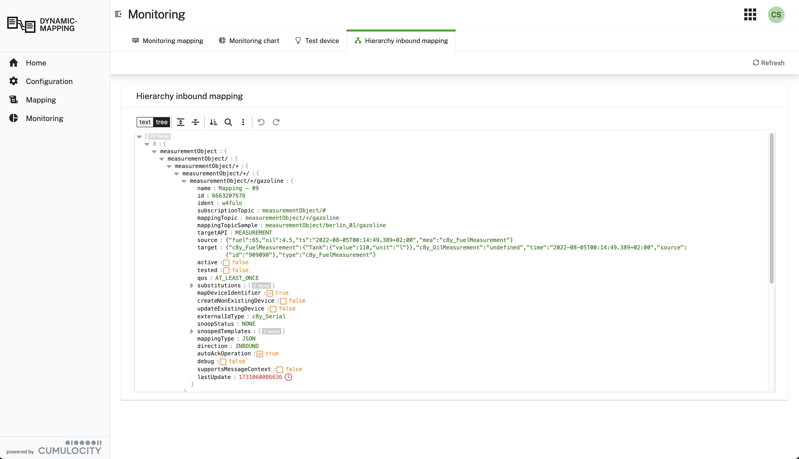

### Monitoring {#monitoring}

The **Monitoring** section in the left navigation contains views for **Statistic processed**, **Chart
processed**, **Cache statistic**, **Service events**, and **Hierarchy mapping**. Each gives a different
operational perspective on what the mapper is doing at runtime.

#### Statistic processed (Inbound / Outbound)

This view shows one row per mapping in a data grid. The columns are:

| Column | Meaning |
|---|---|
| **Name** | The mapping name. Click the name to open the mapping editor directly. |
| **Mapping topic** | The subscription topic pattern the mapping listens on (inbound) or the Cumulocity source object type (outbound). |
| **Publish topic** | The broker topic the mapping publishes to (outbound only). |
| **Received** | Total number of messages received and processed by this mapping since the last reset. Counts every message that matched the topic — including those that produced errors. |
| **Errors** | Number of messages that failed during transformation or Cumulocity API submission. A non-zero value means at least one message was dropped — check **Service events** to see the error detail. |

Counters accumulate since the last reset (or since microservice startup). Use the **Reset statistics** button in
the action bar to zero all counters — useful for measuring throughput during a specific time window. Counters are
lost on microservice restart.

 view listing received/error counts per mapping.")

#### Chart processed

A time-series chart showing the number of messages processed per mapping over time. Each mapping appears as a
separate line. Use this view to spot traffic spikes, identify quiet mappings, and confirm that message flow
resumes after a connector reconnect. The chart updates live as messages arrive.

#### Cache statistic

The Cache statistic view shows three cache panels side by side, each displaying two KPI cards:

| Cache panel | KPI card | Meaning |
|---|:---:|---|
| **Inventory Cache** | **# Entries** | Number of managed object fragments currently held in memory. Below the card the configured size limit is shown (default: 100 000). When the limit is reached, the least-recently-used entry is evicted to make room. |
| **Inventory Cache** | **% Percent** | Fill rate — `Entries / Limit × 100`. A value approaching 100 % means the cache is nearly full and evictions are occurring frequently, which may slow down message processing. |
| **Inbound ID Cache** | **# Entries** | Number of external-ID → internal managed object ID mappings currently cached. Each mapping is resolved once and then stored here, so subsequent inbound messages skip the identity resolution REST call entirely. |
| **Inbound ID Cache** | **% Percent** | Fill rate for the inbound ID cache, same calculation as above. A high fill rate with many devices indicates you may want to increase the cache limit in the service configuration. |
| **Outbound ID Cache** | **# Entries** | Number of internal managed object ID (+ external ID type) → external-ID resolutions currently cached. Used by outbound mappings with **useExternalId** enabled — e.g. a Smart Function or Flow function reading `context.getConfig().externalId` — to avoid resolving the device's external ID from Cumulocity on every outbound message. |
| **Outbound ID Cache** | **% Percent** | Fill rate for the outbound ID cache, same calculation as above. |

The action bar at the top of the page provides four buttons:

- **Clear inbound external ID cache** — removes all cached external-ID-to-internal-ID resolutions (used by
  inbound mappings resolving a device from its external ID). Use this after deleting or re-registering a device
  to prevent stale identity lookups. The cache is rebuilt automatically as new messages arrive.
- **Clear outbound external ID cache** — removes all cached internal-ID-to-external-ID resolutions (used by
  outbound mappings with **useExternalId** enabled). Use this after re-enrolling a device under a different
  external ID, or reassigning an external ID to a different device, to avoid outbound messages being routed
  using a stale external ID. The cache is rebuilt automatically as new outbound messages arrive.
- **Clear inventory cache** — removes all cached managed object fragments. Use this after updating a device's
  managed object directly in Cumulocity (outside the mapper) so the mapper picks up the latest values. The
  fragments you configured under **Service Configuration → Function → Fragments from inventory to cache** are
  re-fetched on demand. Entries can be exact fragment names or glob patterns (e.g. `sparkPlugB_DBIRTH_*`).
- **Reload** — refreshes the KPI cards without clearing the caches, useful to get an up-to-date snapshot of the
  current fill levels.

:::caution
All three caches are held in memory and are lost on microservice restart. After a restart they are rebuilt
automatically as messages arrive — no manual action is needed.
:::

Both ID caches are also cleared automatically on a configurable schedule — see **Days lifetime inbound Id
cache** and **Days lifetime outbound Id cache** under
[**Service Configuration → Caching**](/c8y-pkg-dynamic-mapper/node3/serviceConfiguration/caching). This is a
full-cache wipe on a timer (not per-entry expiry), so set the retention short enough for your device
re-enrollment/reassignment cadence if you rely on it instead of manually clearing the cache.

#### Service events

The Service events view is the primary place to diagnose individual message failures without needing access to
the microservice container logs. It displays a filterable list of events emitted by the mapper backend. Each
entry shows:

- **Type** — event severity/category (e.g. `STATUS_MAPPING_CHANGED`, `STATUS_CONNECTOR_EVENT`,
  `MAPPING_FAILURE`)
- **Timestamp** — when the event occurred
- **Message** — the full error or status description, including the mapping name, tenant, and root cause

Use the **Type** dropdown and **Date from / Date to** pickers to narrow the event list to a specific time window
or event category. This is particularly useful when correlating errors with known message arrival times.

:::caution
Service events are stored in an in-memory ring buffer and are lost on microservice restart. For long-term audit
trails, configure the Cumulocity platform's built-in audit log or forward events to an external monitoring
system.
:::

#### Hierarchy mapping

This view exposes the topic-matching tree described under [Mapping Topic](/c8y-pkg-dynamic-mapper/introduction/define-mapping) as a JSON document: an
array of nodes, each keyed by a topic segment, nested the same way the tree is walked at runtime, down to the
mapping registered at each leaf (its full definition, including its substitutions). It is the most direct way to
trace why a message did — or did not — match a particular mapping, especially once several mappings share
overlapping topic prefixes.

