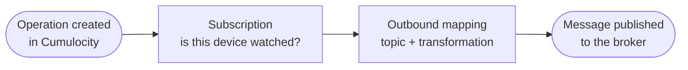

### Quickstart: your first outbound mapping {#quickstart-outbound}

The [first quickstart](/c8y-pkg-dynamic-mapper/introduction/quickstart-inbound) brought device data *into* Cumulocity.
This one sends something back out: an **operation** created in Cumulocity — a command for a device — is
transformed and published to an MQTT topic. It takes about 15 minutes.

**Before you start**, work through the [inbound quickstart](/c8y-pkg-dynamic-mapper/introduction/quickstart-inbound). This
page continues with what it produced:

- the **`quickstart`** connector (Cumulocity MQTT Service), and
- the device **Temperature-Sensor-01**, whose external ID is `device_01` of type `c8y_Serial`.

Any existing device works too — you just need its **ID** and its external ID.

#### Outbound works differently in one important way

Inbound is driven by messages arriving on a topic. Outbound is driven by **changes in Cumulocity**, and the mapper
only hears about a change for a device it has explicitly **subscribed** to. That subscription is a separate object
from the mapping, and forgetting it is the single most common reason an outbound mapping never fires.



#### Step 1 — Subscribe the device

Go to [**Mapping → Subscription outbound**](/c8y-pkg-dynamic-mapper/node1/mappings/subscription/static), choose
**Subscriptions static**, select **Temperature-Sensor-01** and save.

The device now appears in the list of subscribed devices. See
[Outbound mappings](/c8y-pkg-dynamic-mapper/introduction/define-subscription-for-outbound) for the dynamic
alternatives, which subscribe whole groups or every device of a given type automatically.

#### Step 2 — Create the mapping

Go to [**Mapping → Outbound**](/c8y-pkg-dynamic-mapper/node1/mappings/outbound) and click **Add Mapping**. Leave
**Expert Mode** off, so you get **JSON** and a **Smart Function** as in the inbound quickstart.

In the wizard:

1. **Connector** — select `quickstart`.
2. **General settings**:
   - **Mapping Name**: `Quickstart command`
   - **Target API**: `Operation` — the mapping now listens for operations, not measurements
   - **Publish Topic**: `quickstart/cmd/+`
   - **Publish Topic Sample**: `quickstart/cmd/device_01`
   - Switch on **Use external id** and set **External Id type** to `c8y_Serial`

**Use external id** is what lets the function address the device by `device_01` rather than by its internal
Cumulocity ID. Without it, `context.getExternalId()` returns nothing.

#### Step 3 — Give it the Cumulocity payload as source

For an outbound mapping the **source** is the Cumulocity object, so the source template is the operation as
Cumulocity delivers it:

```json
{
  "deviceId": "123456",
  "description": "Set target temperature",
  "status": "PENDING",
  "c8y_SetTemperature": {
    "value": 21
  }
}
```

#### Step 4 — Write the Smart Function

The **Transformation** step opens the JavaScript editor. Note the difference from inbound: an outbound function
returns **one object** with a `topic` and a `payload`, not an array.

```javascript
function onMessage(msg, context) {
    var payload = msg.payload;

    // The resolved external ID of the device the operation targets.
    var externalId = context.getExternalId();
    console.log("Operation for external id: " + externalId);

    return {
        topic: `quickstart/cmd/${externalId}`,
        payload: {
            "cmd": "setTemp",
            "value": payload["c8y_SetTemperature"]["value"],
            "issued": payload["description"]
        }
    };
}
export { onMessage };
```

:::important
Identify the device with `context.getExternalId()` or `msg.sourceId` — never with `payload["source"]["id"]`. An
operation carries the device under `deviceId`, not `source`, so reading `source.id` throws for this target API.
:::

Returning the `topic` from the function is optional: leave it out and the mapping's **Publish Topic** is used. It
is worth doing here because it routes each device's commands to its own topic from a single mapping.

#### Step 5 — Test, save, activate

The **Testing** step runs the function against the source template and shows the message that would be published,
with `console.log()` output in the **Console output** panel. Then **save** the mapping and **activate** it from the
mapping table.

At this point three things must all be true, and the mapping is silent unless they are: the device is
**subscribed**, the mapping is **activated**, and a **connector** is assigned.

#### Step 6 — Trigger it

Create an operation for the device. Subscribe to `quickstart/cmd/device_01` first so you can watch it arrive, then
create the operation in whichever way suits you.

**With [go-c8y-cli](https://goc8ycli.netlify.app/)** — the shortest route, and `--device` accepts the device
**name**, so you do not have to look up its internal ID:

```bash
c8y operations create \
  --device "Temperature-Sensor-01" \
  --description "Set target temperature" \
  --data '{"c8y_SetTemperature":{"value":21}}'
```

**With curl** — no extra tooling, but you need the device's **Cumulocity ID** (shown in Device Management, or in
the URL when the device is open):

```bash
curl -u '<user>' -X POST \
  'https://<tenant>/devicecontrol/operations' \
  -H 'Content-Type: application/json' \
  -d '{
        "deviceId": "<deviceId>",
        "description": "Set target temperature",
        "c8y_SetTemperature": { "value": 21 }
      }'
```

The broker receives, on `quickstart/cmd/device_01`:

```json
{ "cmd": "setTemp", "value": 21, "issued": "Set target temperature" }
```

:::info
The operation stays **PENDING** in Cumulocity. The mapper delivers it to the broker but does not complete it —
acknowledging the command by setting the operation to `EXECUTING` and then `SUCCESSFUL` is the device's job, or
that of an inbound mapping you write for the device's reply.
:::

#### Nothing arrived?

Work through the chain in order — it is almost always the first one:

1. Is the device listed under **Subscription outbound**?
2. Is the mapping **activated**, with a connector assigned?
3. Does the **Target API** match what you created — `Operation` here, not `Measurement`?
4. Does an **inventory filter** or **execution filter** on the mapping exclude it?
5. [Monitoring](/c8y-pkg-dynamic-mapper/introduction/monitoring) counts outbound messages per mapping, and the
   [microservice log](/c8y-pkg-dynamic-mapper/introduction/troubleshooting#microservice-log) shows the
   transformation itself.

#### What to read next

- [Outbound mappings](/c8y-pkg-dynamic-mapper/introduction/define-subscription-for-outbound) — dynamic
  subscriptions by group or device type, inventory filters and execution filters.
- [Smart Functions](/c8y-pkg-dynamic-mapper/introduction/smartfunction) — the full API for both directions.
- [Core concepts](/c8y-pkg-dynamic-mapper/introduction/concepts) — how inbound and outbound fit together.
