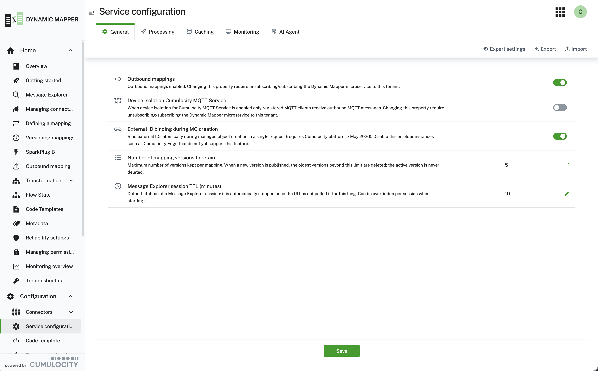

### Service configuration {#service-configuration}

Tenant-wide behaviour of the Dynamic Mapper is controlled under **Configuration → Service configuration**.
These settings apply to the whole service, unlike the per-mapping options in the mapping wizard.

The settings are grouped into tabs — **General**, **Processing**, **Caching**, **Monitoring** and **AI Agent** —
with **Save** applying the changes. **Export** and **Import** move the whole configuration in and out as a file,
which is the quickest way to reproduce a tenant's setup elsewhere. **Expert settings** reveals additional
advanced options that are hidden by default.

The **General** tab covers:

| Setting | Effect |
|---|---|
| **Outbound mappings** | Enables the Cumulocity → broker direction. Changing it requires unsubscribing and re-subscribing the Dynamic Mapper microservice for the tenant. |
| **Device Isolation Cumulocity MQTT Service** | When enabled, only registered MQTT clients receive outbound MQTT messages. Also requires a re-subscribe to take effect. |
| **External ID binding during MO creation** | Binds external IDs atomically while the managed object is created, in a single request. Requires a Cumulocity platform of May 2026 or later — disable it on older instances such as Cumulocity Edge. |
| **Number of mapping versions to retain** | How many versions are kept per mapping. Publishing a new version deletes the oldest ones beyond this limit; the active version is never deleted. See [Versioning mappings](/c8y-pkg-dynamic-mapper/introduction/versioning). |
| **Message Explorer session TTL (minutes)** | Default lifetime of a Message Explorer session — it stops automatically once the UI has not polled it for this long. Can be overridden per session when starting one. See [Message Explorer](/c8y-pkg-dynamic-mapper/introduction/message-explorer). |

Two of these settings — **Outbound mappings** and **Device Isolation Cumulocity MQTT Service** — do not take
effect until the microservice is unsubscribed and subscribed again for the tenant. The rest apply on **Save**.

