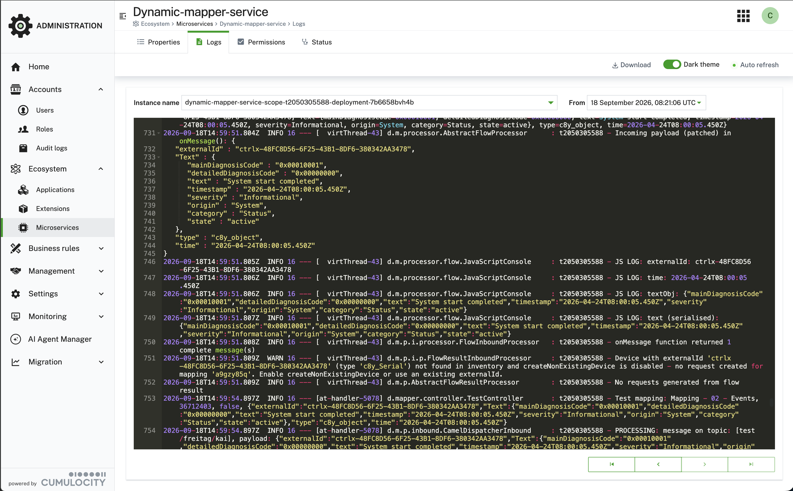

### Troubleshooting {#troubleshooting}

The following lists common problems and how to resolve them.

#### Messages arrive but no Cumulocity objects are created

- Check that the mapping is **enabled** (activated). A greyed-out mapping icon means it is disabled.
- Verify the **topic pattern** matches the topic your device is publishing to. Wildcards `#` and `+` follow MQTT
  semantics.
- Open [**Monitoring → Statistics**](/c8y-pkg-dynamic-mapper/node2/monitoring/statistic/inbound) and check
  whether the message counter for the mapping increases. If it does not, the topic pattern is not matching.
- Check the **Execution Filter** (**Filter execution mapping** on the *Select templates* step) — if set, it must
  evaluate to `true` for the incoming payload, otherwise the message is skipped without an error.
- If the counter increases but objects are not created, check the **Event Log** for transformation errors.

#### Transformation errors in the Event Log

- **"Device not found"** — the `externalId` returned by your mapping does not match any registered device.
  Enable **Create non-existing devices** on the mapping or pre-register the device in Cumulocity.
- **"Cannot evaluate expression"** (JSONata) — the JSONata expression references a field that is missing or null
  in the source payload. Add a null-guard, e.g. `payload.value ? payload.value : 0`.
- **Smart Function throws a JavaScript exception** — the full stack trace is shown in the Event Log. Use
  `console.log()` in your function to emit diagnostic output visible in the Event Log.
- **"Fragment not found in cache"** — the managed object fragment accessed via `context.getManagedObject()` is
  not in the [**Fragments from inventory to cache**](/c8y-pkg-dynamic-mapper/node3/serviceConfiguration/general)
  list. Add the exact fragment name or a matching glob pattern (e.g. `sparkPlugB_DBIRTH_*`) and clear the
  inventory cache or wait for it to refresh.

#### Outbound mapping does not trigger

- Check the mapping's **Source API** — it is used as a filter to select which mappings apply when a
  notification arrives. If it does not match the API of the incoming notification (e.g. **Measurement** vs.
  **Event**), the mapping is silently ignored for that notification.
- Verify that a **subscription** exists for the device. Without a subscription, no outbound messages are
  processed regardless of mapping state.
- Check the **Inventory Filter** — if set, it must evaluate to `true` for the device's managed object.
- Check the **Execution Filter** — if set, it must evaluate to `true` for the triggering payload.
- Confirm the mapping's **connector** is connected (green status in
  [**Monitoring → Statistics**](/c8y-pkg-dynamic-mapper/node2/monitoring/statistic/inbound)).
- If the mapping has **useExternalId** enabled and reads `context.getConfig().externalId` in its
  Smart Function/Flow code, a stale entry in the **Outbound ID Cache** (e.g. after re-enrolling the device under
  a different external ID) can route the message using the old external ID. Clear it under
  [**Monitoring → Cache statistic**](/c8y-pkg-dynamic-mapper/node2/monitoring/cache) using
  **Clear outbound external ID cache**.

#### Smart Function returns stale device inventory data

- The mapper caches inventory fragments for performance. Navigate to
  [**Service Configuration → Caching**](/c8y-pkg-dynamic-mapper/node3/serviceConfiguration/general) and click
  **Clear inventory cache** to force a refresh.
- Ensure the required fragment is listed in
  [**Service Configuration → Function → Fragments from inventory to cache**](/c8y-pkg-dynamic-mapper/node3/serviceConfiguration/general).
  Only listed fragments (or fragments matching a configured glob pattern, e.g. `sparkPlugB_DBIRTH_*`) are loaded
  into the cache.

#### Connector disconnects repeatedly

- Check the broker's access logs for authentication or authorization errors.
- Verify the connector credentials, host, and port in the connector configuration.
- For TLS connections, ensure the broker's certificate is trusted and the CA certificate is correctly configured
  in the connector.
- Check the Event Log for TLS handshake or connection timeout errors.

#### Reading the microservice log {#microservice-log}

When the Event Log and the monitoring counters do not explain a failure, the microservice log is the last and most
detailed source: it records every message the mapper processed, the decisions it took, and the stack trace of
anything that threw.

Open it in the **Administration** application under **Ecosystem → Microservices → dynamic-mapper-service → Logs**.



Useful controls on that page:

- **Instance name** — the microservice may run more than one instance. A given message is handled by exactly one
  of them, so if you do not find your message, check the other instances.
- **From** — jump to the time the message arrived, rather than scrolling back through the buffer.
- **Auto refresh** — follow the log live while you publish a test message.
- **Download** — save the log for a bug report, or to search it with your own tools.

Every line is tagged with the tenant ID, so on a shared instance you can filter the log down to your own tenant.
The lines most worth looking for:

| Log line | What it tells you |
|---|---|
| `PROCESSING: message on topic: [...]` | The message reached the mapper and a mapping matched that topic. If this is missing, the problem is the connector or the topic, not the transformation. |
| `Incoming payload (patched) in onMessage()` | The payload as your Smart Function actually received it, after the mapper added its metadata. |
| `JS LOG: …` | Output from `console.log()` in your Smart Function — the same lines shown in the Console output panel of the mapping editor. See [Testing a Smart Function](/c8y-pkg-dynamic-mapper/introduction/define-mapping#testing-smart-function). |
| `onMessage function returned N complete message(s)` | How many Cumulocity objects your transformation produced. `0` means the transformation ran but built nothing. |
| `No requests generated from flow result` | Nothing was sent to Cumulocity — usually paired with a `WARN` above it giving the reason. |

The `WARN` lines are normally the answer. For example, a mapping that produces nothing because the device does not
exist yet logs exactly that, and names the mapping it applies to:

```text
WARN  d.m.p.i.p.FlowResultInboundProcessor - Device with externalId 'ctrlx-48FC8D56…' (type 'c8y_Serial')
      not found in inventory and createNonExistingDevice is disabled — no request created for mapping
      'a9gzy85q'. Enable createNonExistingDevice or use an existing externalId.
```

**Raising the log level.** By default the log records the processing steps above but not the full detail of each
one. Rather than turning up logging globally — which on a busy tenant buries the messages you care about — enable
**debug** for the one mapping you are investigating. Its entries then include the full payload at each stage, the
individual substitutions applied, and `JS DEBUG:` output from `console.debug()` in Smart Functions, which is
otherwise suppressed. See the next section.

#### Enabling debug mode for a mapping {#debug-mode}

Debug mode logs detailed processing information for a specific mapping without enabling verbose logging globally.
In the mapping list, use the context menu (three-dot icon) to enable **Debug** for a mapping. Debug output
appears in the **Event Log** and in the
[microservice log](/c8y-pkg-dynamic-mapper/introduction/troubleshooting#microservice-log), including the
`JS DEBUG:` lines that are otherwise suppressed. Disable debug mode after troubleshooting to avoid excessive log
volume.

:::caution
Debug mode logs full payload content. Do not leave it enabled in production if payloads contain personally
identifiable information (PII) or secrets.
:::
