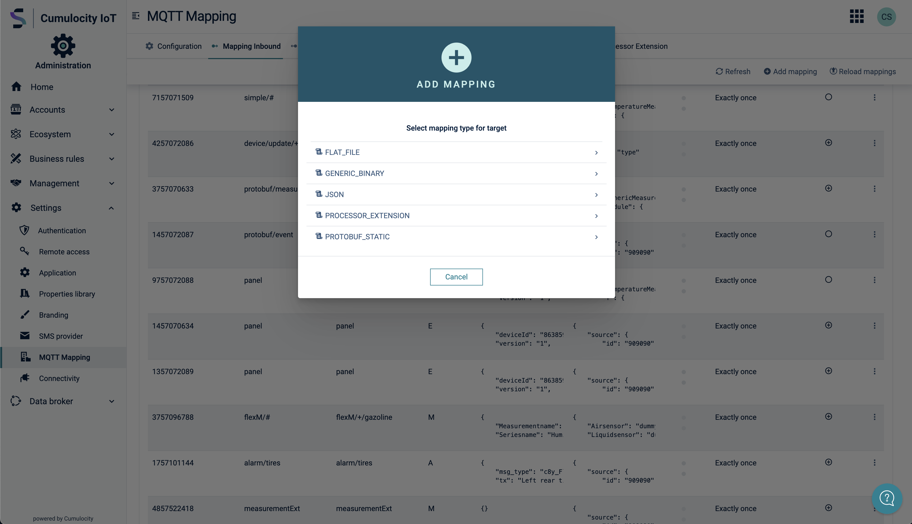

# Dynamic MQTT Mapping Service for Cumulocity


Cumulocity IoT has a MQTT endpoint, but does not yet allow devices to send generic MQTT payloads. This project addresses
this gap by providing the following artifcats:

* A **Microservice** - exposes REST endpoints, uses the [PAHO MQTT Client](https://github.com/eclipse/paho.mqtt.java) to
connect to a MQTT broker, a generic Data Mapper & Expression Language  for data mapping and the
[Cumulocity Microservice SDK](https://cumulocity.com/guides/microservice-sdk/introduction/) to connect to Cumulocity.
* A **Frontend Plugin** - uses the exposed endpoints of the microservice to configure a MQTT broker connection & to perform 
graphical MQTT Data Mappings within the Cumumlocity IoT UI.

Using the solution you are able to connect to any MQTT broker and map any JSON-based payload on any topic dynamically to
the Cumulocity IoT Domain Model in a graphical way.

The mapper processes messages in both directions:
1. `INBOUND`: from external source to C8Y
2. `OUTBOUND`: from C8Y to external source

<p align="center">

</p>
<br/>

For the complete documentation please check the github projekt [cumulocity-dynamic-mqtt-mapper](https://github.com/SoftwareAG/cumulocity-dynamic-mqtt-mapper).

**NOTE:** This solution requires an additional microservice. The microservice ```mqtt-mapping-service.zip``` can be found in the [release section](https://github.com/SoftwareAG/cumulocity-dynamic-mqtt-mapper/releases) of the github project. Instruction how to the deploy the microservice can be found in the [documentation](https://github.com/SoftwareAG/cumulocity-dynamic-mqtt-mapper#microservice).